# Introduction

## The Ageing Population and The Burden of Disease

The global population is ageing as is evident from the changing shape of the world population pyramid (figure \@ref(fig:poppyramid)).
The increase in average lifespan underlying this demographic shift is projected to continue in industrialised nations with a probability of >65% for women and 85% for men [@Kontis2017] (figure \@ref(fig:Kontis2017-fig1)).
Ageing is the main risk factor for cancer, cardiovascular, neurodegenerative diseases, and many other conditions including osteoarthritis [@Niccoli2012]. Furthermore, mortality from these conditions increases according to a logistic function with age [@Belikov2019] (figure \@ref(fig:Belikov2019-fig1)).
In addition to the non-infectious diseases, immunosenescence and frailty in old age contribute to increased mortality from infectious diseases, as exemplified by dramatically higher hospital admissions and deaths for respiratory disease during seasonal flu epidemics in the over 75s [@Fleming2005] (figure \@ref(fig:Fleming2005-fig3)).
Ageing is a common underlying risk factor for many conditions and as this would lead one to expect the number of concomitant disorders and the proportion of persons with multiple morbidities increases with age [@Barnett2012] (figure \@ref(fig:Barnett2012-fig1)). 

```{r poppyramid, fig.cap='(ref:poppyramid-cap)', out.width='95%', fig.show='hold', fig.align = 'center', echo=FALSE}
knitr::include_graphics("figs/population-pryamids-1950-2019.png")
```

(ref:poppyramid-cap) __The Population is Getting Older__ Population pyramids for global population for A) 1950 and B) 2019 from [populationpyramid.net](populationpyramid.net) [@PopulationPyramid2019]

```{r Kontis2017-fig1, fig.cap='(ref:Kontis2017-fig1-cap)', out.width='95%', fig.show='hold', fig.align = 'center', echo=FALSE}
knitr::include_graphics("figs/Kontis2017_fig1.jpg")
```

(ref:Kontis2017-fig1-cap) __The Population is Likely to Continue Getting Older__ Median projected increase in life expectancy from birth in the period 2010 to 2030 for 35 industrial nations reproduced from Kontis et al. 2017 figure 1 [@Kontis2017].

```{r Belikov2019-fig1, fig.cap='(ref:Belikov2019-fig1-cap)', out.width='80%', fig.show='hold', fig.align = 'center', echo=FALSE}
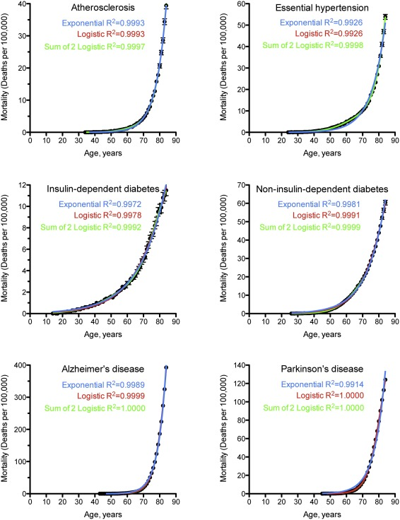
```

(ref:Belikov2019-fig1-cap) __Mortality from Age-Related Conditions Increases According to a Logistic Function with Age__ Mortality rate in deaths per 100,000 at different ages for Atherosclerosis, Essential Hypertension, Insulin-dependent diabetes, Non-insulin-dependent diabetes, Alzheimer's disease, and Parkinson's disease. Showing Model fits for exponential, logistic and the sum of 2 logistic functions. Underlying Cause of Death data (1999-2015) were form the Centers for Disease Control and Prevention, Wide-ranging OnLine Data for Epidemiologic Research (CDC WONDER) database. Reproduced from Belikov 2019 figure 1 [@Belikov2019].

```{r Fleming2005-fig3, fig.cap='(ref:Fleming2005-fig3-cap)', out.width='90%', fig.show='hold', fig.align = 'center', echo=FALSE}
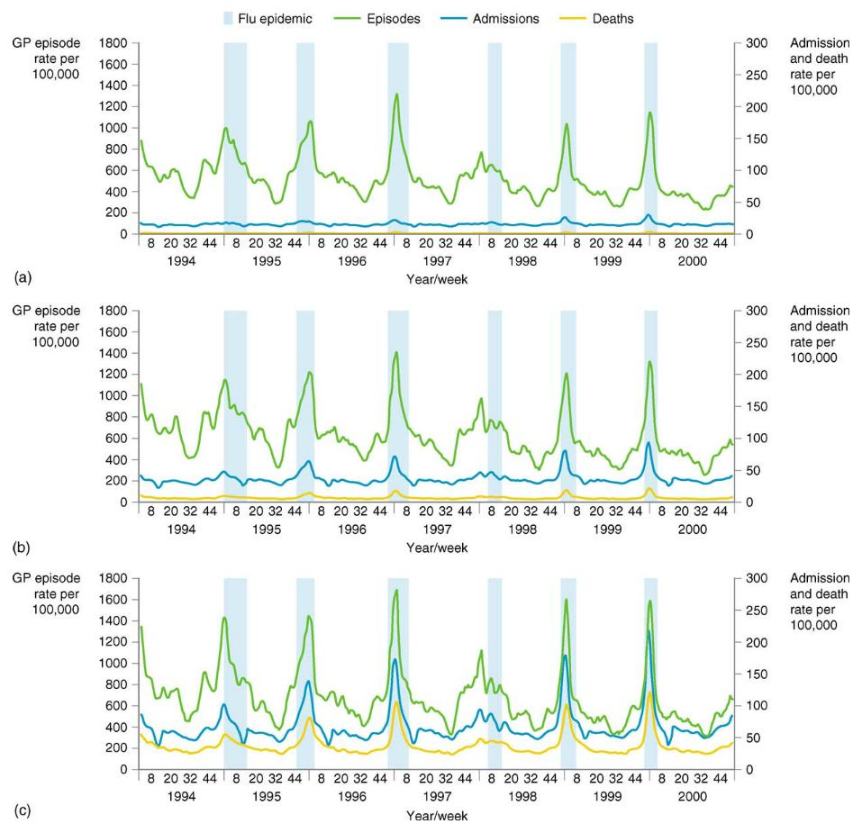
```

(ref:Fleming2005-fig3-cap) __Mortality from Infectious Diseases Increases With Age__ Visits to  General practitioners, hospital admissions and deaths from respiratory disease in persons aged: (a) 45-64, (b) 65-74 and (c) 75 years and over. Reproduced from Fleming et al. 2005 figure 3 [@Fleming2005].

```{r Barnett2012-fig1, fig.cap='(ref:Barnett2012-fig1-cap)', out.width='80%', fig.show='hold', fig.align = 'center', echo=FALSE}
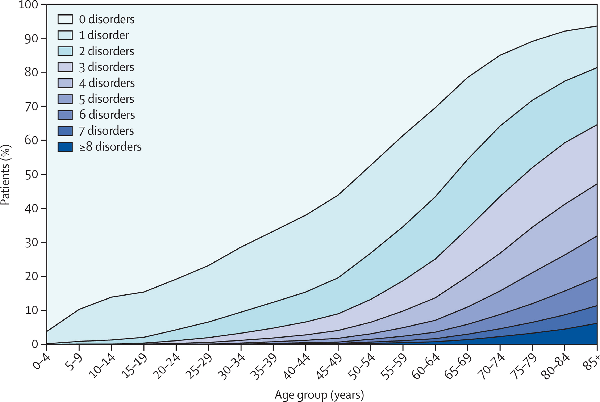
```

(ref:Barnett2012-fig1-cap) __Number and Frequency of Comorbidities increase with Age__ Number of chronic disorders by age group. reproduced from Barnett et al. 2012 figure 1 [@Barnett2012].

Given the rapid increases in the rates of numerous diseases and the rate of death from those diseases as we age, there is a clear impetus to develop interventions to prevent and treat age-related diseases. 
The common factor among all these conditions is their relationship to age, but age is not merely a shared risk factor but frequently the largest; outside of rare genetic conditions which predispose to early-onset [@Niccoli2012].
Thus understanding the underlying biological mechanisms of the ageing process and intervening in those mechanisms, has the potential to be vastly more effective and economical [@Goldman2016] than attempting to tackle diseases individually. 
The discovery in 1993 by Cynthia Kenyon and others [@Kenyon1993] that a single mutation in the *daf-2* gene of *C. elegans* could double the lifespan of this organism is often cited as an inflexion point in the confidence of the ageing research field that interventions in the process of ageing itself may be a realistic therapeutic target. What then do we know about the underlying biology of ageing?

## The biology of Ageing 

Ageing is characterised by a progressive deterioration of physiological integrity with time, resulting in an increased risk of mortality and morbidity.
Theories of how and why this occurs are numerous with a history in the scientific literature stretching back to the late 1800s [@Medvedev1990], setting aside, for now, theoretical frameworks for the process of ageing we will first consider the nature of these changes.
Changes at the organismal level have their origins in changes at the molecular and cellular scales. Lopez-Otin et al. 2013 [@Lopez-Otin2013] identified nine hallmarks of ageing in their 2013 review.
These hallmarks meet the criteria of: 
Manifesting during normal ageing; 
Accelerating ageing when aggravated; 
Retarding ageing when ameliorated.
The hallmarks are further subdivided and hierarchically arranged into primary, antagonistic and integrative categories.
Primary hallmarks are of unequivocally negative effect.
Antagonistic hallmarks arise as a response to the primary and are initially protective against these changes but become problems in their own right as they occur at higher levels over time.
Lastly, the integrative hallmarks directly impact on tissue function and homoeostasis.
The hallmarks are as follows:

__Primary Hallmarks - Causes of Damage__

1. *Genomic instability*: 
  Damage to the genomes of our cells occurs over time and accumulates as we age, this damage ranges from point mutations to large structural mutations, as well as mutations in the mitochondrial genome [@Niedernhofer2018]. 

2. *Telomere attrition*: 
  Telomere shortening occurs during the ageing process, somatic cells do not generally express telomerase so with each division telomeres grow shorter.
  Telomere exhaustion limits the replicative capacity of cells inducing replicative senescence, limiting regenerative potential but also protecting from the uncontrolled growth of cancer [@Casagrande2019].

3. __Epigenetic alterations__: 
  Patterns of DNA methylation and of a number of histone modifications exhibit age-related changes. These contribute to the dysregulation of gene expression and derepression of heterochromatin regions which also increases the risk of genomic instability [@Saldanha2015].
  
4. *Loss of proteostasis*: 
  Production of protein folding chaperones in response to stress decreases with age, as does the activity of the two major proteolytic systems, the ubiquitin-proteasome system and the autophagy-lysosome system. 
  This leads to increased prevalence of misfolded, aberrant and aggregated proteins with age [@Santra2019].

__Antagonistic Hallmarks - Responses to damage__

5. *Deregulated nutrient sensing*: 
  The IIS (insulin & insulin-like growth signalling) and TOR (Target Of Rapamycin) pathways signal nutrient abundance, promoting anabolism.
  The AMPK (5' adenosine monophosphate-activated protein kinase) and Sirtuins signal nutrient scarcity, promoting catabolism.
  Broadly speaking inhibiting the pro-anabolic pathways and activating the pro-catabolic pathways can extend lifespan [@Johnson2018; @Soultoukis2016].
  
6. *Mitochondrial dysfunction*: 
  Mitochondrial ATP production drops off with and ROS (Reactive Oxygen Species) production increases. Elevated ROS do not appear to accelerate ageing nor do elevated antioxidants retard it. 
  Indicating the primary function of ROS in ageing is not straightforwardly a result of oxidative damage, but may result from its role in stress signalling. 
  Dysfunctional mitochondria exhibit an increased propensity to polarise in response to stress, impacting on apoptotic signalling and inflammatory responses.
  This contributes to the increases in senescent cells and their chronic inflammatory phenotype [@Payne2015].
  
7. *Cellular senescence*: 
  Senescent cells are in stable cell-cycle arrest induced by shortened telomeres, other forms of DNA damage, INK4/ARF derepression, or a variety of mitogenic/oncogenic signals.
  Induction of a senescent state in pre-cancerous cells protects against cancer and senescent cells are initially cleared by the immune system.
  However, these cells accumulate in tissue as we age without contributing to function and with a pro-inflammatory secretory phenotype that promotes chronic inflammation [@Avelar2020].

__Integrative Hallmarks - Proximal Causes of the Ageing phenotype__

8. *Stem cell exhaustion*: 
  Adult stem cells capable of producing new cells for the regeneration of tissues undergo asymmetric divisions to replace themselves and produce replicative progenitor cells to replenish tissue.
  Stem cells may accumulate damage and cease replicating or leave their quiescent state becoming overly replicative and potentially becoming senescent.
  This disrupts the supply of new cells for the renewal of tissue [@Ren2017].
  
9. *Altered intercellular communication*: 
  The aforementioned cell-autonomous alterations alter external signalling behaviour of cells across intercellular signalling paradigms.
  This can lead to feedback loops that exacerbate the problem. The high background of pro-inflammatory signals from senescent cells dilutes already declining immune response and fewer senescent cells are cleared [@Franceschi2014].

Many genetic changes have been associated with changes in longevity since Cynthia Kenyon's characterisation of the *daf-2* mutation which approximately doubled the lifespan of *C. elegans* [@Kenyon1993a; @Kenyon2010a; @Singh2019]. 

In Humans Genome Wide Association Studies have identified relatively few genes associated with longevity [@Broer2015; @Zenin2019]. 
APOE is perhaps the most consistently identified, followed by FOXO3A, however FOXO3A appears not to be as predictive for the majority of the population and is only associated with longevity in the very long lived [@Melzer2019]. 
The portion of variance in longevity attributable to genetics may adhere to the emerging pattern of the genetic contibution to common diseases being due to a multitude of common variants with small effects. 
With rarer mutations having more extreme effects on longevity [@Claussnitzer2020].
There is also an effect of ultra-rare/private protein-truncating variants, a high burden of which negatively affects longevity [@Shindyapina2020].

This work and therefore the following review of the literature focuses on the 3rd hallmark, epigenetic alterations, specifically the role of DNA methylation in ageing.
Booth & Brunet [@Booth2016] contend that epigenetic processes are a hub through which all of the other hallmarks of ageing are mediated and feed-back on one another (Figure \@ref(fig:Booth2016fig3)).
One of these interactions is between DNA damage and chromatin state including DNA methylation.
Sinclair and Oberdoerffer [@Sinclair2009] make the case that DNA damage and repair processes are disruptive to the epigenome and, with Hayano et al., link double-stranded DNA breaks to accelerated epigenetic ageing in a recent pre-print [@Hayano2019].
Kane & Sinclair [@Kane2019] make the case that reprogramming of the epigenome to a 'younger' state is a promising mode of intervention in the ageing process. 
Whilst loss of genetic information is effectively irreversible, barring gene therapy-like interventions, loss of epigenetic information is not necessarily so. 
Dysregulation from the loss of epigenetic information is arguably proximate to age-related changes and may run ahead of significant genetic information loss such that intervening in the former may have beneficial effects in its own right and stave off the latter. 

```{r Booth2016fig3, fig.cap='(ref:Booth2016fig3-Cap)', out.width='60%', fig.align = 'center', echo=FALSE}
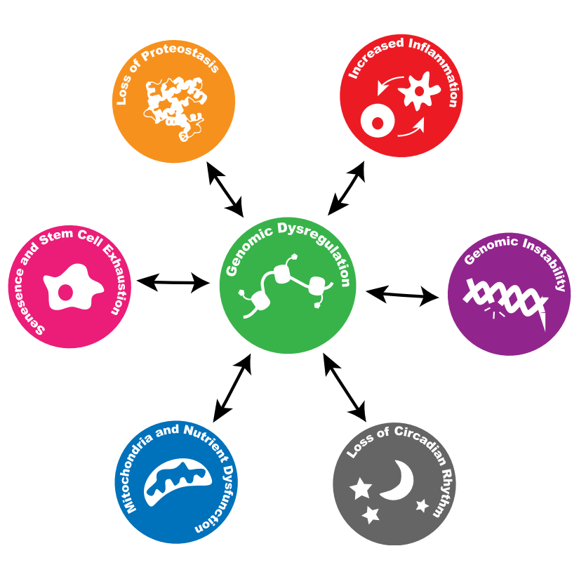
```
(ref:Booth2016fig3-Cap) Epigenetic Changes as a hub for the hallmarks of ageing. (Reproduced from Booth & Brunet [@Booth2016], figure 3)

Prior to examining the specific relationship of epigenetic changes to ageing we take a step back to define and outline epigenomics and examine the fundamentals of DNA methylation biology.

## Epigenomics - Overview

Epigenetics generally refers to modifications to DNA and chromatin which do not affect the primary sequence of DNA bases [@Bird2007], but which are to varying degrees stable and heritable. 
The term derives from epigenesis and genetics originating with Conrad Waddington [@Waddington1942]. 
Epigenesis refers to the idea that organisms develop through the progressive differentiation of cells from the egg into adult tissues. 
As modern genetics revealed that every cell contained a complete copy of the genome which was differentially utilised by the cells of adult organisms, the terms were fused to reflect the study of how this occurs.
The usage has evolved a little further since molecular biology began to elucidate the mechanisms involved in this process and the term now frequently refers to the study of these mechanisms and their effects in less explicitly developmental contexts.
Arthur Riggs et al. considered that heritability should be a criterion for a mark to be considered epigenetic, but this excludes many phenomena now commonly referred to using the term [@Russo1996].
Requiring heritability results in a further definitional dispute over degrees of heritability; mitotic, meiotic, intergenerational, transgenerational and to what degree of fidelity?
Adrian Bird proposed the definition: "the structural adaptation of chromosomal regions so as to register, signal or perpetuate altered activity states." as a useful compromise [@Bird2007].
Epigenomics refers to the totality of the epigenetic modifications present in a particular cell, tissue type or genome.
This definition appears to have caught on with at least some as: 'These days, "epigenetics" more generally refers to all non-genomic information storage in cells including gene networks, chromatin structure and post-translational modifications to histones.', according to Alice Kane and David Sinclair [@Kane2019].

Whilst an organism can generally be thought of as having a single genome, with exceptions such as Somatic mutations and Chimerism, it will have at least as many epigenomes as it has cell types [@Tabansky2015].
There are on the order of $10^{13}$ cells in the human body [@Bianconi2013].
Estimates of the number of cell types vary with the resolution at which one deems cells functionally distinct [@Regev2017].
At this point in time, however, there is no clear definition of what constitutes a distinct cell type, indeed they are beginning to be defined by the distinct patterns of gene expression and epigenetic modifications they exhibit [@CellSystemsCellType2017].
Consequently, the number epigenomes that could be considered distinct will likely ultimately approximate to the number of epigenomes which can usefully distinguish between sub-populations of cells.
A consortium has been established to produce a [Human Cell Atlas](www.humancellatlas.org) [@Regev2017] which aims to define all human cell types, and a cell type ontology [@CellOntologyOBO] exists.

There are a number of epigenetic modifications which can be subdivided into four broad categories:

1. __DNA modifications__

    In mammals DNA methylation primarily takes place on Cytosine residues. 
    Cytosine methylation occurs principally in an mCpG sequence context but can also occur in mCpH, mCHG and mCHH (H=A/C/T) contexts; particularly in cells of the nervous system [@Guo2014a] and embryonic stem cells where as many as 25% of all cytosines can be methylated in non-canonical contexts.
    In contrast to methylation in a differentiated non-neuronal tissue such as foetal lung fibroblasts which is 99.98% in CpG context [@Lister2009; @Schultz2015].
    5-methylcytosine (5mc) can be oxidised to produce another modified DNA base 5-hydroxymethylcytosine (5hmC) [@Penn1972; @Kriaucionis2009].
    5hmC may act as an intermediate to demethylation and potentially has regulatory functions in its own right [@Pfeifer2013].
    5hmC can be oxidised further to formylcytosine (5fC) and carboxylcytosine (5caC) [@Ito2011]. 
    The extent to which these modifications are stable and functional is still being explored.
    Other DNA bases can be methylated such as N6-methyladenine, but this occurs at a substantially lower frequency that 5mC and much less is known about their potential functions [@Wu2016]. 
    N6-methyladenine may play a role in condensing chromatin [@Xie2018].

2. __Histone tail modifications__

    Histone proteins form disk-shaped octamers around which ~150bp of DNA can be wrapped to form a nucleosome. 
    The 'tails' are generally the N termini of the histone proteins, outside of the core globular domains, which protrude from the nucleosome structure [@Losick2014]. 
    Histone tails can be subject to post-translational modification which commonly takes place at lysine residues, other residues are subject to modifications but lysines are among the best characterised. 
    Examples of modifications include methylation with between one and three methyl groups per lysine, Acetylations, Ubiquitylation, SUMOylations, and phosphorylations [@Bannister2011].
    Many of these marks can be generally classified as permissive or repressive but are frequently found in combinations of marks of opposing effect, rendering the interpretation of the 'Histone Code' extremely challenging [@Strahl2000; @Schreiber2002; @Voigt2012].
    One class of approaches to interpreting chromatin state is segmentation, this covers a variety of methods for combining mostly ChIP data for an array of histone modifications generated by large consortia projects such as ENCODE [@Moore2020]. 
    Segmentation makes use of pattern discovery techniques such as Hidden Markov Models to divide the genome into discrete sections assigning these sections to a set of categories which can then be compared to existing annotations to provide functional labels [@Hoffman2012; @Carrillo-de-Santa-Pau2017].
    When successful the pattern discovery algorithm independently recapitulates our existing ontology of functional elements and hopefully provides new insights by for example highlighting regions not previously considered to be in a given functional category. 
    This is a "top-down" approach making use of the "sum" of available chromatin state data rather than trying to interpret the significance of a single type of mark.

3. __Histone Variants__

    Alternatives to the canonical histones can be substituted in the nucleosome, examples of such alternative histones include H2A.Z and H3.3 [@Talbert2012].
    Alternative histones can alter chromatin structure and dynamics by altering nucleosome stability, binding different factors, and presenting a different substrate for histone modifications, thus altering their pattern [@Weber2014].

4. __Some non-coding RNAs (ncRNA)__

    A subset of long ncRNAs, particularly those which persist in close association with chromatin can fall within the definition of epigenetic features [@Kaikkonen2011]. 
    An example of such a long non-coding RNA (lncRNA) is Xist which is a key regulator of X inactivation [@Cerase2015].
    The catagorisation of these as epigenetic is somewhat controversial, as they are not direct chemical modifications to chromatin. However Xist, for example, facilitates the mitotically heritable repression of the inactivate X chromosome satisfying other criteria for being considered an epigenetic modification.

## Fundamentals of DNA Methylation

### Structure and Context

DNA methylation is the most well-studied epigenetic modification [@Haluskova2010].
Specifically CpG methylation, the addition of a Methyl group to the 5 carbon of a cytosine base (figure \@ref(fig:5mCvsC)), in a CpG dinucleotide context.
(hereafter 'DNA Methylation' or 'DNAm' refers to 5mC CpG methylation unless stated otherwise.)
DNA methylation is stable and relatively easy to characterise from biological samples by comparison with other epigenetic marks.
The methylation status of ancient DNA has even been characterised, for example, native American remains ranging in age from 230 to 4500 years were measured using bisulfite sequencing [@Smith2015].
C undergoes spontaneous hydrolytic deamination over time to U, and 5mC to T.
once sufficient time has passed for the deamination process to convert the majority of the 5mC sites, this can be used to infer the methylation state of post-mortem DNA using DNA polymerases that cannot bypass uracils and thus only causes C $\rightarrow$ T misincorporation events at former 5mC loci. 
This approach was employed to estimate the age at death of a a 4000 year of old Paleo-Eskimo belonging to the Saqqaq culture [@Pedersen2014].

5mC is quite chemically stable such that for most tissue sample preservation techniques for which DNA can be extracted from the sample DNAm can also be characterised [@Briggs2010]. 
DNA extracted with normal laboratory methods can be assayed for DNAm.
Histone modification status, on the other hand, is less robust against environmental stresses on samples and often requires considerably more laborious sample preparation to characterise [@Bauden2017].
DNA methylation also offers the appearance of relative simplicity in comparison to the complex picture of the 'histone code', the simple binary nature of DNA methylation state makes it easier to model and possibly to interpret.
However, interaction between DNAm and histone modifications is well documented [@Hashimshony2003; @Esteve2006; @Rose2014], this interplay between DNAm and histone modifications renders the interpretation of DNAm more complex, as its effects may be conditional on the chromatin environment.

```{r 5mCvsC, fig.cap='(ref:5mCvsC-Cap)',  out.width='80%', fig.show='hold', fig.align = 'center', echo=FALSE}
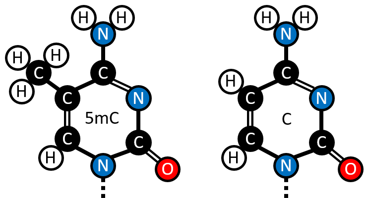
```

(ref:5mCvsC-Cap) The structure of 5-methylcytosine contrasted with Cytosine. (Figure created by the Author.)

### Distribution and Global Trends {#IntroCpGdist}

There are 28,299,634 CpGs [@Luo2014] in the hg19 assembly of the human genome [@Lander2001].
Given that the GC content of the human genome is $42\%$ the prior probability of getting a CpG dinucleotide is: $0.21 \times 0.21 = 0.0441$, $4.41\%$.
CpGs represent $\sim1.8\%$ of the dinucleotides in the human genome ( $28,299,634 \div (3.23\times10^9\div2) \approx 0.0175$).
Making them $\sim2.5$ fold less frequent than would be expected *a priori*.
Methylated cytosines are prone to deamination to thymines, resulting in mismatch lesions where a T is opposite a G. 
This can result in C to T mutations when DNA repair processes resolve this mismatch by changing the G to an A  instead of correcting the T back to a C [@Duncan1980]. 
This increased mutagenic potential generally means that CpGs are selected against, accounting for at least some part of their under-representation in the genome.
Methylated cytosines had a mutation rate in sperm of 18.5% compared to 5.44% for unmethylated CpGs [@Zhou2020], and C $\rightarrow$ T transitions account for ~33.1% of all SNPs [@Guo2005].
The three major classes of repeat elements SINEs, LINEs and LTRs contain some $46\%$ of all CpG sites, with a further $5\%$ in other repetitive elements [@Luo2014]. 

```{r CGIs, fig.cap='(ref:CGIs-Cap)',  out.width='80%', fig.show='hold', fig.align = 'center', echo=FALSE}
knitr::include_graphics("figs/CGI-Shores-Shelves-Seas_2.png")
```

(ref:CGIs-Cap) Schematic representation of CpG Islands, shores, shelves and seas. CpG density declines from shores to seas and methylation increases (CpG density and methylation proportion not to scale). (Figure created by the Author.)

CpGs are not uniformly distributed in the genome, they occur at higher frequency in some regions.
"CpG islands" or CGIs are regions of high CpG density.
They are defined somewhat arbitrarily, the definition used by UCSC is a sliding 500bp window [@Wu2010].
There have existed other definitions [@Gardiner-Garden1987].
The total number of CpGs in the UCSC repeat masked CGI annotation list of 28,691 CGIs is 1,990,729.
Therefore, these CpGs comprise $\sim7.0\%$ of the total number of CpGs the genome. The mean percentage of the sequence of these CGIs that is comprised of CpG dinucleotides is $\sim18.5\%$ and their mean length is 761bp.
CGIs overlap the promoters of $\sim70\%$ of genes [@Saxonov2006], this, however, leaves roughly half of all CGIs as "orphans" not associated with a known transcription site.
These orphan CGIs frequently constitute cell-type specific enhancers [@Bell2017] and alternate promoters [@Illingworth2010; @Maunakea2010].
They are found in both intergenic and intragenic regions.
CpGs are distributed quite sparsely through the genome occurring at low density in "seas" and at increasing density in CGIs and their flanking regions, see figure \@ref(fig:CGIs).
It is a characteristic of CGIs that they are generally unmethylated.

Early work showed 70-80% of CpGs are constitutively methylated [@Ehrlich1982; @Bird2002] Stadler et al. produced a more detailed picture of the distribution of CpG methylation in mouse embryonic stem cells (ESCs) [@Stadler2011] see figures \@ref(fig:Baubec2014fig1) & \@ref(fig:CpGfreqVsDNAm).
Stadler et al. categorised regions of the genome into fully, low and un methylated regions (FMRs, LMRs, UMRs) in mouse embryonic stem cells using a hidden markov model. 
LMRs were evolutionarily conserved and highly enriched for the chromatin signatures of distal regulatory regions such as enhancers (High H3K4me1 relative to H3K4me3, p300, H3K27ac over H3K27me3) [@Stadler2011]. 
Irizarry et al. found that the 2kb regions flanking CpG islands which they termed "CpG island shores" exhibited greater tissue-specific differential methylation than the islands themselves [@Irizarry2009]. 
This nomenclature has subsequently been expanded further with "CpG island shelves" which are 2kb - 4kb from the CGIs, and "seas" referring to the rest of the genome, see figure \@ref(fig:CGIs). 
Ziller et al. identified ~5.6 million CpGs, ~21.8% of autosomal CpGs, which are dynamically regulated across diverse cell-types, these clustered into ~716,000 differentially methylated regions.
More that three quarters of these regions where under 1kb in size and located away from transcription start sites and >70% of which had methylation levels >75% [@Ziller2013].
Data from three different approaches taken by Irizarry et al. [@Irizarry2009], Stadler et al. [@Stadler2011], and Ziller et al. [@Ziller2013] indicate that the most dynamic DNA methylation changes are occurring at the level of small distal regulatory features. 
A small fraction of CpGs, on the order of 2-6% exhibiting constitutively unmethylated states and on the order of 70-90% constitutively methylated leaving 4-28% of sites subject to dynamic regulation.

```{r Baubec2014fig1, fig.cap='(ref:Baubec2014fig1-Cap)',  out.width='80%', fig.show='hold', fig.align = 'center', echo=FALSE}
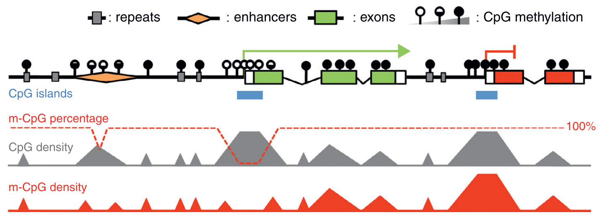
```

(ref:Baubec2014fig1-Cap) Stylised representation of the relationship between CpG Density, CpG methylation and functional DNA elements. (Figure reproduced from Baubec & Schubeler [@Baubec2014] figure 1)

```{r CpGfreqVsDNAm, fig.cap='(ref:CpGfreqVsDNAm-Cap)',  out.width='80%', fig.show='hold', fig.align = 'center', echo=FALSE}
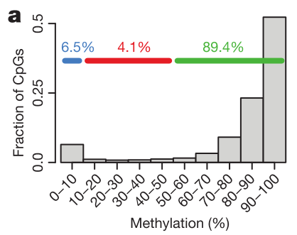
```

(ref:CpGfreqVsDNAm-Cap) The fraction of CpGs with a given methylation level. Data from Whole-Genome Bisulfite Sequencing (WGBS) of Mouse embryonic stem cells. Colours denote: unmethylated regions (blue), low-methylated regions (red), and fully methylated regions (green). These groups are three segments produced by a hidden markov model. low-methylated regions with 10-50% methylation are evolutionarily conserved distal regulatory elements with  dynamic cell-type specific regulation unlike the consistently unmethylated regions at CGIs. (Figure reproduced from Stadler et al. [@Stadler2011] figure 1a)

The regulatory role played by DNA methylation varies with context and the scale at which it is examined. 
For example methylation at a single CpG in a transcription factor binding site can determine whether or not the factor can bind at that site. 
There are methylation-sensitive transcription factors which can have their affinity for DNA either increased or decreased by methylation [@Yin2017; @Zuo2017].
In addition, larger-scale changes in DNAm can through interactions with chromatin modifiers alter DNA compaction and more general accessibility of DNA regions for binding, and/or impacting on their topological organisation.
DNAm also varies with nucleosome occupancy with lower methylation in linker sequences than on nucleosome-associated DNA [@Kelly2012; @Huff2014].
The oxidation products of 5mC can also affect chromatin organisation, 5-Formylcytosine can impact nucleosome positioning through covalently binding to histones [@Raiber2017]. 
This raises the question if some DNA methylation occurs specifically to act as an intermediate step for regulatory mechanisms which utilise its oxidation products.

### Pathways of DNA methylation and demethylation 

CpG methylation is produced and maintained by DNA methyltransferase (DNMT) enzymes.
All the DNMT enzymes use S-adenosylmethionine as the source of the methyl donor group.
DNMTs form a covalent intermediate between a conserved cysteine residue and the target base, through a nucleophilic attack on the C6 position in the cytosine ring [@Lyko2017]. 
This is followed by the transfer of the S-adenosylmethionine methyl group to C5, and deprotonation of the C5 to reform the double bond between C5 and C6; which is mediated by a base provided by the enzyme (Figure \@ref(fig:Lyko2017DNAmMechanism)). 

DNMT1 is associated with the replication machinery [@Vertino2002] and reproduces the methylation state of the parent strand on the daughter strand during replication.
The largest of the DNMT family DNMT1 contains a 'replication foci targeting sequence' (RFTS) domain required for its targeting to replication forks.
DNMT1 specialises in recognising hemimethylated DNA and methylating the unmethylated C in a palindromic CpG dinucleotide site, the UHRF1 protein assists in the recognition of these sequences [@Bostick2007]. 
DNMT3a and DNMT3b are responsible for *de novo* DNA methylation along with DNMT3L a catalytically inactive, but DNA-binding subunit [@Jia2009].
The location of *de novo* methylation by the DNMT3s is influenced by a number of factors including the Chromatin state and other DNA binding factors [@Lyko2017].

```{r Lyko2017DNAmMechanism, fig.cap='(ref:Lyko2017DNAmMechanism-Cap)', out.width='80%', fig.align = 'center', echo=FALSE}
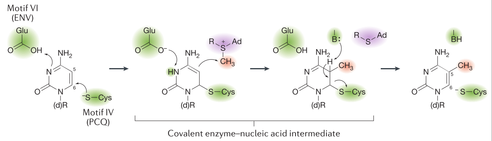
```

(ref:Lyko2017DNAmMechanism-Cap) Motif VI (ENV/PCQ) refers to the conserved catalytic motif in DNMTs. 'B:' Represents the enzyme supplied base (Figure reproduced from the review of DNMT biology by Lyko [@Lyko2017] (fig. 1b))

DNMT2 is unlike the other members of the DNMT family in that it targets an RNA substrate. 
DNMT2 is a tRNA methyltransferase which methylates a specific subset of tRNA genes, mostly Asp isoacceptors, at a site adjacent to the anticodon which protects them from endonucleolytic cleavage under stress conditions.
Unprotected tRNAs produce fragments which compete with small interfering RNAs interfering with their signalling pathways [@Kaiser2017].

The mechanisms of the demethylation of DNA were more recently characterised than those which govern its methylation [@Tahiliani2009; @Ito2011]. 
They are more complex and less well understood.
TET2 mutations are quite common in cancer, ranking 65th across 12 major cancer types [@Kandoth2013] and more common in diverse myeloid malignancies, where loss of its catalytic activity favours tumourigenesis [@Ko2010a].
A distinction is drawn between active and passive demethylation, in passive demethylation, 5mC bases are diluted out in the process of DNA replication.
In the leading model of active demethylation, they are oxidised one or more times by an enzyme from the TET (Ten-Eleven-translocase) family. 
They are then either passively removed by DNA replication or actively removed by a DNA glycosylase (thymine DNA glycosylase TGD) to create an apurinic site which is restored to a C by the Base Excision Repair (BER) pathway. This cycle of cytosine methylation and demethylation is illustrated in Figure \@ref(fig:Wu2017TETsDNAmCycle) [@Wu2017].

```{r Wu2017TETsDNAmCycle, fig.cap='(ref:Wu2017TETsDNAmCycle-Cap)', out.width='60%', fig.align = 'center', echo=FALSE}
knitr::include_graphics("figs/Wu2017TETsDNAmCycle.png")
```

(ref:Wu2017TETsDNAmCycle-Cap) BER = Bases Excision Repair; AM = Active Modification; AR = Active Removal, PD = Passive Dilution (Figure reproduced from the review of TET mediated active demethylation by Wu & Zhang [@Wu2017] (fig. 1a))

### Maintenance and Fidelity

DNA methylation is highly dependent on the underlying DNA sequence. 
Sequence features of particular importance to determining DNA methylation status are; transcription factor and other DNA binding protein recognition motifs, and CpG density [@Lienert2011; @Ziller2013]. 
Alterations in underlying DNA sequence such as SNPs and copy number variants (CNVs) can have a significant impact on methylation level and the susceptibility of the methylation level to change. 
In addition, CNVs can result in dosage effects on measures of DNAm, causing regions to appear, respectively, substantially more or less methylated when fewer or greater copies than expected are present [@Boks2009; @Kerkel2008; @Schalkwyk2010; @Shoemaker2010; @Bell2017a; @Martin-Trujillo2017].
Despite the strong influence of sequence on methylation, global CpG methylation exhibits change over developmental time as illustrated in figure \@ref(fig:DNAmDevTime) and exhibits tissue-specific changes in distribution and amount [@Ziller2013]. 

```{r DNAmDevTime, fig.cap='(ref:DNAmDevTime-Cap)', out.width='80%', fig.align = 'center', echo=FALSE}
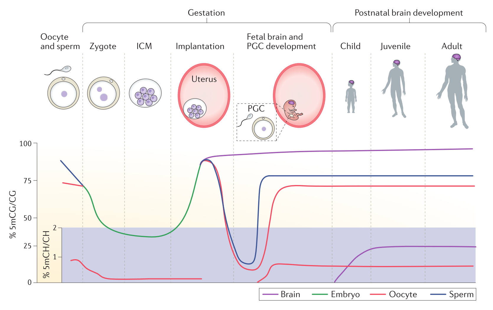
```
(ref:DNAmDevTime-Cap) 5mC levels over developmental time. 5mCH or 5-methylcytosine-(A, T or C) levels are represented on a separate (purple) Axis from the main 5mCG axis. PGC = Primordial Germ Cell. (Figure reproduced from @Ciernia2016 figure 3)

In mitosis, DNA methylation is inherited by daughter cells with an error rate on the order of $1\times10^{-3}$ per site per generation [@Ushijima2005], several orders of magnitude less than that of DNA replication (error rate of $1\times10^{-7}$ - $1\times10^{-8}$ [@Kunkel2004a]).
DNMT1 methylates hemimethylated DNA at CpG sites in S phase copying the DNA methylation state of the parent strand onto the daughter strand.
DNMT1 provides the catalytic activity and is precisely targeted to hemimethylated DNA in conjunction with the UHRF1 (ubiquitin-like, containing PHD and RING finger domains 1) protein which specifically binds hemimethylated CpG sites via its SRA (SET and ring-associated) domain using a flip-out mechanism to recognise 5mC
[@Sharif2007; @Bostick2007; @Arita2008; @Liu2013b].

The fidelity of DNA methylation copying can be assayed by Hairpin-Bisulfite PCR (Polymerase Chain Reaction) [@Laird2004].
Laird et al. looked at two alleles of a portion of the CpG island from the human *FMR1* gene in uncultured lymphocytes, one hypermethylated and one hypomethylated.
In the hypermethylated allele, they found that 96% of sites methylated in the parent strand remained methylated in the daughter strand and 86% of unmethylated sites remained unmethylated. 
By contrast in the hypomethylated allele, there were no methylated sites to be retained and >99% of unmethylated sites remained so following replication. 
Laird et al.'s work suggests a higher degree of overall methylation fidelity for hypomethylated DNA and a propensity for unmethylated sites in hypermethylated DNA to become methylated. 

Change in DNAm levels over time (divisions) can be modelled using the differential equations [@Pfeifer1990a], which predict that a fully methylated site and a fully unmethylated site will converge on an equilibrium level.
This level is determined by the probability of maintenance of the methylation state and of *de novo* methylation for a given locus. 
This stochastic model of DNAm is in agreement with experimental findings [@Laird2004; @Riggs2004a], Figure \@ref(fig:Riggs2004PNASfig2DNAmFidelity).

```{r Riggs2004PNASfig2DNAmFidelity, fig.cap='(ref:Riggs2004PNASfig2DNAmFidelity-Cap)', out.width='70%', fig.show='hold', fig.align = 'center', echo=FALSE}
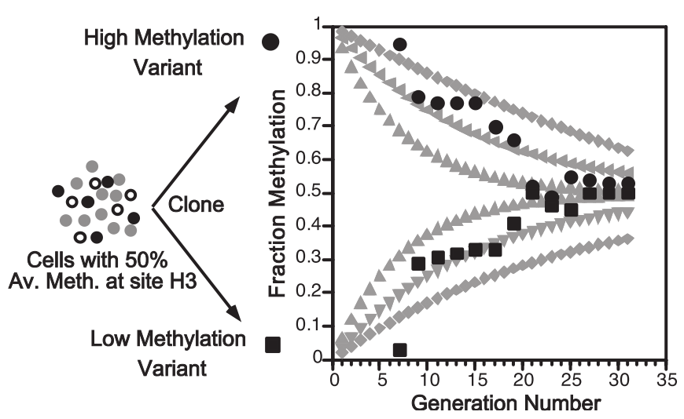
```
(ref:Riggs2004PNASfig2DNAmFidelity-Cap) $E_m$ = probability of methylation maintenance, $E_m$ = probability of *de novo* methylation. $M$ & $U$ = the number of methylated and unmethylated molecules at specific CpG sites respectively. Modelling (__Grey points__) $E_m,E_d$ values of 0.90,0.10; 0.95,0.05; 0.97,0.03 (outermost to innermost, two curves for each $E_m,E_d$ set, one starting at $M=1,U=0$ and one a $M=0,U=1$. Experimental data (__Black points__) from the *HpaII* locus (site H3) in 17 clones of mouse cell line BML-2 which has a known methylation level of 50%. (Reproduced from Riggs & Xiong [@Riggs2004a])

Jenkinson et al. [@Jenkinson2017] used an information-theoretic approach, modelling DNAm as a binary communications channel using a 1-dimensional Ising model from the field of statistical physics. 
This permitted them to examine properties of DNAm not accessible to conventional means of analysis which typically capture the mean methylation level and perhaps the variability for a given locus. 
When considering methylation fidelity using this lens the maintenance of a given methylation state can be seen as an information processing task which requires the consumption of free energy in order to reduce the probability of error in the transmission of that methylation state. 
Thus Relative Dissipated Energy (RDE) can serve as a measure of the work expended by a cell at a given locus in order to preserve the current methylation state of that locus. 
They found that the Transcription Start Sites (TSS) exhibited high levels of RDE and high information capacity as well as low levels of entropy.
These values trended in the opposite direction as they moved outwards to CGIs, shores and seas. 
Jenkinson et al. [@Jenkinson2017] also found a global increase in entropy with age, but not with cell passage in culture suggesting an increase in entropy is associated with epigenetic age independent of mitotic age.
This observation is in agreement with the finding that epigenetic state becomes more stochastic and diverges with age [@Fraga2005; @Slieker2016], indeed genes whose methylation were most divergent with age were enriched for ageing associations. 
They also observed a loss of entropic sensitivity with age. 
Entropic sensitivity is an indicator of how plastic DNAm state is to extrinsic effects. 
Jenkinson et al. noted that there is a general loss of phenotypic plasticity with age, but cited no specific instance of loss of DNAm plasticity to environmental effects with age.
Hahn et al. [@Hahn2017] provided a possible example of this effect when they reported that dietary restriction caused fewer differences in the methylation state of older than younger mice.

Zhao et al [@Zhao2014] applied Hairpin-Bisulfite PCR genome-wide in mouse embryonic stem cells (ESCs). 
They also found high degrees of methylation fidelity in hypomethylated regions such as CGIs and Promoters, as well as a high degree of fidelity in sites bound by transcription factors. 
This is in agreement with the findings of Jenkinson et al. [@Jenkinson2017] who noted that entropy (methylation stochasticity) was lower and more variable in CGIs and TSS (transcription start sites). 

Methylation inheritance fidelity is reduced in cancer [@Ushijima2005] and increases with differentiation [@Zhao2014].
The RDE (relative dissipated energy) at CGIs and TSSs is higher in differentiated tissues such as the brain, implying low entropy, and lower in embryonic stem cells, implying greater entropy [@Jenkinson2017] (see Figure \@ref(fig:Zhao2014fig3ab)). 
In addition, the correlation between CpG sites increases in cancer [@Jenkinson2017], suggesting reduced higher-level regulatory control and tendency to fall back on lower level feedback mechanisms leading to a return to the baseline equilibrium described above as the cell is expending less energy to maintain an out of equilibrium methylation state.

```{r Zhao2014fig3ab, fig.cap='(ref:Zhao2014fig3ab-Cap)',  out.width='80%', fig.show='hold', fig.align = 'center', echo=FALSE}
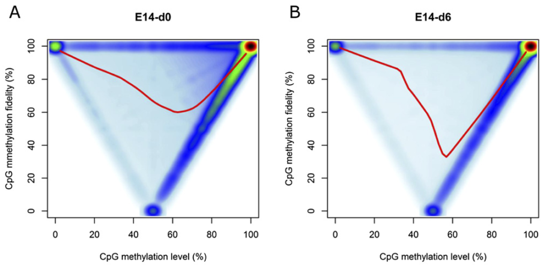
```
(ref:Zhao2014fig3ab-Cap) Bimodal Distribution of DNA methylation level and fidelity. Methylation fidelity exhibits a bimodal distribution with most and least methylated regions exhibiting the highest fidelity. Additionally, fidelity for methylation levels of 10-50% is considerably better than fidelity for levels of 50-90%. These data are from the mouse cell line ES-E14TG2a which is capable of self-renewal when cultured with Leukaemia Inhibitory Factor (LIF) and spontaneous differentiation upon removal of LIF (denoted as E14-d0 at day 0 and E14-d6 at day 6 after the withdrawal of LIF, respectively). Fidelity represents the percentage of symmetrically methylated or unmethylated CpG dyads for a given position as determined by Hairpin-Bisulfite PCR. (Reproduced from Zhao et al. 2014 [@Zhao2014] (figure 3 a and b).)

Zhou et al. linked the substantial loss of DNA methylation in proliferative cancer cells, even counterintuitively those cancers with high DNMT1/UHRF1, DNMT3A/B levels and physiological levels of TETs, to a systematic mechanism of DNA methylation loss.
Partially methylated domains (PMDs) are characterised by low CpG density, larger numbers of lone CpGs flanked on both sides by A/T nucleotides, and low levels of H3K36me3 as well as being lamina-associated late replicating domains.
PMDs are prone to becoming hypomethylated in a manner which progressively increases with mitotic division.
Copying of the parent strand methylation state by DNMT1/UHRF1 takes time and may not be fully completed with each round of replication leading to progressive DNA methylation loss in these regions, especially if proliferation is rapid.
Some late replicating regions have greater methylation fidelity through the action of DNMT3A/B at sites with the H3K36me3 mark [@Zhou2018].

### DNA Methylation Assays 

There are numerous DNA methylation assays. 
Some are designed to assay global DNAm levels producing a single global measurement of the amount of 5mC present in a sample, others assay DNAm in a manner traceable to a specific genomic locus.
These methods can be further subdivided into targeted methods where the loci to be examined are known in advance, and those where the loci covered are quasi-randomly sampled. 
Both the targeted and untargeted methods vary in their granularity, from individual CpGs to large regions of the genome, on the order of megabases.
These assays also vary in their coverage of the genome from locus-specific approaches looking at small numbers of individual loci to whole-genome methods providing methylation information on all ~28 million CpG sites. 
Between these two extremes are 'epigenome-wide' methods which are focused with varying degrees of specificity on genomic regions of interest.

These DNA methylation assays generally exploit one of four following principles:

1. __Methylation sensitive restriction digestion__
    A variety of methods exploit enzymes which differentially cut methylated and unmethylated DNA.
    An example of such enzymes is: HpaII and MspI which are isoschizomers for the sequence: 5'-C^CGG-3' but only HpaII is methylation-sensitive and unable to cut the sequence if the internal cytosine is methylated. 
    The methods which use such enzymes include: Restriction landmark genomic scanning, which gives a roughly megabase resolution indicators of DNAm levels by 2D electrophoresis [@Hatada1991]. 
    MRE-seq (Methylation sensitive restriction enzyme sequencing), which makes use of methylation-sensitive restriction digests to enrich for unmethylated DNA [@Maunakea2010]. 
    This is then sequenced to provide the genomic location of this unmethylated signal. 
    Reduced Representation Bisulfite Sequencing (RRBS), which uses methylation-sensitive restriction digestion to enrich for unmethylated sequences which are then subject to bisulfite sequencing, (see point 3 below).

2. __DNA methylation-sensitive binding of DNA by antibodies or other proteins selectively which bind methylated DNA__
    Anti-5mC antibodies were first used to isolate methylated DNA in 1985 and were subsequently paired with array-based technologies to assay DNAm levels at specific loci in 2005 [@Weber2005; @Harrison2011].
    This was followed by MeDIP-seq (methylated DNA immunoprecipitation and sequencing) [@Down2009; @Lienhard2014], which enriches methylated DNA that is then sequenced and the number of reads mapping to a locus is indicative of the relative methylation level.
    MBD-seq uses a recombinant Methyl Binding Domain (MBD) protein to enrich for methylated double-stranded DNA, prior to sequencing [@Serre2009a].
    Inferring the absolute methylation levels form the number of reads mapping to a locus enriched by one of these pull-down methods is complicated by variation in CpG density in the genome and the fact that CpG dense regions tend to have low methylation levels, and thus tend not to be pulled down by antibodies binding 5mC or MBD proteins.
    The best results for estimating absolute methylation levels with these methods come from pairing them with a complementary method to enrich for unmethylated sites such as MRE-seq (described above) [@Li2015]. 
    Though relative methylation levels remain effective in identifying differentially methylated regions when using these methods alone [@Bock2010; @Maunakea2010].

3. __Sodium bisulfite conversion of unmethylated cytosines to uracil__
    Conversion of cytosine to uracil changes the base complementary to this site from G to A [@Hayatsu1970]. 
    The basic chemistry of the conversion process is illustrated in Figure \@ref(fig:BisulfiteConversionNEB). 
    This conversion can be detected with a variety of technologies such as: 
    Sanger sequencing, The Illumina bead chip methylation arrays; WGBS; and Targeted bisulfite PCR or sequencing to examine a small number of selected loci.
    It can also be performed on a larger number of loci with microfluidic multiplexing such as that provided by the Fluidigm access array [@Adamowicz2018].
    It is worth noting that bisulfite conversion cannot differentiate between methylated and hydroxymethylated cytosines.
    Because 5hmC represents a small fraction of modified bases compared to 5mC many analyses have made the working assumption that unconverted bases are methylated, but it is beginning to be recognised that distinguishing between the two may be biologically important especially in tissues where 5hmC is more prevalent such as neurons.
    A variant of bisulfite conversion, oxidative bisulfite conversion, exists which can permit 5hmC to be distinguished from 5mC [@Skvortsova2017].
    Additionally, New England Biolabs has recently developed an enzymatic alternative to chemical bisulfite conversion [@Williams2019]

```{r BisulfiteConversionNEB, fig.cap='(ref:BisulfiteConversionNEBCap)', out.width='80%', fig.show='hold', fig.align = 'center', echo=FALSE}
knitr::include_graphics("figs/BisulfiteConversionNEB.jpg")
```
(ref:BisulfiteConversionNEBCap) Sodium Bisulfite conversion of C to U, 5mC and 5hmC are unaffected. (Image Credit New England Biolabs).

4. __Physical differences in the methylated base__
    These are exploited by the not yet widely used '3rd generation' sequencing technologies such as nanopore and single-molecule real-time sequencing.
    These methods respectively exploit the effects of modified bases on ion flow through the nanopore and impact on incorporation time of new bases whilst in the polymerase [@Rhoads2015; @Simpson2017].

## DNA Methylation and Ageing

Returning now to the relationship between DNA methylation and ageing we will review the major discoveries in that field, the roles thought to be played by DNAm in ageing and the utility of DNAm clocks as biomarkers of ageing.

Early work on DNA methylation and ageing used biochemical, chromatographic and radiolabeling techniques to assay global changes in the amount of 5mC.
These studies found differences in 5mC composition with cell type [@Ehrlich1982] but did not see changes with age.
Other work around that time however found differences in 5mC levels with the age of cells in culture [@Wilson1983; @Feinberg1983].
Wilson et al. noted that DNA methylation decreased across several tens of generations of cell lines in culture, but not in immortal cell lines.
Immortal cell lines had lower absolute levels of 5mC to start with but remained constant over time.
Wilson et al. also cite earlier work by Romanov at al. 1981 [@Romanov1981] and Berdyshev el al. 1967 [@Berdyshev1967] which documented decreases in 5mC with age in cows and salmon, respectively.

Later work by Wilson et al. 1987 [@Wilson1987] in mice *P. leucopus* and *M. musculus* found decreases in 5mC with age and that the rate of decline was less in the longer-lived *P. leucopus* than in *M. musculus*.
Interestingly, a recent study using Reduced Representation Bisulfite Sequencing (RRBS) by Cole et al. found no global differences between young and old mice in short and long-lived strains, however, their other observations would seem to corroborate these initial trends.
For the assayed sites long-lived mice exhibited 10x more hypermethylation than wild-type (WT), and WT mice had 3x more Differentially Methylated Regions significantly associated with age (DMRs/aDMRs) than did long-lived mice.
Notably, the WT and long-lived mice shared many of the same aDMRs which differed in their degree of methylation as opposed to affecting different sites in the genome [@Cole2017].
The lack of apparent global changes may be due to the biases of the reduced representation bisulfite sequencing (RRBS) method used.
RRBS uses a restriction enzyme-based approach to enrich for regions with high GC content such as CGIs which tend to have low levels of methylation, and consequently may not be sensitive to loss of methylation in generally hypermethylated regions which could contribute to a global trend [@Meissner2005].

Wilson et al. also noted that the mitotic index of tissues did not relate to the loss of DNA methylation with age in tension with their earlier observations *in vitro*.
The persistent loss of 5mC over time and the dramatic changes in methylation seen in cancer cells led Wilson et al. to suggest that dysregulation of DNA methylation may have a substantial role to play in the age-dependency of cancer risk and ageing more generally [@Feinberg2004].
It has been suggested that "Epimutations" may be able to substitute for mutations in the multi-hit model of carcinogenesis [@Knudson1971].
For example; hypermethylation of the *BRCA1* promoter [@Esteller2000], Or, the development of Wilms’ tumour due to Beckwith–Wiedemann syndrome, a disorder arising from loss of imprinting of the gene encoding insulin-like growth factor 2 (IGF-2) leading to a double dose of IGF-2 protein [@Feinberg2018].
Furthermore, the loss of methylation and increased entropy of closed chromatin regions may lead to increased susceptibility to the types of structural mutations commonly found in cancer cells. 
This could result from the exposure of homologous sequences presenting increased opportunities for erroneous breakpoint repair or recombination between similar sequences in different parts of the genome [@Feinberg2004; @Jenkinson2017].

Methods which allowed the examination of changes in DNA methylation at known loci in the genome permitted a more nuanced picture of changes in DNA methylation over time to develop.
Fraga et al. [@Fraga2005] introduced the concept of "epigenetic drift" being the divergence of DNA methylation and other epigenetic modification patterns with time.
Fraga et al. looked at the divergence in DNA methylation along with global Histone H3 and H4 acetylation patterns between monozygotic (MZ) twins over a wide range of ages.
They observed that older twins had greater epigenetic differences with time, in DNA methylation as well as H3, H4 Acetylation. 
Fraga et al. also noted that the divergence in epigenetic state was greater in twins who had lived longer apart and had different medical histories.
Figure \@ref(fig:Fraga2005fig3) is a useful visual encapsulation of Fraga et al.'s DNA methylation results.
Slieker et al. [@Slieker2016] identified 6366 CpGs whose methylation variability increased with age (aVMPs) using the Illumina 450k array platform on whole-blood from 3295 individuals.
Variably upregulated aVMPs were associated with the expression of DNA repair and apoptosis genes and variably downregulated aVMPs with cellular metabolism.
Furthermore 
Both the increase in variability with age and the increasing divergence of twins support a narrative of epigenetic dysregulation and increasing entropy with age.

```{r Fraga2005fig3, fig.cap='(ref:Fraga2005fig3-Cap)',  out.width='80%', fig.show='hold', fig.align = 'center', echo=FALSE}
knitr::include_graphics("figs/Fraga2005fig3.png")
```
(ref:Fraga2005fig3-Cap) Mapping Chromosomal Regions of Differential DNA Methylation. Examples from Chromosomes 1, 3, 12 & 17 are shown for a 3 and 50-year-old twin pair. Methylation status is shown by competitive hybridization of AIMS (amplification of inter-methylated sites) products to metaphase chromosomes. Green and Red signals indicate hypermethylation and hypomethylation events between twins, Yellow indicates little difference. Red and Green blocks adjacent to ideograms indicate areas of significant DNA methylation change. (Reproduced from Fraga et al. [@Fraga2005] (figure 3).)

### Age-Related Differential Methylation and Epigenetic Clocks {#DNAmAgeReview}

With the advent of array-based techniques which permitted the measurement of the methylation status of specific CpGs placed strategically throughout the genome, researchers were able to undertake a more fine-grained analysis of the changes in DNA methylation with age.
This has allowed the prediction of chronological age from a metric of "DNA methylation age" (DNAm age), and interpretation of the differences in predicted and chronological age in terms of the pathophysiology of ageing. 

The Illumina Golden gate array [@Bibikova2006] with 1505 probes targeted to cancer-related genes was the first of these.
Bjornsson et al. observed DNAm changes with age as well as noting substantial intra-individual differences.
In contrast earlier work by Eckhardt et al. [@Eckhardt2006] and Ehrlich et al. [@Ehrlich1982] found no age-related changes using averages across individuals. 
Bjornsson et al. [@Bjornsson2008] also found that the intra-individual differences in differential methylation with ageing were highly heritable by use of familial clustering.
Work by Boks et al. [@Boks2009] also using the golden gate array corroborated Bjornsson et al.'s findings in monozygotic twins. 

The Bjornsson and Boks studies used the golden gate array on peripheral blood samples, whereas Christensen et al. [@Christensen2009] used the golden gate array to look for age-related changes in DNAm in several tissue types.
CpG sites that are differentially methylated with age when searching across tissues were frequently specific to a small number of tissue types.
In addition, CpGs in CGIs tended to be hypermethylated with age and *vice versa*.
Christensen et al. also found that the methylation profiles for different tissues were highly predictive of tissue type.

Rakyan et al. [@Rakyan2010] looked at age-related changes in DNAm using the Illumina 27k array [@Bibikova2009] with whole blood samples in a discovery set.
They replicated their findings in sorted cell fractions to see if they could capture changes in DNAm that could be attributed to changes in blood cell-type composition over time, which they did not find.
Teschendorff et al. [@Teschendorff2010] found that promoters of targets of the polycomb group proteins (PCGTs) were more likely than non-PCGTs to become methylated with age [@Jung2015]. 
Repression of PCGTs is required for Stem cells to differentiate.
PCGTs whose methylation status was associated with age were associated with pre-neoplastic conditions in a large cohort using the 27k array with blood and epithelial cell samples. 

Whilst Bell et al. [@Bell2010] observed a correlation between a major component of variation in DNA methylation in blood and age, Bocklandt et al. [@Bocklandt2011] also using the 27k array but with saliva samples created the first "epigenetic clock" used to predict the chronological age of donors based on the DNAm landscape of their cells, the mean error was 5.2 years.
Bocklandt et al. were able to achieve similar predictive accuracy with as few as 3 CpG sites in their model.
Koch et al. [@Koch2011] used publicly available 27k array datasets from a variety of different tissues to train a model using a different statistical method but only achieved an error of 11 years. 
They did, however, identify a number of CpGs also identified by Bocklandt et al.
Bell et al. [@Bell2012] used 27k array data to look for correlations between differential methylation and age-related phenotypes as well as chronological age.
They found that few age-related phenotypes were correlated with differential methylation, only 5 CpG sites were identified for the 16 age-related phenotypes examined. Whereas 490 significant CpGs were associated with chronological age.
Many of the CpGs they identified persisted across tissue types and replicated in a second cohort, several had been identified previously by Rakyan et al. [@Rakyan2010] and Bocklandt et al. [@Bocklandt2011].

Heyn et al. [@Heyn2012] examined the DNA methylation status of a newborn and a centenarian in CD4+ T cells using whole-genome bisulfite sequencing (WGBS), along with a group of newborns and nonagenarians using the Illumina 450k array [@Bibikova2011]. 
Heyn et al. observed a global decrease in methylation from newborn to centenarian, as well as an intermediate level of methylation on a sample of intermediate age (see figure \@ref(fig:Heyn2012F1b)). 
This observation was replicated in 450k data. 
In addition, Heyn et al. noted that adjacent CpGs normally exhibit a substantial degree of correlation in methylation status and that they were less well correlated with their neighbours with increasing age. 
Interestingly Jenkinson et al. [@Jenkinson2017] found that correlation among nearby CpGs increased in cancer tissues.
Modelling work done by Affinito et al. [@Affinito2016] agrees with this correlation between neighbouring CpGs under physiological conditions, which is particularly pronounced in CpG dense regions like CGIs.
The greater physical proximity of CpGs in CpG dense regions means that greater correlation is expected.
Due to the fact that these CpGs are more likely to be affected by the same proteins and regulatory features than CpGs with greater distance separating them [@Haerter2014].
Unmethylated CGIs with H3K4me3 histone modifications can act as functional promoter units, this unmethylated state is needed for their interaction with CXXC domain containing proteins like Cfp1 [@Thomson2010].
Garagnani et al. used 450k array data from a cohort of 64 subjects aged 9-83 to identify those CpGs most well correlated with age as had been done with previous array technologies [@Garagnani2012].

```{r Heyn2012F1b, fig.cap='(ref:Heyn2012F1b-Cap)',  out.width='80%', fig.show='hold', fig.align = 'center', echo=FALSE}
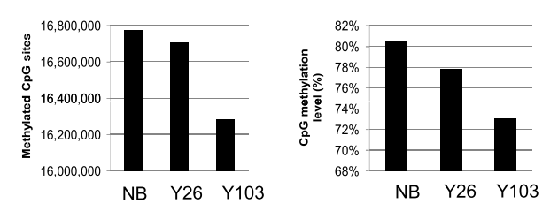
```
(ref:Heyn2012F1b-Cap) Global Hypomethylation with Age. NB = Newborn, Y26 = 26 year old, Y103 = 103 year old.
(Reproduced from Heyn et al. [@Heyn2012] figure 1 b.)

In January of 2013 Hannum at al. [@Hannum2013] published a study using the Illumina 450k array and whole blood samples for 656 participants aged 19-101. 
Their optimised model was able to predict age with an error of 3.9 years.
In December of the same year, Horvath [@Horvath2013] published a study using multiple datasets, including  Hannum's data, some produced on the 27k and some the 450k array. 
Both used 'elastic net' penalised multivariate regression models to identify CpGs which collectively provide the best predictor of DNAm age rather than the CpGs which are individually most highly correlated with age [@Friedman2010]. 

Florath et al. [@Florath2014] identified some additional age-associated CpGs from two large cohorts totalling N = 898 and an N = 67 8yr follow-up longitudinal cohort. 
More than 3/4 of the CpG sites they identified began as hypomethylated and increased in methylation with age, a proportion likely skewed by the large number of 450k probes in CGIs and other typically low methylation regions.
Bacalini et al. [@Bacalini2015] performed a meta-analysis of existing DNAm age datasets and employed a "region-centric" approach to try to identify loci larger than single CpGs which they anticipate will be more biologically meaningful than lone CpGs, despite being limited to just the CpGs for which there are array probes. 
They found that their approach increased the number of common features identified using the Hannum et al. [@Hannum2013] and Heyn et al. [@Heyn2012] datasets. 
Zaghlool et al. [@Zaghlool2015] performed 450k array DNAm age study in Qatari population they identified 12/88, 23/490 and 102/162 of the CpGs found by Bocklandt et al. [@Bocklandt2011], Bell et al. [@Bell2012] and Florath et al. [@Florath2014] respectively. Zaghlool et al. [@Zaghlool2015] also found that Horvath's age predictor [@Horvath2013] had an error of 3.7 years in their dataset. 
This is in agreement with existing findings and indicates that ethnicity has no major effects on the DNAm age signature. Benton et al. [@Benton2017] looked at changes in DNA methylation with age in a genetically isolated population on Norfolk Island with similar results to previous studies but identifying some novel age-associated CpGs.

Most DNAm relationships with age noted in previous studies have been linear, Johnson et al. [@Johnson2017] used the 450k array in peripheral blood samples. 
They identified 21 CpGs whose DNAm changes at a rate that changes with age from an initial pool of 27,723 CpGs which were differentially methylated with age. 
Two sites exhibited an increasing rate of increase in DNAm with age, and 18 sites a decreasing rate of increase.
However, these effects could be impacted by changes in blood cell-type composition with age.

### Genetic Influences on DNA Methylation

Epigenetic variation falls on a continuum of genetic influence that can be summarised by three categories:

1. __pure__ - DNA sequence has no predictive value for epigenetic state.

2. __facilitated__ - DNA sequence biases the epigenetic state enabling epigenetic variation.

3. __obligatory__ - DNA sequence permits exact prediction of epigenetic state.

Regional methylation state is strongly influenced by genotype, by single nucleotide polymorphisms (SNPs) [@Smith2014a] and by structural variants [@Kuehnen2012; @Gymrek2015]. 
An example of an obligatory effect on methylation is a point mutation at a CpG site, a C to T transition precludes methylation at that site in future. 
The effect of structural variants on methylation can be hard to determine as changes in sequence dosage often lead to measurement artefacts. 
Efforts have been made to correct for the influence of genetic factors in EWAS, when searching for purely epigenetic effects but the potential interaction of the somatic mutations known to accumulate with age (Figure \@ref(fig:Jaiswal2014fig1)) and the changes in DNAm with age remain largely unexplored. 

Increases in frequency of particular mutations can also be driven by clonal expansion of cellular sub-populations, particularly blood, and possibly in other tissues with a high level of turnover.
The differentiation of blood cells from heamatopoetic stem cells is less linear and hierarchical than initially modelled.
The hematopoetic stem cell compartment is comprised of a pool of cells with characteristics of multiple lineages and are to a greater or lesser extent primed for a particular branch of differentiation [@Velten2017]. 
The somatic mutations present in these hematopoetic stem cells [@Jaiswal2014], provide the variation necessary for selection processes to act, and the changes in variant allele frequency in blood cells indicates that there are positive selection effects driving the increase in frequency of certain alleles [@Watson2020].
These selection effects favour more highly proloferative cells and may lead to the exhaustion of stem cells able to produce particular lineages and, imbalanced production of different cell types in undesirable proportions [@Kirschner2017].
This can be a pre-cursor to hematalogic malignancies [@Jaiswal2014].

This is of particular relevance to DNAm as the profile of the types of mutation which accumulate with age (Figure \@ref(fig:Jaiswal2014fig2c)) distinctly favours C to T transition mutations which can disrupt CpG dinucleotides [@Jaiswal2014c]. 
CpG dinucleaotides are particularly prone to these mutations through the deamination of 5mC to T.

```{r Jaiswal2014fig1, fig.cap='(ref:Jaiswal2014fig1-Cap)', out.width='60%', fig.align = 'center', echo=FALSE}
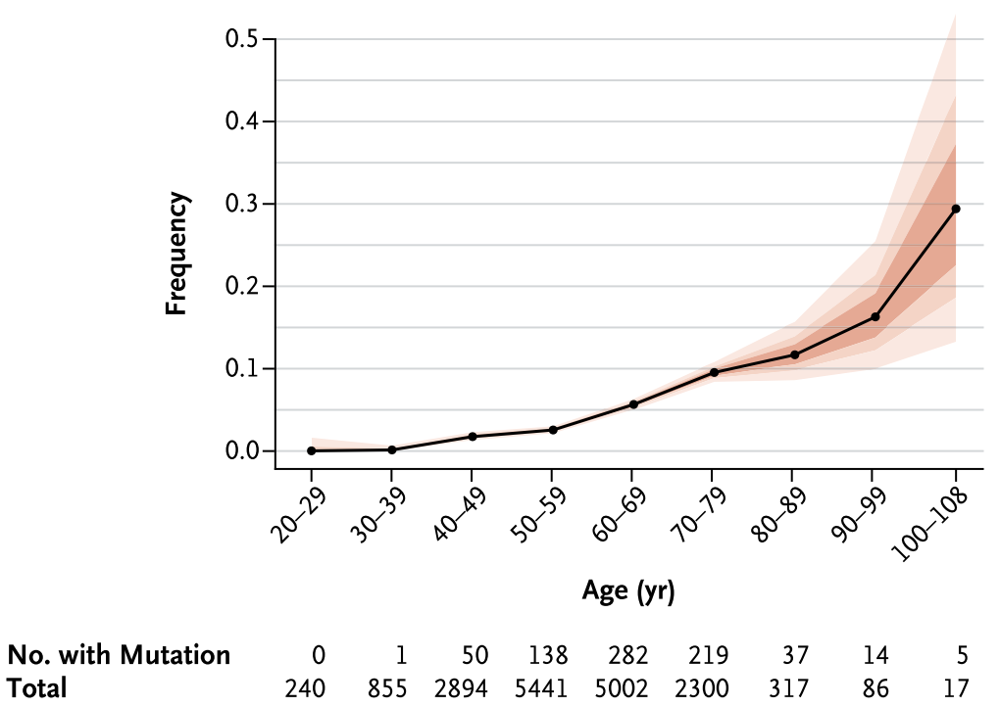
```
(ref:Jaiswal2014fig1-Cap) Somatic mutations increase with Age. (Reproduced from Jaiswal et al. [@Jaiswal2014c], figure 1)

```{r Jaiswal2014fig2c, fig.cap='(ref:Jaiswal2014fig2c-Cap)', out.width='60%', fig.align = 'center', echo=FALSE}
knitr::include_graphics("figs/Jaiswal2014fig2c.png")
```
(ref:Jaiswal2014fig2c-Cap) C to T transitions are the most common substitutions that occur with age. (Reproduced from Jaiswal et al. [@Jaiswal2014c], figure2 c)

### DNAm Age as a Biomarker of Ageing

We have seen that DNAm can be a fairly accurate predictor of age, however, there is more to being a good biomarker of ageing than predictive accuracy. 
Weidner et al. [@Weidner2014] conducted a study with the specific intent of identifying CpG sites that would serve as the best biomarkers of ageing. 
Below is a list of specific criteria for a high-quality biomarker of ageing laid out by Johnson et al. [@Johnson2006].

1. It must predict the rate of ageing. In other words, it would tell exactly where a person is in their total lifespan. It must be a better predictor of lifespan than chronological age.
2. It must monitor a basic process that underlies the ageing process, not the effects of disease.
3. It must be able to be tested repeatedly without harming the person. For example, a blood test or an imaging technique.
4. It must be something that works in humans and laboratory animals, such as mice. This is so that it can be tested in lab animals before being validated in humans.

We have seen that DNA methylation clocks can be good predictors of chronological age, we will revisit the question of whether or not they are superior to chronological age in their ability to predict lifespan below.
Bell et al. [@Bell2012] found DNAm did not generally correlate well with ageing phenotypes but did correlate well with chronological age and Teschendorff et al. [@Teschendorff2010] found that their age-associated DNAm signature remained fairly constant across several disease states including ovarian cancer and type 1 diabetes.
Suggesting that DNAm age prediction does indeed: "monitor a basic process that underlies the ageing process, not the effects of disease", meeting criterion number 2.
Several of the DNAm clocks discussed so far have been based on whole peripheral blood samples meeting criterion number 3. DNAm age clocks have been shown to work in Chimpanzees [@Horvath2013], Dogs/Wolves [@Thompson2017], Mice [@Stubbs2017], Naked Mole Rats [@Lowe2020], Rhesus Macaques, Humpback Whales [@Lowe2018] and are likely to work in other mammalian model organisms.
Furthermore, a cross-species clock based on conserved ribosomal RNA genes has been developed [@Wang2019].
It should be noted that Horvath's Human clock uses array data and that the Dog/Wolf and Mouse clocks use RRBS.
Model organisms such as *C. elegans* which essentially lack DNA methylation would not, however, be likely to be tractable for DNAm based age prediction.
Consequently DNAm age prediction at least partially meets criterion number 4.

Is DNA methylation a better predictor of lifespan than chronological age? 
Both Hannum and Horvath identified the difference between DNAm age and chronological age or $\Delta_{Age}$ as a potential indicator of disproportionate biological ageing. 
Marioni et al. [@Marioni2015] explicitly set forth to test the value of DNAm age as a predictor of mortality.
Adjusting for age, sex, childhood IQ, education, social class, hypertension, diabetes, cardiovascular disease, and *APOE* e4 status a $\Delta_{Age}$ of +5yr is associated with a 16% increased mortality risk (See figure \@ref(fig:Marioni2015f3)).
A longitudinal study of twins found 3.2 fold increase in the risk of dying first per 5yr $\Delta_{Age}$ within twin pairs [@Christiansen2016].
A meta-analysis of DNAm age predictors by Chen et al. [@Chen2016a] also found that measures of age acceleration based on Hannum and Horvath clocks were superior predictors of mortality than chronological age before and after correction for various potentially confounding factors. 
Chen et al. also noted that correction for blood cell composition improved predictive power.
Indicating that DNAm age is indeed superior to chronological age as a predictor of lifespan meeting criterion number 1 for an ageing biomarker. 

A new DNAm age clock explicitly designed to capture phenotypic age and outperform age acceleration as a biomarker of ageing has recently been produced by Levine et al. [@Levine2018].
The 'PhenoAge' metric was created by selecting nine biomarkers of ageing from 42 possible metrics using a proportional hazards penalised regression model and combining these with chronological age.
(The nine biomarkers are: Albumin, Creatinine, Serum glucose, C-reactive protein, Lymphocyte per cent, Mean red cell volume, Red cell distribution width, Alkaline phosphatase, White blood cell count.)
DNAm data was then regressed against PhenoAge using elastic-net regression to produce a DNAm based PhenoAge predictor which made use of 513 CpGs. 
The PhenoAge predictor outperformed the Horvath and Hannum clocks at predicting all-cause mortality, comorbidities, coronary heart disease risk, and measures of physical functioning. 
41 of the 513 CpGs in the PhenoAge clock were present in the original 353 CpG sites used in the Horvath clock.

The 'GrimAge' clock [@Lu2019] takes a different approach to previous epigenetic clocks in that it has a two-tiered model predicting first seven surrogates for a variety of other biomarkers of ageing then fitting a model to predict time to death using these surrogates.
'GrimAge' outperforms age accelerations from the Horvath, Hannum and PhenoAge clocks at predicting time to death [@Halloran2020]. Belsky et al. developed a DNA methylation based estimate of the rate of biological ageing called 'DunedinPoAm' [@Belsky2020].


```{r Marioni2015f3, fig.cap='(ref:Marioni2015f3-Cap)',  out.width='80%', fig.show='hold', fig.align = 'center', echo=FALSE}
knitr::include_graphics("figs/Marioni2015f3.png")
```
(ref:Marioni2015f3-Cap) Survival probability by quartiles of $\Delta_{Age}$ in LBC 1921 adjusted for sex, and chronological age. LBC = Lothian Birth Cohort. Using the Hannum and Horvath predictors' values for $\Delta_{Age}$. (Reproduced from @Marioni2015 figure 3.)

### DNA methylation clock measurements as outcomes for anti-ageing interventions

Fahy et al. showed in a small exploratory study that they could reduce epigenetic age, as measured by four different epigenetic clocks [@Fahy2019].
The clocks used were: Horvath et al. [@Horvath2013], Hannum et al. [@Hannum2013], 'PhenoAge' Levine et al. [@Levine2018] and 'GrimAge' Lu et al. [@Lu2019a].
The study called TRIIM (Thymus Regeneration, Immunorestoration, and Insulin Mitigation) consisted of ten men aged 51-65 who were treated with a regimen of recombinant human growth hormone (rhGH) in combination with dehydroepiandrosterone (DHEA) and metformin.
The aim of this treatment was to counteract the decline in immune function attributed to the decrease in diversity of t-cell receptors that occurs in this age group [@Naylor2005].
rhGH was found to stimulate the reconstitution of the thymus and thereby T-cell levels in HIV patients, hence it was reasoned that it might also counteract the age-related deterioration of the thymus.
DHEA and metformin were included in the regimen to counter the hyperinsulinemia which can be induced by growth hormone [@Marcus1990].
The mean decrease in epigenetic age after 12 months treatment was 2.5 years so a reduction of 1.5 years from baseline, the rate of this decrease appeared still to be increasing in the final 3 months of treatment (9-12 months).
There was incomplete regression towards pre-treatment levels of age acceleration at 18 months from onset, 6 months after cessation of treatment, in 3 of the 4 epigenetic clocks.
There were however no sign of change in the GrimAge [@Lu2019a] acceleration estimate which remained at, on average, 2 years lower than age acceleration at onset.
This study sets an important precedent for for the use of DNAm age acceleration as a readout of the effectiveness of anti-ageing interventions, opening the door for their use in future studies. 
The challenge faced by studies where the intended outcome is increased lifespan is that this requires a long, expensive, and impractical follow-up period to measure directly.
If DNA methylation based measures of age acceleration can be used as effective proxies for measuring lifespan then this dramatically decreases the cost and inconvenience of studying interventions which effect lifespan.
Clearly however it needs to be established how good a proxy for actual health/lifespan increases DNA methylation age metrics actually are before they can be relied upon.

Ascertaining the effectiveness of using DNA methylation based age acceleration metrics as an outcome in ageing and longevity interventions in model organisms is likely to be informative about how well they can be expected to perform in humans.
Promisingly, differences in interventions known to effect longevity in model organisms such as caloric restriction, rapamycin treatment, ovariectomy in female mice, and genetically long lived mouse strains [@Gensous2019; @Wang2017a; @Stubbs2017] have consistently shown decreased epigenetic ageing under the pro-longevity conditions. 
Horvath et al. recently produced a single epigenetic age predictor which works in both humans and rats using the same assay of conserved CpG sites and the same age prediction algorithm [@Horvath2020].
This unified metric provides greater confidence that an intervention which improves ageing outcomes in rats will also do so in humans.
Horvath et al. also demonstrate the effectiveness of Heterochronic Plasma Exchange (HPE), the replacement of the plasma of old rats by that of young rats at rejuvenating the rat tissues.
They observed an average of a 54.2% reduction in epigenetic age across liver, blood, heart, and hypothalamus with their pan tissue clock in old rats which underwent HPE [@Horvath2020].

These results have laid the groundwork for the first large scale trial of an anti-ageing intervention.
Metformin has a relatively small but well documented effect on lifespan and reduced risk of a number of ageing related conditions in model organisms and in humans with type two diabetes, for which it is widely prescribed [@Kulkarni2020].
The TAME (Targeting Aging with Metformin) trial plans to include over 3,000 individuals aged 65-79 in a double-blind placebo controlled trial to examine the effects of metformin treatment on a composite primary endpoint consisting of stroke, heart failure, dementia, myocardial infarction, cancer and death [@TAME2020].
The biomarker work group indicated that DNA methylation ageing assays may not be among the primary set of biomarkers used in the trial [@Justice2018].
However, TAME will establish a repository of bio-specimens including blood which will likely permit the examination of the effects of metformin on DNA methylation based ageing metrics in humans at a large scale.

## Aims

Going forward this work covers several aspects of change in DNA methylation related to ageing phenotypes.
Starting at the beginning of the human life-course EWAS will be performed for *in utero* markers and interventions thought to impact on long-term bone health.
An examination will be undertaken of the age-related changes in the methylation state of a key functional region of the genome, whose methylation state has not previously been characterised in detail, namely the tRNA genes. 
Lastly, new DNA methylation clocks based on a family of repetitive elements, specifically the Alu repeat family, will be generated. 
This will make use of another region of the genome the DNA methylation state of which has not previously been characterised in detail, but which represents a substantial proportion of all CpG sites, the derepression of which has long been considered to play a role in ageing.

1. Identify epigenetic associations with bone health outcomes and of vitamin D supplementation during pregnancy as an intervention to improve bone outcomes [@Harvey2012a; @Cooper2016]. Provide some groundwork for mechanistic studies to extend understanding of what systems influence bone health by identifying what genomic features change epigenetically with bone traits and interventions intended to affect these traits.

2. Identify Age-related changes in DNA methylation in regions of the genome characterised in the TwinsUK MeDIP-seq dataset and poorly covered by or covered in small samples by other technologies. 
The regions to be examined are:

    a. The tRNA genes, following up on the previous finding of age-related DNA hypermethylation at tRNA-iMet-CAT-1-4 [@Bell2016].
    tRNA genes have a core role in cellular metabolism, many emerging regulatory functions both structural and as signalling molecules. 
    tRNA genes also interface with many systems the modulation of which impact longevity, making any age-related changes in their epigenetic state potentially very consequential.
    b. Alu repeat elements, a primate-specific family of SINEs present in over 1 million copies in the human genome. 
    The aim is to construct a DNA methylation clock using only these elements. 
    Age acceleration based on this clock may yield different information about biological ageing than from previous clocks as the effects of DNA methylation changes differ between repressed repetitive elements and enhancers or promoter proximal regulatory sequences. 

