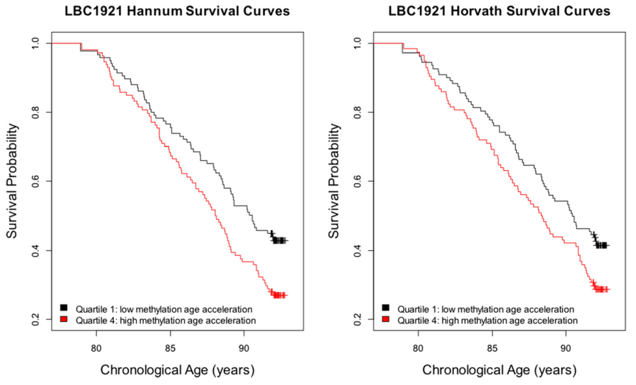

# (PART) Introduction {-}
# The Epigenomics of Human Ageing {#intro}

## Aims & Context

Aims:

1. Identify Age related changes in DNA methylation in regions of the genome characterised in the TwinsUK MeDIP-seq dataset and poorly covered by or covered in small samples by other technologies. 

	a. The tRNA genes, following up on the previous finding of age-related DNA hypermethylation at tRNA-iMet-CAT-1-4 [@Bell2016]. tRNA genes have a core role in cellular metabolism, many emerging regulatory functions both structural and as signalling molecules. tRNA genes also interface with many systems the modulation of which impact longevity, making any age-related changes in their epigenetic state potentially very consequential.
	b. Alu repeat elements, a primate specific family of SINEs present in over 1 million copies in the human genome. We aim to construct a DNA methylation clock using only these elements. We reason that age acceleration based on this clock will yield different information about biological ageing than from previous clocks as the effects of DNA methylation changes differ between repressed repetitive elements and regulatory sequences. 

2. Identify epigenetic associations with bone health outcomes and of vitamin D supplementation during pregnancy as an intervention to improve bone outcomes [@Harvey2012a; @Cooper2016]. Provide some ground work for mechanistic studies to extend understanding what systems influence bone health by identifying what genomic features change epigenetically with bone traits and interventions intented to affect these traits.

# The Ageing Poplation and Burden of Disease

The global population is ageing as is evident from the changing shape of the world population pryamid (figure \@ref(fig:poppyramid)). The increase in average lifespan underlying this demographic shift is projected to continue in industrialised nations with a probability of >65% for woman and 85% for men [@Kontis2017] (figure \@ref(fig:Kontis2017-fig1)). Ageing is the main risk factor for cancer, cardiovascular, neurodegerative diseases, and many other conditions including osteoarthritis [@Niccoli2012]. Furthermore, morality from these conditions increases according to a logistic function with age [@Belikov2019] (figure \@ref(fig:Belikov2019-fig1)). In addition to the non-infectious diseases, immunosenescene and frailty in old age contribute to an increased morality from infectious diseases, as exemplified by dramatically higher hospital admissions and deaths for respiratory disease during seasonal flu epidemics in the over 75s [@Fleming2005] (figure \@ref(fig:Fleming2005-fig3)). Ageing is a common underlying risk factor for many conditions and as this would lead one to expect the number of concomitant disorders and the proportion of persons with multiple morbidities increases with age [@Barnett2012] (figure \@ref(fig:Barnett2012-fig1)). 


```{r poppyramid, fig.cap='(ref:poppyramid-cap)', out.width='95%', fig.show='hold', fig.align = 'center', echo=FALSE}
knitr::include_graphics("figs/population-pryamids-1950-2019.png")
```

(ref:poppyramid-cap) __The Population is Getting Older__ Population pryamids for global population for A) 1950 and B) 2019 from [populationpyramid.net](populationpyramid.net)

```{r Kontis2017-fig1, fig.cap='(ref:Kontis2017-fig1-cap)', out.width='95%', fig.show='hold', fig.align = 'center', echo=FALSE}
knitr::include_graphics("figs/Kontis2017_fig1.jpg")
```

(ref:Kontis2017-fig1-cap) __The Population is Likely to Continue Getting Older__ Median projected increase in life expectancy from birth in the period 2010 to 2030 for 35 industrial nations reproduced from Kontis et al. 2017 figure 1 [@Kontis2017].

```{r Belikov2019-fig1, fig.cap='(ref:Belikov2019-fig1-cap)', out.width='80%', fig.show='hold', fig.align = 'center', echo=FALSE}
knitr::include_graphics("figs/Belikov2019_fig1.jpg")
```

(ref:Belikov2019-fig1-cap) __Mortality from Age-Related Conditions Increases According to a Logistic Function with Age__ Morality rate in deaths per 100,000 at different ages for Atherosclerosis, Essential Hypertenstion, Insulin-dependent diabetes, Non-insulin-dependent diabetes, Alzheimer's disease, and Parkinson's disease. Showing Model fits for exponential, logistic and the sum of 2 logistic functions. Underlying Cause of Death data (1999-2015) were form the Centers for Disease Control and Prevention Wide-ranging OnLine Data for Epidemiologic Research (CDC WONDER) database. Reproduced from Belikov 2019 figure 1 [@Belikov2019].

```{r Fleming2005-fig3, fig.cap='(ref:Fleming2005-fig3-cap)', out.width='80%', fig.show='hold', fig.align = 'center', echo=FALSE}
knitr::include_graphics("figs/Fleming2005_fig3.jpg")
```

(ref:Fleming2005-fig3-cap) __Mortality from Non-infectious Diseases Increases With Age__ Visits to  General practitioners, hospital admissions and deaths from respiratory disease in persons aged: (a) 45-64, (b) 65-74 and (c) 75 years and over. Reproduced from Fleming et al. 2005 figure 3 [@Fleming2005].

```{r Barnett2012-fig1, fig.cap='(ref:Barnett2012-fig1-cap)', out.width='80%', fig.show='hold', fig.align = 'center', echo=FALSE}

```

(ref:Barnett2012-fig1-cap) __Number and Frequency of Comorbidities increases with Age__ Number of chronic disorders by age group. reproduced from Barnett et al. 2012 figure 1 [@Barnett2012].

? compression of morbidity, rectangularisation?

- economics [@Goldman2016]

- epigenomics ageing links
  - @Sinclair2009
  - @Kane2019
  - @Hayano2019
  - @Jenkinson2017 - eu-hetero RDE~ dif

- genetic and other interventions modify longevity/ageing


## Epigenomics - Overview

Epigenetics generally refers to modifications to DNA and chromatin which do not affect the primary sequence of DNA bases, but which are to varying degrees stable and heritable. The term derives from epigenesis and genetics originating with Conrad Waddington [@Waddington1942]. Epigenesis refers to the idea that organisms develop through the progressive differentiation of cells from the egg into adult tissues. As modern genetics revealed that every cell contained a complete copy of the genome which was differentially utilised by the cells of adult organisms, the terms were fused to reflect the study of how this occurs. The usage has evolved a little further since molecular biology began to elucidate the mechanisms involved in this process and the term now frequently refers to the study of these mechanisms and their effects in less explicitly developmental contexts. Arthur Riggs et al. considered that heritability should be a criterion for a mark to be considered epigenetic, but this excludes many phenomena now commonly referred to using the term [@Russo1996]. Requiring heritability results in a further definitional dispute over degrees of heritability; mitotic, meiotic, transgenerational and to what degree of fidelity? Adrian Bird proposed the definition: "the structural adaptation of chromosomal regions so as to register, signal or perpetuate altered activity states." as a useful compromise [@Bird2007]. Epigenomics refers to the totality of the epigenetic modifications present in a particular cell, tissue type or genome. This defintition appears to have caught on with at least some as: 'These days, "epigenetics" more generally refers to all non-genomic information storage in cells including gene networks, chromatin structure and post-translational modifications to histones.', according to Alice Kane and David Sinclair [@Kane2019].

Whilst an organism can generally be thought of as having a single genome, with exceptions such as Somatic mutations and Chimerism, it will have at least as many epigenomes as it has cells types. There are on the order of $10^{13}$ cells in the human body [@Bianconi2013]. Estimates of the number of cell types vary with resolution at which one deems cells functionally distinct [@HumanCellAtlas]. At this point in time, however, there is no clear definition of what constitutes a distinct cell type, indeed they are beginning to be defined by the distinct patterns of gene expression and epigenetic modifications they exhibit [@CellSystemsCellType2017]. Consequently, the number epigenomes that could be considered distinct will likely ultimately approximate to the number of epigenomes which can usefully distinguish between sub-populations of cells. A consortium has been established to produce a [Human Cell Atlas](www.humancellatlas.org) [@Regev2017] which aims to define all human cell types, and a cell type ontology [@CellOntologyOBO] exists.

There are a number of epigenetic modifications which can be subdivided into four broad categories:

1. __DNA modifications__

    DNA methylation primarily takes place on Cytosine residues. Cytosine methylation occurs principally in an mCpG sequence context but can also occur in mCpH, mCHG and mCHH (H=A/C/T) contexts; particularly in cells of the nervous system [@Guo2014a] and embryonic stem cells where as many as 25% of all cytosines can be methylated in non-canonical contexts. In contrast to methylation in a differentiated non-neuronal tissue such as foetal lung fibroblasts which is 99.98% in CpG context [@Lister2009], [@Schultz2015]. 5-methylcytosine (5mc) can be oxidised to produce and another modified DNA base 5-hydroxymethylcytosine (5hmC). 5hmC may act as an intermediate to demethylation and potentially has regulatory functions in its own right, reviewed in [@Pfeifer2013]. 5hmC can be oxidised further to formylcytosine (5fC) and carboxylcytosine (5caC). The extent to which these modifications are stable and functional is still being explored. Other DNA bases can be methylated such as N6-methyladenine, but this occurs at a substantially lower frequency that 5mC and much less is known about their potential functions [@Wu2016].

2. __Histone tail modifications__

    Histone proteins form disk-shaped octamers around which ~150bp of DNA can be wrapped to form a nucleosome. The 'tails' are generally the N termini of the histone proteins, outside of the core globular domains, which protrude from the nucleosome structure. Histone tails can be subject to post-translational modification which commonly takes place at lysine residues, other residues are subject to modifications but lysines are among the best characterised. Examples of modifications include methylations with between one and three methyl groups per lysine, Acetylations, Ubiquitylation, SUMOylations, and phosphorylations (Reviewed in @Bannister2011). Many of these marks can be generally classified as permissive or repressive but are frequently found in combinations of marks of opposing effect, rendering the interpretation of the 'Histone Code' extremely challenging [@Voigt2012]. One approach to interpreting chromatin state is segmentation. Segmentation makes use of pattern discovery techniques to divide the genome into discrete sections assigning these sections to a set of categories which can then be compared to existing annotations to provide functional labels [@Hoffman2012,@Carrillo-de-Santa-Pau2017]. When successful the pattern discovery algorithm independently recapitulates our existing ontology of functional elements and hopefully provides new insights by for example highlighting regions not previously considered to be in a given functional category. This is a "top-down" approach making use of the "sum" of available chromatin state data rather than trying to interpret the significance of a single type of mark.

3. __Histone Variants__

    Alternatives to the canonical histones can be substituted in the nucleosome, examples of such alternative histones include H2A.Z and H3.3. Alternative histones can alter chromatin structure and dynamics by altering nucleosome stability, binding different factors, and presenting a different substrate for histone modifications, thus altering their pattern. (reviewed in @Weber2014.)

4. __Some non-coding RNAs (ncRNA)__

    A subset of ncRNAs, particularly those which persist in close association with chromatin can fall within the definition of epigenetic features. (reviewed in @Kaikkonen2011.) An example of such a long non-coding RNA (lncRNA) is Xist which is a key regulator of X inactivation [@Cerase2015].

## DNA Methylation

### Structure and Context

DNA methylation is the most well-studied epigenetic modification [@Haluskova2010]. Specifically CpG methylation, the addition of a Methyl group to the 5 carbon of a cytosine base (figure \@ref(fig:5mCvsC)), in a CpG dinucleotide context (figure \@ref(fig:CpGvsGpC)). (hereafter 'DNA Methylation' or 'DNAm' refers to 5mC CpG methylation unless stated otherwise.)

DNA methylation is stable and relatively easy to characterise from biological samples by comparison with other epigenetic marks, the methylation status of ancient DNA has even been characterised, see for example: DNAm profiles have been produced from DNA extracted from mammoth and neandertal remains [@Briggs2010] and from native American remains ranging in age from 230 to 4500 years [@Smith2015]. 5mC is quite chemically stable such that for most tissue sample preservation techniques for which DNA can be extracted from the sample DNAm can also be characterised. DNA extracted with normal laboratory methods can be assayed for DNAm. Histone modification status, on the other hand, is less robust against environmental stresses on samples and often requires considerably more laborious sample preparation to characterise [@Bauden2017]. DNA methylation also offers the appearance of relative simplicity in comparison to the complex picture of the 'histone code' giving the impression that its useful interpretation may be more readily tractable. However, interaction between DNAm and histone modifications is well documented [@Hashimshony2003,@Esteve2006,@Rose2014] consequently, a fuller understanding of DNAm will likely require an understanding histone modifications and their potential to feedback on and thus affect DNAm.

```{r 5mCvsC, fig.cap='(ref:5mCvsC-Cap)', echo=FALSE}
knitr::include_graphics("figs/5mC_vs_C.png")
```

(ref:5mCvsC-Cap) The structure of 5-methylcytosine contrasted with Cytosine. (Figure created by the Author.)

```{r CpGvsGpC, fig.cap='(ref:CpGvsGpC-Cap)', echo=FALSE}

```

(ref:CpGvsGpC-Cap) A schematic representation showing a Methylated __CpG__ dinucleotide in its structural context. This is contrasted with a __GpC__ dinucleotide, which cannot be superimposed on a __CpG__. upper left: methylated cytosine residues in a __CpG__ dinucleotide, showing 5mC is 5' of G on both DNA strands. upper right: unmethylated cytosine residues in a __GpC__ dinucleotide, showing G is 5' of C on both DNA strands. lower: superimposition of a __GpC__ and __CpG__ dinucleotide illustrating the mirrored nature of these structures and the impossibility of superimposing them through rotation. (Figure created by the Author.)

### Distribution and Global Trends

There are 28,299,634 CpGs [@Luo2014] in the hg19 assembly of the human genome [@Lander2001]. Given that the GC content of the human genome is $42\%$ the prior probability of getting a CpG dinucleotide is: $0.21 \times 0.21 = 0.0441$, $4.41\%$. CpGs represent $\sim1.8\%$ of the dinucleotides in the human genome ( $28,299,634 \div (3.23\times10^9\div2) \approx 0.0175$). Making them $\sim2.5$ fold less frequent than would be expected *a priori*. Methylated cytosines are prone to deamination to thymines, resulting in mismatch lesions [@Duncan1980]. This increased mutagenic potential generally means they are selected against, accounting for at least some part of their under-representation in the genome. The three major classes of repeat elements SINEs, LINEs and LTRs contain some $46\%$ of all CpG sites, with a further $5\%$ in other repetitive elements [@Luo2014]. 

```{r CGIs, fig.cap='(ref:CGIs-Cap)', echo=FALSE}
knitr::include_graphics("figs/CGI-Shores-Shelves-Seas_2.png")
```

(ref:CGIs-Cap) Schematic representation of CpG Islands, shores, shelves and seas. CpG density declines from shores to seas and methylation increases (CpG density and methylation proportion not to scale). (Figure created by the Author.)

CpGs are not uniformly distributed in the genome, they occur at higher frequency in some regions. "CpG islands" or CGIs are regions of high CpG density. The total number of CpGs in the UCSC repeat masked CGI annotation list of 28,691 CGIs is 1,990,729. Therefore, these CpGs comprise $\sim7.0\%$ of the total number of CpGs the genome. The mean percentage of the sequence of these CGIs that is comprised of CpG dinucleotides is $\sim18.5\%$ and their mean length is 761bp. Irizarry et al. found that the 2kb regions flanking CpG islands which they termed "CpG island shores" exhibited greater tissue-specific differential methylation than the islands themselves [@Irizarry2009]. This nomenclature has subsequently been expanded further with "CpG island shelves" which are 2kb - 4kb from the CGIs, and "seas" referring to the rest of the genome, see figure \@ref(fig:CGIs). 

CGIs overlap the promoters of $\sim70\%$ of genes [@Saxonov2006], this, however, leaves roughly half of all CGIs as "orphans" not associated with a known transcription site. These orphan CGIs frequently constitute cell-type specific enhancers [@Bell2017] and alternate promoters [@Illingworth2010],[@Maunakea2010]. They are found in both intergenic and intragenic regions. CpGs are distributed quite sparsely through the genome occurring at low density in "seas" and at increasing density in CGIs and their flanking regions, see figure \@ref(fig:CGIs). Early work showed 70-80% of CpGs are constitutively methylated [@Ehrlich1982] (reviewed @Bird2002) Stadler et al. produced a more detailed picture of the distribution of CpG methylation in mouse embryonic stem cells (ESCs) [@Stadler2011] see figure \@ref(fig:CpGfreqVsDNAm). It is a characteristic of CGIs that they are generally unmethylated.

```{r CpGfreqVsDNAm, fig.cap='(ref:CpGfreqVsDNAm-Cap)', echo=FALSE}
knitr::include_graphics("figs/CpGfreqVsDNAm.png")
```

(ref:CpGfreqVsDNAm-Cap) The fraction of CpGs with a given methylation level. Data from Whole-Genome Bisulfite Sequencing (WGBS) of Mouse embryonic stem cells. (Figure reproduced from @Stadler2011 figure 1a)

The regulatory role played by DNA methylation varies with context and the scale at which it is examined. For example methylation at a single CpG in a transcription factor binding site can determine whether or not the factor can bind at that site. There are methylation-sensitive transcription factors which can have their affinity for DNA either increased or decreased by methylation [@Yin2017,@Zuo2017]. In addition, larger scale changes in DNAm can through interactions with chromatin modifiers alter DNA compaction and more general accessibility of DNA regions for binding, and/or impacting on their topological organisation. DNAm also varies with nucleosome occupancy with lower methylation in linker sequences than on nucleosome-associated DNA [@Kelly2012,@Huff2014]. The oxidation products of 5mC can also affect chromatin organisation, 5-Formylcytosine can impact nucleosome positioning through covalently binding to histones [@Raiber2017]. This raises the question if some DNA methylation occurs specifically to act as an intermediate step for regulatory mechanisms which utilise its oxidation products.

### Pathways of DNA methylation and demethylation 

CpG methylation is produced and maintained by DNA methyltransferase (DNMT) enzymes. All the DNMT enzymes use S-adenosylmethionine as the source of the methyl donor group. DNMTs form a covalent intermediate between a conserved cysteine residue and the target base, through a nucleophilic attack on the C6 position in the cytosine ring. This is followed by the transfer of the S-adenosylmethionine methyl group to C5, and deprotonation of the C5 to reform the double bond between C5 and C6; which is mediated by a base provided by the enzyme (Figure \@ref(fig:Lyko2017DNAmMechanism)). 

DNMT1 is associated with the replication machinery [@Vertino2002] and reproduces the methylation state of the parent strand on the daughter strand during replication. The largest of the DNMT family DNMT1 contains a 'replication foci targeting sequence' (RFTS) domain required for its targeting to replication forks. DNMT1 specialises in recognising hemimethylated DNA and methylating the unmethylated C in a palindromic CpG dinucleotide site, the UHRF1 protein assists in the recognition of these sequences [@Bostick2007]. DNMT3a and DNMT3b are responsible for *de novo* DNA methylation along with DNMT3L a catalytically inactive, but DNA-binding subunit [@Jia2009]. The location of *de novo* methylation by the DNMT3s is influenced by a number of factors including the Chromatin state and other DNA binding factors [@Lyko2017].

```{r Lyko2017DNAmMechanism, fig.cap='(ref:Lyko2017DNAmMechanism-Cap)', out.width='80%', fig.align = 'center', echo=FALSE}
knitr::include_graphics("figs/Lyko2017DNAmMechanism.png")
```

(ref:Lyko2017DNAmMechanism-Cap) Motif VI (ENV/PCQ) refers to the conserved catalytic motif in DNMTs. 'B:' Represents the enzyme supplied base (Figure reproduced from the review of DNMT biology by @Lyko2017 (fig. 1b))

DNMT2 is unlike the other member of the DNMT family in that it targets an RNA substrate. DNMT2 is a tRNA methyltransferase which methylates a specific subset of tRNA genes, mostly Asp isoacceptors, at a site adjacent to the anticodon which protects them from endonucleolytic cleavage under stress conditions. Unprotected tRNAs produce fragments which complete with small interfering RNAs interfering with their signalling pathways.

The mechanisms of the demethylation of DNA were more recently characterised than those which govern its methylation. They are more complex and less well understood. A distinction is drawn between active and passive demethylation, in passive demethylation, 5mC bases are diluted out in the process of DNA replication. In the leading model of active demethylation, they are oxidised one or more times by an enzyme from the TET (Ten-Eleven-translocase) family. They are then either passively removed by DNA replication or actively removed by a DNA glycosylase (thymine DNA glycosylase TGD) to create an apurinic site which is restored to a C by the Base Excision Repair (BER) pathway. This cycle of cytosine methylation and demethylation is illustrated in Figure \@ref(fig:Wu2017TETsDNAmCycle) [@Wu2017].

```{r Wu2017TETsDNAmCycle, fig.cap='(ref:Wu2017TETsDNAmCycle-Cap)', out.width='60%', fig.align = 'center', echo=FALSE}
knitr::include_graphics("figs/Wu2017TETsDNAmCycle.png")
```

(ref:Wu2017TETsDNAmCycle-Cap) BER = Bases Excision Repair; AM = Active Modification; AR = Active Removal, PD = Passive Dilution (Figure reproduced from the review of TET mediated active demethylation by @Wu2017 (fig. 1a))

### Maintenence and Fidelity

DNA methylation is highly dependent on the underlying DNA sequence. Sequence features of particular importance to determining DNA methylation status are; transcription factor and other DNA binding protein recognition motifs, and CpG density [@Lienert2011],[@Ziller2013]. Alterations in underlying DNA sequence such as SNPs and copy number variants (CNVs) can have a significant impact on methylation level and the susceptibility of the methylation level to change. In addition CNVs can result in dosage effects on measures of DNAm, causing regions to appear, respectively, substantially more or less methylated when fewer or greater copies than expected are present [@Boks2009], [@Kerkel2008],[@Schalkwyk2010],[@Shoemaker2010], and [@Bell2017a]. Despite the strong influence of sequence on methylation, global CpG methylation exhibits change over developmental time as illustrated in figure \@ref(fig:DNAmDevTime) and exhibits tissue-specific changes in distribution and amount [@Ziller2013]. 

```{r DNAmDevTime, fig.cap='(ref:DNAmDevTime-Cap)', out.width='80%', fig.align = 'center', echo=FALSE}

```

(ref:DNAmDevTime-Cap) 5mC levels over developmental time. 5mCH or 5-methylcytosine-(A, T or C) levels are represented on a separate (purple) Axis from the main 5mCG axis. PGC = Primordial Germ Cell. (Figure reproduced from @Ciernia2016 figure 3)

In mitosis, DNA methylation is inherited by daughter cells with an error rate on the order of $1\times10^{-3}$ per site per generation [@Ushijima2005], several orders of magnitude less than that of DNA replication (error rate of $1\times10^{-7}$ - $1\times10^{-8}$ [@Kunkel2004a]). The fidelity of DNA methylation copying can be assayed by Hairpin-Bisulfite PCR (Polymerase Chain Reaction) [@Laird2004]. Laird et al. looked at two alleles of a portion of the CpG island from the human *FMR1* gene in uncultured lymphocytes, one hypermethylated and one hypomethylated. In the hypermethylated allele, they found that 96% of sites methylated in the parent strand remained methylated in the daughter strand and 86% of unmethylated sites remained unmethylated. By contrast in the hypomethylated allele, there were no methylated sites to be retained and >99% of unmethylated sites remained so following replication. Laird et al.'s work suggests a higher degree of overall methylation fidelity for hypomethylated DNA and a propensity for unmethylated sites in hypermethylated DNA to become methylated. 

Change in DNAm levels over time (divisions) can be modelled using the differential equations [@Pfeifer1990a], which predict that a fully methylated site and a fully unmethylated site will converge on an equilibrium level. This level is determined by the probability of maintenance of the methylation state and of *de novo* methylation for a given locus. This stochastic model of DNAm is in agreement with experimental findings [@Laird2004,@Riggs2004a], Figure \@ref(fig:Riggs2004PNASfig2DNAmFidelity).

```{r Riggs2004PNASfig2DNAmFidelity, fig.cap='(ref:Riggs2004PNASfig2DNAmFidelity-Cap)', out.width='70%', fig.show='hold', fig.align = 'center', echo=FALSE}
knitr::include_graphics("figs/Riggs2004PNASfig2DNAmFidelity.png")
```
(ref:Riggs2004PNASfig2DNAmFidelity-Cap) $E_m$ = probability of methylation maintenance, $E_m$ = probability of *de novo* methylation. $M$ & $U$ = the number of methylated and unmethylated molecules at specific CpG sites respectively. Modelling (__Grey points__) $E_m,E_d$ values of 0.90,0.10; 0.95,0.05; 0.97,0.03 (outermost to innermost, two curves for each $E_m,E_d$ set, one starting at $M=1,U=0$ and one a $M=0,U=1$. Experimental data (__Black points__) from the *HpaII* locus (site H3) in 17 clones of mouse cell line BML-2 which has a known methylation level of 50%. (Reproduced from [@Riggs2004a])

@Jenkinson2017 used an information-theoretic model, modelling DNAm as a binary communications channel using a 1-dimensional Ising model from the field of statistical physics. This permitted them to examine properties of DNAm not accessible to conventional means of analysis which typically capture the mean methylation level and perhaps the variability for a given locus. When considering methylation fidelity using this lens the maintenance of a given methylation state can be seen as an information processing task which requires the consumption of free energy in order to reduce the probability of error in transmission of that methylation state. Thus Relative Dissipated Energy (RDE) can serve as a measure of the work expended by a cell at a given locus in order to preserve the current methylation state of that locus. 

Zhao et al [@Zhao2014] applied Hairpin-Bisulfite PCR genome-wide in mouse embryonic stem cells (ESCs). They also found high degrees of methylation fidelity in hypomethylated regions such as CGIs and Promoters, as well as a high degree of fidelity in sites bound by transcription factors. This is in agreement with the findings of @Jenkinson2017 who noted that entropy (methylation stochasticity) was lower and more variable in CGIs and TSS (transcription start sites). 

Methylation inheritance fidelity is reduced in cancer [@Ushijima2005] and increases with differentiation [@Zhao2014]. The RDE (relative dissipated energy) at CGIs and TSSs is higher in differentiated tissues such as the brain, implying low entropy, and lower in embryonic stem cells, implying greater entropy [@Jenkinson2017] (see Figure \@ref(fig:Zhao2014fig3ab)). In addition, the correlation between CpG sites increases in cancer [@Jenkinson2017], suggesting reduced higher level regulatory control and tendency to fall back on lower level feedback mechanisms.

```{r Zhao2014fig3ab, fig.cap='(ref:Zhao2014fig3ab-Cap)', echo=FALSE}
knitr::include_graphics("figs/Zhao2014_fig3_a+b.png")
```

(ref:Zhao2014fig3ab-Cap) Bimodal Distribution of DNA methylation level and fidelity.
Methylation fidelity exhibits a bimodal distribution with most and least methylated regions exhibiting the highest fidelity. Additionally, fidelity for methylation levels of 10-50% is considerably better than fidelity for levels of 50-90%. These data are from the mouse cell line ES-E14TG2a which is capable of self-renewal when cultured with Leukaemia Inhibitory Factor (LIF) and spontaneous differentiation upon removal of LIF (denoted as E14-d0 at day 0 and E14-d6 at day 6 after the withdrawal of LIF, respectively). Fidelity represents the percentage of symmetrically methylated or unmethylated CpG dyads for a given position as determined by Hairpin-Bisulfite PCR. (Reproduced from @Zhao2014 (figure 3 a and b).)

### === DNA methylation assays 

## Ageing 

### Hallmarks

Ageing is characterised by a progressive deterioration of physiological integrity with time, resulting in increased risk of mortality and morbidity. These changes at the organismal level have their origins in changes at the molecular and cellular scales. @Lopez-Otin2013 identified nine hallmarks of ageing in their 2013 review. These hallmarks are:

1. Genomic instability
2. Telomere attrition
3. __Epigenetic alterations__
4. Loss of proteostasis
5. Deregulated nutrient sensing
6. Mitochondrial dysfunction
7. Cellular senescence
8. Stem cell exhaustion
9. Altered intercellular communication

This review focuses on the 3rd hallmark, epigenetic alterations, specifically the role of DNA methylation in ageing. @Booth2016 argue that Epigenetic dysregulation is a hub through which many of the hallmarks of ageing are mediated. Gene regulation as governed by epigenetic factors is a key module in the complex network of systems maintaining tissue homeostasis and is highly connected to other modules such that the deterioration of the epigenetic control of gene expression module can snowball into the dysregulation of other modules (Figure \@ref(fig:Booth2016fig3)). 

```{r Booth2016fig3, fig.cap='(ref:Booth2016fig3-Cap)', out.width='60%', fig.align = 'center', echo=FALSE}
knitr::include_graphics("figs/Booth2016_F3_epigenomeHubAgingHallmarks_alpha.png")
```

(ref:Booth2016fig3-Cap) Epigenetic Changes as a hub for the hallmarks of ageing. 
(reproduced from [@Booth2016], figure 3)

### DNA Methylation and Ageing

Early work on DNA methylation and ageing used biochemical, chromatographic and radiolabeling techniques to assay global changes in the amount of 5mC. These studies found differences in 5mC composition with cell type [@Ehrlich1982] but did not see changes with age. Other work around that time however found differences in 5mC levels with the age of cells in culture [@Wilson1983]. Wilson et al. noted that DNA methylation decreased across several tens of generations of cell lines in culture, but not in immortal cell lines. Immortal cell lines had lower absolute levels of 5mC to start with but remained constant over time. Wilson et al. also cite earlier work by Romanov at al. 1981 [@Romanov1981] and Berdyshev el al. 1967 [@Berdyshev1967] which documented decreases in 5mC with age in cows and salmon, respectively.

Later work by Wilson et al. 1987 [@Wilson1987] in mice *P. leucopus* and *M. musculus* found decreases in 5mC with age and that the rate of decline was less in the longer-lived *P. leucopus* than in *M. musculus*. Interestingly, a recent study using different methods by Cole et al. found no global differences between young and old mice in short and long-lived strains, however, their other observations would seem to corroborate these initial trends. For the assayed sites long-lived mice exhibited 10x more hypermethylation than wild-type (WT), and WT mice had 3x more Differentially Methylated Regions significantly associated with age (DMRs/aDMRs) than did long-lived mice. Notably, the WT and long-lived mice shared many of the same aDMRs which differed in their degree of methylation as opposed to affecting different sites in the genome [@Cole2017]. The lack of apparent global changes may be due to the biases of the reduced representation bisulfite sequencing (RRBS) method used. RRBS uses a restriction enzyme based approach to enrich for regions with high GC content such as CGIs which tend to have low levels of methylation, and consequently may not be sensitive to loss of methylation in generally hypermethylated regions which could contribute to a global trend [@Meissner2005].

Wilson et al. also noted that the mitotic index of tissues did not relate to the loss of DNA methylation with age in tension with their earlier observations *in vitro*. The persistent loss of 5mC over time and the dramatic changes in methylation seen in cancer cells lead Wilson et al. to suggest that dysregulation of DNA methylation may have a substantial role to play in the age dependency of cancer risk and ageing more generally, a possibility which has subsequently been further explored by others, reviewed by @Feinberg2004. It has been suggested that "Epimutations" may be able to substitute for mutations in the multi-hit model of carcinogenesis [@Knudson1971]. For example; hypermethylation of the *BRCA1* promoter [@Esteller2000], Or, the development of Wilms’ tumour due to Beckwith–Wiedemann syndrome, a disorder arising from loss of imprinting of the gene encoding insulin-like growth factor 2 (IGF-2) leading to a double dose of IGF-2 protein [@Feinberg2018].

Methods which allowed the examination of changes in DNA methylation at known loci in the genome permitted a more nuanced picture of changes in DNA methylation over time to develop. @Fraga2005 introduced the concept of "epigenetic drift" being the divergence of DNA methylation and other epigenetic modification patterns with time. Fraga et al. looked at the divergence in DNA methylation along with global Histone H3 and H4 acetylation patterns between monozygotic (MZ) twins over a wide range of ages. They observed that older twins had greater epigenetic differences with time, in DNA methylation as well as H3, H4 Acetylation. Fraga et al. also noted that the divergence in epigenetic state was greater in twins who had lived longer apart and had different medical histories. Figure \@ref(fig:Fraga2005fig3) is a useful visual encapsulation of Fraga et al.'s DNA methylation results. @Slieker2016 identified 6366 CpGs whose methylation variability increased with age using the Illumina 450k array platform on whole-blood from 3295 individuals, both the increase in variability with age and the increasing divergence of twins support a narrative of epigenetic dysregulation with age.


```{r Fraga2005fig3, fig.cap='(ref:Fraga2005fig3-Cap)', echo=FALSE, out.width='80%'}
knitr::include_graphics("figs/Fraga2005fig3.png")
```

(ref:Fraga2005fig3-Cap) Mapping Chromosomal Regions of Differential DNA Methylation.
Examples from Chromosomes 1, 3, 12 & 17 are shown for a 3 and 50-year-old twin pair.
Methylation status is shown by competitive hybridization of AIMS (amplification of inter-methylated sites) products to metaphase chromosomes.
Green and Red signals indicate hypermethylation and hypomethylation events between twins, Yellow indicates little difference. 
Red and Green blocks adjacent to ideograms indicate areas of significant DNA methylation change.
(Reproduced from [@Fraga2005] (figure 3).)


### Age-Related Differential Methylation and Epigenetic Clocks {#DNAmAgeReview}

With the advent of array-based techniques which permitted the measurement of the methylation status of specific CpGs placed strategically throughout the genome, researchers were able to undertake a more fine-grained analysis of the changes in DNA methylation with age. This has allowed the prediction of chronological age from a metric of "DNA methylation age" (DNAm age), and interpretation of the differences in predicted and chronological age in terms of the pathophysiology of ageing. 

The Illumina Golden gate array [@Bibikova2006] with 1505 probes targeted to cancer-related genes was the first of these. Bjornsson et al. observed DNAm changes with age as well as noting substantial intra-individual differences. In contrast earlier work by @Eckhardt2006 and @Ehrlich1982 found no age-related changes using averages across individuals. @Bjornsson2008 also found that the intra-individual differences in differential methylation with ageing were highly heritable by use of familial clustering. Work by @Boks2009 also using the golden gate array corroborated Bjornsson et al.'s findings in monozygotic twins. 

The Bjornsson and Boks studies used the golden gate array on peripheral blood samples, whereas @Christensen2009 used the golden gate array to look for age-related changes in DNAm in several tissue types. CpG sites that are differentially methylated with age when searching across tissues were frequently specific to a small number of tissue types. In addition, CpGs in CGIs tended to be hypermethylated with age and *vice versa*. Christensen et al. also found that the methylation profiles for different tissues were highly predictive of tissue type.

@Rakyan2010 looked at age-related changes in DNAm using the Illumina 27k array [@Bibikova2009] with whole blood samples in a discovery set. They replicated their findings in sorted cell fractions to see if they could capture changes in DNAm that could be attributed to changes in blood cell-type composition over time, which they did not find. @Teschendorff2010 found that promoters of targets of the polycomb group proteins (PCGTs) were more likely than non-PCGTs to become methylated with age. Repression of PCGTs is required for Stem cells to differentiate. PCGTs whose methylation status was associated with age were associated with pre-neoplastic conditions in a large cohort using the 27k array with blood and epithelial cell samples. 

@Bocklandt2011 also using the 27k array but with saliva samples created the first "epigenetic clock" used to predict the chronological age of donors based on the DNAm landscape of their cells, the mean error was 5.2 years. Bocklandt et al. were able to achieve similar predictive accuracy with as few as 3 CpG sites in their model. @Koch2011 used publically available 27k array datasets from a variety of different tissues to train a model using a different statistical method but only achieved an error of 11 years. They did, however, identify a number of CpGs also identified by Bocklandt et al. @Bell2012 used 27k array data to look for correlations between differential methylation and age-related phenotypes as well as chronological age. They found that few age related phenotypes were correlated with differential methylation, only 5 CpG sites were identified for the 16 age-related phenotypes examined. Whereas 490 significant CpGs were associated with chronological age. Many of the CpGs they identified persisted across tissue types and replicated in a second cohort, several had been identified previously by Rakyan et al. and Bocklandt et al.

@Heyn2012 examined the DNA methylation status of a newborn and a centenarian in CD4+ T cells using whole genome bisulfite sequencing (WGBS), along with a group of newborns and nonagenarians using the Illumina 450k array [@Bibikova2011]. Heyn et al. observed a global decrease in methylation from newborn to centenarian, as well as an intermediate level of methylation on a sample of intermediate age (see figure \@ref(fig:Heyn2012F1b)). This observation was replicated in 450k data. In addition, Heyn et al. noted that adjacent CpGs normally exhibit a substantial degree of correlation in methylation status and that they were less well correlated with their neighbours with increasing age. Interestingly @Jenkinson2017 found that correlation among nearby CpGs increased in cancer tissues. Modelling work done by @Affinito2016 agrees with this correlation between neighbouring CpGs under physiological conditions, which is particularly pronounced in CpG dense regions like CGIs. The greater physical proximity of CpGs in CpG dense regions means that greater correlation is expected. Due to the fact that these CpGs are more likely to be affected by the same proteins and regulatory features than CpGs with greater distance separating them [@Haerter2014]. Garagnani et al. used 450k array data from a cohort of 64 subjects aged 9-83 to identify those CpGs most well correlated with age as had been done with previous array technologies [@Garagnani2012].

```{r Heyn2012F1b, fig.cap='(ref:Heyn2012F1b-Cap)', echo=FALSE}
knitr::include_graphics("figs/Heyn2012F1b.png")
```

(ref:Heyn2012F1b-Cap) Global Hypomethylation with Age. NB = Newborn, Y26 = 26 year old, Y103 = 103 year old.
(Reproduced from @Heyn2012 figure 1 b.)

In January of 2013 Hannum at al. [@Hannum2013] published a study using the Illumina 450k array and whole blood samples for 656 participants aged 19-101. Their optimised model was able to predict age with an error of 3.9 years. In December of the same year, Horvath [@Horvath2013] published a study using multiple datasets, including  Hannum's data, some produced on the 27k and some the 450k array. Both used 'elastic net' penalised multivariate regression models to identify CpGs which collectively provide the best predictor of DNAm age rather than the CpGs which are individually most highly correlated with age [@Friedman2010]. 

@Florath2014 identified some additional age-associated CpGs from two large cohorts totalling N=898 and an N=67 8yr follow-up longitudinal cohort. More than 3/4 of the CpG sites they identified began as hypomethylated and increased in methylation with age, a proportion likely skewed by the large number of 450k probes in CGIs and other typically low methylation regions. @Bacalini2015 performed a meta-analysis of existing DNAm age datasets and employed a "region-centric" approach to try to identify loci larger than single CpGs which they anticipate will be more biologically meaningful than lone CpGs. They found that their approach increased the number of common features identified using the Hannum et al. and Heyn et al. datasets. @Zaghlool2015 performed 450k array DNAm age study in Qatari population they identified 12/88, 23/490 and 102/162 of the CpGs found by Bocklandt et al, Bell et al. and Florath et al. respectively. Zaghlool et al. also found that Horvath's age predictor had an error of 3.7 years in their dataset. This is in agreement with existing findings and indicates that ethnicity has no major effects on the DNAm age signature. @Benton2017 looked at changes in DNA methylation with age in a genetically isolated population on Norfolk Island with similar results to previous studies but identifying some novel age-associated CpGs.

Most DNAm relationships with age noted in previous studies have been linear, @Johnson2017 used the 450k array in peripheral blood samples. They identified 21 CpGs whose DNAm changes at a rate that changes with age from an initial pool of 27,723 CpGs which were differentially methylated with age. Two sites exhibited an increasing rate of increase in DNAm with age, and 18 sites a decreasing rate of increase.

### Genetic Influences on DNA Methylation

Epigenetic variation falls on a continuum of genetic influence that can be summarised by three categories:

1. __pure__ - DNA sequence has no predictive value for epigenetic state.

2. __facilitated__ - DNA sequence biases epigenetic state.

3. __obligatory__ - DNA sequence permits exact prediction of epigenetic state.

Regional methylation state is strongly influenced by genotype, by single nucleotide polymorphisms (SNPs) [@Smith2014a] and by structural variants [@Bell2017a]. An example of an obligatory effect on methylation is a point mutation at a CpG site, a C to T transition precludes methylation at that site in future. The effect of structural variants on methylation can be hard to determine as changes in sequence dosage often lead to measurement artefacts. Efforts have been made to correct for the influence of genetic factors in EWAS, when searching for purely epigenetic effects but the potential interaction of the somatic mutations known to accumulate with age (Figure \@ref(fig:Jaiswal2014fig1)) and the changes in DNAm with age remain largely unexplored. This is of particular relevance to DNAm as the profile of the types of mutation which accumulate with age (Figure \@ref(fig:Jaiswal2014fig2c)) distinctly favours C to T transition mutations which can disrupt CpG dinucleotides [@Jaiswal2014c].

```{r Jaiswal2014fig1, fig.cap='(ref:Jaiswal2014fig1-Cap)', out.width='60%', fig.align = 'center', echo=FALSE}
knitr::include_graphics("figs/Jaiswal2014fig1_somaticMutationAge.png")
```
(ref:Jaiswal2014fig1-Cap) Somatic mutations increase with Age.
(Reproduced from [@Jaiswal2014c], figure 1)

```{r Jaiswal2014fig2c, fig.cap='(ref:Jaiswal2014fig2c-Cap)', out.width='60%', fig.align = 'center', echo=FALSE}
knitr::include_graphics("figs/Jaiswal2014fig2c.png")
```
(ref:Jaiswal2014fig2c-Cap) C to T transitions are the most common substitutions that occur with age.
(Reproduced from [@Jaiswal2014c], figure2 c)

### DNAm Age as a Biomarker of Ageing

We have seen that DNAm can be a fairly accurate predictor of age, however, there is more to being a good biomarker of ageing than predictive accuracy. @Weidner2014 conducted a study with the specific intent of identifying CpG sites that would serve as the best biomarkers of ageing. Below is a list of specific criteria for a high-quality biomarker of ageing laid out by @Johnson2006. 

1. It must predict the rate of ageing. In other words, it would tell exactly where a person is in their total lifespan. It must be a better predictor of lifespan than chronological age.
2. It must monitor a basic process that underlies the ageing process, not the effects of disease.
3. It must be able to be tested repeatedly without harming the person. For example, a blood test or an imaging technique.
4. It must be something that works in humans and in laboratory animals, such as mice. This is so that it can be tested in lab animals before being validated in humans.

We have seen that DNA methylation clocks can be good predictors of chronological age, we will revisit the question of whether or not they are superior to chronological age in their ability to predict lifespan below. @Bell2012 found DNAm did not generally correlate well with ageing phenotypes but did correlate well with chronological age and @Teschendorff2010 found that their age-associated DNAm signature remained fairly constant across several disease states including ovarian cancer and type 1 diabetes. Suggesting that DNAm age prediction does indeed: "monitor a basic process that underlies the ageing process, not the effects of disease", meeting criterion number 2. Several of the DNAm clocks discussed so far have been based on whole peripheral blood samples meeting criterion number 3. DNAm age clocks have been shown to work in Chimpanzees [@Horvath2013], Dogs/Wolves [@Thompson2017], Mice [@Stubbs2017], naked mole rats, rhesus macaques, humpback whales [@Lowe2018] and are likely to work in other mammalian model organisms. It should be noted that Horvath's Human clock uses array data and that the Dog/wolf and mouse clocks use RRBS. Model organisms such as *C. elegans* which essentially lack DNA methylation would not, however, be likely to be tractable for DNAm based age prediction. Consequently DNAm age prediction at least partially meets criterion number 4.

Is DNA methylation a better predictor of lifespan than chronological age? Both Hannum and Horvath identified the difference between DNAm age and chronological age or $\Delta_{Age}$ as a potential indicator of disproportionate biological ageing. @Marioni2015 explicitly set forth to test the value of DNAm age as a predictor of mortality. Adjusting for Age, Sex, childhood IQ, education, social class, hypertension, diabetes, cardiovascular disease, and *APOE* e4 status a $\Delta_{Age}$ of +5 is associated with a 16% increased mortality risk (See figure \@ref(fig:Marioni2015f3)). A longitudinal study of twins found 3.2 fold increase in the risk of dying first per 5yr $\Delta_{Age}$ within twin pairs [@Christiansen2016]. A meta-analysis of DNAm age predictors by @Chen2016a also found that measures of age acceleration based on Hannum and Horvath clocks were superior predictors of mortality than chronological age before and after correction for various potentially confounding factors. Chen et al. also noted that correction for blood cell composition improved predictive power. Indicating that DNAm age is indeed superior to chronological age as a predictor of lifespan meeting criterion number 1 for an ageing biomarker. 

A new DNAm age clock explicitly designed to capture phenotypic age and outperform age acceleration as a biomarker of ageing has recently been produced by @Levine2018. The 'PhenoAge' metric was created by selecting nine biomarkers of ageing from 42 possible metrics using a proportional hazards penalised regression model and combining these with chronological age. (The nine biomarkers are: Albumin, Creatinine, Serum glucose, C-reactive protein, Lymphocyte percent, Mean red cell volume, Red cell distribution width, Alkaline phosphatase, White blood cell count.) DNAm data was then regressed against PhenoAge using elastic-net regression to produce a DNAm based PhenoAge predictor which made use of 513 CpGs. The PhenoAge predictor outperformed the Horvath and Hannum clocks at predicting all-cause mortality, comorbidities, coronary heart disease risk, and measures of physical functioning. 41 of the 513 CpGs in the PhenoAge clock were present in the original 353 CpG sites used in the Horvath clock.


```{r Marioni2015f3, fig.cap='(ref:Marioni2015f3-Cap)', echo=FALSE}

```

(ref:Marioni2015f3-Cap) Survival probability by quartiles of $\Delta_{Age}$ in LBC 1921 adjusted for sex, and chronological age. LBC = Lothian Birth Cohort. Using the Hannum and Horvath predictors' values for $\Delta_{Age}$.
(Reproduced from @Marioni2015 figure 3.)

### Discussion and Analysis of the Findings of DNAm Age Studies

Interestingly as illustrated in figure \@ref(fig:AgeCpGUpSet) CpGs whose methylation status has been identified as correlating with age in various studies show relatively little overlap, this overlap would be reduced a little further if I had also required a consistent direction of change with age in this search. Despite this, changes in DNAm with age are probably the most robust and reproducible large-scale epigenetic change yet captured. This lack of agreement in absolute terms, however, presents a challenge about how to interpret DNAm changes with age. 

```{r AgeCpGUpSet, fig.cap='(ref:AgeCpGUpSet-Cap)', echo=FALSE}

```

(ref:AgeCpGUpSet-Cap) Overlap of CpG sites identified in various in DNAm ageing models, set intersections with no contents are not included.
Data from: [@Rakyan2010],[@Teschendorff2010],[@Bocklandt2011],[@Garagnani2012],[@Bell2012],[@Hannum2013],[@Horvath2013],[@Florath2014],[@Weidner2014],[@Benton2017]. NB some of the datasets show here are __not independent__, data used to identify aDMRs in some of these studies was also used in others. These data also __do not use consistent cut-off thresholds or check for a consistent direction of change__ when including loci in the list of top age-associated hits.
(Created with UpSetR [@Lex2014].)

The result of the various DNAm age studies display some seemingly contradictory trends. For example there is the global loss of methylation with age [@Wilson1987],[@Fraga2005],[@Heyn2012] and yet the majority of the highly significant age predicting CpGs in clocks are undergoing hypermethylation by a ratio of very roughly 2:1 [@Rakyan2010], [@Bocklandt2011], [@Koch2011], [@Garagnani2012], [@Florath2014] (see figure \@ref(fig:Florath2014F4abc)). Interestingly when expanded to look at all age-associated CpGs and not just the most highly correlated CpGs a slightly different picture emerges. @Teschendorff2010 noted in their original study and @Zhang2017 noted in a subsequent analysis, if more loosely age correlated sites are included hypomethylation with age is more prevalent. @Zhang2017 states roughly 60% of sites are hypomethylated and 40% hypermethylated, they also observed that all of the highly age-predictive CpGs which overlapped between the studies they examined were hypomethylated. 

It is worth noting that the technolgies used to measure the DNAm introduce their own biases into global changes in DNAm levels. The more Global measures such as WGBS and biochemical measures seem to favour hypomethylation with age [@Wilson1987],[@Fraga2005],[@Heyn2012]. The arrays seem to have agreed more with these global measures as they have increased in size. RRBS also seems to skew in favour of hypermethylation with age [@Cole2017]. These more narrow technologies are biased towards promoters and CGIs with their higher CpG density and lower baseline methylation levels making the prior probability of observing a methylation event greater than demethylation by dint of having a dearth of methylated sites to start with.

Sites which are hypomethylated as their "ground state" are more likely to be in CGIs than sites which are hypermethylated as their "ground state", and thus hypomethylated sites are more likely to be variable in their methylation state and subject to tight regulatory control than are hypermethylated sites. Expanding the pool to look at CpG sites more poorly correlated with age is likely to introduce more sites whose hypomethylation with age is due to increased stochasticity with age. however from the background information, one would expect that hypermethylated sites in CpG dense regions like CGIs whose methylation level declines with age would make good quality indicators. Given that CpGs in CGIs have a high prior probability of being hypomethylated, it follows that one would be more likely to observe a hypermethylation event by chance. Consequently, a CpG in a CGI that exhibits hypomethylation with age is less likely to be a result of noise than its converse, This may explain the higher reproducibility of these hypomethylated sites. 

```{r Florath2014F4abc, fig.cap='(ref:Florath2014F4abc-Cap)', echo=FALSE}
knitr::include_graphics("figs/Florath2014_F4abc.png")
```

(ref:Florath2014F4abc-Cap) Mean methylation level by genomic region showing proportions negatively correlated with age, i.e. become hypomethylated as age increases.
(Reproduced from @Florath2014 figure4 a, b, c.)

In a review of DNAm and ageing @Jones2015 drew a distinction between epigenetic drift changes and epigenetic clock changes with age wherein they defined drift as "the collection of DNA methylation changes that are associated with age within an individual but are not common across individuals.", which is slightly different from the definition used by @Fraga2005. Clock changes are defined as "those sites that are associated with age across individuals and can thus in some cases be used to predict chronological age". Drift constitutes stochastic change over time not driven by some process which strongly biases the resulting changes in DNAm in direction or to specific sites. Clock changes are the converse, some underlying process biases DNAm changes in direction and/or position.

This picture is complicated by the tissue specificity of DNAm changes. Whilst it is evidently the case that multi-tissue DNAm age prediction is possible, it also seems to be the case that an age predictor trained on samples from a specific tissue will outperform one trained on multiple or other tissues when predicting the age of a sample of matching tissue type. This is supported by the out-performance of the Horvath predictor by the Hannum predictor in blood samples [@Marioni2015] and differentially predicted ages of tissues such as breast noted by @Horvath2013. DNAm was highly correlated with age for a variety of tissue-specific sites in many studies, suggesting that the definition of clock sites is frequently tissue dependent. This may also be true of drift changes, stochastic changes may occur at sites in one tissue that would be tightly controlled in another. One could restrict the definition of clock changes further to only those which are present in all/most tissue types to make a multi-tissue predictor. 

Apparent changes in the DNAm state of a mixed cell population could be due not to global changes in that population but rather its composition, blood exhibits changes in the cellular composition with age [@Rimmele2014]. As haematopoietic stem cells age their numbers increase and their regenerative potential declines. Their output becomes skewed towards the myeloid lineage but produces poorer quality cells. The number of naive T-cells decreases with age, memmory and effector T-cells accumulate as to memmory B cells limiting the diversity in the cell-types and contributing to immunosenescence (reviewed in [@Geiger2013]). Cellular composition of tissues can have a substantial impact on epigenome-wide association studies (EWAS), especially when dealing with small effect sizes [@Jaffe2014]. Thus shifts in cell composition such as those in blood during ageing can be substantial sources of confounding when searching for cell-intrinsic changes in DNA. Some attempts to assay and/or correct for cell type composition have been made, for example, @Rakyan2010 isolated $CD4^+$ T-cells and found that they had a 60% overlap with age-related CpGs in whole blood. @Chen2016a used the method developed by @Houseman2012 to correct for cell-type composition and found that it did improve the performance of the Horvath and Hannum age predictors. The changes were significant but the effect of this correction was relatively modest. Whilst cell composition has an effect, DNAm Age definitely seems to be capturing something beyond shifts in cell-type composition. However, the age acceleration computed with Hannum's method, which is trained on blood data only, was more strongly correlated with cell-type composition than Horvath's method, indicating that extrinsic changes in cell-type composition likely have some impact the model. 

@Jenkinson2017 took an information-theoretic approach to DNA methylation maintenance, modelling the binary methylation state of CpGs as a noisy communications channel. Permitting them to compute the information capacity (CAP), methylation entropy (ENT), and the relative dissipated energy (RDE) of these channels. High capacity channels represent reliable transmission of methylation state, consistent with high RDE as more energy is needed to ensure reliability and low entropy as methylation is more ordered at sites under tighter control than at less highly controlled sites. They found that the Transcription start sites (TSS) exhibited high levels of RDE and high information capacity as well as low levels of entropy these values trended in the opposite direction as they moved outwards to CGIs, shores and seas. This information-theoretic framing provides a useful lens through which to view drift and clock loci. 

It could be hypothesised that as a cell differentiates those sites the methylation status of which are most important for successful differentiation will be the focus of the expenditure of cellular resources to set and maintain their methylation state, and will thus exhibit high capacity and low entropy. Whatever mechanism is focusing the resources of the cell on the maintenance of the methylation at these sites may be responsible for the tissue-specific biases in DNAm changes over time i.e. their targets will be clock sites. Those sites not involved in the maintenance of the specific differentiated state would be a lower priority for the expenditure of cellular resources and thus display lower information capacity and higher entropy i.e. be drift sites. This would also lead one to predict that multi-tissue age predicting loci would be enriched for factors common to the maintenance of a differentiated state. The polycomb and Trithorax group proteins are very broadly evolutionarily conserved and play a key role in developmental cell fate choice and particularly in long-term stable maintenance of epigenetic state [@Schuettengruber2017]. Consistent with this hypothesis @Teschendorff2010 observed that PCGTs are enriched among CpGs associated with age and @Levine2018 also noted that their 513 clock CpGs were enriched for PCGTs. This is also complementary to the idea that DNAm dysregulation with age promotes carcinogenesis by stabilising stem cell character but with reduced capacity for differentiation as proposed by @Teschendorff2010 and @Rakyan2010.

In his paper [@Horvath2013] Horvath proposed that DNAm age is a measure of the work done by an "Epigenetic Maintenance System" (EMS) which maintains epigenetic stability over time. Considering work in its physical sense of the integral of power over time, Horvath considered power, the rate of change in the use of energy by the EMS as the 'tick-rate' of the epigenetic clock. He proposed that during development power would be high due to the high level of stress on the system and that power would drop to a consistent level once maturity was reached. Horvath laid out four predictions of this EMS model and argued that there was evidence in support of each of them. The predictions were:

1. Cancer tissue should show signs of accelerated age, reflecting the protective actions of the EMS
2. Many mitogens, genomic aberrations, and oncogenes, which trigger the response of the EMS, should be associated with accelerated DNAm age.
3. High age acceleration of cancer tissue should be associated with fewer somatic mutations given the protective role of the EMS
4. Mutations in TP53 should be associated with a lower age acceleration of cancer tissue if one further assumes that p53 signalling helps trigger the EMS

I would propose that a fifth prediction of this model is that DNA methylation fidelity should be elevated during development and differentiation as a reflection of the greater amount of work done by the EMS during this period. This is borne out by the results of Zhao et al. [@Zhao2014] who noted a global increase in DNA methylation fidelity during the early differentiation of mouse embryonic stems cells (see figure \@ref(fig:Zhao2014fig3ab)). 

If Horvath's Concept of an EMS is accurate and Jenkinson et al.'s RDE captures the energy expended by the cell on the maintenance of the methylation state of a locus, one would expect Horvath's concept of an EMS to tie in quite nicely with Jenkinson et al.'s methylation channel model. With the Relative dissipated energy (RDE) for a CpG channel corresponding to the work done by Horvath's EMS at a given locus. Jenkinson et al. did indeed observe high levels of RDE in stem cells and a decline of RDE with age. Interestingly, however, some cancers exhibited decreased RDE, CAP and increased entropy which is consistent with an accelerated ageing profile but seemingly less so with elevated activity of an EMS. It is possible that whilst the distribution of RDE at various loci in the genome shifts giving a lower mean RDE that the total amount of energy expended is increasing but becoming less well targeted such that whilst there is increased energy flux through the EMS it is not being properly directed. There may also be a plateau effect wherein the energy flux through the EMS is maxed out and cannot keep up with demand from many loci. One would also predict more rapid equilibration of DNAm levels at loci with high RDEs, which could be examined by looking at the second derivatives for the stochastic model of DNA methylation described by @Pfeifer1990a using the experimental systems @Laird2004 and @Riggs2004a used which supported the original model.

@Jenkinson2017 found a global increase in entropy with age, but not with cell passage in culture suggesting an increase in entropy is associated with epigenetic age independent of mitotic age. This observation is in agreement with the finding that epigenetic state becomes more stochastic and diverges with age [@Fraga2005] & [@Slieker2016], indeed genes whose methylation were most divergent with age were enriched for ageing associations. They also observed a loss of entropic sensitivity with age. Entropic sensitivity is an indicator of how plastic DNAm state is to extrinsic effects. Jenkinson et al. noted that there is a general loss of phenotypic plasticity with age, but cited no specific instance of loss of DNAm plasticity to environmental effects with age. @Hahn2017 provided a possible example of this effect when they reported that dietary restriction caused fewer differences in the methylation state of older than younger mice.

### Conclusions

DNAm age is a high-quality biomarker of ageing which can be tailored to the particular requirements of the context, be it estimating the chronological age of individuals, measuring age acceleration/deceleration of individuals relative to their chronological age or estimating age disparity of tissues. There is predictably a cost/accuracy trade-off. DNAm age is to some degree capturing "biological age" and likely not being driven by changes due to specific ageing related diseases as illustrated by lack of relationships with specific pathologies and phenotypes of ageing noted by @Bell2012. The PhenoAge clock is a better predictor of morbidity and mortality than age acceleration but may not be a better predictor of underlying biological age if the risk it is capturing is driven more by disease than that captured by age acceleration. PhenoAge is strongly associated with comorbidity count, more so than either the Hannun or Horvath clocks, interestingly zero comorbidities are associated with a negative PhenoAge score suggesting some of the PhenoAge signal is derived from disease status. Disease may, of course, interact with biological age causing an acceleration thereof, making them difficult to disentangle. Neither Age acceleration nor PhenoAge perfectly captures biological age but both are highly informative on the subject

Global DNA methylation decreases with age, DNA methylation becomes more disordered and less plastic to environmental influences with age. A set of loci, not necessarily individual CpGs but rather some functional unit of methylation exhibit consistent predictable changes with age. Which loci are in this set varies with tissue type; there is, however, a subset which seems to be common to most tissues. The preponderance of these loci are in areas of high to moderate CpG density and become hypermethylated with age. As the high frequency of CpGs and the hypomethylated "ground state" of CGIs would lead one to expect a bias towards being located in CGIs and becoming hypermethylated it is unclear if changes in DNA methylation over time are biased towards regions of high CpG density and hypermethylation at a level that is greater or less than one would predict with the prior information.

For other reviews of DNA methylation and ageing which have informed this work see: [@Jung2015], [@Jones2015] and [@Horvath2018].
