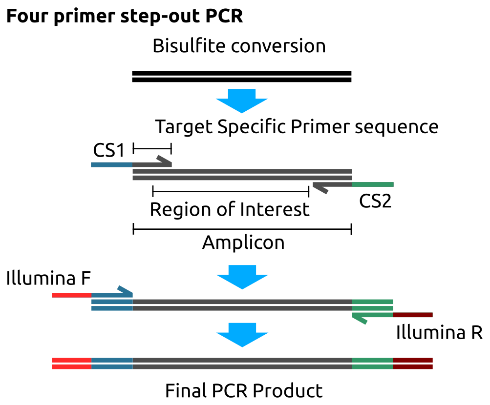

# Methods {#methods}

## Illumina DNA Methylation arrays {#GenMethodsMethArray}

The Illumina methylation bead chip arrays make use of 50 bp long probes with sequences corresponding to the loci of interest in the genome, with an additional 23 base sequence for positional addressing on the array [@Bibikova2006; @Bibikova2009; @Bibikova2011; @Moran2015].
The CpG of interest is located at the 3' end of the probes.
These probes are attached by their 5' ends to $3\mu m$ diameter silica beads which are embedded in indentations acid etched into the surface of planar silica slides.
Each locus is represented by an average of ~30 beads and a minimum of ~5 beads which are distributed randomly across the slide. 
The number of beads for a given locus is approximated well by the poisson distribution, so this can be used in conjunction with the number of loci to ensure that the probability of having fewer than 5 beads per locus is kept negligibly small by adjusting the ratio of loci to possible bead sites.
Thus each BeadChip array has a unique random distribution of probes which must be decoded to yield the mapping between positions on the array and target loci being assayed.
The positions of the beads are decoded through the sequential hybridisation of fluorescent oligonucleotide probes within the 23 base addressing sequence, with probes for each locus having a unique combination of hybridisation events to identify them [@Gunderson2004; @Michael1998].
An optical scanner such as Illumina's iScan system with a charge coupled device (CCD) to detect the light and a laser to excite the flourescent dyes is used the read the arrays. 
There are two fluorophore channels the respective fluorescence intensities of which are are recorded at each spot.
Initially the probe decoding oligos are used to map the probe locations and then flourescently tagged DNA bases are cycled to assay the DNA methylation as described below.

Samples are prepared for the array assay by fragmentation, bisulfite conversion and amplification.
bisulfite conversion creates a 'pseudo-SNP' by selectively deaminating unmethylated cytosines to uracil and thus changing their base pairing properties and permitting this technology, originally developed to detect SNPs, to assay DNA methylation [@Bibikova2006].
These sample fragments anneal to complementary probes on the array and unbound DNA is washed away.
A single DNA polymerase-mediated elongation step is carried out to permit a fluorescently labelled base to be incorporated at the end of each probe.
C and G are tagged with one fluorophore and A and T with another.
There are two probe designs:

1. The type I probes, which make use of two distinct bead types for each locus.
2. the type II probes, which make use of a single type of bead at each locus.

The 'colour' of the fluorophore incorporated signifies the methylation state and the intensity of the proportion of sites which are in that state.
The logic of which 'colour' corresponds to methylated or unmethylated varies with the probe type and Figure \@ref(fig:Bibikova2011IlluminaMethylationBeadChip) illustrates and explains this in-depth.

```{r Bibikova2011IlluminaMethylationBeadChip, fig.cap='(ref:Bibikova2011IlluminaMethylationBeadChip-Cap)', out.width='60%', fig.show='hold', fig.align = 'center', echo=FALSE}
knitr::include_graphics("figs/Bibikova2011IlluminaMethylationBeadChip.png")
```
(ref:Bibikova2011IlluminaMethylationBeadChip-Cap) __Illumina Methylation Bead Chip Array Probe Designs__ The probes on the array are 50bp in length. In type I probes, unlike type II probes the base that is incorporated (or not) in the elongation step is the base that __follows__ the CpG site. The probes on the array are bound by the amplification products derived from the bisulfite converted DNA, not direct conversion products. Thus, Cs in the sample DNA represent methylated positions and Ts unmethylated positions, as Ts take the place of Us created by bisulfite conversion during the amplification process. __Type I__: Panel A shows the type I probe design. Each locus is represented on two beads, a methylated and an unmethylated bead. *Methylated Sample*: When sample DNA binds a methylated probe the G at the second position in the CpG on the methylated probe will be complementary to the C marking the location of the 5mC. Extension will then be able to occur incorporating a fluorescently labelled base complementary to the base just 5' of the 5mC position in the probe. On the unmethylated probe, the C marking the position of the 5mC will not be complementary to the A base in the probe and thus extension cannot occur. No fluorescent base will be incorporated at the unmethylated probe. *Unmethylated Sample*: When sample DNA binds the methylated probe the T marking the position of the unmethylated C is not complementary to the G at the second position in the CpG site on the probe. Thus, no fluorescent base is incorporated. Whereas, on the unmethylated probe the T marking the position of the unmethylated C will be complementary to the A at the second position in the CpG site on the probe. Thus, a fluorescently labelled base can be incorporated. __Type II__: Panel B shows the Type II probe design. For the Type II probes only one probe represents each locus. In the Type II probes the incorporated base is at the second position in the CpG site. A fluorescently labelled A is always incorporated opposite a T in the sample DNA marking the position of an unmethylated C, and a fluorescently labelled G is always incorporated opposite a C marking the position of an unconverted 5mC in the sample DNA. For the Type II probes, in contrast to the Type I probes, methylation is always signalled in the green channel and unmethylation in the red channel. (figure reproduced from Bibikova et al. [@Bibikova2011].)

These arrays have now undergone several iterations [@Bibikova2009; @Bibikova2011; @Moran2015].
The current array probe design was preceded by the 'golden gate' array which used a variant on the SNP probe design with methylation-specific PCR.
This array contained ~1.5k probes covering 371 genes with a strong focus of cancer-related genes [@Bibikova2006].
The first array using the probe design outlined above was the 'Infinium' array which contained 27k type I probes focused on the promoter regions for 14,475 consensus coding genes with 110 miRNA promoters [@Bibikova2009].
The 450k array which had ~480k mixed type I and II probes covering 21,231 RefSeq genes, 26,658 CpG islands, 80,538 predicted enhancer regions and a variety of other features, including the MHC region [@Bibikova2011].
The 450k array systematically underestimates the methylation level in highly methylated regions [@Clark2012].
A Markov chain model of DNA methylation state developed by Affinito et al. [@Affinito2016] suggests that once a threshold level of DNAm is reached on a molecule further methylation becomes less likely.
They reason that DNMTs recruited by the high methylation state have greater difficulty accessing the remaining unmethylated sites.
Thus sampling a single site is likely to produce a systematic underestimate as once neighboring sites are methylated methylation at a given CpG is less likely to increase further.
The 'EPIC' array has ~850k probes including >90% of those on the 450k with greatly expanded coverage of loci with more dynamic methylation states than promoters and CGIs [@Moran2015].
Promoters and CGIs tend to have relatively low methylation variability and the EPIC array aims to capture more functional methylation variation at regions such as enhancers [@Ziller2013].
The 'EPIC' array also contains both Type I and Type II probes, with many of the new sites being type II.
The type I probes have greater dynamic range than the type II but take up twice as much space on the array so there is some trade-off between maximising the number of sites covered and the quality of data at those sites.

Methylation at each site on the array is commonly reported as a $\beta$ value, which corresponds to the proportion of the sample DNA which was methylated at that site.
This is computed from the intensity values extracted from Illumina's IDAT format files which in the case of the methylation arrays are a binary format which had to be reverse engineered to permit analysis outside of Illumina's 'GenomeStudio' [@Smith2013].

$$\frac{\beta=intensity[M]}{intensity[U] + intensity[M]}$$

Where $M$ = methylated and $U$ = unmethylated.

The type I and type II probes have slight systematic differences not accounted for by their genomic context [@Dedeurwaerder2011].
Type I probes have a wider range and are more reproducible than the type II probes. 
This is likely due to the dual complementary probes with fluorescence in different colour channels providing additional information for methylation level calling leading to more robust estimates at extreme values near 1 and 0.
This difference means that to operate uniformly on this mixed data a normalisation procedure is needed to correct for these differences. 

```{r Dedeurwaerder2011fig1bL, fig.cap='(ref:Dedeurwaerder2011fig1bL-Cap)', out.width='50%', fig.show='hold', fig.align = 'center', echo=FALSE}
knitr::include_graphics("figs/Dedeurwaerder2011fig1bL.png")
```
(ref:Dedeurwaerder2011fig1bL-Cap) __Type I probes have a wider range and less variability than type II__. Type I probes shown in blue, Type II in red. Plot shows kernel density of beta values with gausian smoothing. (Reproduced from Dedeurwaerder et al. [@Dedeurwaerder2011])

There exist a number of normalisation methods to account for probe-type bias [@Fortin2016] such as beta-mixture quantile normalization (BMIQ) [@Teschendorff2013]. 
This method was applied as a part of the pre-processing of the Twins UK 450k array datasets used in (Chapter \@ref(tRNAs)) in this thesis. 
In addition, there are other techniques capable of correcting for probe bias as well as other sources of technical variation such as batch effects [@Leek2010].
Functional normalisation [@Fortin2014] which makes use of the technical control probe data on the arrays to inform its transformation of the DNA methylation values was used to normalise EPIC array data from the MAVIDOS and Southampton Women's Survey (SWS) data in (Chapter \@ref(arrays)) of this work.

Bisulfite conversion efficiency can be estimated by looking at the rates of conversion at non-CpG cytosines as these are very rarely methylated they should be bisulfite converted at a very high rate. 
If this is not the case it can lead to the overestimation of DNA methylation levels, bisulfite conversion also  fragments DNA so there is a trade-off between achieving sufficient conversion efficiency and not producing overly fragmented DNA [@Ehrich2007].
On the Illumina methylation arrays control probes ([@Illumina2015] p226) are located at non-CpG cytosines to assay the conversion efficiency for use in quality control assessment of array data.

In addition to probe-type bias, there are other sources of potential problems for individual probes on these arrays [@Pidsley2016].
Zhou et al. divide these into three categories [@Zhou2017]:

1. Probes with SNPs internal to the probes especially if located near the 3' end.
  These can cause issues by: 
    a) preventing extension through mismatches near the 3' end.
    b) Altering the ability of the target cytosine to be methylated through effects on the sequence context, including the case where a C/T polymorphism in place of the C/T bisulfite induced conversion.
    c) Inducing a colour change in a type I probe by altering the extension base.
2. Probes which map to multiple possible locations in the bisulfite-converted genome. 
  Methylation values from multi-mapping probes are an amalgam of the methylation levels at the different loci to which the probes can map and cannot be disentangled to yield reliable results for the different loci.
3. Probes with partial off-target matches to other loci.
  Probes with partial matches at the 3' end can lead to extension and an erroneous readout of methylation levels for that locus or partial matches elsewhere can lead to competition for binding with the probe intended for that locus.

To account for these potential problems probe 'masks' have been produced which identify probes which commonly exhibit one or more of these problematic properties so that findings at these loci can be excluded or followed up for validation with other methods [@Zhou2017; @Pidsley2016].
These masks have been used here to identify potentially problematic probes.

When looking for a purely epigenetic effect the presence of a genetic variant which influences the DNA methylation state of a CpG is known as genetic confounding.
This is not necessarily a problem if genetic effects on a phenotype of interest are a useful outcome but it is an issue if looking for effects mediated purely through epigenetic mechanisms.
Genetic variants which bias the DNA methylation in a particular direction, or modulate the plasticity of DNA methylation state to environmental influences may be important to mechanistic understanding the biological system under examination [@Birney2016; @Lappalainen2017].
Simply excluding all probes with a SNP above a certain minor allele frequency and with a certain distance of a target CpG can both miss rarer genetic confounders and throw away actual non-genetic differences in DNA methylation.
Andrews et al. developed a method called 'gap-hunting' to identify probes which commonly have multi-modal DNA methylation distributions which may be associated with different genotypes influencing a probe locus [@Andrews2016]. 
'gap-hunting' was also employed in this work to search for DNA methylation changes which may be under genetic influence (Chapter \@ref(arrays)).
In addition to SNPs causing sequence context changes that affect the DNAm of probes, structural mutations can also have this effect on DNA methylation [@Bell2017a].
Thus probes in the vicinity of non-SNP mutations should also be subject to additional scrutiny.

## MeDIP-seq {#MeDIPseq}

MeDIP-seq uses a monoclonal anti-5mC antibody to bind denatured fragmented genomic DNA at methylated CpG sites. 
This antibody-bound fraction of DNA is isolated and sequenced [@Down2009], Figure \@ref(fig:MeDIPseqReaction) outlines the workflow.
Unlike bisulfite conversion approaches this method permits 5mC to be differentiated from 5hmC, as the antibody binds specifically to 5mC.
The methylation level across the CpG sites in the region of the genome to which the resultant sequencing reads map can subsequently be estimated by counting the number of reads and accounting for the CpG density with software tools such as the `MEDIPS` R package [@Lienhard2014].

MeDIP-seq can also cover much more of the methylome than do the 450k or EPIC arrays. 
The 450k array captures ~1.6% of the 28 million CpGs in the genome. 
At near saturation coverage of ~40 million reads per sample, MeDIP-seq can cover ~60% of all CpGs with at least 1 read, this is almost all methylated CpGs.
At half that total read count MeDIP-seq still covers ~50% of CpGs at $\ge1\times$ and ~20% at $\ge5\times$ [@Taiwo2012].
Other estimates place the threshold for saturation coverage by MeDIP-seq lower at between 20 and 30 million reads and suggest that the maximum number of CpGs covered at least once could extend up to 90% [@Chavez2010].
MeDIP-seq provide a particular advantage by comparison with the Illumina beadchip array technologies with respect to the coverage it provides for repetitive regions of the genome. 
This is illustrated by Clark et al. who show that MeDIP-seq covers an estimated 91.4% of repetitive sequences and the 450k array only 3.4% [@Clark2012] (Figure \ref{fig:Clark2012fig1}).
This makes it particularly suited to the aims of this project (Chapters \@ref(tRNAs) & \@ref(Alus)).

MeDIP-seq does however have the disadvantage that it is less good at absolute quantitation of DNA methylation levels than bisulfite conversion base methods.
This is especially the case without input controls i.e. sequencing data without antibody pull-down to account for the 'sequencability' or background levels of reads that are generated for a given region in the genome which can be corrected for when estimating methylation levels.
Better even that input controls is to couple MeDIP-seq with MRE-seq which makes use of methylation-sensitive restriction digests to enrich for unmethylated DNA [@Maunakea2010].
Signal in MRE-seq thus corresponds to the genomic location of unmethylated regions and can thus be used to differentiate gaps in MeDIP-seq coverage from truly unmethylated regions.
In conjunction these complementary sequencing technologies provide an improved ability to discern absolute methylation levels compared to MeDIP-seq alone [@Clark2012, @Bock2010].
The data generated on behalf of TwinsUK and used in this thesis did not make use of input or MRE-seq controls.
Additionally Data for Chromosome X were not available for use in the analyses performed in this thesis.
Interpretation of changes in chromosome X DNA methylation with age would be interesting to examine especially in this almost exclusively female cohort, despite the challenges in interpreting such changes given X inactivation.

```{r Clark2012fig1, fig.cap='(ref:Clark2012fig1-Cap)', out.width='90%', fig.show='hold', fig.align = 'center', echo=FALSE}
knitr::include_graphics("figs/Clark2012fig1MeDIPseqVs450Kcoverage.png")
```

(ref:Clark2012fig1-Cap) MeDIP-seq provides superior coverage of repetitive regions of the genome than the Illumina array platform. This presumes saturation coverage for the MeDIP-seq assay. MD-s = MeDIP-seq, 450k = Illumina 450k DNA methylation bead chip array (Reproduced from Clark et al. [@Clark2012]) The CpG islands, shores, and shelves major RefSeq gene features are covered almost as well in the 450k array as they are by MeDIP-seq but repetitive regions and other regulatory elements are where MeDIP-seq provides substantially greater coverage.

```{r MeDIPseqReaction, fig.cap='(ref:MeDIPseqReaction-Cap)', out.width='60%', fig.show='hold', fig.align = 'center', echo=FALSE}

```
(ref:MeDIPseqReaction-Cap) __Graphical Summary of the MeDIP-seq process__ Purified DNA is fragmented by sonication, denatured and incubated with anti-5mC antibodies. It is then immunoprecipitated resulting in fragments containing methylated CpGs which are subsequently sequenced.

DNA sample preparation, MeDIP reaction, and Illumina sequencing were performed by BGI-Shenzhen (Shenzhen, China) on behalf of Twins UK, prior to the analytical work performed on the resulting data in this thesis.
Fragmentation of genomic DNA from whole peripheral blood samples from the Twins UK cohort was performed by sonication using a Covaris system (Woburn, MA, USA).
$5\mu g$ of DNA was used in the Illumina Single-End DNA Sample Prep kit followed by end repair, <A> base addition and adaptor ligation.
The MeDIP reaction was performed, according to the protocol for the MagMeDIP kit (mc-magme-048), with a monoclonal antibody for 5-methylcytosine (5mC) (Cat. No.: CO2010021 mc-magme-048 from Diagenode (Liège, Belgium)). 
The antibody was incubated with Adaptor-ligated DNA combining $0.5 \mu l$ antibody + $0.5 \mu l$ water; then $0.6 \mu l$ MagBuffer A, $1.4 \mu l$ water and, $2 \mu l$ MagBuffer C; yielding a final volume of $5 \mu l$ for the immunoprecipitation reaction.
The MeDIP reaction was validated with quantitative PCR.
The product of the MeDIP reaction was purified with Zymo DNA Clean & Concentrator-5 (Zymo Research), and amplified with adaptor-mediated PCR.
Size selection of fragments (200–500 bp) was performed by gel excision and quality assessed by Agilent BioAnalyzer (Agilent Technologies, Santa Clara, CA, USA). 
The resultant libraries were subjected to highly parallel 50bp single-end sequencing on the Illumina HiSeq2000 platform.

Quality control (QC) and alignment were performed by Twins UK, also prior to the work done in this thesis.
Sequencing data were subject to initial QC for call quality and base composition using `FASTQC` (v0.10.0) (https://github.com/s-andrews/FastQC) [@Andrews2010].
Duplicates were removed with `SAMTools` (https://github.com/samtools/samtools) [@Li2009b].
The alignment was performed using the Burrows-Wheeler Aligner (`bwa`) (https://github.com/lh3/bwa) [Li2009] with a minimum mapping quality score of Q10.
`MEDIPS` (v1.0) was used to perform MeDIP-specific QC, as well as to generate reads per million (RPM) and Absolute methylation score (AMS) values (https://bioconductor.org/packages/release/bioc/html/MEDIPS.html) [@Lienhard2014].
AMS and RPM values are binned into 500bp windows with a 250bp slide in the BED format, resulting in ~12.8 million windows on the genome (Build: hg19/GRCh37).
Additional quality control checks were performed by Twins UK in the R language: correlation matrix, hierarchical clustering, dendrogram, heatmap, density plot, and batch effects inspection by principal component analysis.
Analyses in this thesis are based on these binned DNA methylation level estimates and the accompanying individual metadata, such as age, produced by Twins UK.
There was a mean of ~16.89 million (SD 3.04M) reads per sample.
This number of reads per sample is consistent with covering ~50% of all CpGs at 1x, ~15% at 5x and ~10% at 10x (estimated using the results of Taiwo *et al.* 2012 [@Taiwo2012].)
MeDIP-seq data from regions of interest was extracted using `bedtools` v2.17.0 [@Quinlan2010].

The above-described processing steps for Methylated DNA Immunoprecipitation sequencing (MeDIP-seq) data used here have been previously described in Bell et al. [@Bell2016; @Bell2017a].
These processed data are available, subject to approval, in the European Genome-phenome Archive (EGA) (https://www.ebi.ac.uk/ega) under study number EGAS00001001910 and dataset  ([https://www.ebi.ac.uk/ega/datasets/EGAD00010000983](https://www.ebi.ac.uk/ega/datasets/EGAD00010000983)).

### Participants {#Participants}

Peripheral blood samples for DNA extraction were provided by the adult volunteers from the UK Twin Register (TwinsUK Resource [@Moayyeri2013]).
The participants are rigorously phenotyped at visits at St Thomas’ Hospital, London.
A twinning questionnaire determines twin zygosity and is confirmed by genotyping. 
Ethics were approved by Guy’s & St Thomas’ NHS Foundation Trust Ethics Committee (EC04/015—15-Mar-04) and written informed consent was obtained from all subjects in accordance with this. 
Samples are stored at −80 °C in EDTA tubes before extraction via the Nucleon Genomic DNA Extraction Kit. 
DNA is subsequently stored in TE Buffer at −20 °C. 

The MeDIP-seq dataset used in this work consists of 4350 whole blood methylomes with age data.
4054 are female and 270 male.
3001 have full blood counts.
There are 3652 individuals in this data set.
These individuals originate from 1933 unique families.
There are 1234 monozygotic (MZ) twin pairs (2468 individuals), and 458 dizygotic (DZ) twin pairs (916 individuals).


## Targeted Bisulfite Sequencing {#MethodsTargetedBisulfiteSequencing}

Targeted Bisulfite sequencing [@Korbie2015] is very similar in principle to ordinary targeted DNA sequencing but preceded by a bisulfite conversion step as illustrated in Figure \@ref(fig:BisulfiteConversionNEB) [@Bock2010].
However, bisulfite conversion has several implications for downstream processing.
Bisulfite library prep can be either directional, sequencing reads correspond to a bisulfite-converted version of either the forward or reverse strand, or non-directional in which sequencing reads correspond to bisulfite-converted versions of either strand giving a total of four bisulfite-converted sequences with the strand of origin unknown.
If a library is directional there are only two bisulfite-converted sequences.
Other than ability to trace strand of origin there is no particular advantage to either approach.
In both cases very rigorous adapter trimming is needed to avoid biases arising from the reads that are longer than the fragments and thus might be inferring methylation state for cytosines introduced during the library preparation process.
Library preparation in this work was non-directional.

Mapping can be performed with customised software wrapper to implementations of existing alignment tools. 
`Bismark` is a popular example of such as wrapper which uses the bowtie alignment tool and calls site methylation levels [@Tran2014].
Alignment is performed with *in silico* bisulfite converted versions of the genome and reads, with G to A conversions for reverse strand reads.
This requires four parallel instances of bowtie for forward and reverse G to A and C to T conversions, which are combined to determine the unique best alignment.
(Figure \@ref(fig:Krueger2011BismarkAlignment) panel A).
Bisulfite conversion results in loss of sequence complexity as many Cs effectively become Ts meaning short reads can be challenging to map.
For targeted sequencing approaches it is advisable to align to both the targeted sites and their flanking regions as well as to the whole genome, especially if any of the targeted regions contain repetitive sequences [@Bottcher2012].
Substantial mapping to areas other than those targeted could be indicative of off-target amplification, this step forms a part of the quality control process.
`Bismark` produces methylation calls either combined or by strand and which can be filtered by methylation context CpG, CHG or CHH.

```{r Krueger2011BismarkAlignment, fig.cap='(ref:Krueger2011BismarkAlignment-Cap)', out.width='60%', fig.show='hold', fig.align = 'center', echo=FALSE}
knitr::include_graphics("figs/Krueger2011BismarkAlignment.png")
```
(ref:Krueger2011BismarkAlignment-Cap) __Bisulfite sequencing alignment process__ **A)**  Unmethylated cytosines are converted to uracil in the bisulfite conversion process these are rendered as thymidine as T is used in the PCR amplification following bisulfite conversion. Following the conversion of a C to A T its corresponding G is swapped for an A in the complementary strand. The Genome is converted in silico to permit the alignment of these altered bases. Thus there is the C to T converted and a G to A converted genome each to which has two strands totalling 4 possible alignment targets for the converted reads. **B)** The unique best alignment for a read is determined from this set and mismatches of C in this alignment are used to call the methylation state. (Reproduced from Krueger et al. [@Krueger2011])

Targeted sequencing methods where the aim is to sequence a number of amplicons ($N_a$) from a number of samples ($N_s$) means the total number of PCR reactions in the pairwise matrix is ($N_a \times N_s$).
This can rapidly become difficult to manage with conventional bench-top PCR methods especially where consistency between reactions is important for quantitation.
Microfluidic systems for conducting multiple PCR reactions in parallel such as the Fluidigm 48.48 access array employed here improve the ease with which a large number of reactions can be performed.

```{r targetedBiSseqFluidigmGeneric, fig.cap='(ref:targetedBiSseqFluidigmGeneric-Cap)', out.width='60%', fig.show='hold', fig.align = 'center', echo=FALSE}
knitr::include_graphics("figs/targeted_BiSseq_fluidigm_generic.png")
```

(ref:targetedBiSseqFluidigmGeneric-Cap) __Microfluidic system for multiple parallel pairwise PCR reactions.__ The Fluidigm 48.48 access array permits the combination of up-to 48 samples with up-to 48 different set of reagents, without multiplexing. In this case the reagents are locus specific primers for targeted sequencing. Samples are added to one side of the array and reagents to the other the flow cell permits all combinations of the two to be mixed. Fluidigm's controller flow cell and thermocycler allow all the PCR reactions to be carried out simultaneously and their products be extracted for sequencing.

A four primer step-out PCR process is performed on the bisulfite-converted genome to generate the final PCR product used in the Illumina sequencing reaction (Figure \ref{fig:targetedBiSseqFluidigmPCR}).
After the loci of interest are selected locus-specific primers are designed to be complementary to the bisulfite converted regions flanking the area of interest and avoiding CpG sites in those flanking regions.
A number of tools for designing such primers are available, the tool used in this work was: 'methPrimer' [@Li2002].

```{r targetedBiSseqFluidigmPCR, fig.cap='(ref:targetedBiSseqFluidigmPCR-Cap)', out.width='60%', fig.show='hold', fig.align = 'center', echo=FALSE}

```

(ref:targetedBiSseqFluidigmPCR-Cap) __Four primer step-out PCR for targeted bisulfite sequencing on the Fluidigm access array.__ The sample DNA is bisulfite converted. The region of interest amplified using site specific primers with the Fluidigm CS1 and CS2 primers in the first PCR step. The CS1/2 primers have regions complementary to the Illumina sequencing primers permitting them to be added in a second PCR step to generate the final PCR product ready for sequencing.

After designing the target-specific primer sequences the CS1 and CS2 adaptor sequences are added to the forward and reverse primers respectively to permit the addition of Illumina sequencing primers in a second PCR step.
The subsequent analysis is similar to that for whole-genome bisulfite sequencing.
The PCR products are sequenced and the resulting reads aligned and methylation levels called with `Bismark`.
