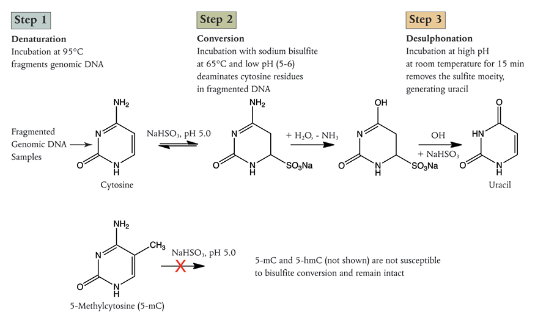

# (PART) Methods {-}

# Methods

## DNA methylation assays

### Overview

There are numerous DNA methylation assays. Some are designed to assay global DNAm levels producing a single global measurement of the amount of 5mC present in a sample, others assay DNAm in a manner traceble to a specific genomic locus. These methods can be further subdivided into targeted methods where the loci to be examined are known in advance, and those where the loci covered are quasi-randomly sampled. Both the targeted and untargeted methods vary in their granularity, from individual CpGs to large regions of the genome, on the order of megabases. These assays also vary in their coverage of the genome from locus-specific approaches looking at small numbers of individual loci to whole genome methods providing methylation information on all ~28 million CpG sites. Between these two extremes are 'epigenome-wide' methods which are focused with varying degrees of specificity on genomic regions of interest.

These DNA methylation assays generally exploit one of four following things:

1. __Methylation sensitive restriction digestion__
    A variety of methods exploit enzymes which differentially cut methylated and unmethylated DNA. An example of such enzymes is: HpaII and MspI which are isoschizomers for the sequence: 5'-C^CGG-3' but only HpaII methylation sensitive and unable to cut the sequence if the internal cytosine is methylated. The methods which use such enzymes include: Restriction landmark genomic scanning, which gives a roughly megabase resolution indicators of DNAm levels by 2D electrophoresis [@Hatada1991]. MRE-seq, which makes use of methylation-sensitive restriction digests to enrich for unmethylated DNA [@Maunakea2010]. This is then is sequenced to provide the genomic location of this unmethylated signal. Reduced Representation Bisulfite Sequencing (RRBS) which using methylation senstitive restriction digestion to enrich for unmethylated sequences which are then subject to bisilfite sequencing, (see point 3 below).

2. __DNA methylation-sensitive binding of DNA by antibodies or other proteins which bind methylated DNA__
    Anti-5mC antibodies were first used to isolate methylated DNA in 1985 and were subsequently paired with array-based technologies to assay DNAm levels at specific loci in 2005 [@Weber2005,@Harrison2011]. This was followed by MeDIP-seq (methylated DNA immuno-precipitation and sequencing) [@Down2009,@Lienhard2014], which enriches methylated DNA that is then sequenced and the number of reads mapping to a locus is indicative of the relative methylation level. MBD-seq uses a recombinant Methyl Binding Domain (MBD) protein to enrich for methylated double-stranded DNA, prior to sequencing [@Serre2009a]. Inferring the absolute methylation levels form the number of reads mapping to a locus enriched by one of these pull-down methods is complicated by variation in CpG density in the genome and the fact that CpG dense regions tend to have low methylation levels, and thus tend not be pulled down by antibodies binding 5mC or MBD proteins. The best results for estimating absolute methylation levels with these methods come from pairing them with a complementary method to enrich for unmethylated sites such as MRE-seq (described above) [@Li2015]. Though relative methylation levels remain effective in identifying differentially methylated regions when using these methods alone [@Bock2010,@Maunakea2010].

3. __Sodium bisulfite conversion of unmethylated cytosines to uracil__
    Conversion of cytosine to uracil changes the base complementary to this site from G to A [@Hayatsu1970]. This basic chemistry of the conversion process is illustrated in Figure \@ref(fig:BisulfiteConversionNEB). This conversion can be detected with a variety of other technologies from targeted bisulfite PCR to examine a small number of selected loci, to the Illumina bead chip methylation arrays or WGBS. Targeted bisilfite PCR and be preformed on a larger number of loci with microfuidic multiplexing such as that provided by the Fluidigm access array [@Adamowicz2018]. It is worth noting that bisulfite conversion cannot differentiate between methylated and hydroxymethylated cytosines. Because 5hmC represents a small fraction of modified bases compared to 5mC many analyses have made the working assumption that unconverted bases are methylated, but it is beginning to be recognised that distinguishing between the two may be biologicall important especially in tussues where 5hmC is more prevalant such as neurons. A variant of bisulfite conversion, oxidative bisulfite conversion, exists which can permit 5hmC to be distinguished from 5mC [@Skvortsova2017].

```{r BisulfiteConversionNEB, fig.cap='(ref:BisulfiteConversionNEB-Cap)', out.width='80%', fig.show='hold', fig.align = 'center', echo=FALSE}

```
(ref:BisulfiteConversionNEB-Cap) Sodium Bisulfite conversion of C to U, 5mC and 5hmC are unaffected. (Image Credit New England Biolabs).

4. __Physical differences in the methylated base__
    These are exploited by the not yet widely used '3rd generation' sequencing technologies such as nanopore and single-molecule real-time sequencing. These methods respectively exploit the effects of modified bases on ion flow through the nanopore and impact on incorporation time of new bases whilst in the polymerase [@Rhoads2015,@Simpson2017].

### Methods used in this work

#### MeDIP-seq {#MeDIPseq}

MeDIP-seq uses a monoclonal anti-5mC antibody to bind denatured fragmented genomic DNA at methylated CpG sites, this antibody-bound fraction of DNA is isolated and sequenced [@Down2009], Figure \@ref(fig:MeDIPseqReaction) outlines the workflow. Unlike bisulfite conversion approaches this method permits 5mC to be differentiated from 5hmC. The methylation level across the CpG sites in the region of the genome to which the resultant sequencing reads map can subsequently be estimated by counting the number of reads and accounting for the CpG density with software tools such as the MEDIPS R package [@Lienhard2014].

```{r MeDIPseqReaction, fig.cap='(ref:MeDIPseqReaction-Cap)', out.width='100%', fig.show='hold', fig.align = 'center', echo=FALSE}
knitr::include_graphics("figs/MeDIPseqReaction.png")
```
(ref:MeDIPseqReaction-Cap) Graphical Summary of the MeDIP-seq process.

#### Bisulfite Conversion methods

##### Illumina Methylation arrays

The Illumina methylation bead chip arrays make use of 50 bp long probes with sequences corresponding to the loci of interest in the genome.  These probes are attached by their 5' ends to beads which are stuck to the surface of a glass slide, several beads represent each locus at a single spot on the slide. The positions of the bead spots are known and used to identify the probes. The CpG of interest is located at the 3' end of the probes. Samples are prepared for the array assay by fragmentation, bisulfite conversion and amplification. These sample fragments anneal to complementary probes on the array and unbound DNA is washed away. A single DNA polymerase-mediated elongation step is carried out to permit a fluorescently labelled base to be incorporated at the end of each probe. C and G are tagged with one fluorophore and A and T with another. There are two probe designs one which makes use of two distinct bead types for each locus, the type I probes, and one which makes use of a single type of bead at each locus, the type II. A scanner excites the two fluorophore channels with a laser and their respective fluorescence intensities at each spot are recorded with an imaging system. The 'colour' of the fluorophore incorporated signifies the methylation state and the intensity of the proportion of sites which are in that state. The logic of which 'colour' corresponds to methylated or unmethylated varies with the probe type and Figure \@ref(fig:Bibikova2011IlluminaMethylationBeadChip) illustrates and explains this in depth.

These arrays have now undergone several iterations [@Bibikova2009,@Bibikova2011,@Moran2015]. The current array probe design was preceded by the 'golden gate' array which used a variant on the SNP probe design with methylation-specific PCR, This array contained ~1.5k probes covering 371 genes with a strong focus of cancer-related genes [@Bibikova2006]. The first array using the probe design outlined above was the 'Infinium' array which contained 27k type I probes focused on the promoter regions for 14,475 consensus coding genes with 110 miRNA promoters [@Bibikova2009]. The 450k array which had ~480k mixed type I and II probes covering 21,231 RefSeq genes, 26,658 CpG islands, 80,538 predicted enhancer regions and a variety of other features, including the MHC region [@Bibikova2011]. The 'EPIC' array has ~850k probes including >90% of those on the 450k with greatly expanded coverage of loci with more dynamic methylation states than promoters and CGIs which tend to have relatively low methylation variability aiming to capture more functional methylation variation at regions such as enhancers [@Moran2015,@Ziller2013]. The 'EPIC' array also contains both Type I and Type II probes, with many of the new sites being type II. The type I probes have greater dynamic range than the type II but take up twice as much space on the array so there is some trade-off between maximising the number of sites covered and the quality of data at those sites.

```{r Bibikova2011IlluminaMethylationBeadChip, fig.cap='(ref:Bibikova2011IlluminaMethylationBeadChip-Cap)', out.width='90%', fig.show='hold', fig.align = 'center', echo=FALSE}
knitr::include_graphics("figs/Bibikova2011IlluminaMethylationBeadChip.png")
```
(ref:Bibikova2011IlluminaMethylationBeadChip-Cap) __Illumina Methylation Bead Chip Array Probe Designs__
The probes on the array are 50bp in length. In the type I probes unlike the type II probes the base that is incorporated (or not) in the elongation step is the base that __follows__ the CpG site. The probes on the array are bound by the amplification products derived from the bisulfite converted DNA not direct conversion products. Thus, Cs in the sample DNA represent methylated positions and Ts unmethylated positions, as Ts take the place of Us create by bisulfite conversion during the aplification process.
__Type I__: Panel A shows the type I probe design. Each locus is represented on two beads, a methylated and an unmethylated bead.
*Methylated Sample*: When sample DNA binds a methylated probe the G at the second position in the CpG on the methylated probe will be complementary to the C marking the location of the 5mC. Extension will then be able to occur incorporating a fluorescently labeled base complementary to the base just 5' of the 5mC position in the probe. On the unmethylated probe the C marking the position of the 5mC will not be complementary to the to the A base in the probe and thus extension cannot occur. No fluorescent base will be incorporated at the unmethylated probe. 
*Unmethylated Sample*: When sample DNA binds the methylated probe the T marking the position of the unmethylated C is not complementary to the G at the second position in the CpG site on the probe. Thus, no fluorescent base is incorporated. Whereas, on the unmethylated probe the T marking the position of the unmethylated C will be complementary to the A at the second position in the CpG site on the probe. Thus, a fluorescently labelled base can be incorporated.
__Type II__: Panel B shows the Type II probe design. For the Type II probes only one probe represents each locus. In the Type II probes the incorporated base is at the second position in the CpG site. A fluorescently labelled A is always incorporated opposite a T in the sample DNA marking the position of an unmethylated C, and a fluorescently labelled G is always incorporated opposite a C marking the position of an unconverted 5mC in the sample DNA. For the Type II probes, in contrast to the Type I probes, methylation is always signalled in the green channel and unmethylation in the red channel.
(figure reproduced from [@Bibikova2011].)

Methylation at each site on the array is commonly reported as a $\beta$ value, which correspond to the proportion of the sample DNA which was methylated at that site.

$$\frac{\beta=intensity[M]}{intensity[U] + intensity[M]}$$

Where $M$ = methylated and $U$ = unmethylated.

##### Sequencing Methods

###### Whole Genome

Whole Genome Bisulfite Sequencing (WGBS) theoretically permits all ~28 million CpGs in the genome to have their methylation state assayed (excluding unmappable and other problematic regions) and thus represents a gold standard for characterising the methylome. However, WGBS is highly inefficient with 70-80% of the reads generated providing no information about methylation as many reads map to loci without CpG sites [@Ziller2013]. In addition, to reliably call DNA methylation levels at all sites with a dynamic range equivalent to other popular technologies such as the Illumina array would require reads depths on the order of 85x [@Libertini2016]. Given that read depth is semi-randomly distributed this means that it will likely not always be possible to get reliable calls at sites in which investigators are interested, without using what are a present prohibitively expensive read depths.

WGBS is very similar in principle to ordinary whole genome sequencing but preceded by a bisulfite conversion step as illustrated in Figure \@ref(fig:BisulfiteConversionNEB) [@Bock2010]. However, bisulfite conversion has several implications for downstream processing. Bisulfite library prep can be either directional, sequencing reads correspond to a bisulfite-converted version of either the forward or reverse strand, or non-directional in which sequencing reads correspond to bisulfite-converted versions of either strand giving a total of four bisulfite converted sequences with the strand of origin unknown. If a library is directional there are only two bisulfite converted sequences.

Mapping is usually done with customised software wrapper to implementations of existing alignment tools. Bismark is a popular example of such as wrapper which uses the bowtie alignment tool and calls site methylation levels [@Tran2014]. Alignment is performed with *in silico* bisulfite converted versions of the genome and reads, with G to A conversions for reverse strand reads. This requires four parallel instances of bowtie for forward and reverse G to A and C to T conversions, which are combined to determine the unique best alignment. (Figure \@ref(fig:Krueger2011BismarkAlignment) panel A). Bisulfite conversion results in loss of sequence complexity as many Cs effectively become Ts meaning short reads can be challenging to map. Bismark produces methylation calls either combined or by strand and which can be filtered by methylation context CpG, CHG or CHH.

Information theoretic analysis techniques which exploit the correlation of methylation levels between neighbouring CpG sites [@Haerter2014,@Affinito2016] to call methylation levels in small regions have recently been developed. They also provide additional insight into the variability of methylation at a given site and reliability with which the methylation state will be maintained even in relatively low coverage WGBS data [@Jenkinson2018].

```{r Krueger2011BismarkAlignment, fig.cap='(ref:Krueger2011BismarkAlignment-Cap)', out.width='90%', fig.show='hold', fig.align = 'center', echo=FALSE}

```
(ref:Krueger2011BismarkAlignment-Cap) [@Krueger2011]

###### Targeted

Targeted bisulfite sequencing can be carried out with a variety of methods for isolating the sequences of interest. Among them is bisulfite PCR, where the genome is bisulfite converted and PCR carried out with specially designed primers complementary to the regions flanking bisulfite converted sequence of interest. Tools for designing such primers are available, for example: 'methPrimer' [@Li2002]. Subsequent analysis is similar to that for WGBS, the PCR products are sequenced. The resulting reads aligned and methylation levels called with a tool such as Bismark.

## Discussion

In summary, there are a wide range of DNA methylation assays and analytical techniques available, each with strengths and weaknesses. Thus, the choice of assay and analysis will need to be informed by the biological question being asked. For example, the 450k array would not be well suited to study the methylation of repetitive elements as its coverage in these regions is low. WGBS may be prohibitively expensive and MeDIP-seq may represent a good compromise, as it would provide good coverage of these regions and permit accurate detection of differential methylation. With the caveat that MeDIP-seq can be highly sensitive to genetic variation affecting CpG numbers [@Okitsu2015a]. This approach could potentially be improved by coupling MeDIP-seq with MRE-seq, as in congunction they would provide an improved ability to discern absolute methylation levels compared to MeDIP-seq alone [@Clark2012,@Bock2010]. Unlike the 450k array MeDIP-seq captures regional methylation levels, whilst this may seem like a disadvantage due to lower resolution it can result in a more accurate and biologically relevant picture of regional methylation especially in highly methylated regions. The 450k array systematically underestimates the methylation level in highly methylated regions [@Clark2012], this may well be because it samples only single sites, and highly methylated regions are often not fully methylated. Modeling work by @Affinito2016 suggests that once a threshold level of DNAm is reached in a region further methyation becomes less likely, meaning that sampling a single site is likely to produce a systematic underestimate. MeDIP-seq can also cover much more the methylome than does the 450k array. The 450k array captures ~1.6% of the 28 million CpGs in the genome. At near saturation coverage of ~40 million reads per sample MeDIP-seq can cover ~60% of all CpGs with at least 1 read, this is allmost all methylated CpGs. At half that total read count MeDIP-seq still covers ~50% of CpGs at $\ge1\times$ and ~20% at $\ge5\times$ [@Taiwo2012].

