# Results 1 - Assessment of Umbilical Cord Tissue DNA Methylation with Respect to Bone Health, Environmental Factors and Ageing {#arrays}

## Abstract

Maternal vitamin D levels during pregnancy have previously been shown to impact on the methylation status of specific genes associated with vitamin D signalling and metabolism, such as *RXRA*. 
Long-term bone health outcomes have also been associated with both maternal vitamin D during pregnancy and methylation of the *CDKN2A* gene. 
To attempt to identify other loci the epigenetic regulation of which is pertinent to the impact of maternal vitamin D levels on long-term bone health Epigenome-Wide Association Studies (EWAS) were performed with DNA methylation data from the Illumina EPIC & 450k methylation bead chip arrays (n=137 & n=60, respectively). 
The impact of intervention vs placebo status in a trial of vitamin D supplementation in pregnancy, neonatal bone mineral content, Maternal Vitamin D levels (34wks) and change in maternal Vitamin D levels from 11-34wks, on methylation were examined. 
No loci were identified as changing significantly in methylation status in any of these EWAS, however, the power of this study was such that changes with small to medium effect sizes may have gone undetected. 
It is our intention to extend this analysis with additional samples to increase the power. 
We also intend to make use of this data to assess epigenetic estimates of biological and gestational age.

## Introduction

### Background

Epigenetic states are a product of both genetics and environment, they exist on a continuum from complete or obligatory genetic influence through facultative variation influenced by genetics, to the purely epigenetic subject entirely to environmental factors. 
This picture is complicated by the observation that genetics can not merely influence epigenetic state but also the extent to which that state will vary depending on environmental factors [@Holland2017]. 
Epigenome-wide association studies have been performed for many traits including age (Section \@ref(DNAmAgeReview)), smoking status [@Dogan2017], exposure to atmospheric particulate matter [Dai2016], and obesity [@Wahl2016]. 
Some robust and reproducible epigenetic changes have been identified with EWAS, particularly for traits such as a age and smoking. 
Unlike genome-wide association studies (GWAS) associations found by EWAS can be due to reverse causation. 
That is to say, a genetic variant associated with a disease is very unlikely to have been caused by the disease state whereas an epigenetic association can be the consequence of a disease state. 
Whilst this can complicate the dissection of disease aetiology it can also be a boon in unpicking the biology that follows on from a particular disease or environmental exposure by revealing what biological networks are affected. 


Work in rat models has demonstrated the ability of maternal nutritional exposure during pregnancy to influence the methylation and expression of genes in their offspring [@Burdge2007a; @Lillycrop2008] (reviewed in [@Burdge2007]). 
Consequently, the methylation status of target genes of interest for vitamin D and bone development related pathways have been examined. 


Retinoid-X-receptor-alpha (RXRA), which forms a heterodimer with the vitamin D receptor is essential for the nuclear action of $1,25(OH)_2-Vitamin~D$. 
DNA methylation at four of ten CpG sites in the *RXRA* gene were significantly ($p\le0.05$) lower in the umbilical cord of offspring from cholecalciferol supplemented mothers compared to placebo with a mean difference in methylation of -1.98% (n=447, 95% CI -3.65 to -0.32, p=0.01). 
One CpG site in the gene is related to estimated free 25(OH)D levels [@Harvey2014d].

Methylation of cyclin-dependent kinase inhibitor 2A (CDKN2A) in umbilical cord tissue has been implicated in bone cell activity mediating skeletal development and homeostasis. 
The *CDKN2A* locus has quite complex biology encoding two cell cycle inhibitors $p14^{ARF}$ and $p16^{INK4a}$ as well as the long non-coding RNA *ANRIL* which inhibits $p16^{INK4a}$. 
Targeted analysis of nine CpGs in a 300bp stretch of the *ANRIL* promoter region of *CDKN2A* was carried out. 
Methylation at several of these sites showed an inverse correlation with bone size, mineral content, and mineral density at age four years [@Curtis2017].

The MAVIDOS trial is a randomised, double-blind, placebo-controlled trial of vitamin D supplementation in pregnancy focused on bone development outcomes [@Harvey2012a; @Cooper2016]. 
Motivated by findings that low levels of maternal 25(OH)-Vitamin D during gestation have been associated with reduced bone mass, extending to peak bone mass [@Zhu2014a] and altered femoral morphology; leading to increased risk of osteoporosis in later life [@Mahon2010a; @Viljakainen2010; @Viljakainen2011]. 
$1,25(OH)_2-Vitamin~D$ has been implicated in the control of Plasma membrane $Ca^{2+}$-ATPases (PMCAs). 
The expression of the *PMCA3* gene in the placenta has been associated with umbilical cord calcium concentration and intrauterine accrual of bone mineral content [@Kip2004]. 
This provides part of a candidate mechanism linking vitamin D to bone outcomes.

### EWAS for Maternal Vitamin D Status and Offspring Bone Outcomes

This work sought to identify additional loci with changes in DNAm associated with bone development outcomes and vitamin D, beyond those identified in previous work targeted to specific loci. 
An 'epigenome-wide' approach examining ~850k sites in the genome was carried out using the Illumina EPIC methylation bead chip array on umbilical cord tissue samples from participants in the MAVIDOS study (n=140). 
Results were compared with additional samples run on the Illumina 450k array (n=60), which as the name suggests covers only ~450k sites. 
 

Epigenome-Wide Association Studies (EWAS) were performed for four variables of interest: intervention vs placebo status, neonatal bone mineral content(g) as determined by dual-energy X-ray absorptiometry (DXA) scans, Maternal Vitamin D levels (34wks) and change in maternal Vitamin D levels from 11 to 34wks.

>Subsequent analyses planned with this data include: Testing the effectiveness of epigenetic predictors of gestational age developed in cord blood [@Bohlin2016; @Knight2016] in cord tissue samples. 
Potentially testing if 'phenotypic age' as predicted by DNA methylation [@Levine2018] is related to gestational age, unlike DNA methylation age [@Simpkin2016; @Simpkin2017].

## Methods

Analysis of the Illumina EPIC and 450k methylation arrays was carried out in the R language using the ['meffil'](https://github.com/perishky/meffil/wiki) package [@Min2017], which is capable of performing functional normalisation in a more memory efficient fashion than alternatives such as 'minfi'. 


### Functional Normalisation

Functional normalisation is an approach to removing unwanted variation associated with 'batch' effects such as the date on which a sample was analysed or which slide a sample is on developed by @Fortin2014. 
This noise in the data masks the signal associated with the underlying biological effect of interest. 


Functional normalisation makes use of control probes on the arrays which are designed to capture only technical variation as surrogates for the sources of unwanted variation. 
The control probes are processed into 42 summary measures, and principal components analysis is performed on the control probe summary matrices for all samples. 
The top *m* principal components (PCs) are used as the surrogates for technical variation going forward. 
The number, *m*, of PCs from the control probe summary matrices used is informed by the amount of residual variation remaining after normalisation. 
Picking the number of PCs which correspond to the last steep drop in residual variation is the approach recommended by the implementers of meffil, and @Fortin2014 recommend an *m* of 2 as performing well across a variety of analyses. 
(See supplementary material from [@Fortin2014] for details of the control probe summary process.)

The process used by functional normalisation is a variant on quantile normalisation. 
Instead of forcing the empirical marginal distributions of the samples to be identical at each site across arrays it constructs quantile function which only removes variation arising from surrogates for batch variation to produce the normalised values. 
This approach is effective even when comparing samples with large global differences in methylation levels such as between normal and cancer samples, but cannot overcome high degrees of confounding [@Fortin2014].

### EWAS Models

#### Cell-Type Correction

Blood cell composition is a known confounder in epigenetic studies [@Jaffe2014; @Houseman2012]. 
Observed variation DNA methylation can be cell-type intrinsic, changes in DNAm not driven by changes in the cell-type composition of the tissue, or cell-type extrinsic, due to changes in the cell-type composition of the population sampled (Figure \@ref(fig:IntrinsicVsExtrinsicDNAmChangeGeneral)). 
An established approach for addressing this potential source of confounding it is to add terms to the regression model which reflect the cell type composition of each sample. 
Cell type composition can be ascertained through three main approaches: Direct cell count data; predicted cell-count based on comparing experimental methylation data to methylation data from reference samples of the tissue in question [@Houseman2012]; or reference free approaches which make use of mathematical methods to identify sources of confounding variation such as cell-type heterogeneity. 
Whilst there are several reference samples available for cord blood [@Cardenas2016; @DeGoede2015; @Bakulski2016; @Gervin2016], and one for cord tissue reference was recently published [@Lin2018]. 
This cell-type reference had not yet been integrated into the `meffil` R package I was using to perform the EWAS analyses so I created [a fork of `meffil` including this reference panel in the required format](https://github.com/RichardJActon/meffil/blob/LinAndKarnaniCordTissueRef/data-raw/lin-karnani-reference.r), this can be installed directly from github. 
The code necessary to add this reference to the package data before building the R package can be found in this [gist](https://gist.github.com/RichardJActon/703ae70438e865a37998cd608bd12cd3).

~~none were found for cord tissue samples, consequently, we made use of reference free methods for cell type correction.~~

I performed EWAS using Surrogate Variable Analysis (SVA) [@Leek2007] and Independent surrogate variable analysis (iSVA) [@Teschendorff2011], the results displayed here are those generated using SVA as this method was recommended based on comparisons of the performance of various cell-type heterogeneity correction methods [@McGregor2016; @Teschendorff2017].

```{r IntrinsicVsExtrinsicDNAmChangeGeneral, fig.cap='(ref:IntrinsicVsExtrinsicDNAmChangeGeneral-Cap)', out.width='80%', fig.align = 'center', fig.show='hold', echo=FALSE}
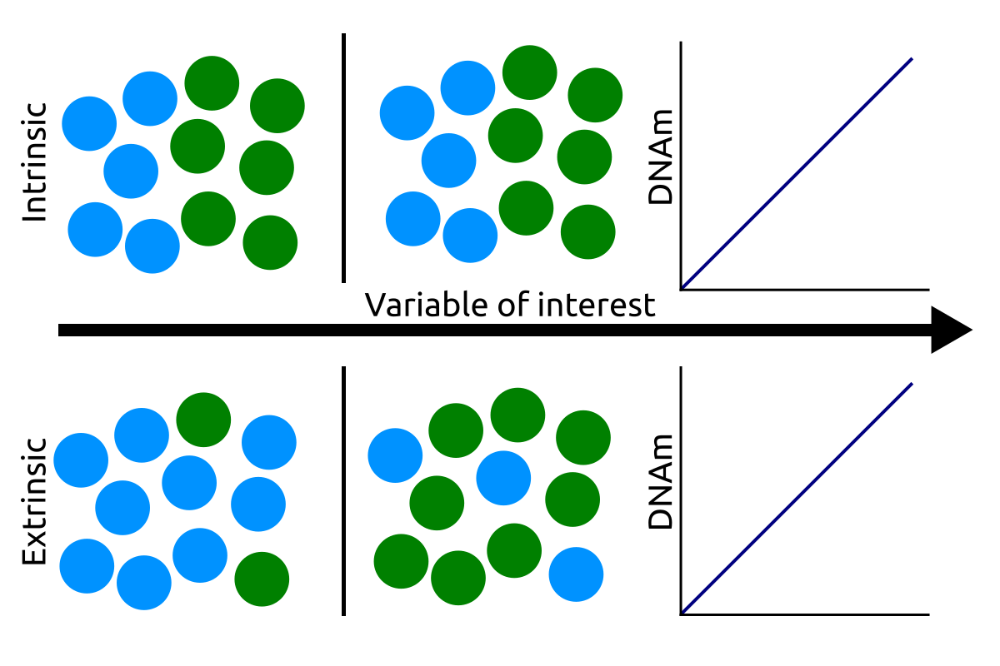
```
(ref:IntrinsicVsExtrinsicDNAmChangeGeneral-Cap) Diagramatic representation of DNAm change arrising from extrinsic, cell-type composition change and intrinic, DNAm of cells changes without the proportion of cell-types in the population changing. These two modes of change are of course not mutually exclusive and both can be occuring. 


#### !!! custom cord tissue ref ~ Add new results


#### Covariates Included in the Models

By default EWAS in meffil are run with four different models:

1. No covariates, attempting to predict methylation with the variable of interest.
2. All covariates, attempting to predict methylation with the variable of interest plus a user-supplied list of covariates.
3. SVs + all covariates, attempting to predict methylation with user-supplied covariates and surrogate variables generated from SVA.
4. iSVs + all covariates, attempting to predict methylation with user-supplied covariates and independent surrogate variables generated from iSVA.

In all the EWAS run here age at which bone measurements were made and sex were supplied as covariates.

Running EWAS with multiple models permits the effects of adding the various covariates on the results of the analysis to be seen. 
We observed no major differences in the results when using models with and without covariates so have reported here the results of model 3 above. 
That is to say, the covariates used were the surrogate variables produced from SVA, Age (days) and Sex.

### Concordance of EPIC and 450k EWAS Results

>Concordance between the top ranking probes by p-value with SVA correction was determined using the code which can be found in Section xxx: concordanceCode.

## Results

### Summary of Results

DNAm at none of the probes were significantly associated with the any of the four variables of interest for which EWAS were performed in either the EPIC or 450k datasets. 
The concordance between the probes with the top-ranked p-values in common between the EPIC and 450k data was at the level of chance. 
3 of the EPIC arrays were excluded from the analysis for failing quality control leaving an n=137.

### Quality Control (QC)

#### Whole array QC

##### EPIC arrays

The predicted sex of the samples generated using sex chromosome probe intensities was checked against that in the sample annotation and two mismatches were found. 
These were MAVIDOS IDs 206 and 63 and the associated arrays were excluded from further analysis, (Figure \@ref(fig:MAVIDOSqcEPICsexMismatch)).

```{r MAVIDOSqcEPICsexMismatch, fig.cap='(ref:MAVIDOSqcEPICsexMismatch-Cap)', out.width='80%', fig.align = 'center', fig.show='hold', echo=FALSE}
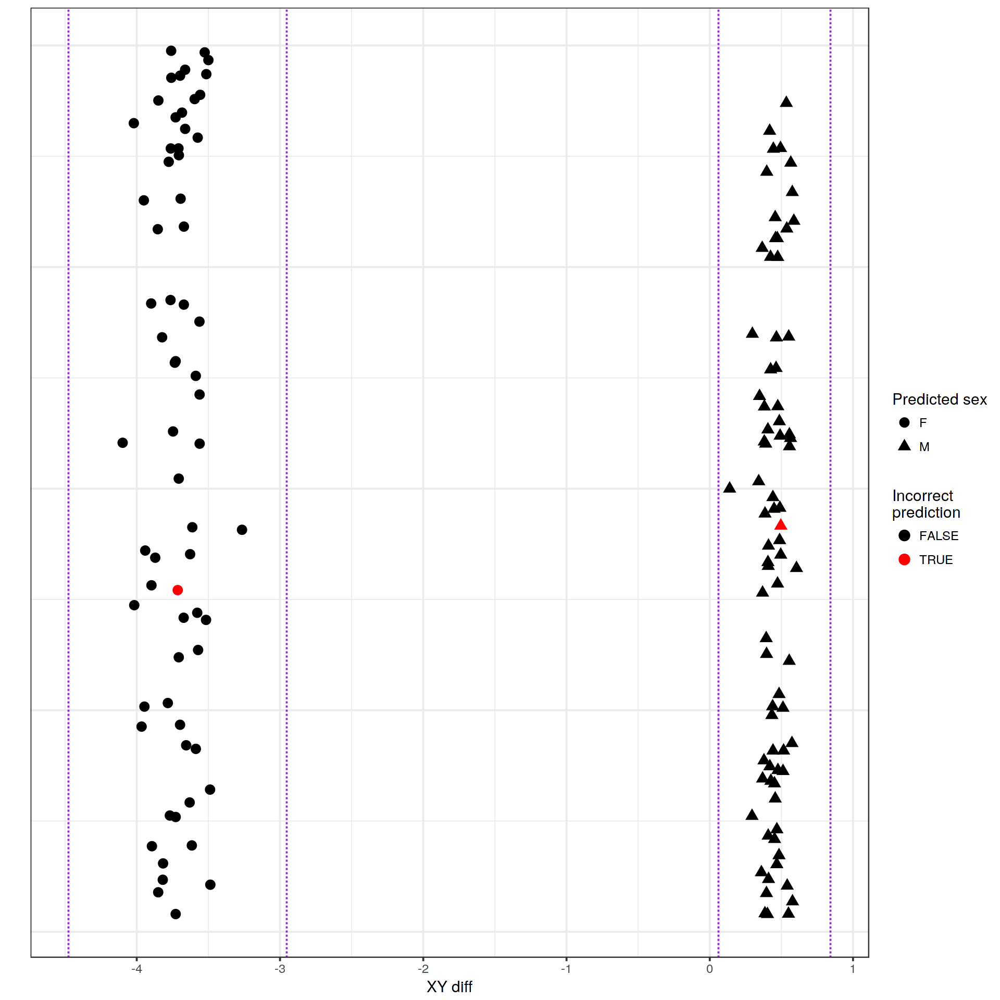
```
(ref:MAVIDOSqcEPICsexMismatch-Cap) Predicted sex of each sample based on the sex chromosome copy numbers infered from probe intensities for the EPIC array data. Mismatches between the predicted sex and that asserted in the sample annotation metadata are shown in red. Two predicted sex values differ from their annotions. Plot generated by meffil QC report.

The dataset also contained four samples for which there were two technical replicates, only the first replicate from each was used (144 arrays run for 140 individuals). 
Array 201516310023 (MAVIDOS ID 95) was excluded as its median methylated signal was more than $3\sigma$ from the expected value, (Figure \@ref(fig:MAVIDOSqcEPICmethVsUnmeth)). 
No samples were excluded for having a higher than expected proportion of undetected probes (proportion of probes with detection p-value > 0.01 is > 0.1) (Figure \@ref(fig:MAVIDOSqcEPICpropSites)). 
No samples were excluded for having a high proportion of probes with low bead counts (proportion of probes with bead number < 3 is > 0.1), (Figure \@ref(fig:MAVIDOSqcEPICbeadNum)).

```{r MAVIDOSqcEPICmethVsUnmeth, fig.cap='(ref:MAVIDOSqcEPICmethVsUnmeth-Cap)', out.width='80%', fig.align = 'center', fig.show='hold', echo=FALSE}
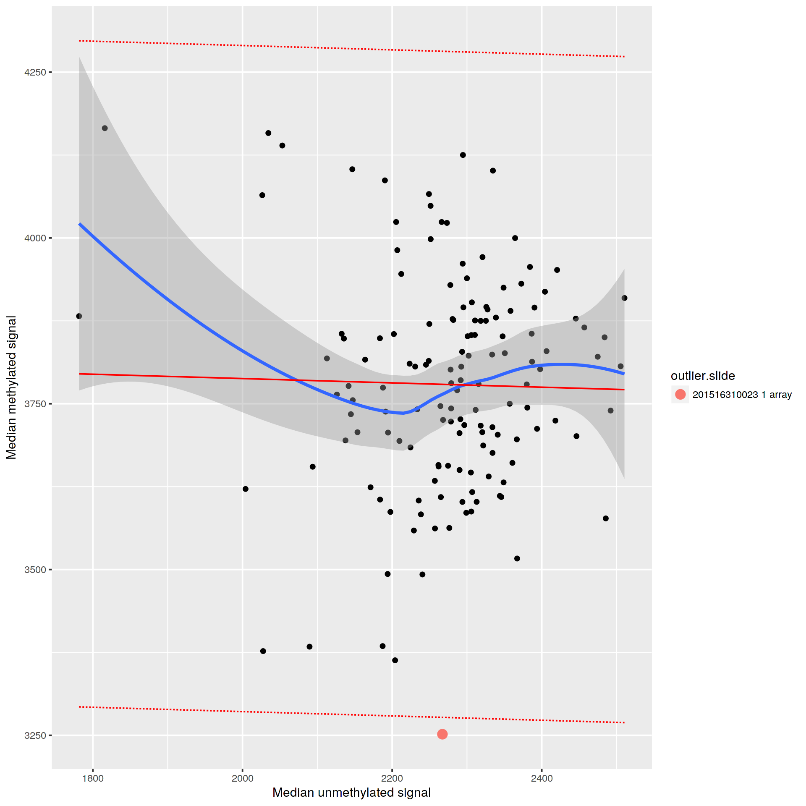
```
(ref:MAVIDOSqcEPICmethVsUnmeth-Cap) Median methylated signal vs unmethylated signal per sample for the EPIC array data, solid red line indicates linear regression of median methylated signal vs median unmethylated signal with dotted red lines representing $3\sigma$ from the expected mean. Samples outside the expected range are indicated in the legend. Plot generated by meffil QC report.

```{r MAVIDOSqcEPICpropSites, fig.cap='(ref:MAVIDOSqcEPICpropSites-Cap)', out.width='80%', fig.align = 'center', fig.show='hold', echo=FALSE}
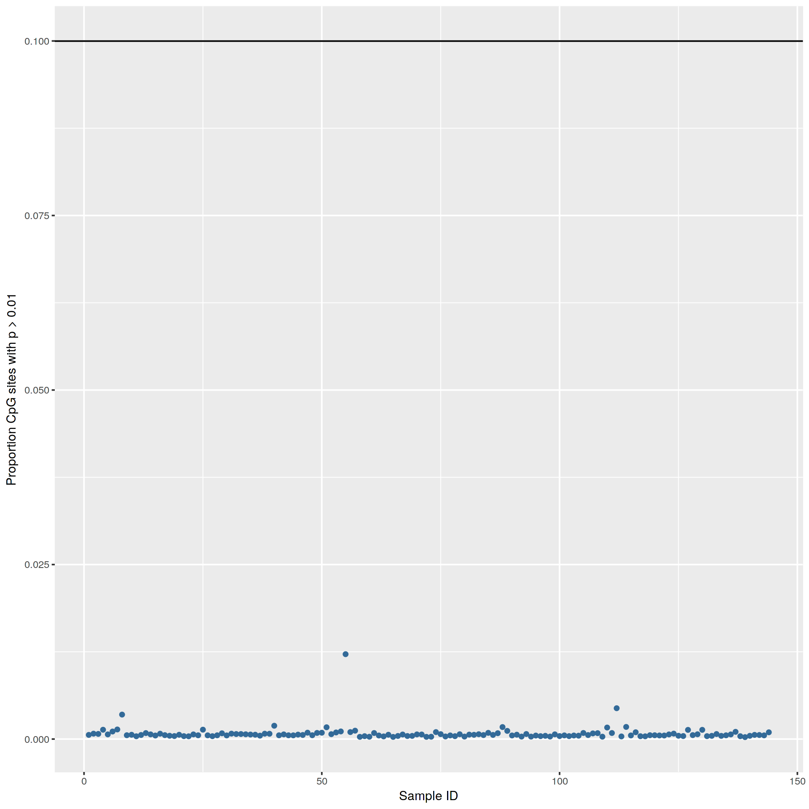
```
(ref:MAVIDOSqcEPICpropSites-Cap) Proportion of probes with detection p-values >0.01 by sample for the EPIC array data. Black line indicates the exclusion threshold of 0.1. Plot generated by meffil QC report.

```{r MAVIDOSqcEPICbeadNum, fig.cap='(ref:MAVIDOSqcEPICbeadNum-Cap)', out.width='80%', fig.align = 'center', fig.show='hold', echo=FALSE}
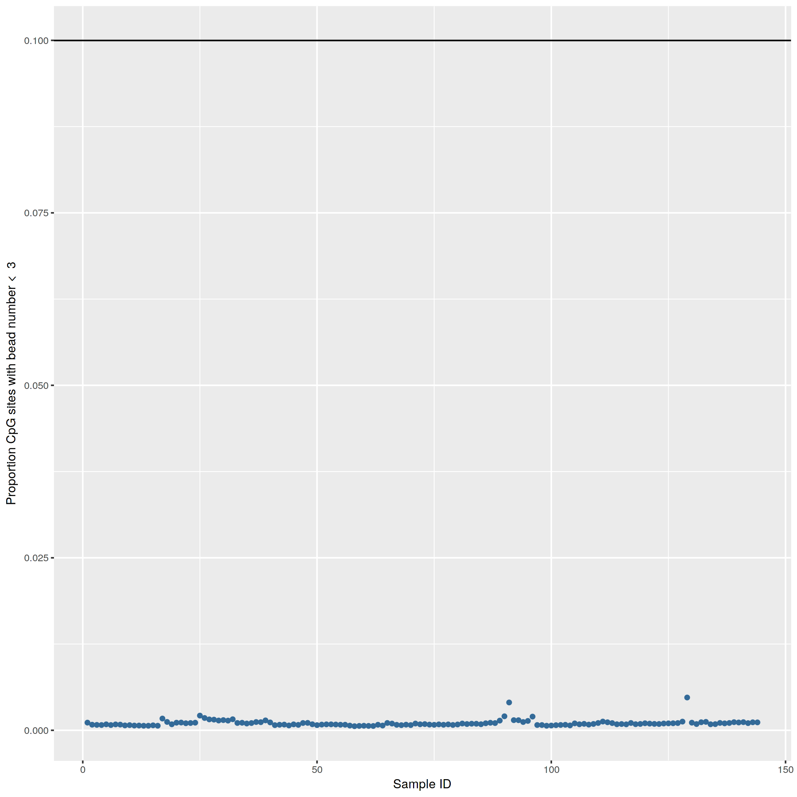
```
(ref:MAVIDOSqcEPICbeadNum-Cap) Proportion of probes with a bead count of < 3 by sample for the EPIC array data. 
Black line indicates the exclusion threshold of 0.1. 
Plot generated by meffil QC report.

##### 450k Arrays

There were no mismatches between predicted and annotated sex (Figure \@ref(fig:MAVIDOSqc450ksexMismatch)). 
There were not any samples with outliers in their methylated / unmethylated probe proportions (Figure \@ref(fig:MAVIDOSqc450kmethVsUnmeth)). 
No samples were excluded for having a higher than expected proportion of undetected probes (proportion of probes with detection p-value > 0.01 is > 0.1), (Figure \@ref(fig:MAVIDOSqc450kpropSites)). 
No samples were excluded for having a high proportion of probes with low bead counts (proportion of probes with bead number < 3 is > 0.1), (Figure \@ref(fig:MAVIDOSqc450kbeadNum)).

```{r MAVIDOSqc450ksexMismatch, fig.cap='(ref:MAVIDOSqc450ksexMismatch-Cap)', out.width='80%', fig.align = 'center', fig.show='hold', echo=FALSE}
knitr::include_graphics("figs/MAVIDOSqc450ksexMismatch.png")
```
(ref:MAVIDOSqc450ksexMismatch-Cap) Predicted sex of each sample based on the sex chromosome copy numbers infered from probe intensities for the 450k array data. No predicted sex values differ from their annotions. Plot generated by meffil QC report.

```{r MAVIDOSqc450kmethVsUnmeth, fig.cap='(ref:MAVIDOSqc450kmethVsUnmeth-Cap)', out.width='80%', fig.align = 'center', fig.show='hold', echo=FALSE}
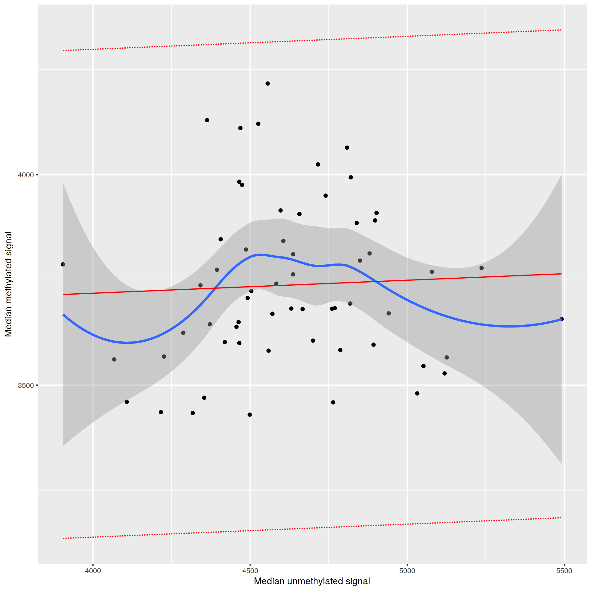
```
(ref:MAVIDOSqc450kmethVsUnmeth-Cap) Median methylated signal vs unmethylated signal per sample for the 450k array data, solid red line indicates linear regression of median methylated signal vs median unmethylated signal with dotted red lines representing $3\sigma$ from the expected mean. Samples outside the expected range would be indicated in the legend. Plot generated by meffil QC report.

```{r MAVIDOSqc450kpropSites, fig.cap='(ref:MAVIDOSqc450kpropSites-Cap)', out.width='80%', fig.align = 'center', fig.show='hold', echo=FALSE}
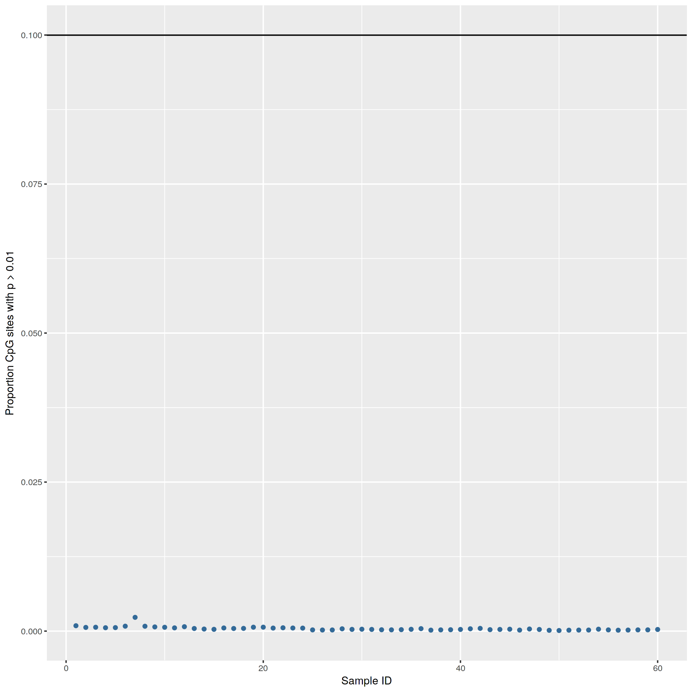
```
(ref:MAVIDOSqc450kpropSites-Cap) Proportion of probes with detection p-values >0.01 by sample for the 450k array data. Black line indicates the exclusion threshold of 0.1. Plot generated by meffil QC report.

```{r MAVIDOSqc450kbeadNum, fig.cap='(ref:MAVIDOSqc450kbeadNum-Cap)', out.width='80%', fig.align = 'center', fig.show='hold', echo=FALSE}
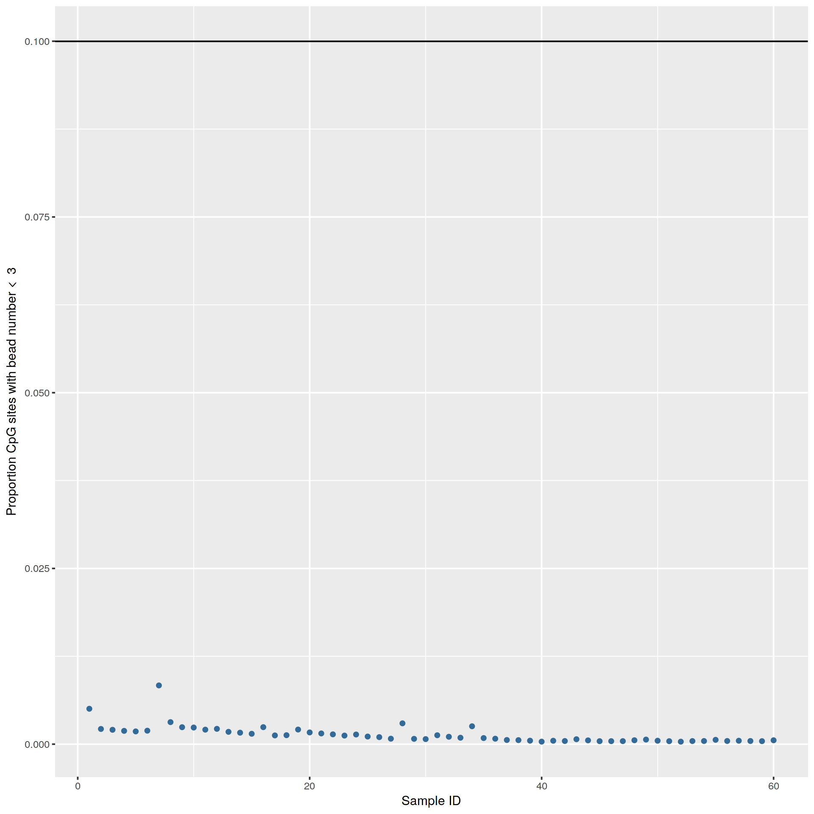
```
(ref:MAVIDOSqc450kbeadNum-Cap) Proportion of probes with a bead count of < 3 by sample for the 450k array data. 
Black line indicates the exclusion threshold of 0.1. 
Plot generated by meffil QC report.

#### Probe QC

##### Probe QC - EPIC Arrays

###### Probe Quality

There were no outliers within the control probes Figure \@ref(fig:MAVIDOSqcEPICctrlProbes). 
1,626 probes were excluded for having high background signal in a high proportion of samples (proportion of samples with detection p-value > 0.01 is > 0.1), (Figure \@ref(fig:MAVIDOSqcEPICpropSamples)). 
162 probes were excluded for having low bead count in a high proportion of samples (proportion of samples with bead number < 3 is > 0.1), (Figure \@ref(fig:MAVIDOSqcEPICbeadNumAcross)). 
Probes with poor technical quality were excluded from the analysis prior to functional normalisation.

```{r MAVIDOSqcEPICctrlProbes, fig.cap='(ref:MAVIDOSqcEPICctrlProbes-Cap)', out.width='80%', fig.align = 'center', fig.show='hold', echo=FALSE}
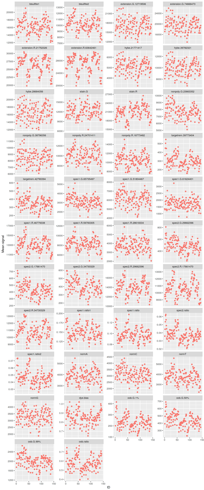
```
(ref:MAVIDOSqcEPICctrlProbes-Cap) Control probe signal by sample for each summary group for the EPIC data. 
Outliers would be circled in black. Plot generated by meffil QC report.

```{r MAVIDOSqcEPICpropSamples, fig.cap='(ref:MAVIDOSqcEPICpropSamples-Cap)', out.width='80%', fig.align = 'center', fig.show='hold', echo=FALSE}
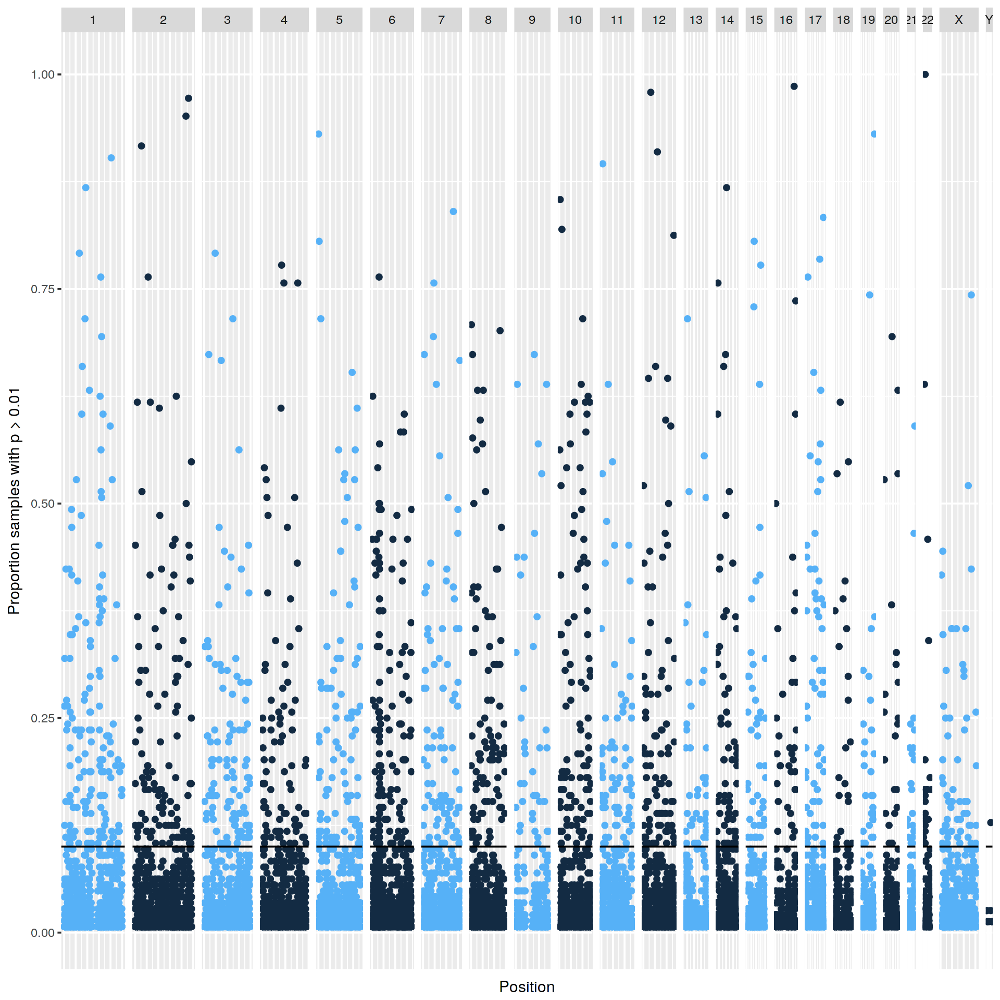
```
(ref:MAVIDOSqcEPICpropSamples-Cap) Undetectable probes across samples for EPIC data. Manhattan plot showing proportion of samples (y) in which a given probe (x) is not distinguishable from background noise, i.e. a detection p-value of > 0.01. Black line indicates the exclusion threshold of 0.1. Plot generated by meffil QC report.

```{r MAVIDOSqcEPICbeadNumAcross, fig.cap='(ref:MAVIDOSqcEPICbeadNumAcross-Cap)', out.width='80%', fig.align = 'center', fig.show='hold', echo=FALSE}
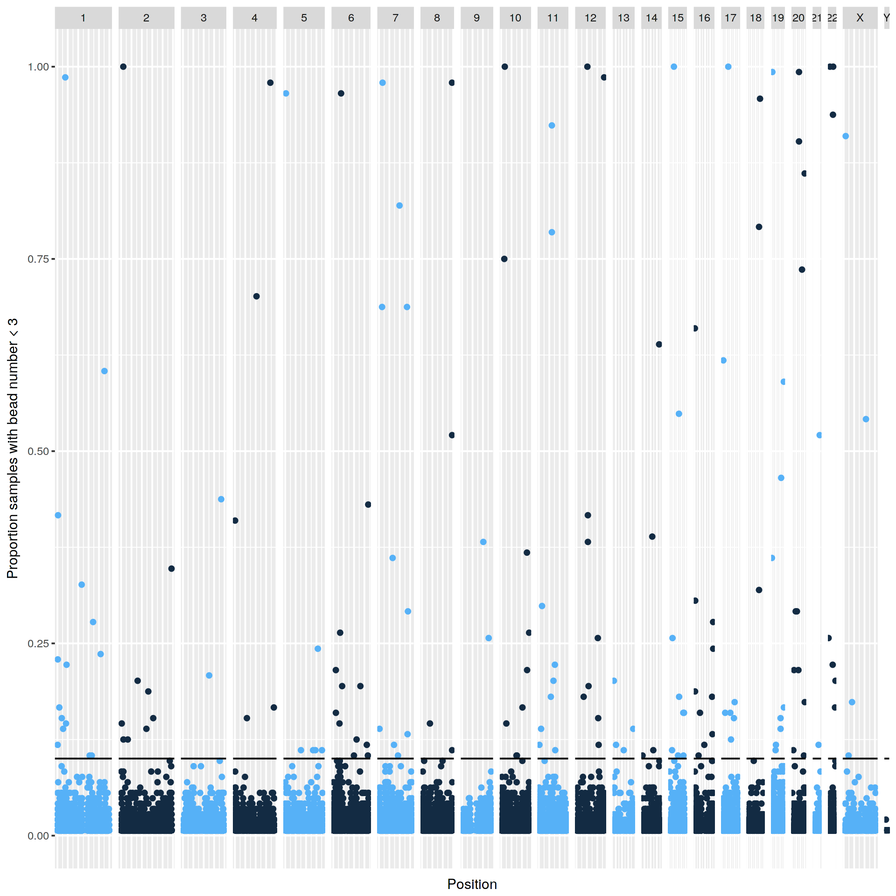
```
(ref:MAVIDOSqcEPICbeadNumAcross-Cap) Low bead count probes across samples for EPIC data. Manhattan plot showing the proportion of samples (y) in which a given probe (x) has a bead count of <3. Black line indicates the exclusion threshold of 0.1. Plot generated by meffil QC report.

###### Multi-mapping and Genetically Confounded Probes

Probes from different locations in the genome with similar sequences, especially following the reduction in sequence complexity associated with bisulfite conversion, can be cross-reactive on the arrays leading to erroneous signals and are thus commonly excluded from analysis. 
DNAm is often strongly influenced by genetic factors, the effect is especially pronounced when variants alter the sequence at CpG sites themselves as the site can then no longer be methylated. 
Thus, sites that have common genetic variants at the probe sites are also excluded from the analysis, as well as some sites whose methylation is known to be under strong genetic influence by common genetic variation.

43,254 probes on the EPIC array have been identified as multi-mapping, DNA binding to the probes may be derived from other locations in the genome invalidating these probes as a measure of methylation at their intended loci [@Pidsley2016]. 
12,510 probes were identified as having genetic variants at the CpG locus they are intending to assay, this can produce misleading results as mutant bases can resemble the products of bisulfite conversion [@Pidsley2016]. 
1,812 probes overlapping regions exhibiting haplotype-specific methylation associated with common non-SNP genetic variants (CNVs, Indels, STRs) and regional in-phase clustering of CpG-SNPs [@Bell2017a]. 
These were excluded from subsequent analysis after functional normalisation. 
This, including the poor quality probes, is a total of 57,396 unique probes excluded from the analysis (~6.62% of the total number of probes)

In order to identify any potential additional sources of genetic confounding, we looked for probes with methylation values which cluster into distinct groups using the 'gap hunting' method developed by @Andrews2016. 
Such distinct clusters of methylation can arise from genetic variants which influence methylation levels being present in homozygous and heterozygous forms in the study population, see Figure \@ref(fig:MAVIDOSgaphunterEgMonApr162018). 
As the sensitivity and specificity of 'gap hunting' is limited, it is the advice of the authors not to exclude probes flagged by 'gaphunter()' prior to performing EWAS. 
It is instead advised to check if any of the results appear in this list after the fact and proceed with caution if they are. 
Gap hunter identified a further 77,398 probes (8.9% of all probes) which might be subject to genetic confounding.

```{r MAVIDOSgaphunterEgMonApr162018, fig.cap='(ref:MAVIDOSgaphunterEgMonApr162018-Cap)', out.width='80%', fig.align = 'center', fig.show='hold', echo=FALSE}
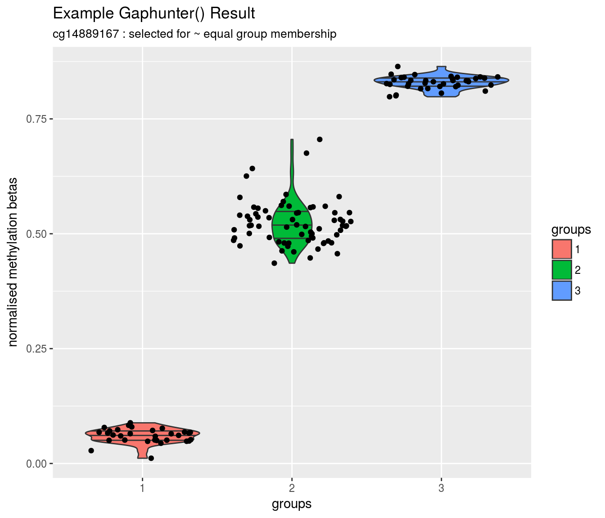
```
(ref:MAVIDOSgaphunterEgMonApr162018-Cap) An example of the DNAm distribution for a result from the 'gaphunter()' function. This is an example chosen to best exemplify the sort of result which is strongly suggestive of a genetic variant with an impact on methylation status acting on this site. It is unrepresentative of typical results from 'gaphunter()' in that the groups have a relatively even membership, many results have a small number of individuals in one or more groups making it hard to distinguish methylation outliers caused by rarer genetic variants from those with other causes.

##### Probe QC - 450k Arrays

###### Probe Quality

There was one sample (MAVIDOS ID 2183) with an outlier within the control probes, the 'stain.R' probe, (Figure \@ref(fig:MAVIDOSqc450kctrlProbes)). 
509 probes were excluded for having high background signal in a high proportion of samples (proportion of samples with detection p-value > 0.01 is > 0.1), (Figure \@ref(fig:MAVIDOSqc450kpropSamples)). 
1037 probes were excluded for having low bead count in a high proportion of samples (proportion of samples with bead number < 3 is > 0.1) (Figure \@ref(fig:MAVIDOSqc450kbeadNumAcross)).

```{r MAVIDOSqc450kctrlProbes, fig.cap='(ref:MAVIDOSqc450kctrlProbes-Cap)', out.width='80%', fig.align = 'center', fig.show='hold', echo=FALSE}
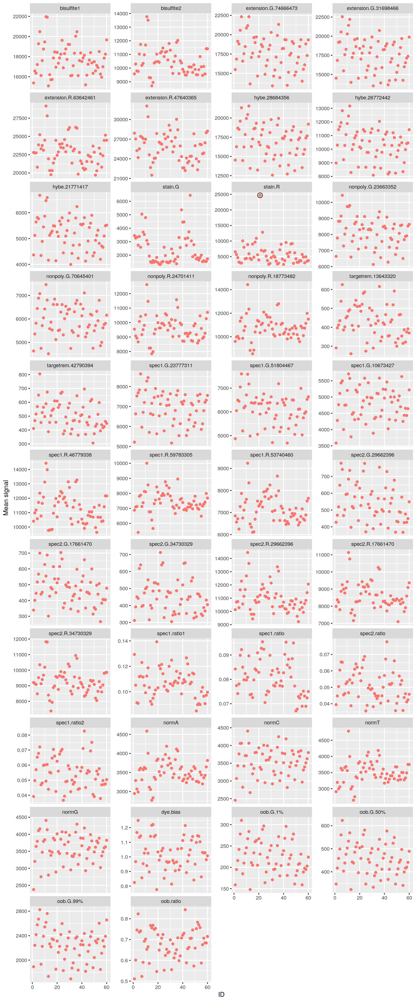
```
(ref:MAVIDOSqc450kctrlProbes-Cap) Control probe signal by sample for each summary group for the 450k data. Outliers would be circled in black. Plot generated by meffil QC report.

```{r MAVIDOSqc450kpropSamples, fig.cap='(ref:MAVIDOSqc450kpropSamples-Cap)', out.width='80%', fig.align = 'center', fig.show='hold', echo=FALSE}
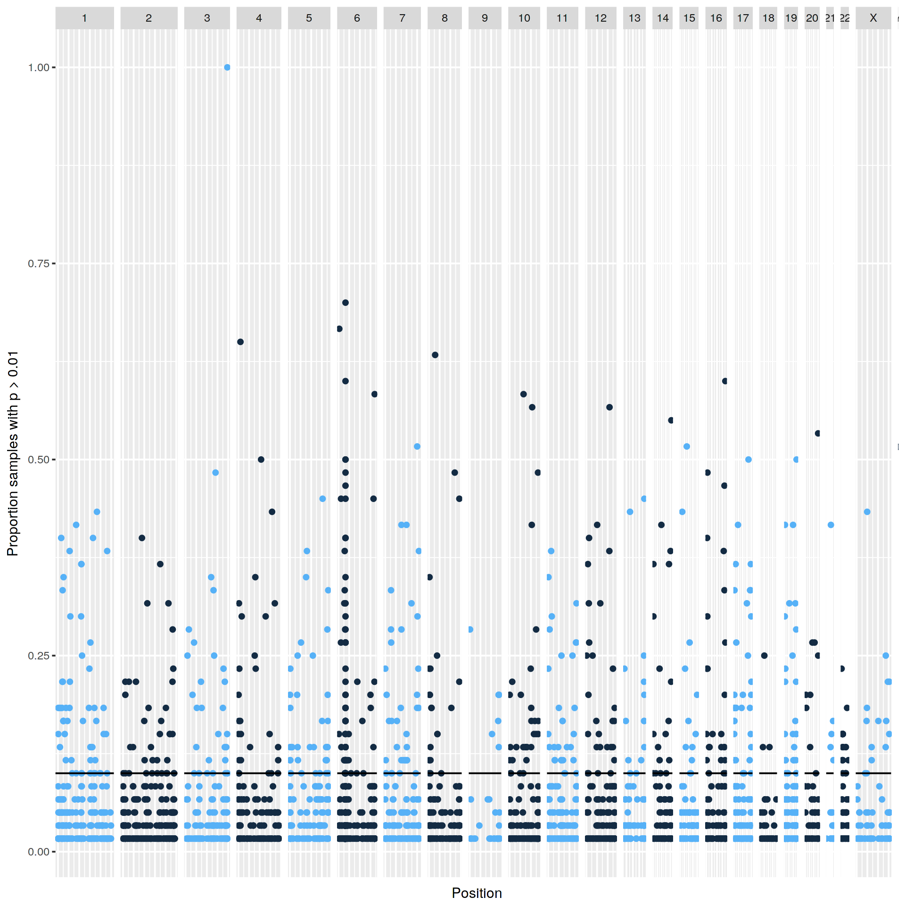
```
(ref:MAVIDOSqc450kpropSamples-Cap) Undetectable probes across samples for 450k data. Manhattan plot showing proportion of samples (y) in which a given probe (x) is not distinguishable from background noise, i.e. a detection p-value of > 0.01. Black line indicates the exclusion threshold of 0.1. Plot generated by meffil QC report.

```{r MAVIDOSqc450kbeadNumAcross, fig.cap='(ref:MAVIDOSqc450kbeadNumAcross-Cap)', out.width='80%', fig.align = 'center', fig.show='hold', echo=FALSE}
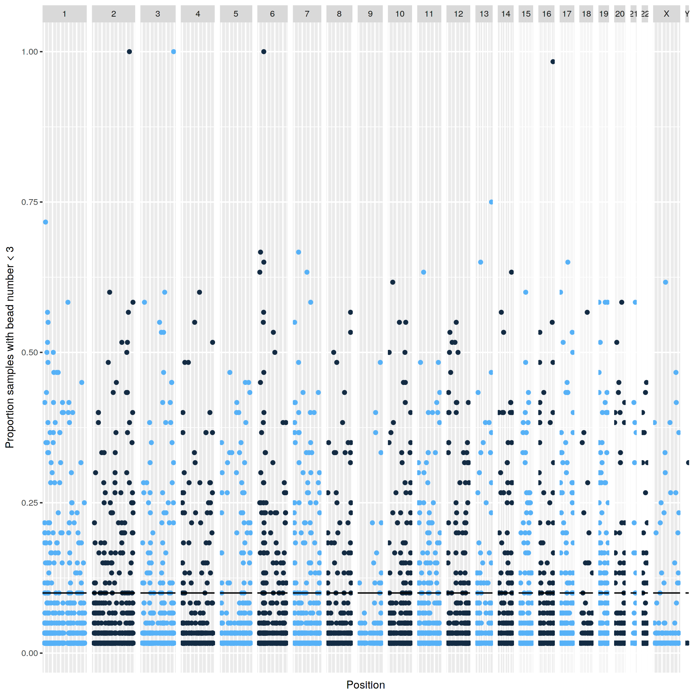
```
(ref:MAVIDOSqc450kbeadNumAcross-Cap) Low bead count probes across samples for 450k data. Manhattan plot showing the proportion of samples (y) in which a given probe (x) has a bead count of <3. Black line indicates the exclusion threshold of 0.1. Plot generated by meffil QC report.

###### Multi-mapping and Genetically Confounded Probes

@Zhou2017 provided a list of probes which they recommend 'masking' from the 450k array due to, multi-mapping issues, genetic variants overlapping the CpG sites and other factors which may render results from these probes problematic. 
All probes on this list were excluded from the analysis following functional normalisation, leaving a total of 418,632 probes for subsequent analysis.

### Functional Normalisation

An *m* of 6 was chosen for the EPIC arrays as this value produced the last steep drop in residual variation, see Figure \@ref(fig:MAVIDOSfunnormPCsEPICMonApr162018). 
An *m* of 6 was chosen for the 450k arrays as this value produced the last steep drop in residual variation, see Figure \@ref(fig:MAVIDOSfunnormPCs450kMonApr162018).

```{r MAVIDOSfunnormPCsEPICMonApr162018, fig.cap='(ref:MAVIDOSfunnormPCsEPICMonApr162018-Cap)', out.width='80%', fig.align = 'center', fig.show='hold', echo=FALSE}
knitr::include_graphics("figs/MAVIDOSfunnormPCsEPICMonApr162018.png")
```
(ref:MAVIDOSfunnormPCsEPICMonApr162018-Cap) Residual variation remaining after functional normalisation of the top 20,000 most variable probes with *m* PCs from the control probe summary matrices for the EPIC array samples (n=137), for M = methylated and U = unmethylated probes.

```{r MAVIDOSfunnormPCs450kMonApr162018, fig.cap='(ref:MAVIDOSfunnormPCs450kMonApr162018-Cap)', out.width='80%', fig.align = 'center', fig.show='hold', echo=FALSE}
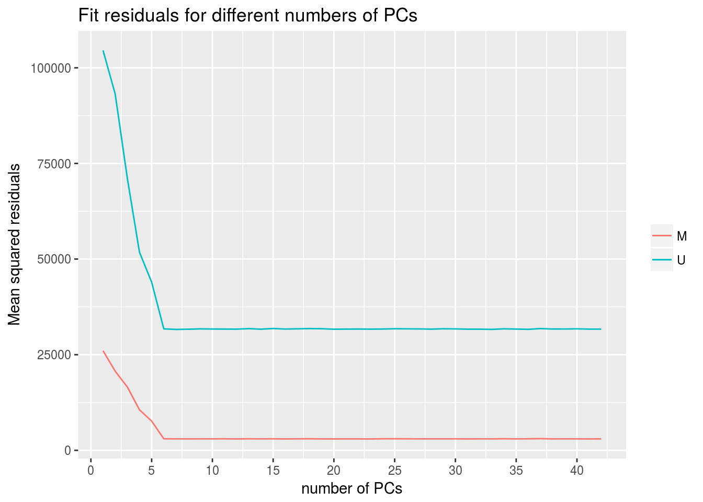
```
(ref:MAVIDOSfunnormPCs450kMonApr162018-Cap) Residual variation remaining after functional normalisation of the top 20,000 most variable probes with *m* PCs from the control probe summary matrices for the 450k array samples (n=60), for M = methylated and U = unmethylated probes.

### EWASs

#### Neonatal Bone Mineral Content

No probes fell below the Bonferroni corrected significance threshold for an association between DNAm at that locus and neonatal bone mineral content, Figure \@ref(fig:MAVIDOSbmcEPICewasManhattanSVA).

```{r MAVIDOSbmcEPICewasManhattanSVA, fig.cap='(ref:MAVIDOSbmcEPICewasManhattanSVA-Cap)', out.width='80%', fig.align = 'center', fig.show='hold',  echo=FALSE}
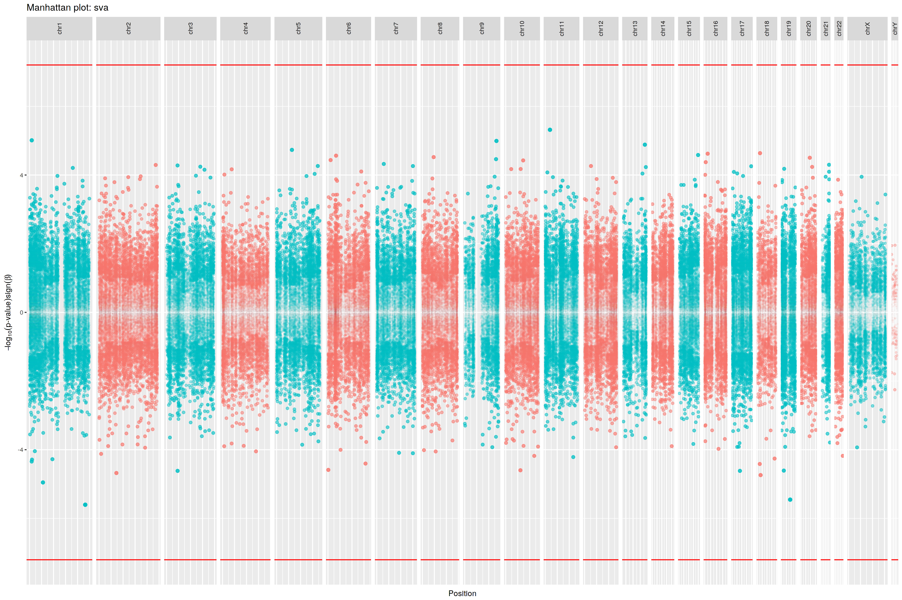
```
(ref:MAVIDOSbmcEPICewasManhattanSVA-Cap) Results of EWAS for neonatal bone mineral content with SVA model. Bidirectional Manhattan plot on which $-log_{10}(p-value)$ is plotted on the y axis and the sign of this value represents the direction of change. Size and transparency of points increases with $-log_{10}(p-value)$ such that the most significant probes are represented the largest and least transleucent points. x axis represent chromosomes and position thereupon. Red line indicates the significance threshold of $6.18\times10^{-8}~(0.05\div808,585)$  

#### Intervention / Placebo

No probes fell below the Bonferroni corrected significance threshold for an association between DNAm at that locus and Intervention/placebo group status, Figure \@ref(fig:MAVIDOSccEPICewasManhattanSVA).

```{r MAVIDOSccEPICewasManhattanSVA, fig.cap='(ref:MAVIDOSccEPICewasManhattanSVA-Cap)', out.width='80%', fig.align = 'center', fig.show='hold', echo=FALSE}
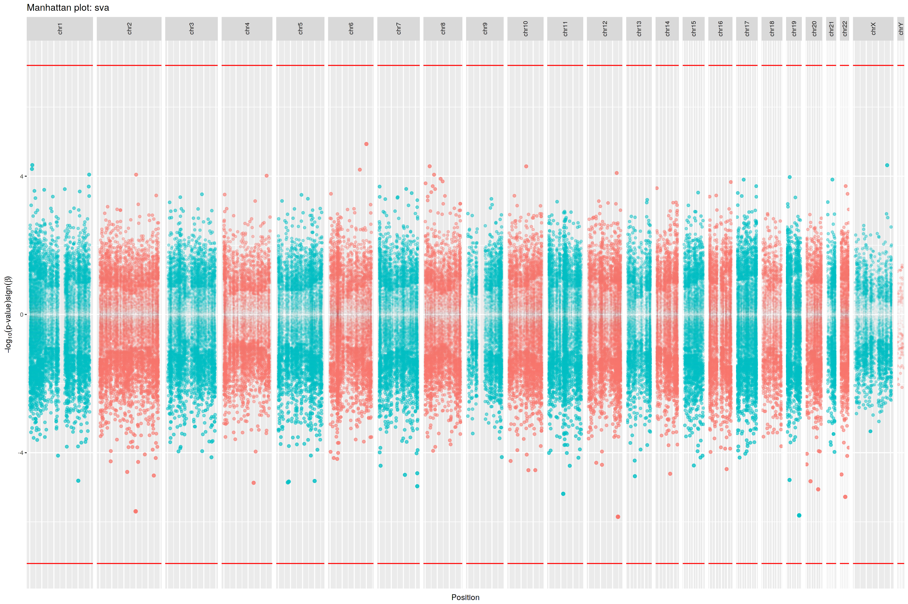
```
(ref:MAVIDOSccEPICewasManhattanSVA-Cap) Results of EWAS for intervention/placebo group status with SVA model. Bidirectional Manhattan plot on which $-log_{10}(p-value)$ is plotted on the y axis and the sign of this value represents the direction of change. Size and transparency of points increases with $-log_{10}(p-value)$ such that the most significant probes are represented the largest and least transleucent points. x axis represent chromosomes and position thereupon. Red line indicates the significance threshold of $6.18\times10^{-8}~(0.05\div808,585)$ 

#### Maternal Vitamin D (34wks)

Maternal Vitamin D levels remain substantially overlapping between intervention and placebo groups at 34wks, see Figure \@ref(fig:MAVIDOSvitDviolinMonApr162018). 
Thus maternal vitamin D at 34wks may prove a more useful variable to model than intervention/placebo status. 
No probes fell below the Bonferroni corrected significance threshold for an association between DNAm at that locus and maternal vitamin D levels at 34wks gestation, (Figure \@ref(fig:MAVIDOSmVitD34EPICewasManhattanSVA)).

```{r MAVIDOSvitDviolinMonApr162018, fig.cap='(ref:MAVIDOSvitDviolinMonApr162018-Cap)', out.width='80%', fig.align = 'center', fig.show='hold', echo=FALSE}
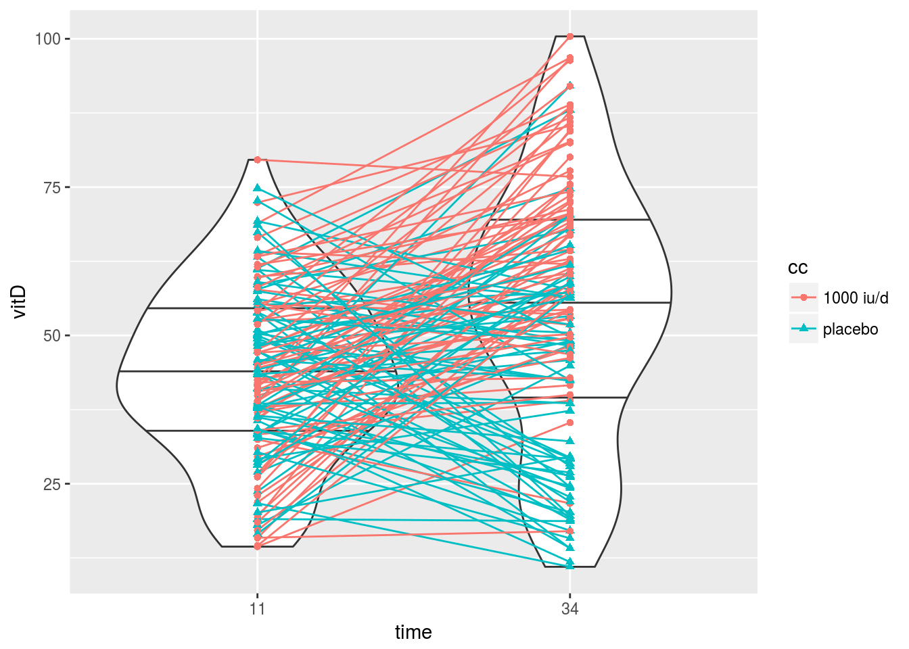
```
(ref:MAVIDOSvitDviolinMonApr162018-Cap) Maternal Vitamin D levels at 11 and 34wks gestation, supplemtation with 1000 IU/day cholecalciferol began at week 14. Each participant is shown at both time points linked by a line to indicate the direction of change. The violin plots indicate the density of the distribution of vitamin D values at each time point with the $25^{th}$, $50^{th}$, $75^{th}$ quantiles indicated with horizontal black lines. The colour indicates Intervention (Red) / Placebo (Blue) group

```{r MAVIDOSmVitD34EPICewasManhattanSVA, fig.cap='(ref:MAVIDOSmVitD34EPICewasManhattanSVA-Cap)', out.width='80%', fig.align = 'center', fig.show='hold', echo=FALSE}
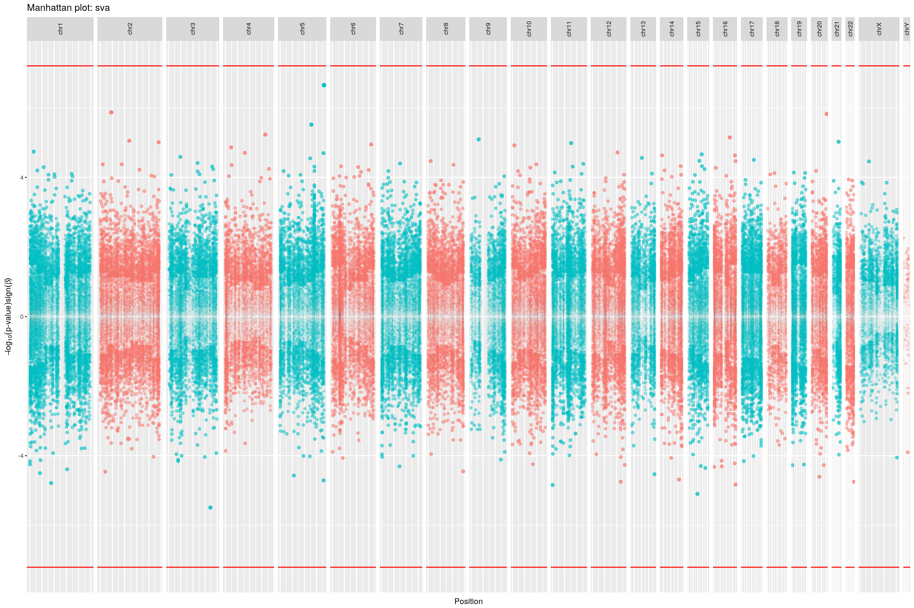
```
(ref:MAVIDOSmVitD34EPICewasManhattanSVA-Cap) Results of EWAS for maternal vitamin D levels at 34wks gestation with SVA model. Bidirectional Manhattan plot on which $-log_{10}(p-value)$ is plotted on the y axis and the sign of this value represents the direction of change. Size and transparency of points increases with $-log_{10}(p-value)$ such that the most significant probes are represented the largest and least transleucent points. x axis represent chromosomes and position thereupon. Red line indicates the significance threshold of $6.18\times10^{-8}~(0.05\div808,585)$ 

#### Change in Maternal Vitamin D

No probes fell below the Bonferroni corrected significance threshold for an association between DNAm at that locus and change in maternal vitamin D from 11 to 34wks gestation, Figure \@ref(fig:MAVIDOSdifVDEPICewasManhattanSVA).

```{r MAVIDOSdifVDEPICewasManhattanSVA, fig.cap='(ref:MAVIDOSdifVDEPICewasManhattanSVA-Cap)', out.width='80%', fig.align = 'center', fig.show='hold', echo=FALSE}
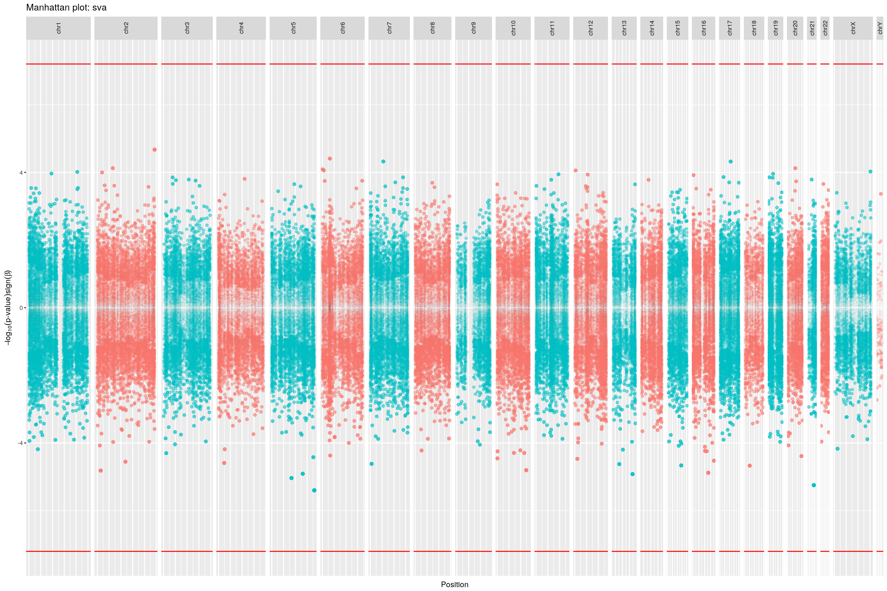
```
(ref:MAVIDOSdifVDEPICewasManhattanSVA-Cap) Results of EWAS for Change in maternal vitamin D levels from 11 to 34wks gestation with SVA model. Bidirectional Manhattan plot on which $-log_{10}(p-value)$ is plotted on the y axis and the sign of this value represents the direction of change. Size and transparency of points increases with $-log_{10}(p-value)$ such that the most significant probes are represented the largest and least transleucent points. x axis represent chromosomes and position thereupon. Red line indicates the significance threshold of $6.18\times10^{-8}~(0.05\div808,585)$ 

### !!! keep? Concordance of EPIC and 850k EWAS results !!!

In order to ascertain if the results from the EWAS in the 450k and EPIC arrays were producing similar sets of probes in the top ranking positions when ordered by p-value the concordance (% overlap) between the top k probes, where k = 1 .. 
100,000 was calculated. 
Only probes in common between the two arrays were used and k was incremented in steps of 50.

Concordance between the rankings of probes would suggest that the EWAS may be capturing a 'real' signal that is simply below the significance threshold with the statistical sensitivity/power that is available in this dataset. 
The concordance between the EPIC and 450k datasets (Figures \@ref(fig:EPIC450kEWASconcordMAVIDOSMonApr162018) & \@ref(fig:EPIC450kEWASconcordMAVIDOSMonApr162018zoom)) appears to be at roughly the level expected by chance. 
This does not lend support to the possibility that there are associations between the variables of interest and DNAm that are beneath the current sensitivity of the study, it does not, however, rule this out. 
In the absence of any probes above the significance threshold and with poor concordance between the 450k and EPIC array p-value rankings no further analyses such as gene set enrichment and differentially methylated region (DMR) calling have been carried out at this time.

```{r EPIC450kEWASconcordMAVIDOSMonApr162018, fig.cap='(ref:EPIC450kEWASconcordMAVIDOSMonApr162018-Cap)', out.width='80%', fig.align = 'center', fig.show='hold', echo=FALSE}
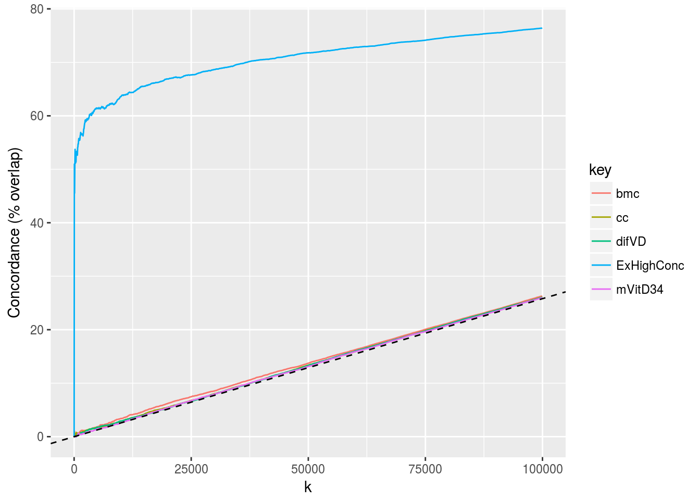
```
(ref:EPIC450kEWASconcordMAVIDOSMonApr162018-Cap) Concordance between the top 100,000 probes in common between the EWASs run on the EPIC (n=137) and 405k (n=60) data sets. bmc = bone mineral content, cc = Intervention / Placebo, difVD = Chance in Vitamin D from 11 to 34wks, ExHighConc = Example of High Concordance generated using SVA vs iSVA results for the 450k intervention/placebo EWAS. Dotted line denotes concorcance expected by chance (intersects 50% at 387,511, the number of shared probes)

```{r EPIC450kEWASconcordMAVIDOSMonApr162018zoom, fig.cap='(ref:EPIC450kEWASconcordMAVIDOSMonApr162018zoom-Cap)', out.width='80%', fig.align = 'center', fig.show='hold', echo=FALSE}
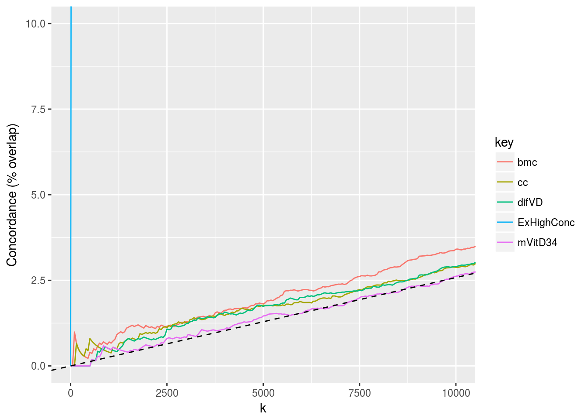
```
(ref:EPIC450kEWASconcordMAVIDOSMonApr162018zoom-Cap) Concordance between the top 10,000 probes in common between the EWASs run on the EPIC (n=137) and 405k (n=60) data sets. bmc = bone mineral content, cc = Intervention / Placebo, difVD = Chance in Vitamin D from 11 to 34wks, ExHighConc = Example of High Concordance generated using SVA vs iSVA results for the 450k intervention/placebo EWAS. Dotted line denotes concorcance expected by chance (intersects 50% at 387,511, the number of shared probes)

## !!SWS/New MAVIDOS EWAS!!

### 

## Discussion

We have not been able to detect any changes in DNA methylation associated with, neonatal bone mineral content, maternal vitamin D at 34wks gestation, change in maternal vitamin D from 11 to 34wks gestation or intervention/placebo group membership. 
However, at this juncture, we lack the necessary statistical power to rule out the presence of such changes, at effect sizes which may be biologically relevant. 
EWAS have identified biologically relevant changes associated with environmental exposures in DNAm with magnitudes of less than a single percentage point, and percentage changes in the low single digits are not uncommon in EWAS [@Breton2017]. 
To achieve 80% power for the 450k array to detect moderate effect sizes (Cohen's f2 = 0.15) requires >300 samples, to do so with small effect sizes (Cohen's f2 = 0.02) requires >2500 samples, the additional multiple testing correction introduced when using the ~850k sites on the EPIC array increases these sample size requirements still further [@Cohen1988].

Previous studies have found relationships between bone outcomes in childhood and later life rather than in neonates, we may see an association between DNAm and bone outcomes at subsequent time points.

The EPIC array covers many regions not present on the 450k array, in particular, EPIC covers many additional enhancer regions. 
The lack of concordance between the EPIC and 450k data applies only to those sites that are present on both arrays. 
Thus, there may be results on the 850k array which are at present false negatives due to the lack of statistical power to detect them but which would have consistently highly ranked p-values were we able to compare them to an additional set of EPIC data. 


### Future Work

We are intending to repeat this analysis with additional samples to increase the power. 
In addition, we may be getting data on the cord blood vitamin D levels corresponding to our samples, as the EWAS for maternal vitamin D levels at 34wks produced some of the lowest p-values we reason that a more direct measure of vitamin D levels for the sample in question may yield stronger results. 
We intend to alter the model construction for subsequent analyses to bring the covariates included in line with those used in other analyses performed on MAVIDOS data, for example including gestational age. 
We also intend to combine the EPIC and 450k array data and perform an analysis with all the available data to maximise the power.

At present we likely have insufficient power to perform EWAS on subsets, e.g. 
only births in a particular season as seasonal is know to impact Vitamin D levels [@Sachs2013]. 
It may also be instructive to compare the concordance of results of the four EPIC array for which there are technical replicates to see if there is agreement between these replicates, despite the small size of this group. 
It would also be interesting to check if any of the CpGs in *CDKN2A* identified as correlating with bone outcomes are present on the arrays and possibly to perform a power analysis to ascertain if we would have predicted that we would be able to replicate these findings with this data.

The effect of maternal smoking on cord blood methylation is a very strong and well established EWAS result [@Joubert2016,@Breton2017]. 
We have maternal smoking data so it would be interesting to see if we can recapitulate the smoking EWAS result in cord tissue.

#### !!! never look at gestational age __ DNA Methylation Age analyses

> Epigenetic clocks for gestational age have been developed [@Bohlin2016; @Knight2016] but their estimates did not correlate as well with gestational age in a replication set [@Simpkin2017a]. 
This was potentially due to a bias towards pre-term infants in the initial training set which was quite small. 
They were initially trained on cord blood and not cord tissue samples, we intend to assess their effectiveness at predicting gestational age in our cord tissue dataset. 
DNAm age estimates at birth with Horvath's clocks have minimal correlations with gestational age at delivery [@Simpkin2016; @Simpkin2017], we also intend to attempt to replicate this finding. 
Once the PhenoAge calculator becomes available we also intend to assess if PhenoAge is similarly uncorrelated with gestational age [@Levine2018]. 
Another potentially interesting question is if there is any association with any of the epigenetic age estimates and bone outcomes.
