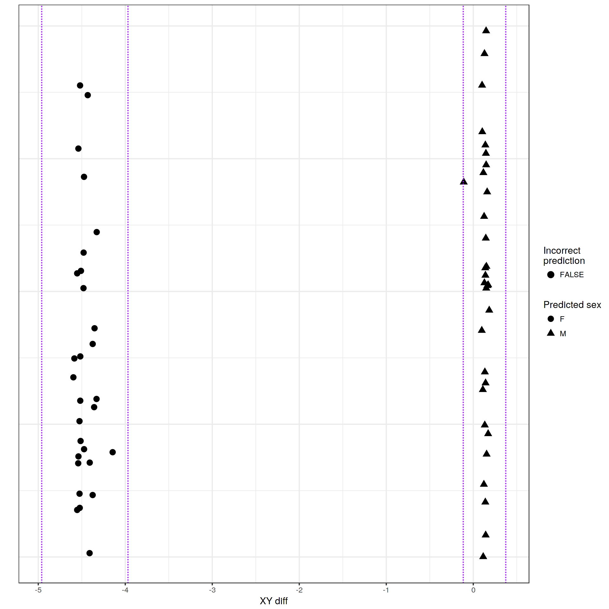
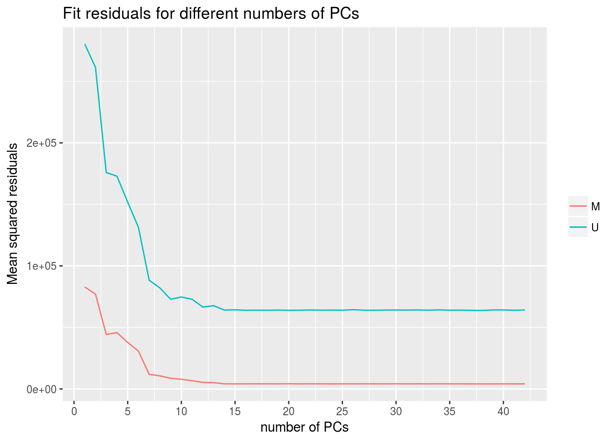
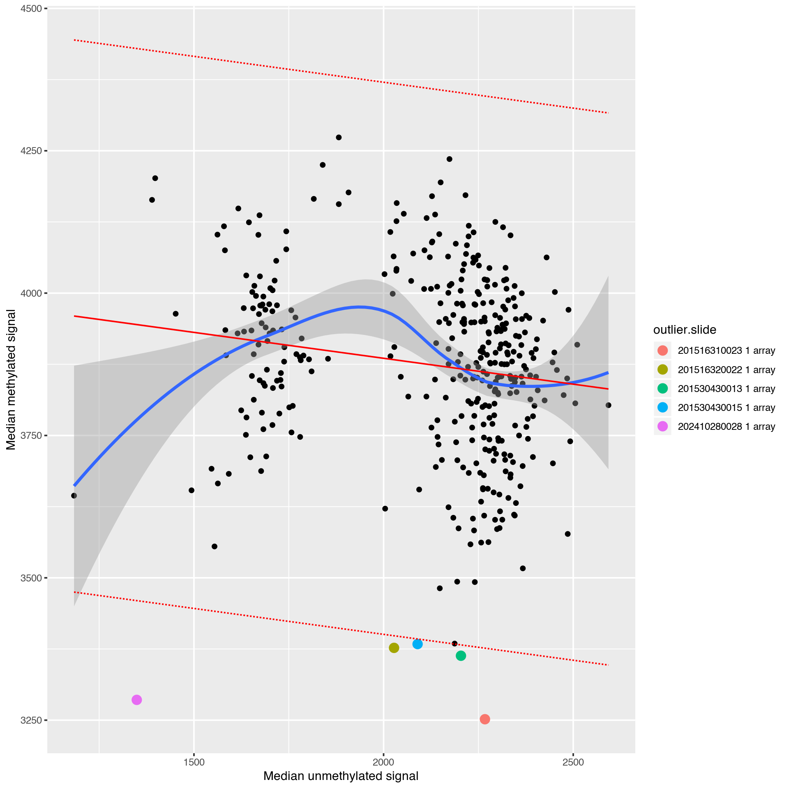
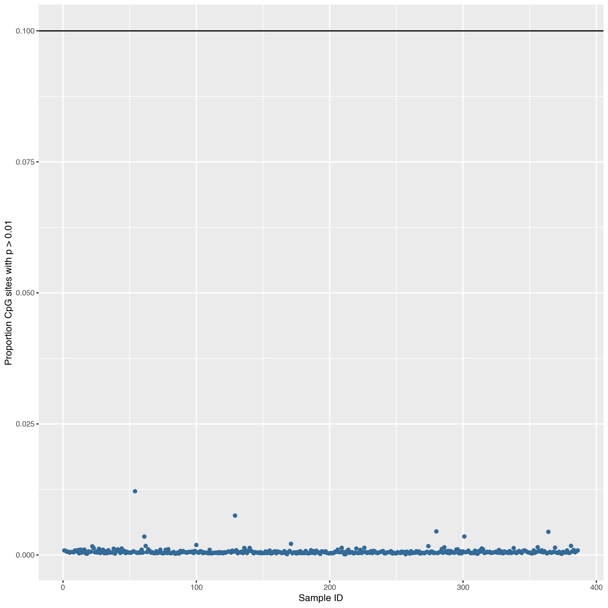
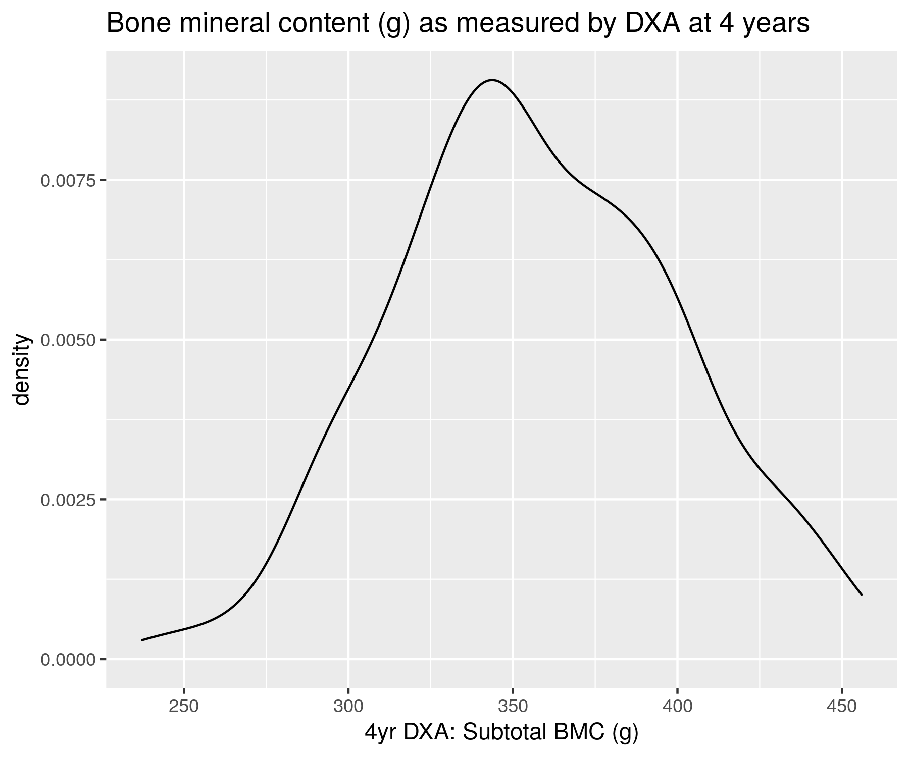
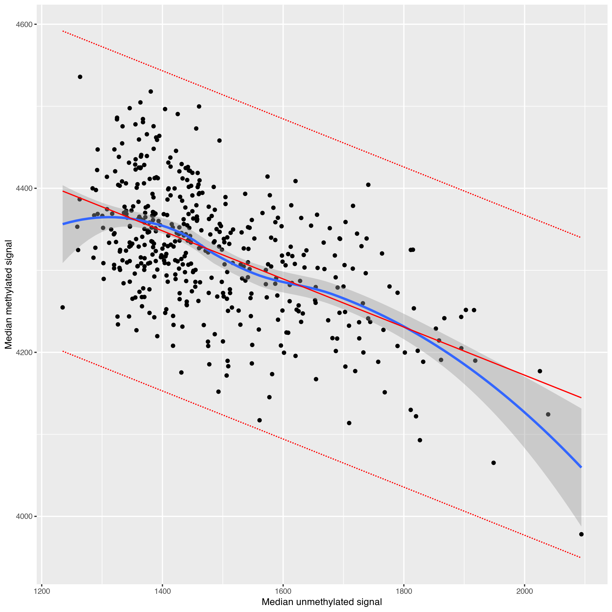
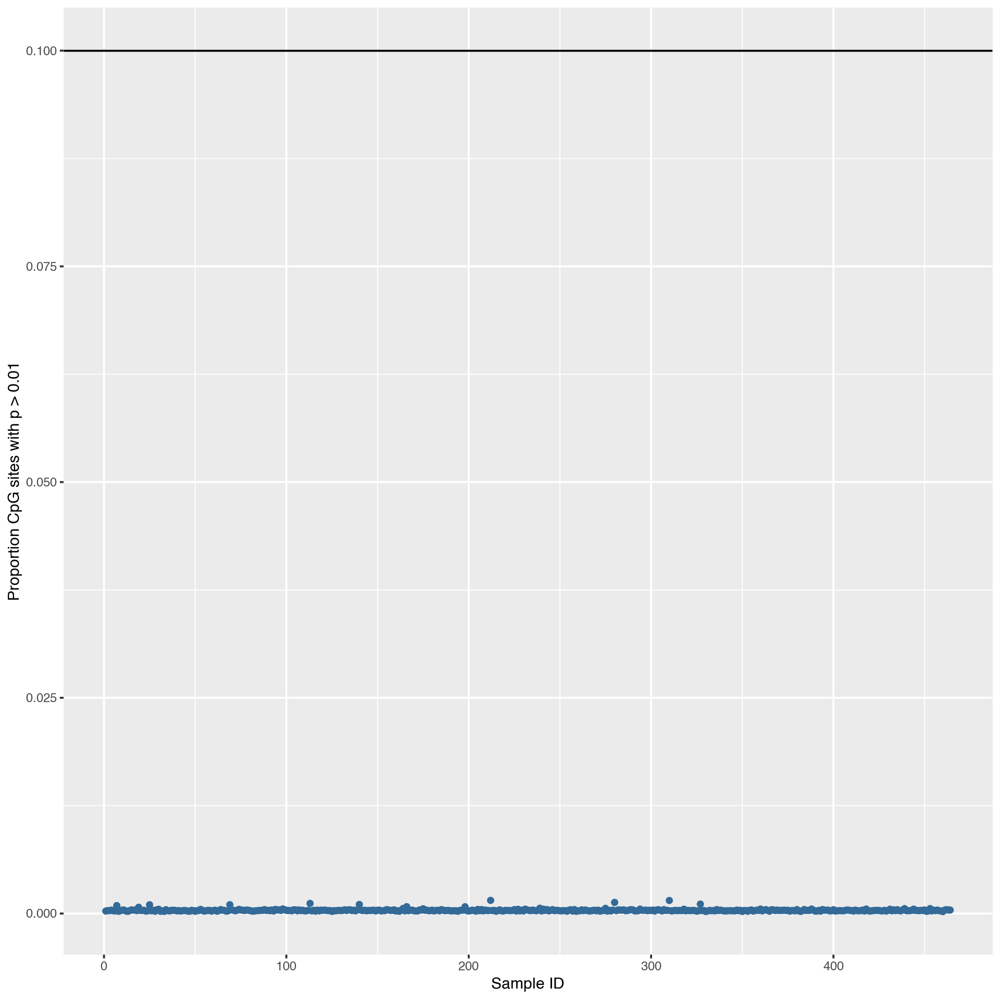
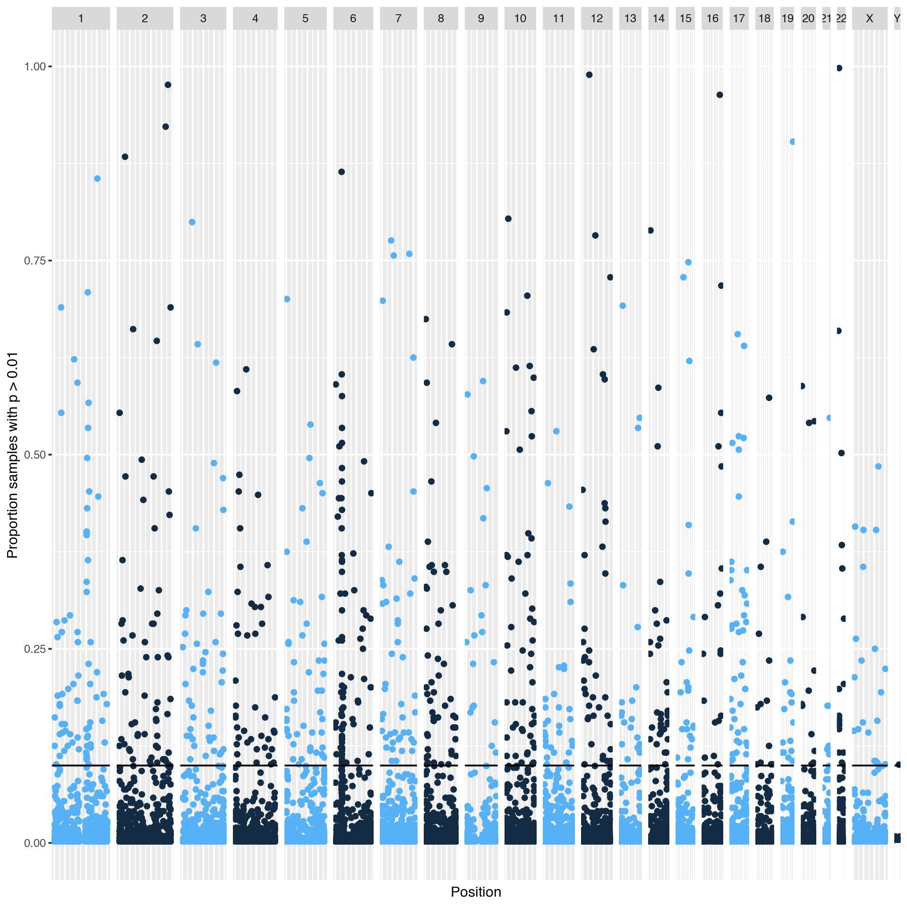

# Results 1 - Epigenome Wide Association Studies for Bone Health Outcomes in Umbilical Cord Blood and Tissue {#arrays}

## Abstract

Long term bone health and fracture risk is strongly influenced by the peak bone mass that is attained in early adulthood, this has its origins in development from late pregnancy trough early childhood.
Vitamin D availability to facilitate the uptake of calcium and phosphate is essential to healthy bone development, in addition to the role of vitamin D as a hormone mediating this process.
Greater mechanistic understanding of this process is desirable to permit the design of more effective interventions to reduce the substantial health burden of osteoporotic fractures in the elderly.
Maternal vitamin D levels during pregnancy have previously been shown to impact on the methylation status of specific genes associated with vitamin D signalling and metabolism, such as *RXRA*. 
Long-term bone health outcomes have also been associated with both maternal vitamin D during pregnancy and methylation of the *CDKN2A* gene. 
To attempt to identify other loci the epigenetic regulation of which is pertinent to the impact of maternal vitamin D levels on long-term bone health Epigenome-Wide Association Studies (EWAS) were performed with DNA methylation data from the Illumina EPIC & 450k methylation bead chip arrays.
We tentatively identify two CpGs whose DNA methylation state is associated with bone mineral content at 6 years of age and periosteal circumference at 6 years of age respectively.

## Introduction

In England and Wales a survey of general practice data indicates that 53% of women and 21% of men will experience a bone fracture in their remaining lifetime from the age of 50 years [@VanStaa2001] (Figure \@ref(fig:VanStaa2001)).
Hip fractures in particular are associated with a reduction in survival of an estimated 10-20% with most deaths occurring in the first 6 months, vertebral fractures though approximately an order of magnitude less common carry a similar mortality risk [@VanStaa2001; @Streubel2011].
The national osteoporosis foundation estimated the societal cost of osteoporosis at 58 Billion USD for 2018 in the USA alone [@Thompson2018] with serious negative implications for the quality of life of those with this condition.
Thus interventions to increase bone health and reduce the rate of osteoporosis as well as developing a mechanistic understanding of the development of this condition are of considerable medical interest.

```{r VanStaa2001, fig.cap='(ref:VanStaa2001-Cap)', out.width='80%', fig.align = 'center', fig.show='hold', echo=FALSE}
knitr::include_graphics("figs/adapted_from_VanStaa2001_Fig1-2.png")
```
(ref:VanStaa2001-Cap) __Overall Fracture Incidence Increases With Age__ Data from 5 million adults in the General Practice Research Database 1988-1998. __A__ Incidence of all fractures at any site by sex and age. __B__ Fractures by sex and age at select sites, pelvis, Femur/Hip & Vertebra confer the greatest increased mortality rates and Radius/Ulna has the greatest sexual dimorphism. (Adapted from van Staa et al. [@VanStaa2001].)


Modelling work indicates that the largest determinant of osteoporosis risk is peak bone mineral density (BMD) with a 10% change in peak BMD leading to a predicted 13 year delay in the development of osteoporosis [@Hernandez2003].
Though the baseline BMD is a better predictor of fracture risk, the rate of loss also independently predicts risk [@Nguyen2005; @Finkelstein2008; @Hui1990].
Thus factors altering the peak bone mass will be important for modulating osteoporosis risk.
Bone mass increases from intrauterine development through to a peak in early adulthood (Figure \@ref(fig:Harvey2014bfig1)).

```{r Harvey2014bfig1, fig.cap='(ref:Harvey2014bfig1-Cap)', out.width='80%', fig.align = 'center', fig.show='hold', echo=FALSE}

```
(ref:Harvey2014bfig1-Cap) __Bone Mass Over The Lifecourse__ Bone mass increases from intrauterine development through to a peak in early adulthood. Intervention in early life to modulate growth trajectory and increase peak mass may provide a higher starting point and delay bone loss in later life. (Reproduced from [@Harvey2014b].)


Calcium, phosphate and vitamin D are needed for bone development [@Bikle2012] and maintenance.
Vitamin D is needed for sufficient intestinal absorption of calcium [@Christakos2011] and phosphate [@Fukumoto2014] in addition to the hormonal role it plays in the regulation of bone development. 
Calcium and vitamin D intake are modifiable factors and thus constitute a reasonable starting point for interventions to improve bone health.
This raises the question of how and when they can best be deployed to maximise their impact on bone health.

Birth weight predicts bone mass in adulthood [@Baird2011]. 
A longitudinal study with long term follow up at Helsinki University Central Hospital linked low childhood growth rate with greater fracture risk in later life [@Cooper2001].
Data from the Southampton Women's Survey (SWS)[@Inskip2006] suggest that intervention in the interuterine period and infancy may afford the greatest opportunity to impact on long term bone health. 
Rate of growth in late pregnancy (19-34 weeks) and early post natal growth (up to ~2 years) predict bone mass at 4 years of age [@Harvey2010a], and estimates of hip strength at 6 years [@Harvey2013].
The proportion of individuals crossing between tertiles of the distribution of growth in length decreases with age, indicating that the variability and thus potential malleability of growth is greatest during the period from 11 weeks gestation to ~2 years.

Observational data indicated a relationship between maternal vitamin D status and bone outcomes in children
[@Mahon2010a; @Viljakainen2010].
Prospective studies showed the effects of maternal vitamin D status on bone growth in newborns [@Viljakainen2011] and at 20 years of age [@Zhu2014a].
MAVIDOS (Maternal Vitamin D Osteoporosis Study) is a randomised, double-blind, placebo-controlled trial of oral vitamin D supplementation (1000 IU cholecalciferol/day or placebo) from 14 weeks gestation in women with initial circulating 25(OH)-vitamin D levels of 25-100 nmol/l [@Harvey2012a; @Cooper2016]. 
The primary outcome of the study was whole body bone mineral content, assessed by Dual Energy X-ray absorptiometry (DXA) within 14 days of birth, and follow up DXA at 4 years of age.
MAVIDOS did not find significant differences in neonatal bone outcomes overall but there were significant differences between intervention and placebo for births taking place during the winter months.

$1,25(OH)_2-Vitamin~D$ has been implicated in the control of Plasma membrane $Ca^{2+}$-ATPases (PMCAs). 
The expression of the *PMCA3* gene in the placenta has been associated with umbilical cord calcium concentration and intrauterine accrual of bone mineral content [@Kip2004]. 
This provides part of a candidate mechanism linking intrauterine vitamin D availability to bone outcomes, but much remains to be elucidated about how maternal vitamin D status may impact bone development.
Work in rat models has demonstrated the ability of maternal nutritional exposure during pregnancy to influence the epigenetic state and expression of genes in their offspring, specifically a change in DNA methylation was identified [@Burdge2007a; @Lillycrop2008; @Burdge2007].
Consequently, the DNA methylation status of target genes of interest for vitamin D and bone development related pathways have been examined [@Holroyd2012]. 

Retinoid-X-receptor-alpha (RXRA), which forms a heterodimer with the vitamin D receptor is essential for the nuclear action of $1,25(OH)_2-Vitamin~D$. 
DNA methylation at four of ten CpG sites in the *RXRA* gene were significantly ($p\le0.05$) lower in the umbilical cord of offspring from cholecalciferol supplemented mothers compared to placebo with a mean difference in methylation of -1.98% (n=447, 95% CI -3.65 to -0.32, p=0.01). 
One CpG site in the gene is related to estimated free 25(OH)D levels [@Harvey2014d].

Methylation of cyclin-dependent kinase inhibitor 2A (CDKN2A) in umbilical cord tissue has been implicated in bone cell activity mediating skeletal development and homeostasis. 
The *CDKN2A* locus has quite complex biology encoding two cell cycle inhibitors $p14^{ARF}$ and $p16^{INK4a}$ as well as the long non-coding RNA *ANRIL* which inhibits $p16^{INK4a}$. 
Targeted analysis of nine CpGs in a 300bp stretch of the *ANRIL* promoter region of *CDKN2A* was carried out. 
Methylation at several of these sites showed an inverse correlation with bone size, mineral content, and mineral density at age four years [@Curtis2017].

Epigenetic states are a product of both genetics and environment, they exist on a continuum from complete or obligatory genetic determination through facilitative variation influenced by genetics, to the purely epigenetic subject entirely to environmental factors.
This picture is complicated by the observation that genetics can not merely influence epigenetic state but also the extent to which that state will vary depending on environmental factors [@Holland2017]. 
Epigenome-wide association studies have been performed on DNA methylation data for many traits including age (Section \@ref(DNAmAgeReview)), smoking status [@Dogan2017], exposure to atmospheric particulate matter [@Dai2016], and obesity [@Wahl2016]. 
Some robust and reproducible DAN methylation changes have been identified with EWAS, particularly for traits such as a age and smoking. 
Unlike genome-wide association studies (GWAS) associations found by EWAS can be due to reverse causation. 
That is to say, a genetic variant associated with a disease is very unlikely to have been caused by the disease state whereas an epigenetic association can be the consequence of a disease state. 
Whilst this can complicate the dissection of disease aetiology it can also be a boon in unpicking the biology that follows on from a particular disease or environmental exposure by revealing what biological networks are affected. 

The previous work identifying DNA methylation changes at the *RXRA* [@Harvey2014d] and *CDKN2A/ANRIL* [@Curtis2017] loci associated with childhood bone outcomes lead to an interest in establishing if DNA methylation changes were occuring at other loci.
EWAS using the Illumina 450k and EPIC array technologies were performed for maternal Vitamin D status and childhood bone outcomes in data from the MAVIDOS and SWS cohorts.

### Outline of EWAS

Three sets of EWAS analyses were performed:
Phase I of the MAVIDOS EPIC arrays and comparison with 450k array results.
Phase II of the MAVIDOS EPIC analysis with additional samples.
Analysis of the SWS cord blood EPIC array data.

- MAVIDOS phase I results (EPIC n = 140, 450k n = 60), EWAS outcomes: 
  - Intervention Vs. Placebo 
  - Bone Mineral Content at Birth (g), measured by DXA
  - Maternal circulating 25(OH)-vitamin D levels (nmol/l) at 34 weeks
  - Change in Maternal Vitamin D form 11 to 34 weeks
    
- MAVIDOS phase II results (n = 237), EWAS outcomes:
  - 4 year Total BMC (g), without heads , measured by DXA
  
- SWS cord blood, EWAS outcomes:
  - 8 year Total BMC (kg), without heads, adjusted for sex and age, measured by DXA (n = 408)
  - 6 year Total BMC (kg), without heads, adjusted for sex and age, measured by DXA (n = 402)
  - 6 year Periosteal circumference of the Tibia at 38% from the distal end (mm), measured by Peripheral Quantitative Computed Tomography (PQCT) (n = 141)
  - 6 year Cortical density of the Tibia at 38% from the distal end (mg/cm3), measured by Peripheral PQCT (n = 141)

## Methods

Analysis of the Illumina EPIC and 450k methylation arrays was carried out in the `R` statistical programming language (v3.5.2) using the [`meffil`](https://github.com/perishky/meffil/wiki) package [@Min2017], which was chosen as it is capable of performing functional normalisation in a more memory efficient fashion than alternatives such as `minfi`. 

### Functional Normalisation

Functional normalisation is an approach to removing unwanted variation associated with 'batch' effects such as the date on which a sample was analysed or which slide a sample is on developed by Fortin et al. [@Fortin2014]. 
This noise in the data masks the signal associated with the underlying biological effect of interest. 

Functional normalisation makes use of control probes on the arrays which are designed to capture only technical variation as surrogates for the sources of unwanted variation. 
The control probes are processed into 42 summary measures, and principal components analysis is performed on the control probe summary matrices for all samples. 
The top *m* principal components (PCs) are used as the surrogates for technical variation going forward. 
The number, *m*, of PCs from the control probe summary matrices used is informed by the amount of residual variation remaining after normalisation. 
Picking the number of PCs which correspond to the last steep drop in residual variation is the approach recommended by the implementers of `meffil`, and Fortin et al. [@Fortin2014] recommend an *m* of 2 as performing well across a variety of analyses. 
(See supplementary material from [@Fortin2014] for details of the control probe summary process.)

The process used by functional normalisation is a variant on quantile normalisation. 
Instead of forcing the empirical marginal distributions of the samples to be identical at each site across arrays it constructs quantile function which only removes variation arising from surrogates for batch variation to produce the normalised values. 
This approach is effective even when comparing samples with large global differences in methylation levels such as between normal and cancer samples, but cannot overcome high degrees of confounding [@Fortin2014].

### Genetically Confounded and Multi-mapping Probes

Probes from different locations in the genome with similar sequences, especially following the reduction in sequence complexity associated with bisulfite conversion, can be cross-reactive on the arrays leading to erroneous signals and are thus commonly excluded from analysis. 
DNAm is often strongly influenced by genetic factors, the effect is especially pronounced when variants alter the sequence at CpG sites themselves as the site can then no longer be methylated. 
Thus, sites that have common genetic variants at the probe site are also excluded from the analysis, as well as some sites whose methylation is known to be under strong genetic influence by common genetic variation.

43,254 probes on the EPIC array have been identified as multi-mapping, DNA binding to the probes may be derived from other locations in the genome invalidating these probes as a measure of methylation at their intended loci [@Pidsley2016]. 
12,510 probes were identified as having genetic variants at the CpG locus they are intending to assay, this can produce misleading results as mutant bases can resemble the products of bisulfite conversion [@Pidsley2016]. 
1,812 probes overlapping regions exhibiting haplotype-specific methylation associated with common non-SNP genetic variants (CNVs, Indels, STRs) and regional in-phase clustering of CpG-SNPs [@Bell2017a]. 
Zhou et al. [@Zhou2017] provided a list of probes which they recommend 'masking' from the 450k array due to, multi-mapping issues, genetic variants overlapping the CpG sites and other factors which may render results from these probes problematic. 

In order to identify any potential additional sources of genetic confounding in the phase I MAVIDOS analysis, we looked for probes with methylation values which cluster into distinct groups using the 'gap hunting' method developed by Andrews et al. [@Andrews2016]. 
Such distinct clusters of methylation can arise from genetic variants which influence methylation levels being present in homozygous and heterozygous forms in the study population, see Figure \@ref(fig:MAVIDOSgaphunterEgMonApr162018). 
As the sensitivity and specificity of 'gap hunting' is limited, it is the advice of the authors not to exclude probes flagged by `gaphunter()` prior to performing EWAS. 
It is instead advised to check if any of the results appear in this list after the fact and examine the possibility of a genetic effect if they are.
In phase II of the MAVIDOS analysis and in the SWS analyses only probes with specific technical QC issues were excluded prior to normalisation and EWAS.
Flagging of problematic probes occurred after EWAS on any significant results.

### EWAS Models

#### Cell-Type Correction

Cell composition is a known confounder in epigenetic studies [@Jaffe2014; @Houseman2012]. 
Observed variation DNA methylation can be cell-type intrinsic, changes in DNAm not driven by changes in the cell-type composition of the tissue, or cell-type extrinsic, due to changes in the cell-type composition of the population sampled (Figure \@ref(fig:IntrinsicVsExtrinsicDNAmChangeGeneral)). 
An established approach for addressing this potential source of confounding is to add terms to the regression model which reflect the cell-type composition of each sample. 
Cell-type composition can be ascertained through three main approaches: Direct cell count data; Estimating cell counts using the experimental data and models fitted on DNA methylation data from reference panels of known cell-type composition [@Houseman2012]; or reference free approaches which make use of mathematical methods to identify sources of confounding variation such as cell-type heterogeneity. 
Whilst there are several reference samples available for cord blood [@Cardenas2016; @DeGoede2015; @Bakulski2016; @Gervin2016], None were available to cord tissue at the time of the initial analysis, and consequently we made use of reference free techniques in phase I of the MaViDOS analysis.
Models were fitted using Surrogate Variable Analysis (SVA) [@Leek2007] and Independent surrogate variable analysis (iSVA) [@Teschendorff2011].
Our results focus on SVA as we observed minimal differences between the two methods and SVA was recommended based on comparisons of the performance of various cell-type heterogeneity correction methods [@McGregor2016; @Teschendorff2017].

```{r IntrinsicVsExtrinsicDNAmChangeGeneral, fig.cap='(ref:IntrinsicVsExtrinsicDNAmChangeGeneral-Cap)', out.width='80%', fig.align = 'center', fig.show='hold', echo=FALSE}
knitr::include_graphics("figs/IntrinsicVsExtrinsicDNAmChangeGeneral.png")
```
(ref:IntrinsicVsExtrinsicDNAmChangeGeneral-Cap) Diagrammatic representation of DNAm change arising from extrinsic, cell-type composition change and intrinsic, DNAm of cells changes without the proportion of cell-types in the population changing. These two modes of change are of course not mutually exclusive and both can be occurring. 


A reference panel for cord tissue samples was recently published [@Lin2018]. 
This cell-type reference had not yet been integrated into the `meffil` R package used to perform the EWAS analyses so I created [a fork of `meffil` including this reference panel in the required format](https://github.com/RichardJActon/meffil/blob/LinAndKarnaniCordTissueRef/data-raw/lin-karnani-reference.r), this can be installed directly from github. 
The code I used to add this reference to the package data before building the R package can be found in this [gist](https://gist.github.com/RichardJActon/703ae70438e865a37998cd608bd12cd3).
Cell-type correction based on this reference was used in phase II of the MAVIDOS analysis.

#### Structure of models fitted for each EWAS

By default EWAS in `meffil` are run with four different models:

1. No covariates, attempting to predict methylation with the variable of interest.
2. All covariates, attempting to predict methylation with the variable of interest plus a user-supplied list of covariates.
3. Surrogate Variables + all covariates, attempting to predict methylation with user-supplied covariates and surrogate variables generated from SVA.
4. independent Surrogate Variables + all covariates, attempting to predict methylation with user-supplied covariates and independent surrogate variables generated from iSVA.

Running EWAS with multiple models permits the effects of adding the various covariates on the results of the analysis to be seen. 

### Concordance of EPIC and 450k EWAS Results

In order to ascertain if the results from the EWAS in the 450k and EPIC arrays were producing similar sets of probes in the top ranking positions when ordered by p-value the concordance (% overlap) between the top k probes, where k = 1 .. 100,000 was calculated. 
Only probes in common between the two arrays were used and k was incremented in steps of 50.

## Results

### MAVIDOS phase I

DNA methylation at none of the probes were significantly associated with the any of the four variables of interest for each EWAS performed in either the EPIC or 450k datasets. 
The concordance between the probes with the top-ranked p-values in common between the EPIC and 450k data was at the level of chance.

#### Whole array QC

##### EPIC arrays

The predicted sex of the samples generated using sex chromosome probe intensities was checked against that in the sample annotation and two mismatches were found. 
These were MAVIDOS IDs 206 and 63 and the associated arrays were excluded from further analysis, (Figure \@ref(fig:MAVIDOSqcEPICsexMismatch)).

```{r MAVIDOSqcEPICsexMismatch, fig.cap='(ref:MAVIDOSqcEPICsexMismatch-Cap)', out.width='80%', fig.align = 'center', fig.show='hold', echo=FALSE}

```
(ref:MAVIDOSqcEPICsexMismatch-Cap) Predicted sex of each sample based on the sex chromosome copy numbers inferred from probe intensities for the EPIC array data. Mismatches between the predicted sex and that asserted in the sample annotation metadata are shown in red. Two predicted sex values differ from their annotations. Plot generated by `meffil` QC report.


The dataset also contained four samples for which there were two technical replicates, only the first replicate from each was used (144 arrays run for 140 individuals). 
Array 201516310023 (MAVIDOS ID 95) was excluded as its median methylated signal was more than $3\sigma$ from the expected value, (Figure \@ref(fig:MAVIDOSqcEPICmethVsUnmeth)). 
No samples were excluded for having a higher than expected proportion of undetected probes (proportion of probes with detection p-value > 0.01 is > 0.1) (Figure \@ref(fig:MAVIDOSqcEPICpropSites)). 
No samples were excluded for having a high proportion of probes with low bead counts (proportion of probes with bead number < 3 is > 0.1), (Figure \@ref(fig:MAVIDOSqcEPICbeadNum)).
In Total 3 of the EPIC arrays were excluded from the analysis for failing quality control leaving an n=137.

```{r MAVIDOSqcEPICmethVsUnmeth, fig.cap='(ref:MAVIDOSqcEPICmethVsUnmeth-Cap)', out.width='80%', fig.align = 'center', fig.show='hold', echo=FALSE}
knitr::include_graphics("figs/MAVIDOSqcEPICmethVsUnmeth.png")
```
(ref:MAVIDOSqcEPICmethVsUnmeth-Cap) Median methylated signal vs unmethylated signal per sample for the EPIC array data, solid red line indicates linear regression of median methylated signal vs median unmethylated signal with dotted red lines representing $3\sigma$ from the expected mean. Samples outside the expected range are indicated in the legend. Plot generated by `meffil` QC report.


```{r MAVIDOSqcEPICpropSites, fig.cap='(ref:MAVIDOSqcEPICpropSites-Cap)', out.width='80%', fig.align = 'center', fig.show='hold', echo=FALSE}

```
(ref:MAVIDOSqcEPICpropSites-Cap) Proportion of probes with detection p-values >0.01 by sample for the EPIC array data. Black line indicates the exclusion threshold of 0.1. Plot generated by `meffil` QC report.


```{r MAVIDOSqcEPICbeadNum, fig.cap='(ref:MAVIDOSqcEPICbeadNum-Cap)', out.width='80%', fig.align = 'center', fig.show='hold', echo=FALSE}
knitr::include_graphics("figs/MAVIDOSqcEPICbeadNum.png")
```
(ref:MAVIDOSqcEPICbeadNum-Cap) Proportion of probes with a bead count of < 3 by sample for the EPIC array data. Black line indicates the exclusion threshold of 0.1. Plot generated by `meffil` QC report.


##### 450k Arrays

There were no mismatches between predicted and annotated sex (Figure \@ref(fig:MAVIDOSqc450ksexMismatch)). 
There were not any samples with outliers in their methylated / unmethylated probe proportions (Figure \@ref(fig:MAVIDOSqc450kmethVsUnmeth)). 
No samples were excluded for having a higher than expected proportion of undetected probes (proportion of probes with detection p-value > 0.01 is > 0.1), (Figure \@ref(fig:MAVIDOSqc450kpropSites)). 
No samples were excluded for having a high proportion of probes with low bead counts (proportion of probes with bead number < 3 is > 0.1), (Figure \@ref(fig:MAVIDOSqc450kbeadNum)).

```{r MAVIDOSqc450ksexMismatch, fig.cap='(ref:MAVIDOSqc450ksexMismatch-Cap)', out.width='80%', fig.align = 'center', fig.show='hold', echo=FALSE}

```
(ref:MAVIDOSqc450ksexMismatch-Cap) Predicted sex of each sample based on the sex chromosome copy numbers inferred from probe intensities for the 450k array data. No predicted sex values differ from their annotations. Plot generated by `meffil` QC report.


```{r MAVIDOSqc450kmethVsUnmeth, fig.cap='(ref:MAVIDOSqc450kmethVsUnmeth-Cap)', out.width='80%', fig.align = 'center', fig.show='hold', echo=FALSE}
knitr::include_graphics("figs/MAVIDOSqc450kmethVsUnmeth.png")
```
(ref:MAVIDOSqc450kmethVsUnmeth-Cap) Median methylated signal vs unmethylated signal per sample for the 450k array data, solid red line indicates linear regression of median methylated signal vs median unmethylated signal with dotted red lines representing $3\sigma$ from the expected mean. Samples outside the expected range would be indicated in the legend. Plot generated by `meffil` QC report.


```{r MAVIDOSqc450kpropSites, fig.cap='(ref:MAVIDOSqc450kpropSites-Cap)', out.width='80%', fig.align = 'center', fig.show='hold', echo=FALSE}
knitr::include_graphics("figs/MAVIDOSqc450kpropSites.png")
```
(ref:MAVIDOSqc450kpropSites-Cap) Proportion of probes with detection p-values >0.01 by sample for the 450k array data. Black line indicates the exclusion threshold of 0.1. Plot generated by `meffil` QC report.


```{r MAVIDOSqc450kbeadNum, fig.cap='(ref:MAVIDOSqc450kbeadNum-Cap)', out.width='80%', fig.align = 'center', fig.show='hold', echo=FALSE}
knitr::include_graphics("figs/MAVIDOSqc450kbeadNum.png")
```
(ref:MAVIDOSqc450kbeadNum-Cap) Proportion of probes with a bead count of < 3 by sample for the 450k array data. Black line indicates the exclusion threshold of 0.1. Plot generated by `meffil` QC report.


#### Probe QC

##### Probe QC - EPIC Arrays

There were no outliers within the control probes Figure \@ref(fig:MAVIDOSqcEPICctrlProbes). 
1,626 probes were excluded for having high background signal in a high proportion of samples (proportion of samples with detection p-value > 0.01 is > 0.1), (Figure \@ref(fig:MAVIDOSqcEPICpropSamples)). 
162 probes were excluded for having low bead count in a high proportion of samples (proportion of samples with bead number < 3 is > 0.1), (Figure \@ref(fig:MAVIDOSqcEPICbeadNumAcross)). 
Probes with poor technical quality were excluded from the analysis prior to functional normalisation.

```{r MAVIDOSqcEPICctrlProbes, fig.cap='(ref:MAVIDOSqcEPICctrlProbes-Cap)', out.width='80%', fig.align = 'center', fig.show='hold', echo=FALSE}
knitr::include_graphics("figs/MAVIDOSqcEPICctrlProbes.png")
```
(ref:MAVIDOSqcEPICctrlProbes-Cap) Control probe signal by sample for each summary group for the EPIC data. Outliers would be circled in black. Plot generated by `meffil` QC report.


```{r MAVIDOSqcEPICpropSamples, fig.cap='(ref:MAVIDOSqcEPICpropSamples-Cap)', out.width='80%', fig.align = 'center', fig.show='hold', echo=FALSE}

```
(ref:MAVIDOSqcEPICpropSamples-Cap) Undetectable probes across samples for EPIC data. Manhattan plot showing proportion of samples (y) in which a given probe (x) is not distinguishable from background noise, i.e. a detection p-value of > 0.01. Black line indicates the exclusion threshold of 0.1. Plot generated by `meffil` QC report.


```{r MAVIDOSqcEPICbeadNumAcross, fig.cap='(ref:MAVIDOSqcEPICbeadNumAcross-Cap)', out.width='80%', fig.align = 'center', fig.show='hold', echo=FALSE}
knitr::include_graphics("figs/MAVIDOSqcEPICbeadNumAcross.png")
```
(ref:MAVIDOSqcEPICbeadNumAcross-Cap) Low bead count probes across samples for EPIC data. Manhattan plot showing the proportion of samples (y) in which a given probe (x) has a bead count of <3. Black line indicates the exclusion threshold of 0.1. Plot generated by `meffil` QC report.


Problematic probes identified Pidsley et al. [@Pidsley2016] and those overlapping the regions identified by Bell et al. [@Bell2017a] were excluded from subsequent analysis after functional normalisation. 
This, including the poor quality probes, is a total of 57,396 unique probes excluded from the analysis (~6.62% of the total number of probes).
Gap hunter identified a further 77,398 probes (8.9% of all probes) which might be subject to genetic confounding (Figure \@ref(fig:MAVIDOSgaphunterEgMonApr162018)).

```{r MAVIDOSgaphunterEgMonApr162018, fig.cap='(ref:MAVIDOSgaphunterEgMonApr162018-Cap)', out.width='80%', fig.align = 'center', fig.show='hold', echo=FALSE}

```
(ref:MAVIDOSgaphunterEgMonApr162018-Cap) An example of the DNAm distribution for a result from the `gaphunter()` function. This is an example chosen to best exemplify the sort of result which is strongly suggestive of a genetic variant with an impact on methylation status acting on this site. It is unrepresentative of typical results from `gaphunter()` in that the groups have a relatively even membership, many results have a small number of individuals in one or more groups making it hard to distinguish methylation outliers caused by rarer genetic variants from those with other causes.


##### Probe QC - 450k Arrays

509 probes were excluded for having high background signal in a high proportion of samples (proportion of samples with detection p-value > 0.01 is > 0.1), (Figure \@ref(fig:MAVIDOSqc450kpropSamples)). 
1037 probes were excluded for having low bead count in a high proportion of samples (proportion of samples with bead number < 3 is > 0.1) (Figure \@ref(fig:MAVIDOSqc450kbeadNumAcross)).
There was one sample (MAVIDOS ID 2183) with an outlier within the control probes, a dinitrophenyl labelled staining control probe, thus it was not excluded as only outliers in dye bias and bisulfite conversion control probes were deemed sufficient grounds for excluding a sample (Figure \@ref(fig:MAVIDOSqc450kctrlProbes), [Detailed contol probe desciption](https://support.illumina.com/content/dam/illumina-support/documents/documentation/chemistry_documentation/infinium_assays/infinium_hd_methylation/infinium-hd-methylation-guide-15019519-01.pdf)). 

```{r MAVIDOSqc450kctrlProbes, fig.cap='(ref:MAVIDOSqc450kctrlProbes-Cap)', out.width='80%', fig.align = 'center', fig.show='hold', echo=FALSE}
knitr::include_graphics("figs/MAVIDOSqc450kctrlProbes.png")
```
(ref:MAVIDOSqc450kctrlProbes-Cap) Control probe signal by sample for each summary group for the 450k data. Outliers would be circled in black. Plot generated by `meffil` QC report.


```{r MAVIDOSqc450kpropSamples, fig.cap='(ref:MAVIDOSqc450kpropSamples-Cap)', out.width='80%', fig.align = 'center', fig.show='hold', echo=FALSE}
knitr::include_graphics("figs/MAVIDOSqc450kpropSamples.png")
```
(ref:MAVIDOSqc450kpropSamples-Cap) Undetectable probes across samples for 450k data. Manhattan plot showing proportion of samples (y) in which a given probe (x) is not distinguishable from background noise, i.e. a detection p-value of > 0.01. Black line indicates the exclusion threshold of 0.1. Plot generated by `meffil` QC report.


```{r MAVIDOSqc450kbeadNumAcross, fig.cap='(ref:MAVIDOSqc450kbeadNumAcross-Cap)', out.width='80%', fig.align = 'center', fig.show='hold', echo=FALSE}
knitr::include_graphics("figs/MAVIDOSqc450kbeadNumAcross.png")
```
(ref:MAVIDOSqc450kbeadNumAcross-Cap) Low bead count probes across samples for 450k data. Manhattan plot showing the proportion of samples (y) in which a given probe (x) has a bead count of <3. Black line indicates the exclusion threshold of 0.1. Plot generated by `meffil` QC report.


All probes on the 'general mask' list from Zhou et al. [@Zhou2017] were excluded from the analysis following functional normalisation, leaving a total of 418,632 probes for subsequent analysis.

#### Functional Normalisation

An *m* of 6 was chosen for the EPIC arrays as this value produced the last steep drop in residual variation, see Figure \@ref(fig:MAVIDOSfunnormPCsEPICMonApr162018). 
An *m* of 6 was chosen for the 450k arrays as this value produced the last steep drop in residual variation, see Figure \@ref(fig:MAVIDOSfunnormPCs450kMonApr162018).

```{r MAVIDOSfunnormPCsEPICMonApr162018, fig.cap='(ref:MAVIDOSfunnormPCsEPICMonApr162018-Cap)', out.width='80%', fig.align = 'center', fig.show='hold', echo=FALSE}

```
(ref:MAVIDOSfunnormPCsEPICMonApr162018-Cap) Residual variation remaining after functional normalisation of the top 20,000 most variable probes with *m* PCs from the control probe summary matrices for the EPIC array samples (n=137), for M = methylated and U = unmethylated probes.


```{r MAVIDOSfunnormPCs450kMonApr162018, fig.cap='(ref:MAVIDOSfunnormPCs450kMonApr162018-Cap)', out.width='80%', fig.align = 'center', fig.show='hold', echo=FALSE}
knitr::include_graphics("figs/MAVIDOSfunnormPCs450kMonApr162018.png")
```
(ref:MAVIDOSfunnormPCs450kMonApr162018-Cap) Residual variation remaining after functional normalisation of the top 20,000 most variable probes with *m* PCs from the control probe summary matrices for the 450k array samples (n=60), for M = methylated and U = unmethylated probes.


#### EWASs

All EWAS performed below were also performed in exactly the same fashion for the 60 450k arrays, none of these results were significant and they are not included here.

##### Neonatal Bone Mineral Content

Figure \@ref(fig:MAVIDOSbmc) illustrates the distribution of Neonatal Bone Mineral Content, the outcome on which this EWAS was performed.

```{r MAVIDOSbmc, fig.cap='(ref:MAVIDOSbmc-Cap)', out.width='80%', fig.align = 'center', fig.show='hold',  echo=FALSE}

```
(ref:MAVIDOSbmc-Cap) Distribution of Neonatal Bone Mineral Content (g) for individuals in the EWAS.


No probes fell below the Bonferroni corrected significance threshold for an association between DNA methylation at that locus and neonatal bone mineral content, Figure \@ref(fig:MAVIDOSbmcEPICewasManhattanSVA).
Sex and sample age at DXA were included as covariates in the 'all' model.
SVA generated 5 significant surrogate variables which were additionally used in the SVA model.

```{r MAVIDOSbmcEPICewasManhattanSVA, fig.cap='(ref:MAVIDOSbmcEPICewasManhattanSVA-Cap)', out.width='80%', fig.align = 'center', fig.show='hold',  echo=FALSE}

```
(ref:MAVIDOSbmcEPICewasManhattanSVA-Cap) Results of EWAS for neonatal bone mineral content with SVA model. Bidirectional Manhattan plot on which $-log_{10}(p-value)$ is plotted on the y axis and the sign of this value represents the direction of change. Size and transparency of points increases with $-log_{10}(p-value)$ such that the most significant probes are represented the largest and least translucent points. x axis represent chromosomes and position thereupon. Red line indicates the significance threshold of $6.18\times10^{-8}~(0.05\div808,585)$  


##### Intervention / Placebo

No probes fell below the Bonferroni corrected significance threshold for an association between DNA methylation at that locus and Intervention/placebo group status, Figure \@ref(fig:MAVIDOSccEPICewasManhattanSVA).
Sex and sample age at DXA were included as covariates in the 'all' model.
SVA generated 5 significant surrogate variables which were additionally used in the SVA model.

```{r MAVIDOSccEPICewasManhattanSVA, fig.cap='(ref:MAVIDOSccEPICewasManhattanSVA-Cap)', out.width='80%', fig.align = 'center', fig.show='hold', echo=FALSE}
knitr::include_graphics("figs/MAVIDOSccEPICewasManhattanSVA.png")
```
(ref:MAVIDOSccEPICewasManhattanSVA-Cap) Results of EWAS for intervention/placebo group status with SVA model. Bidirectional Manhattan plot on which $-log_{10}(p-value)$ is plotted on the y axis and the sign of this value represents the direction of change. Size and transparency of points increases with $-log_{10}(p-value)$ such that the most significant probes are represented the largest and least translucent points. x axis represent chromosomes and position thereupon. Red line indicates the significance threshold of $6.18\times10^{-8}~(0.05\div808,585)$ 


##### Maternal Vitamin D (34wks)

Maternal Vitamin D levels remain substantially overlapping between intervention and placebo groups at 34wks, see Figure \@ref(fig:MAVIDOSvitDviolinMonApr162018). 
Thus maternal vitamin D at 34wks may prove a more useful variable to model than intervention/placebo status. 

```{r MAVIDOSvitDviolinMonApr162018, fig.cap='(ref:MAVIDOSvitDviolinMonApr162018-Cap)', out.width='80%', fig.align = 'center', fig.show='hold', echo=FALSE}
knitr::include_graphics("figs/MAVIDOSvitDviolinMonApr162018.png")
```
(ref:MAVIDOSvitDviolinMonApr162018-Cap) Maternal circulating 25(OH)-vitamin D levels (nmol/l) at 11 and 34wks gestation, supplementation with 1000 IU/day cholecalciferol began at week 14. Each participant is shown at both time points linked by a line to indicate the direction of change. The violin plots indicate the density of the distribution of vitamin D values at each time point with the $25^{th}$, $50^{th}$, $75^{th}$ quantiles indicated with horizontal black lines. The colour indicates Intervention (Red) / Placebo (Blue) group


No probes fell below the Bonferroni corrected significance threshold for an association between DNAm at that locus and maternal vitamin D levels at 34wks gestation, (Figure \@ref(fig:MAVIDOSmVitD34EPICewasManhattanSVA)).
Sex and sample age at DXA were included as covariates in the 'all' model.
SVA generated 5 significant surrogate variables which were additionally used in the SVA model.

```{r MAVIDOSmVitD34EPICewasManhattanSVA, fig.cap='(ref:MAVIDOSmVitD34EPICewasManhattanSVA-Cap)', out.width='80%', fig.align = 'center', fig.show='hold', echo=FALSE}
knitr::include_graphics("figs/MAVIDOSmVitD34EPICewasManhattanSVA.png")
```
(ref:MAVIDOSmVitD34EPICewasManhattanSVA-Cap) Results of EWAS for maternal circulating 25(OH)-vitamin D levels (nmol/l) levels at 34wks gestation with SVA model. Bidirectional Manhattan plot on which $-log_{10}(p-value)$ is plotted on the y axis and the sign of this value represents the direction of change. Size and transparency of points increases with $-log_{10}(p-value)$ such that the most significant probes are represented the largest and least transleucent points. x axis represent chromosomes and position thereupon. Red line indicates the significance threshold of $6.18\times10^{-8}~(0.05\div808,585)$ 


##### Change in Maternal Vitamin D

Figure \@ref(fig:MAVIDOSdifVD) illustrates the change in maternal vitamin D from 11 to 34 weeks gestation.
No probes fell below the Bonferroni corrected significance threshold for an association between DNAm at that locus and change in maternal vitamin D from 11 to 34wks gestation, Figure \@ref(fig:MAVIDOSdifVDEPICewasManhattanSVA).
SVA generated 5 significant surrogate variables which were additionally used in the SVA model.

```{r MAVIDOSdifVD, fig.cap='(ref:MAVIDOSdifVD-Cap)', out.width='80%', fig.align = 'center', fig.show='hold', echo=FALSE}
knitr::include_graphics("figs/MAVIDOSdifVD.png")
```
(ref:MAVIDOSdifVD-Cap) Distribution of the changes in maternal circulating 25(OH)-vitamin D levels (nmol/l) levels from 11 to 34 weeks gestation.


```{r MAVIDOSdifVDEPICewasManhattanSVA, fig.cap='(ref:MAVIDOSdifVDEPICewasManhattanSVA-Cap)', out.width='80%', fig.align = 'center', fig.show='hold', echo=FALSE}
knitr::include_graphics("figs/MAVIDOSdifVDEPICewasManhattanSVA.png")
```
(ref:MAVIDOSdifVDEPICewasManhattanSVA-Cap) Results of EWAS for Change in maternal circulating 25(OH)-vitamin D levels (nmol/l) levels from 11 to 34wks gestation with SVA model. Bidirectional Manhattan plot on which $-log_{10}(p-value)$ is plotted on the y axis and the sign of this value represents the direction of change. Size and transparency of points increases with $-log_{10}(p-value)$ such that the most significant probes are represented the largest and least translucent points. x axis represent chromosomes and position thereupon. Red line indicates the significance threshold of $6.18\times10^{-8}~(0.05\div808,585)$ 

#### Concordance of EPIC and 450k EWAS results

Concordance between the rankings of probes would suggest that the EWAS may be capturing a 'real' signal that is simply below the significance threshold with the statistical sensitivity/power that is available in this dataset. 
The concordance between the EPIC and 450k datasets (Figures \@ref(fig:EPIC450kEWASconcordMAVIDOSMonApr162018) & \@ref(fig:EPIC450kEWASconcordMAVIDOSMonApr162018zoom)) appears to be at roughly the level expected by chance. 
This does not lend support to the possibility that there are associations between the variables of interest and DNAm that are beneath the current sensitivity of the study, it does not, however, rule this out. 
In the absence of any probes above the significance threshold and with poor concordance between the 450k and EPIC array p-value rankings no further analyses such as gene set enrichment and differentially methylated region (DMR) calling have been carried out at this time.

```{r EPIC450kEWASconcordMAVIDOSMonApr162018, fig.cap='(ref:EPIC450kEWASconcordMAVIDOSMonApr162018-Cap)', out.width='80%', fig.align = 'center', fig.show='hold', echo=FALSE}
knitr::include_graphics("figs/EPIC450kEWASconcordMAVIDOSMonApr162018.png")
```
(ref:EPIC450kEWASconcordMAVIDOSMonApr162018-Cap) Concordance between the top 100,000 probes in common between the EWASs run on the EPIC (n=137) and 450k (n=60) data sets. bmc = bone mineral content, cc = Intervention / Placebo, difVD = Change in Vitamin D from 11 to 34wks, ExHighConc = Example of High Concordance generated using SVA vs iSVA results for the 450k intervention/placebo EWAS. Dotted line denotes concorcance expected by chance (intersects 50% at 387,511, the number of shared probes)


```{r EPIC450kEWASconcordMAVIDOSMonApr162018zoom, fig.cap='(ref:EPIC450kEWASconcordMAVIDOSMonApr162018zoom-Cap)', out.width='80%', fig.align = 'center', fig.show='hold', echo=FALSE}
knitr::include_graphics("figs/EPIC450kEWASconcordMAVIDOSMonApr162018zoom.png")
```
(ref:EPIC450kEWASconcordMAVIDOSMonApr162018zoom-Cap) Concordance between the top 10,000 probes in common between the EWASs run on the EPIC (n=137) and 405k (n=60) data sets. bmc = bone mineral content, cc = Intervention / Placebo, difVD = Chance in Vitamin D from 11 to 34wks, ExHighConc = Example of High Concordance generated using SVA vs iSVA results for the 450k intervention/placebo EWAS. Dotted line denotes concordance expected by chance (intersects 50% at 387,511, the number of shared probes)


### MAVIDOS phase II

DNA methylation at none of the probes was significantly associated with bone mineral content at 4 years.

#### Whole Array QC

The predicted sex of the samples generated using sex chromosome probe intensities was checked against that in the sample annotation and 5 mismatches were found (Figure \@ref(fig:MAVIDOSIIqcEPICsexMismatch)).
Two samples did not have sex information, 2 had predicted sex discordant with their annotated sex and 1 was ambiguous these were excluded from further analysis.

```{r MAVIDOSIIqcEPICsexMismatch, fig.cap='(ref:MAVIDOSIIqcEPICsexMismatch-Cap)', out.width='80%', fig.align = 'center', fig.show='hold', echo=FALSE}

```
(ref:MAVIDOSIIqcEPICsexMismatch-Cap) Predicted sex of each sample based on the sex chromosome copy numbers inferred from probe intensities for the EPIC array data. Mismatches between the predicted sex and that asserted in the sample annotation metadata are shown in red. Two predicted sex values differ from their annotations. Plot generated by `meffil` QC report.


Arrays: 201516310023 (mavid: 1490), 201516320022 (mavid: 1672), 201530430013 (mavvid: 4090), 201530430015 (mavid: 1903), & 202410280028 (mavid: 2078) were excluded as their median methylated signal was more than $3\sigma$ from the expected value, (Figure \@ref(fig:MAVIDOSIIqcEPICmethVsUnmeth)). 
No samples were excluded for having a higher than expected proportion of undetected probes (proportion of probes with detection p-value > 0.01 is > 0.1) (Figure \@ref(fig:MAVIDOSIIqcEPICpropSites)). 
No samples were excluded for having a high proportion of probes with low bead counts (proportion of probes with bead number < 3 is > 0.1), (Figure \@ref(fig:MAVIDOSqcEPICbeadNum)).

```{r MAVIDOSIIqcEPICmethVsUnmeth, fig.cap='(ref:MAVIDOSIIqcEPICmethVsUnmeth-Cap)', out.width='80%', fig.align = 'center', fig.show='hold', echo=FALSE}

```
(ref:MAVIDOSIIqcEPICmethVsUnmeth-Cap) Median methylated signal vs unmethylated signal per sample for the EPIC array data, solid red line indicates linear regression of median methylated signal vs median unmethylated signal with dotted red lines representing $3\sigma$ from the expected mean. Samples outside the expected range are indicated in the legend. Plot generated by `meffil` QC report.


```{r MAVIDOSIIqcEPICpropSites, fig.cap='(ref:MAVIDOSIIqcEPICpropSites-Cap)', out.width='80%', fig.align = 'center', fig.show='hold', echo=FALSE}
knitr::include_graphics("figs/MAVIDOS-II-qcEPICpropSites.png")
```
(ref:MAVIDOSIIqcEPICpropSites-Cap) Proportion of probes with detection p-values >0.01 by sample for the EPIC array data. Black line indicates the exclusion threshold of 0.1. Plot generated by `meffil` QC report.


```{r MAVIDOSIIqcEPICbeadNum, fig.cap='(ref:MAVIDOSIIqcEPICbeadNum-Cap)', out.width='80%', fig.align = 'center', fig.show='hold', echo=FALSE}
knitr::include_graphics("figs/MAVIDOS-II-qcEPICbeadNum.png")
```
(ref:MAVIDOSIIqcEPICbeadNum-Cap) Proportion of probes with a bead count of < 3 by sample for the EPIC array data. Black line indicates the exclusion threshold of 0.1. Plot generated by `meffil` QC report.


#### Probe QC

There was one outlier within the control probes, in a non-critical specificity control probe for detecting non-specific methylation detection over an unmethylated background (Figure \@ref(fig:MAVIDOSqcEPICctrlProbes)). 
1,317 probes were excluded for having high background signal in a high proportion of samples (proportion of samples with detection p-value > 0.01 is > 0.1), (Figure \@ref(fig:MAVIDOSqcEPICpropSamples)). 
220 probes were excluded for having low bead count in a high proportion of samples (proportion of samples with bead number < 3 is > 0.1), (Figure \@ref(fig:MAVIDOSqcEPICbeadNumAcross)). 
Probes with poor technical quality were excluded from the analysis prior to functional normalisation.

```{r MAVIDOSIIqcEPICctrlProbes, fig.cap='(ref:MAVIDOSIIqcEPICctrlProbes-Cap)', out.width='80%', fig.align = 'center', fig.show='hold', echo=FALSE}
knitr::include_graphics("figs/MAVIDOS-II-qcEPICctrlProbes.png")
```
(ref:MAVIDOSIIqcEPICctrlProbes-Cap) Control probe signal by sample for each summary group for the EPIC data. Outliers would be circled in black. Plot generated by `meffil` QC report.


```{r MAVIDOSIIqcEPICpropSamples, fig.cap='(ref:MAVIDOSIIqcEPICpropSamples-Cap)', out.width='80%', fig.align = 'center', fig.show='hold', echo=FALSE}

```
(ref:MAVIDOSIIqcEPICpropSamples-Cap) Undetectable probes across samples for EPIC data. Manhattan plot showing proportion of samples (y) in which a given probe (x) is not distinguishable from background noise, i.e. a detection p-value of > 0.01. Black line indicates the exclusion threshold of 0.1. Plot generated by `meffil` QC report.


```{r MAVIDOSIIqcEPICbeadNumAcross, fig.cap='(ref:MAVIDOSIIqcEPICbeadNumAcross-Cap)', out.width='80%', fig.align = 'center', fig.show='hold', echo=FALSE}

```
(ref:MAVIDOSIIqcEPICbeadNumAcross-Cap) Low bead count probes across samples for EPIC data. Manhattan plot showing the proportion of samples (y) in which a given probe (x) has a bead count of <3. Black line indicates the exclusion threshold of 0.1. Plot generated by `meffil` QC report.

#### Functional Normalisation

An *m* of 6 was chosen for as this value produced the last steep drop in residual variation, see Figure \@ref(fig:MAVIDOSIIfunnormPCsEPIC).

```{r MAVIDOSIIfunnormPCsEPIC, fig.cap='(ref:MAVIDOSIIfunnormPCsEPIC-Cap)', out.width='80%', fig.align = 'center', fig.show='hold', echo=FALSE}
knitr::include_graphics("figs/MAVIDOS-II-funnormPCsEPIC.png")
```
(ref:MAVIDOSIIfunnormPCsEPIC-Cap) Residual variation remaining after functional normalisation of the top 20,000 most variable probes with *m* PCs from the control probe summary matrices for the EPIC array samples (n=237), for M = methylated and U = unmethylated probes.

#### EWAS

##### Bone Mineral Content at 4 years

The model for this EWAS attempted to predict whole body (minus head) bone mineral content (g) (Figure \@ref(fig:MAVIDOSIInsubtotbmc)) correcting for: Cell type composition (B-cells, CD4+T, CD8+T, Granulocytes, Monocytes, Natural Killer cells, Endothelial cells, Epithelial cells, Stromal cells), Mother's age at birth, Sex, Mother's BMI at 11 weeks gestation, Whether the mother smoked during pregnancy, & Gestational Age.
The EWAS was performed on 237 individuals.
Surrogate variable analysis identified 19 significant surrogate variables which were included in the model.
No probes fell below the Bonferroni corrected significance threshold for an association between DNAm at that locus and bone mineral content, in any of the models including SVA (Figure \@ref(fig:MAVIDOSIInsubtotbmcEPICewasManhattanSVA)).

```{r MAVIDOSIInsubtotbmc, fig.cap='(ref:MAVIDOSIInsubtotbmc-Cap)', out.width='80%', fig.align = 'center', fig.show='hold',  echo=FALSE}

```
(ref:MAVIDOSIInsubtotbmc-Cap) Distribution of whole body (minus head) bone mineral content in grams at 4 years of age.


```{r MAVIDOSIInsubtotbmcEPICewasManhattanSVA, fig.cap='(ref:MAVIDOSIInsubtotbmcEPICewasManhattanSVA-Cap)', out.width='80%', fig.align = 'center', fig.show='hold',  echo=FALSE}
knitr::include_graphics("figs/MAVIDOSIInsubtotbmcEPICewasManhattanSVA.png")
```
(ref:MAVIDOSIInsubtotbmcEPICewasManhattanSVA-Cap) Results of EWAS for whole body minus head bone mineral content (g) with SVA model (n = 237). Bidirectional Manhattan plot on which $-log_{10}(p-value)$ is plotted on the y axis and the sign of this value represents the direction of change. Size and transparency of points increases with $-log_{10}(p-value)$ such that the most significant probes are represented the largest and least translucent points. x axis represent chromosomes and position thereupon. Red line indicates the significance threshold of $6.18\times10^{-8}~(0.05\div808,585)$  

### Southampton Womens Survey (SWS)

DNA methylation at two probes were significantly associated with total bone mineral content at 6 years and periosteal circumference at 6 years respectively.
Probe cg26559250 located at Chr6:157,653,445-157,653,447 at the ZDHHC14 (zinc finger DHHC-type palmitoyltransferase 14) gene shown an increase of DNA methylation with increasing bone mineral content with a significance of $2.52\times 10^{-8}$
Probe cg22570676 located at Chr19:2,527,492-2,527,494 at the GNG7 (G protein subunit gamma 7) gene showed an increase of DNA methylation with increasing periosteal circumference with a significance of $4.24\times 10^{-8}$.
Neither probe is flagged for known technical issues or genetic confounding [@Zhou2017].

```{r, eval=FALSE, echo=FALSE, include=FALSE}
vroom::vroom(
  "~/Documents/PhD_Stuff/phd/Projects/MAVIDOS/data/data_gitIg/EPIC.hg19.manifest.tsv.gz"
) %>% dplyr::filter(probeID %in% c("cg26559250","cg22570676")) %>%
  dplyr::select(dplyr::starts_with("MASK"))# %>% View()
```

#### Whole Array QC

The predicted sex of the samples generated using sex chromosome probe intensities was checked against that in the sample annotation and no mismatches were found (Figure \@ref(fig:SWSqcEPICsexMismatch)).

```{r SWSqcEPICsexMismatch, fig.cap='(ref:SWSqcEPICsexMismatch-Cap)', out.width='80%', fig.align = 'center', fig.show='hold', echo=FALSE}
knitr::include_graphics("figs/SWSqcEPICsexMismatch.png")
```
(ref:SWSqcEPICsexMismatch-Cap) Predicted sex of each sample based on the sex chromosome copy numbers inferred from probe intensities for the EPIC array data. Mismatches between the predicted sex and that asserted in the sample annotation metadata are shown in red. Two predicted sex values differ from their annotations. Plot generated by `meffil` QC report.


No samples were exclude for having a median methylated signal that was more than $3\sigma$ from the expected value, (Figure \@ref(fig:SWSqcEPICmethVsUnmeth)). 
No samples were excluded for having a higher than expected proportion of undetected probes (proportion of probes with detection p-value > 0.01 is > 0.1) (Figure \@ref(fig:SWSqcEPICpropSites)). 
No samples were excluded for having a high proportion of probes with low bead counts (proportion of probes with bead number < 3 is > 0.1), (Figure \@ref(fig:SWSqcEPICbeadNum)).

```{r SWSqcEPICmethVsUnmeth, fig.cap='(ref:SWSqcEPICmethVsUnmeth-Cap)', out.width='80%', fig.align = 'center', fig.show='hold', echo=FALSE}

```
(ref:SWSqcEPICmethVsUnmeth-Cap) Median methylated signal vs unmethylated signal per sample for the EPIC array data, solid red line indicates linear regression of median methylated signal vs median unmethylated signal with dotted red lines representing $3\sigma$ from the expected mean. Samples outside the expected range are indicated in the legend. Plot generated by `meffil` QC report.


```{r SWSqcEPICpropSites, fig.cap='(ref:SWSqcEPICpropSites-Cap)', out.width='80%', fig.align = 'center', fig.show='hold', echo=FALSE}

```
(ref:SWSqcEPICpropSites-Cap) Proportion of probes with detection p-values >0.01 by sample for the EPIC array data. Black line indicates the exclusion threshold of 0.1. Plot generated by `meffil` QC report.


```{r SWSqcEPICbeadNum, fig.cap='(ref:SWSqcEPICbeadNum-Cap)', out.width='80%', fig.align = 'center', fig.show='hold', echo=FALSE}

```
(ref:SWSqcEPICbeadNum-Cap) Proportion of probes with a bead count of < 3 by sample for the EPIC array data. Black line indicates the exclusion threshold of 0.1. Plot generated by `meffil` QC report.

#### Probe QC

There were no outliers within the control probes (Figure \@ref(fig:SWSqcEPICctrlProbes)). 
833 probes were excluded for having high background signal in a high proportion of samples (proportion of samples with detection p-value > 0.01 is > 0.1), (Figure \@ref(fig:SWSqcEPICpropSamples)). 
127 probes were excluded for having low bead count in a high proportion of samples (proportion of samples with bead number < 3 is > 0.1), (Figure \@ref(fig:SWSqcEPICbeadNumAcross)). 
Probes with poor technical quality were excluded from the analysis prior to functional normalisation.

```{r SWSqcEPICctrlProbes, fig.cap='(ref:SWSqcEPICctrlProbes-Cap)', out.width='80%', fig.align = 'center', fig.show='hold', echo=FALSE}
knitr::include_graphics("figs/SWSqcEPICctrlProbes.png")
```
(ref:SWSqcEPICctrlProbes-Cap) Control probe signal by sample for each summary group for the EPIC data. Outliers would be circled in black. Plot generated by `meffil` QC report.


```{r SWSqcEPICpropSamples, fig.cap='(ref:SWSqcEPICpropSamples-Cap)', out.width='80%', fig.align = 'center', fig.show='hold', echo=FALSE}

```
(ref:SWSqcEPICpropSamples-Cap) Undetectable probes across samples for EPIC data. Manhattan plot showing proportion of samples (y) in which a given probe (x) is not distinguishable from background noise, i.e. a detection p-value of > 0.01. Black line indicates the exclusion threshold of 0.1. Plot generated by `meffil` QC report.


```{r SWSqcEPICbeadNumAcross, fig.cap='(ref:SWSqcEPICbeadNumAcross-Cap)', out.width='80%', fig.align = 'center', fig.show='hold', echo=FALSE}

```
(ref:SWSqcEPICbeadNumAcross-Cap) Low bead count probes across samples for EPIC data. Manhattan plot showing the proportion of samples (y) in which a given probe (x) has a bead count of <3. Black line indicates the exclusion threshold of 0.1. Plot generated by `meffil` QC report.

#### Functional Normalisation

An *m* of 12 was chosen for as this value produced the last steep drop in residual variation, see Figure \@ref(fig:SWSfunnormPCsEPIC).

```{r SWSfunnormPCsEPIC, fig.cap='(ref:SWSfunnormPCsEPIC-Cap)', out.width='80%', fig.align = 'center', fig.show='hold', echo=FALSE}
knitr::include_graphics("figs/SWSfunnormPCsEPIC.png")
```
(ref:SWSfunnormPCsEPIC-Cap) Residual variation remaining after functional normalisation of the top 20,000 most variable probes with *m* PCs from the control probe summary matrices for the EPIC array samples (n=464), for M = methylated and U = unmethylated probes.

#### EWAS

For all the EWAS blood cell-type counts were estimated using the Houseman method [@Houseman2012] using cord blood cell-type reference panel from Bakulski et al. [@Bakulski2016].
The Cell-types estimated were: B cells, CD4+ T cells, CD8+ T Cells, Granulocytes, Monocytes, Natural Killer cells, & Erythrocytes.
In addition to the estimated blood cell counts all models included as covariates: Maternal Age at time of birth (years), Sex, maternal BMI at 11 weeks gestation, parity, whether or not the mother smoked during pregnancy, and gestational age.

##### Total Bone Mineral Conent at 8 years

Figure \@ref(fig:SWSttotbmcwhasa), illustrates the distribution of bone mineral content at 8 years in the 408 individuals in this EWAS.
Surrogate variable analysis identified 95 significant surrogate variables, this is likely an overestimate stemming from small amounts of variation remaining unaccounted for by the manual model thus we have included manhattan plots base on the manual model.
No probes fell below the Bonferroni corrected significance threshold ($5.92\times10^{-8}$) for an association between DNA methylation at that locus and total bone mineral content minus head at 8 years adjusted for age and sex, Figure \@ref(fig:SWSttotbmcwhasaEPICewasManhattanSVA).

```{r SWSttotbmcwhasa, fig.cap='(ref:SWSttotbmcwhasa-Cap)', out.width='80%', fig.align = 'center', fig.show='hold',  echo=FALSE}
knitr::include_graphics("figs/SWS8yrBMCdist.png")
```
(ref:SWSttotbmcwhasa-Cap) Distribution of whole body (minus head) bone mineral content in kg at 8 years of age (n = 408), adjusted for sex and age, as measured by DXA.

```{r SWSttotbmcwhasaEPICewasManhattanSVA, fig.cap='(ref:SWSttotbmcwhasaEPICewasManhattanSVA-Cap)', out.width='80%', fig.align = 'center', fig.show='hold', echo=FALSE}
knitr::include_graphics("figs/SWSttotbmcwhasaEPICewasManhattanAll.png")
```
(ref:SWSttotbmcwhasaEPICewasManhattanSVA-Cap) Results of EWAS for whole body (minus head) bone mineral content in kg at 8 years of age (n = 408), adjusted for sex and age. The 'all' model model results are shown here. Bidirectional Manhattan plot on which $-log_{10}(p-value)$ is plotted on the y axis and the sign of this value represents the direction of change. The x axis represent chromosomes and position thereupon. Red line indicates the significance threshold of $5.92\times10^{-8}$

##### Total Bone Mineral Conent at 6 years

Figure \@ref(fig:SWSstotbmcwhasa), illustrates the distribution of bone mineral content at 6 years in the 402 individuals in this EWAS.
Surrogate variable analysis identified 97 significant surrogate variables, this is likely an overestimate stemming from small amounts of variation remaining unaccounted for by the manual model thus we have included manhattan plots base on the manual model.

```{r SWSstotbmcwhasa, fig.cap='(ref:SWSstotbmcwhasa-Cap)', out.width='80%', fig.align = 'center', fig.show='hold',  echo=FALSE}
knitr::include_graphics("figs/SWS6yrBMCdist.png")
```
(ref:SWSstotbmcwhasa-Cap) Distribution of whole body (minus head) bone mineral content in kg at 8 years of age (n = 402), adjusted for sex and age, as measured by DXA.

One probe fell below the Bonferroni corrected significance threshold ($5.92\times10^{-8}$) for an association between DNA methylation at that locus and total bone mineral content minus head at 6 years adjusted for age and sex, Figure \@ref(fig:SWSstotbmcwhasaEPICewasManhattanSVA). This probe was cg26559250 which is located at Chr6:157,653,445-157,653,447 adjacent to the ZDHHC14 (zinc finger DHHC-type palmitoyltransferase 14) gene. cg26559250 was significant (p = $2.52\times 10^{-8}$, increase of 1.46% per kg) in the 'all' model and was also bonferoni significant in the uncorrected model. However, cg26559250 was not significant in the SVA or iSVA models suggesting that it may be attributable to batch or cell-type effects.

```{r SWSstotbmcwhasaEPICewasManhattanSVA, fig.cap='(ref:SWSstotbmcwhasaEPICewasManhattanSVA-Cap)', out.width='80%', fig.align = 'center', fig.show='hold', echo=FALSE}

```
(ref:SWSstotbmcwhasaEPICewasManhattanSVA-Cap) Results of EWAS for whole body (minus head) bone mineral content in kg at 6 years of age (n = 402), adjusted for sex and age. The 'all' model model results are shown here. Bidirectional Manhattan plot on which $-log_{10}(p-value)$ is plotted on the y axis and the sign of this value represents the direction of change. The x axis represent chromosomes and position thereupon. Red line indicates the significance threshold of $5.92\times10^{-8}$

##### Periosteal Circumference at 6 years

Figure \@ref(fig:SWSs3peric), illustrates the distribution of periosteal circumference at 38% from the distal end of the tibia at 6 years (mm) in the 141 individuals in this EWAS.
Surrogate variable analysis identified 37 significant surrogate variables, this is likely an overestimate stemming from small amounts of variation remaining unaccounted for by the manual model thus we have included manhattan plots base on the manual model.

```{r SWSs3peric, fig.cap='(ref:SWSs3peric-Cap)', out.width='80%', fig.align = 'center', fig.show='hold',  echo=FALSE}

```
(ref:SWSs3peric-Cap) Distribution of periosteal circumference at 38% from the distal end of the tibia (mm) at 6 years of age (n = 141), adjusted for sex and age, as measured by PQCT.

One probe fell below the Bonferroni corrected significance threshold for an association between DNA methylation at that locus and periosteal circumference at 38% from the distal end of the tibia at 6 years (mm) adjusted for age and sex, Figure \@ref(fig:SWSs3pericEPICewasManhattanSVA). This probes was cg22570676 which is located at Chr19:2,527,492-2,527,494 at the GNG7 (G protein subunit gamma 7) gene. cg22570676 was significant (p = $4.24\times 10^{-8}$, increase of 0.370% per mm) in the 'all' model and was also bonferoni significant in the uncorrected model. However, cg22570676 was not significant in the SVA or iSVA models suggesting that it may be attributable to batch or cell-type effects.

```{r SWSs3pericEPICewasManhattanSVA, fig.cap='(ref:SWSs3pericEPICewasManhattanSVA-Cap)', out.width='80%', fig.align = 'center', fig.show='hold', echo=FALSE}

```
(ref:SWSs3pericEPICewasManhattanSVA-Cap) Results of EWAS for periosteal circumference at 38% from the distal end of the tibia (mm) at 6 years of age (n = 141), adjusted for sex and age. The 'all' model model results are shown here. Bidirectional Manhattan plot on which $-log_{10}(p-value)$ is plotted on the y axis and the sign of this value represents the direction of change. The x axis represent chromosomes and position thereupon. Red line indicates the significance threshold of $5.92\times10^{-8}$

##### Cortical Denisty at 6 years

Figure \@ref(fig:SWSs3crtden), illustrates the distribution of cortical density at 38% from the distal end of the tibia at 6 years ($mg~cm^{-3}$) in the 141 individuals in this EWAS.
No probes fell below the Bonferroni corrected significance threshold ($5.92\times10^{-8}$) for an association between DNA methylation at that locus and cortical density at 6 years, Figure \@ref(fig:SWSs3crtdenEPICewasManhattanSVA).
Surrogate variable analysis identified 37 significant surrogate variables, this is likely an overestimate stemming from small amounts of variation remaining unaccounted for by the manual model thus we have included manhattan plots base on the manual model.

```{r SWSs3crtden, fig.cap='(ref:SWSs3crtden-Cap)', out.width='80%', fig.align = 'center', fig.show='hold',  echo=FALSE}
knitr::include_graphics("figs/SWSs3crtden.png")
```
(ref:SWSs3crtden-Cap) Distribution of cortical density at 38% from the distal end of the tibia ($mg~cm^{-3}$) at 6 years of age (n = 141), as measured by PQCT.

```{r SWSs3crtdenEPICewasManhattanSVA, fig.cap='(ref:SWSs3crtdenEPICewasManhattanSVA-Cap)', out.width='80%', fig.align = 'center', fig.show='hold', echo=FALSE}
knitr::include_graphics("figs/SWSs3crtdenEPICewasManhattanAll.png")
```
(ref:SWSs3crtdenEPICewasManhattanSVA-Cap) Results of EWAS for cortical density at 38% from the distal end of the tibia ($mg~cm^{-3}$) at 6 years of age (n = 141). The 'all' model model results are shown here. Bidirectional Manhattan plot on which $-log_{10}(p-value)$ is plotted on the y axis and the sign of this value represents the direction of change. The x axis represent chromosomes and position thereupon. Red line indicates the significance threshold of $5.92\times10^{-8}$

## Discussion

EWAS for 9 outcomes were carried out across 3 sets of samples from MAVIDOS and SWS using the EPIC and 450K array platforms. 
No significant results were found in either the first or second phase of the MAVIDOS analysis. 
Two possible results for bone outcomes at 6 years were identified in the SWS data but did not remain in models including surrogate variables for possible confounding effects. 
The effect observed at probe cg26559250, adjacent to the ZDHHC14 gene, in EWAS for bone mineral content at 6 years was not seen at the 8 year time point.
Furthermore both this result and the finding for probe cg22570676 and periosteal circumference were of small effect sizes 1.46% per kg, 0.370% per mm respectively.
Consequently these results should be treated with considerable caution, they are in need of replication before they can be considered reliable.
We did not manage to identify any Bonferoni significant DNA methylation changes at the *CDKN2A* and *RXRA* loci which have been previously associated maternal vitamin D and bone phenotypes, despite the presence of 95 and 75 probes annotated as being in the vicinity of these genes respectively.

```{r, echo=FALSE, include=FALSE, eval=FALSE}
#See: http://www.utstat.toronto.edu/~brunner/oldclass/378f16/readings/CohenPower.pdf
#P412-425
library(pwr)
r2 <- 0.02
r2 / (1 - r2)

testres <- pwr.f2.test(
	u = 7, 
	f2 = r2 / (1 - r2),
	sig.level = 5.92e-8,
	power = 0.8
)
testres
ceiling(testres$v) + 1 + testres$u
```

```{r, eval=FALSE, echo=FALSE, include=FALSE}
epicmaniX <- readRDS(
  "~/Documents/PhD_Stuff/phd/Projects/MAVIDOS/data/data_gitIg/EPIC.hg38.manifest.gencode.v22.rds"
)
RXRAprobes <- epicmaniX %>% plyranges::filter(grepl("RXRA",geneNames)) %>% names()
CDKN2A <- epicmaniX %>% plyranges::filter(grepl("CDKN2A",geneNames)) %>% names()

RXRAprobes %>% length()
CDKN2A %>% length()
```

Whilst the calculation of power for EWAS is a complex and rather understudied problem [@Wang2011; @Tsai2015; @Graw2019] it is possible to achieve some approximations using Cohen's methods [@Cohen1988]. 
To achieve the modest goal of 80% power for a small effect size ($r^2 = 0.02$) in a linear regression analysis (F-test) with 7 covariates at a significance level suitable for the EPIC array of p = $5.92\times10^{-8}$ an n of 2607 is needed.
Seven was a smallest number of covariates used in an SVA model in these analyses, models in the SWS analyses had 13 manually specified variables.
When considering what is for EWAS a very large effect size ($r^2 = 0.15$) with the 13 covariates used in the SWS models it is possible to achieve 80% power for an n of 374.
This is an effect size in line with the effects of smoking on DNA methylation at some loci [@Joubert2016; @Breton2017].
This would make the two largest EWAS performed here for BMC at 8 and 6 years (n = 408, n = 402 respectively) powered only to find large effect sizes with just over 80% probability. 
The most generous set of parameters (80% power, $r^2 = 0.15$, p = $5.92\times10^{-8}$, & 2 covariates) yield an n of 259, more realistic numbers (90% power, $r^2 = 0.02$, p = $5.92\times10^{-8}$, & 13 covariates) yield an n of 3370.
EWAS have identified biologically relevant changes associated with environmental exposures in DNA methylation with magnitudes of less than a single percentage point, and percentage changes in the low single digits are not uncommon in EWAS [@Breton2017]. 
This makes all of the EWAS performed here underpowered to identify small DNA methylation changes which might be expected to occur.
We are in collaboration with colleagues in Bristol on a meta-analysis to include these data with similar results from other cohorts in order to increase the power of our analyses. 
The covariates included in the models for the second phase of MAVIDOS analysis and the SWS analysis are matched to those being used by our collaborators to maximise the comparability of our results.

Given that the effect of maternal vitamin D on neonatal bone mass appears to be seasonal, with only babies born in the winter months showing statistically significant benefits of supplementation [@Cooper2016], it would be interesting to perform seasonally stratified EWAS were sufficient numbers available to do so with reasonable power.

Attempting identify small changes in the overall DNA methylation state of complex populations of cells like blood and umbilical cord tissue which are associated with phenotypes such as circulating maternal vitamin D is a technically challenging undertaking. 
This work provides two candidates for further analysis for associations between DNA methylation and bone health outcomes at 6 years of age.
Furthermore, these results have contributed to a larger meta analysis with greater power to detect associations with metrics of bone health.

