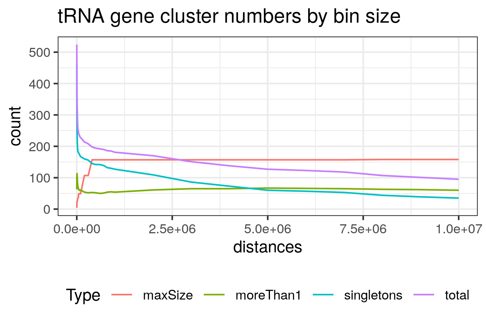
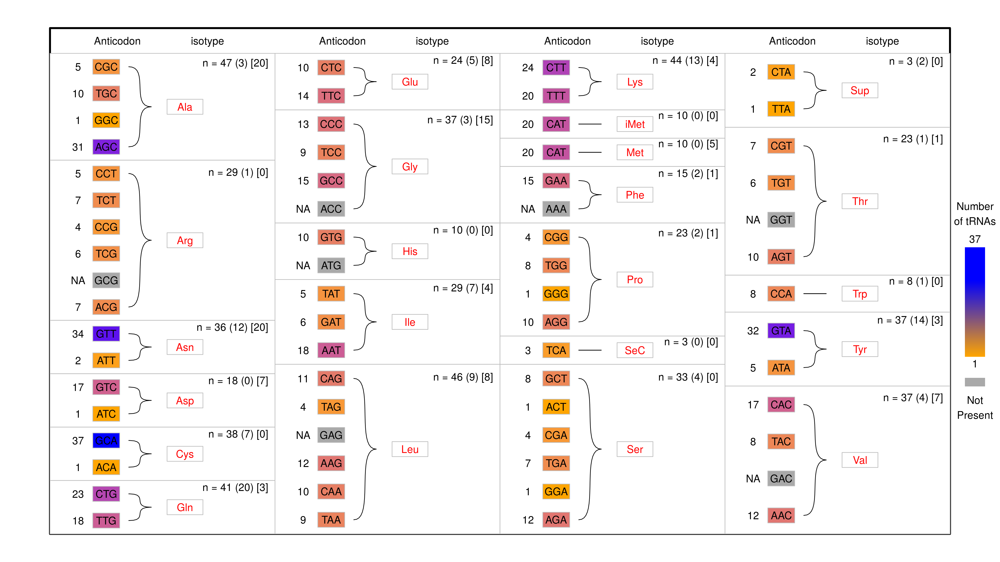
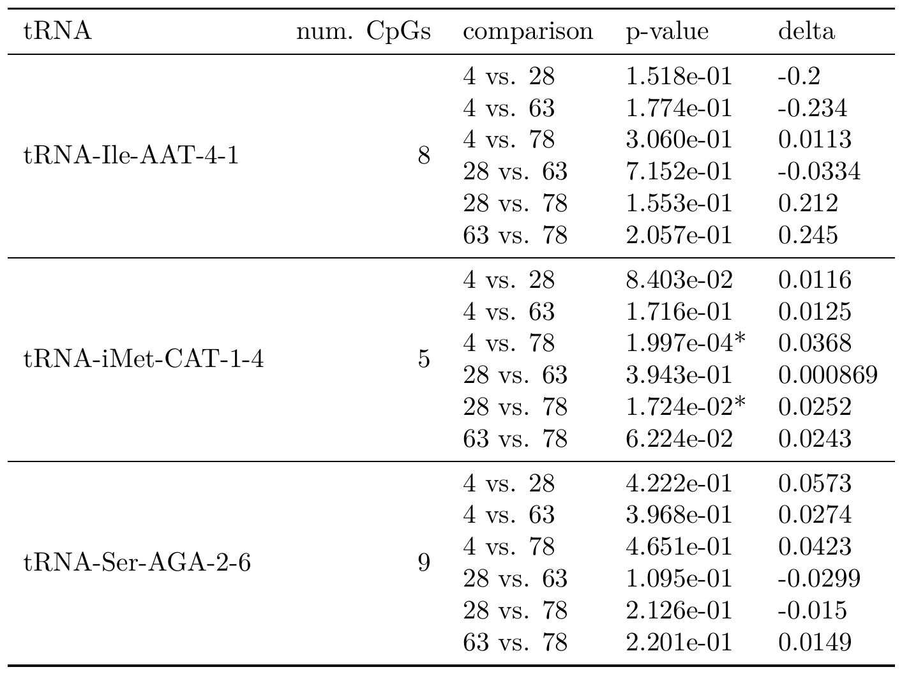
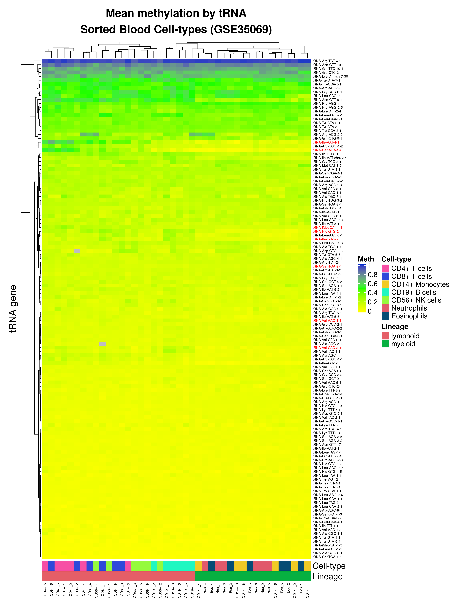
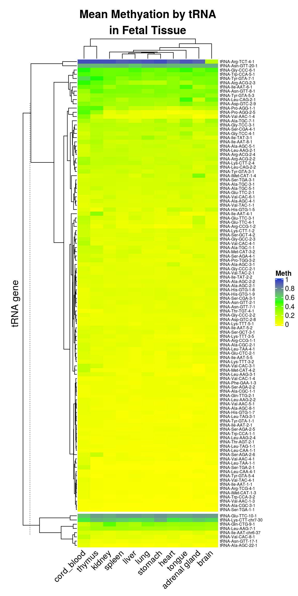

# The Genomic Loci of Specific Human tRNA Genes Exhibit Ageing-Related DNA Hypermethylation {#tRNAs}

## Abstract {#tRNA-abstract}

Understanding how the epigenome deteriorates with age and subsequently impacts on biological function may bring unique insights to ageing-related disease mechanisms. As a central cellular apparatus, tRNAs are fundamental to the information flow from DNA to proteins.
Whilst only being transcribed from ~46kb (<0.002%) of the human genome, their transcripts are the second most abundant in the cell.
Furthermore, it is now increasingly recognised that tRNAs and their fragments also have complex regulatory functions.
In both their core translational and additional regulatory roles, tRNAs are intimately involved in the control of metabolic processes known to affect ageing.
Experimentally DNA methylation can alter tRNA expression, but little is known about the genomic DNA methylation state of tRNAs.

Here, we find that the human genomic tRNA loci are enriched for ageing-related DNA hypermethylation.
We initially identified DNA hypermethylation of 44 and 21 specific tRNA genes, at study-wide (p < $8.36\times10^{-5}$) and genome-wide ($p < 4.34\times10^{-9}$) significance, respectively, in 4,350 MeDIP-seq peripheral blood DNA methylomes (16 - 82 years).
This starkly contrasted with 0 hypomethylated at both these significance levels.
Further analysing the 21 genome-wide results, we found 3 of these tRNAs to be independent of major changes in cell-type composition (tRNA-iMet-CAT-1-4, tRNA-Ser-AGA-2-6, tRNA-Ile-AAT-4-1).
We also excluded the ageing-related changes being due to the inherent CpG density of the tRNAome by permutation analysis (1,000x, Empirical p-value < $1\times10^{-3}$).
We additionally explored 79 tRNA loci in an independent cohort using Fluidigm deep targeted bisulfite-sequencing of pooled DNA (n=190) across a range of 4 timepoints (aged ~4, ~28, ~63, ~78 years).
This revealed these ageing changes to be specific to particular isodecoder copies of these tRNAs (tRNAs coding for the same amino acid but with sequence body differences) and included replication of 2 of the 3 genome-wide tRNAs.
Additionally, this isodecoder-specificity may indicate the potential for regulatory fragment changes with age.

In this study we provide the first comprehensive evaluation at the genomic DNA methylation state of the human tRNAome, revealing a discreet and strongly directional hypermethylation with advancing age.

\newpage

## Introduction {#tRNA-Introduction}

Ageing is implicated as a risk factor in multiple chronic diseases [@Partridge2018].
Understanding how the ageing process leads to deteriorating biological function is now a major research focus. This field has hopes of increasing human longevity and ‘healthspan’ whilst ameliorating the extensive physical, social and economic costs of these ageing-related disorders [@Campisi2019].
Epigenetic processes, which influence or inform cell-type specific gene expression, are altered with age and are a fundamental hallmark of this progression, indeed they are arguably a hub mediating other hallmarks including stem cell exhaustion, cellular senescence, and mitochondrial dysfunction [@Lopez-Otin2013; @Booth2016]. 

DNA methylation (DNAm) is the most common epigenetic modification of DNA and age-associated changes in this mark were recognised in mammalian tissues as early as 1983 [@Wilson1983].
Changes in DNAm with age are extensive with thousands of loci affected.
Many of these changes represent 'drift' [@Fraga2005] arising from the imperfect maintenance of methylation state.
Specific genomic regions show distinct directional changes, with loss of DNA methylation in repetitive or transposable elements [@Chuong2017], and gains in certain promoters, including the targets of polycomb repressor complex [@Teschendorff2010] as well as bivalent domains [@Rakyan2010].
The advent of high-throughput DNAm arrays [@Sandoval2011; @Teschendorff2010; @Hannum2013] has elucidated more detailed patterns of ageing related changes in DNAm.
The identification of precise individual CpG sites that exhibit consistent changes with age enabled the construction of predictors of chronological age known as epigenetic or DNAm ‘clocks’ [@Hannum2013; @Horvath2013; @Levine2018; @Horvath2018a; @Lu2019].
Furthermore, it was observed that ‘acceleration’ of this DNAm-derived measure is a biomarker of ‘biological’ ageing due to associations with morbidity and mortality [@Horvath2018; @Field2018].
In a previous investigation of ageing-related DNAm changes within common disease-associated GWAS regions, Bell et al. identified hypermethylation of the specific transfer RNA gene, tRNA-iMet-CAT-1-4 [@Bell2016].
The initiator methionine tRNA possesses certain unique properties [@Bhattacharyya2016; @Kamhi2010; @Birch2016], including its capacity to be rate limiting for translation [@Rideout2012], association with the translation initiation factor eIF2 [@Kolitz2010], and ability to impact the expression of other tRNA genes [@Pavon-Eternod2013]. 

tRNAs are fundamental in the translation process for all domains of life and are thus evolutionarily ancient [@Eigen1989].
This translation machinery and the regulation of protein synthesis are controlled by conserved signalling pathways shown to be modifiable in longevity and ageing interventions [@Tavernarakis2008].
The human tRNAome, comprising all of the genomic locations of tRNA genes, represents an extremely small portion of the genome [@Parisien2013].
There are 416 high confidence tRNA genes when additionally considering tRNA pseudo genes, nuclear encoded mitochondrial tRNA genes and possibly some closely related repetitive sequences the number of sequences closely resembling tRNAs is 610 (gtRNAdb [@Chan2009]) this extended set covers <46 kb (including introns) and represents <0.002% of the human genome.
Despite their small genomic footprint, and the observation that approximately half of all tRNA genes are transcribed at negligible levels if at all [@Torres2019a], these genes produce the second most abundant RNA species next to ribosomal RNA [@Lodish2000] and are required for the production of all proteins.
Mature tRNAs have an L-shaped three dimensional structure arising from a 'clover-leaf' shaped two dimensional structure comprised of three hairpin stem-loop structures (Figure \@ref(fig:tRNAstructure)).

```{r tRNAstructure, fig.cap="(ref:tRNAstructure-Cap)", out.width='70%', fig.show='hold', fig.align = 'center', echo=FALSE}

```
(ref:tRNAstructure-Cap) __Structure of a mature tRNA__ Two and three dimensional representations of tRNA structure with matching colour coding. Adapted from the wikimedia foundation structure based on PDBID: 1ehz. tRNAs are 'charged' when an amino acid is attached at the CCA site at the 3' end.

tRNA genes are transcribed by RNA polymerase III (polIII) [@Schramm2002] and have type II polIII promoters which contain A and B-box internal promoter elements bound by the complex TFIIIC, followed by TFIIIB, and polIII [@Canella2010] (Figure \@ref(fig:tRNApromoter)).
Transcription is terminated by a simple run of Ts and proceeds in rounds of fast re-initiation where the same polIII molecule is preferentially re-used [@Dieci1996].
tRNA gene expression is modulated by the polIII specific transcription factor Maf1 a highly conserved factor which represses tRNA transcription [@Murawski1994; @Pluta2001; @Vorlander2020].
The activity of Maf1 is modulated by the Target of Rapamycin Kinase Complex 1 (TORC1) [@Mange2017], a highly conserved hub for signals that modulate ageing [@Kennedy2016].
Several general transcription factors also influence tRNA gene expression; the tumour suppressors p53 [@Crighton2003] and Rb [@Sutcliffe2000] both negatively regulate tRNA expression and c-Myc upregulates tRNA gene expression, all act via TFIIIB [@Gomez-Roman2003].
tRNAs are dysregulated in cancer, and have  potential utility as prognostic markers [@Krishnan2016].
tRNA regulation may play an important role in cancer [@Huang2018]. 
DNAm is able to repress the expression of tRNA genes experimentally [@Besser1990], in plasmid expression systems, but may also represent co-ordination with the local repressive chromatin state [@Varshney2015].
In addition, recent results from Gerber et al. [@Gerber2020] show a mechanism by which polII can function in the regulation of certain polIII transcribed loci including several tRNA genes.

```{r tRNApromoter, fig.cap="(ref:tRNApromoter-Cap)", out.width='100%', fig.show='hold', fig.align = 'center', echo=FALSE}
knitr::include_graphics("./figs/tRNA-PollIII_white.png")
```
(ref:tRNApromoter-Cap) __tRNA Transcription__ Cartoon representation of the RNA polIII transcription initiation complex and structure of the type II RNA polymerase III promoter. Colour coding here corresponds to that in figure \@ref(fig:tRNAstructure) illustrating that promoter is internal as the A box corresponds approximately to the D-loop and the B box to the T-loop in the tRNA structure.

Assuming similar rates of transcription one would expect that the more frequently an amino acid is used in the exome, the more copies of that tRNA gene there would be in the genome [@Gingold2012].
Indeed, tRNA gene dosage is quite closely matched to amino acid usage frequency in the human exome, though the correlation is less strong for codon usage (Figure \@ref(fig:codonAndaaFreqNtRNAplots)).
The imperfect nature of this correlation suggests that there may be regulation of tRNA expression beyond simply having copy numbers proportionate to usage frequency.

```{r codonAndaaFreqNtRNAplots, fig.cap="(ref:codonAndaaFreqNtRNAplots-Cap)", out.width='60%', fig.show='hold', fig.align = 'center', echo=FALSE}
knitr::include_graphics("./figs/codonAndaaFreqNtRNAplots.png")
```
(ref:codonAndaaFreqNtRNAplots-Cap) __tRNA gene copy number is imperfectly correlated with amino acid and codon usage frequency__ __A)__ Amino acid usage frequency in the human exome vs tRNA gene copy number __B)__ Codon usage frequency in the human exome vs tRNA gene copy number Usage Frequency Data [@Athey2017], tRNA gene count data from GtRNAdb [@Chan2009].


A variety of observations have indicated that many tRNA genes are expressed in a tissue specific fashion in diverse organisms [@Dittmar2006],[@Sagi2016].
These include the tissue specific manifestations of diseases caused by mutations involving tRNAs and their usage [@Kirchner2017],[@Ishimura2015].
Though detailed characterisation of tissue specific tRNA expression patterns are still lacking.
Considering the broad similarity of transcriptome codon usage across time and tissues and the purported functional equivalence in translation of tRNAs with the same anticodon, there is an open question as to the reason for tissue specificity of tRNA expression.
The tissue specific expression of tRNAs whilst substantially maintaining codon ratios would require highly coordinated tRNA gene regulation to obtain similar expression levels of putatively functionally equivalent genes. This situation is strongly suggestive of as yet undiscovered function.

Additionally, beyond their core role in the information flow from DNA to protein sequence, tRNAs can fragment into numerous tRNA-derived small RNAs (tsRNAs).
There are a number of types of tRNA derived small RNAs (tsRNAs) [@Pliatsika2018] which serve as signalling molecules [@Lee2009] (Figure \@ref(fig:tRNAderivedSmallRNARoles)).
Four main types of tsRNAs have been identified, these are 5' tRNA halves, 3' tRNA halves, and the tRNA derived fragments (tRFs) of ~18 - ~22bp sizes [@Torres2019; @Li2018a; @Xu2017a].
tRNAs and pre-tRNAs also give rise to piRNAs [@Keam2014; @Honda2017; @Tosar2018] and internal tRNA fragments or itRFs [@Loher2017].
The terminology and ontology of tsRNAs is still stabilising as our understanding of these RNA species evolves.
Some of these tsRNAs feedback on protein synthesis by regulating ribosome biogenesis [@Kim2017], others have diverse regulatory functions such as targeting transposable element transcripts [@Martinez2017].
The extent of the functional significance of tsRNAs is also an open question [@Schimmel2017].

```{r tRNAderivedSmallRNARoles, fig.cap="(ref:tRNAderivedSmallRNARoles-Cap)", out.width='100%', fig.show='hold', fig.align = 'center', echo=FALSE}
knitr::include_graphics("./figs/tRNAderivedSmallRNARoles.png")
```
(ref:tRNAderivedSmallRNARoles-Cap) __The Types and Functions of tRNA derived small RNAs__ Reproduced from Cristodero et al. [@Cristodero2017].

Ageing is linked to core aspects of metabolic regulation, with nutrient sensing and stress response acting as major modulators of ageing. 
tRNAs as well as tsRNAs are integral to the regulation of protein synthesis and stress response.
Protein synthesis represents a substantial proportion of total cellular energy expenditure and this fraction can vary considerably with nutrient availability [@Pace2006].
Metabolic processes are also recognised to modulate the age estimates of DNAm clocks [@Nwanaji-Enwerem2018].
Partial inhibition of translation increases lifespan in multiple model organisms [@Hansen2007] and polIII inhibition increases longevity acting downstream of TORC1 [@Filer2017].
Furthermore, 5’ tRNA halves circulating in serum are modulated by ageing and caloric restriction [@Dhahbi2013]. 

DNAm is able to repress the expression of tRNA genes on methylated expression vectors [@Besser1990].
Whilst the broader chromatin milieu affects tRNA transcription, tRNA genes are unusual in that they are sufficiently short to fit within a single nucleosome.
tRNA genes are generally 'nucleosome free' and precise placement of the nucleosome immediately upstream of the transcriptional start site is of importance for their expression [@Bhargava2013a].
A recent review of the epigenetic regulation of the polIII transcriptome [@Park2017] noted the very limited CpG methylation data available at polIII loci.
Transcription by RNA polymerase III at SINE loci is suppressed by histone methylation but not by DNA methylation [@Varshney2015], indicating that DNA methylation may not directly influence the expression of tRNA genes but may do so by influencing the surrounding chromatin state.
Standard RNA-seq is of limited utility in examining tRNA expression due to the issues of mappability, in addition much RNA-seq data is generated with size and polyA selection methods which would exclude tRNA derived transcripts.
Also, tRNAs are a major target for 'epitranscriptomic' modification, with an average of 11-13 modifications per tRNA [@Wilusz2015; @Schimmel2017], some of which stop polymerases from elongating or alter base pairing, creating further mapping challenges.
Thus, variants on standard RNA-seq procedures have been developed [@Cozen2015; @Shigematsu2017a; @Gogakos2017]. 
polIII ChIP-seq has been used as a proxy for tRNA gene expression and, unlike RNA-seq based methods, generates reads from uniquely identifiable flanking regions which map to a known locus of origin [@Canella2010].
This same advantage exists for the MeDIP-seq data used in this study. 

tRNA gene loci may also play a role in large scale genome organisation.
tRNA gene clusters act as insulators [@Raab2011], and have extensive long-range chromatin interactions with other tRNA gene loci [@VanBortle2017].
The coordinated transcription of tRNAs at subnuclear foci may represent an organising principle for 3D-chromatin by providing spatial constraints. 
In both budding and fission yeast tRNA genes localise to the nucleolus.
In fission yeast, a subset of B-box sequence elements are bound by TFIIIC and not polIII serving as chromatin anchors to the nuclear periphery and acting as boundaries between euchromatic and heterochromatic regions [@Noma2006].
It is unclear to what extent tRNA genes may play similar roles in large scale chromatin organisation in other organisms.

In this study ageing-related changes in the epigenetic DNA methylation state of the entire tRNAome were directly investigated, facilitated by the availability of a large-scale MeDIP-seq dataset.
Arrays poorly cover this portion of genome.
The 450k and EPIC arrays have 110 robust probes covering 84 tRNAs and 129 robust probes covering 89 tRNAs respectively, thus even the latest EPIC arrays cover <15% of the tRNA genes, with robust probes, and in total only ~4.7% of all the tRNA gene CpGs [@Zhou2017].

tRNA genes sit at the heart not only of the core biological process of translation but at a nexus of signalling networks operating in several different paradigms, from small RNA signalling to large scale chromatin organisation [@VanBortle2017].
In summation tRNA biology, protein synthesis, nutrient sensing, stress response and ageing are intimately interlinked.
The newly described ageing-related observation of tRNAome DNA hypermethylation has here been identified as and independently replicated.

\newpage

## Methods {#tRNAmethods}

Code for analyses performed in this chapter can be found here: [https://github.com/RichardJActon/tRNA_paper_code](https://github.com/RichardJActon/tRNA_paper_code)

### Participants {#tRNA-Participants}

#### MeDIP-seq DNA methylomes

Participants in the 'EpiTwins' study are adult volunteers from the TwinsUK Register.
The participants were aged between 16 and 82 years, with a median of ~55 years (cohort profile [@Moayyeri2013]).
Ethics for the collection of these data were approved by Guy's & St Thomas' NHS Foundation Trust Ethics Committee (EC04/015—15-Mar-04) and written informed consent was obtained from all participants.  

#### Targeted Bisulfite sequencing

Participants for our targeted bisulfite sequencing of select tRNA loci were drawn from two studies.
Samples from participants aged 4 and 28 years are from the MAVIDOS [@Harvey2012a] study and participants aged 63 and 78 years are from the Hertfordshire cohort study [@Syddall2005].
Due to a limited number of available samples, the two 4 year old pools contained DNA from 20 individuals each, with all other pools having 25 contributing individuals.
Pool 1, the first 4 year old pool used DNA from all male samples, with all other pools using all female samples.
Thus, the total number of participants was 190 (see Table \@ref(fig:poolSummaryTable)).
Samples from the 28 year old time point are all from pregnant women at ~11 weeks gestation.  

### tRNA annotation information {#tRNAanno}

Genomic coordinates of the tRNA genes were downloaded from GtRNAdb [@Chan2009]. 
The 2 tRNAs located in chr1_gl000192_random are tRNA-Gly-CCC-8-1 & tRNA-Asn-ATT-1-2 ([Supplementary File S1](./Supplementary_Files/hg19-tRNAs.bed)).
The 213 probes overlapping tRNA genes were derived from intersecting the tRNA gene annotation data from gtRNAdb with the Illumina 450k array manifest annotation for the hg19 genome build using bedtools v2.17.0 [@Quinlan2010].
107 tRNA genes were excluded from blacklisted regions of hg19 [@Amemiya2019].

#### tRNA Gene Clustering {#clustering}

To explore the genomic spatial distribution of the tRNA genes, the tRNA loci were clustered by grouping together all tRNAs within 5Mb of one another using the `bedtools merge` tool v2.17.0 [@Quinlan2010].
A command of the form: `bedtools merge -c 4 -o collapse -d <N> -i hg19-tRNAs.bed` was used, where `<N>` is the binsize.
The binsize was varied and 5Mb was selected as it is at approximately this size that number of clusters with more than one tRNAs exceeds the number of singleton tRNAs (Figure \ref{fig:tRNAgeneClustersByBinSize}).
The further requirements that these groupings contain at least 5 tRNA genes with a density of at least 5 tRNA genes per Mb were added for these groups to be considered clusters. 

```{r tRNAgeneClustersByBinSize, fig.cap="(ref:tRNAgeneClustersByBinSizeCap)", out.width='100%', fig.show='hold', fig.align = 'center', echo=FALSE}

```

(ref:tRNAgeneClustersByBinSizeCap) __tRNA gene cluster numbers at different bin sizes__ total: total number of tRNA clusters. singletons: number of tRNAs in clusters alone. moreThan1: number of tRNAs in clusters with more than one tRNA. maxSize: the number of tRNAs in the largest cluster.

#### tRNA gene mappability assessment {#mappabilityDensity}

To assess the mappability of tRNA gene regions a value for mappability score density was computed to facilitate comparisons of regions of the genome.
Mappability score density is computed as the area under the encode mappability tracks [@Derrien2012] over the length of the region.

### DNA methylome data {#tRNA-DNA-methylome-Data}

#### TwinsUK MeDIP-seq methylomes {#EpiTwinsMethods}

The Methylated DNA Immunoprecipitation sequencing (MeDIP-seq) data was processed as previously described [@Bell2016; @Bell2017a] and detailed in [Methods](#MeDIPseq) \@ref(MeDIPseq).
These processed data are available from the European Genome-phenome Archive (EGA) (https://www.ebi.ac.uk/ega) under study number EGAS00001001910 and dataset EGAD00010000983 and were generated by BGI Shenzen for TwinsUK.
The dataset used in this work consists of 4350 whole blood methylomes with age data. 
4054 are female and 270 male. 
3001 have full blood counts.
There are 3652 individuals in this data set.
These individuals originate from 1933 unique families.
There are 1234 monozygotic (MZ) twin pairs (2468 individuals), and 458 dizygotic (DZ) twin pairs (916 individuals).
MeDIP-seq data from regions of interest was extracted using Bedtools v2.17.0 [@Quinlan2010].  

#### Analysis of DNA methylome data for Significant Ageing-related changes {#medipmodels}

All analysis was performed in R/3.5.2.
Linear models were fitted to age using the MeDIP-seq DNA methylome data, as quantile normalised RPM scores at each 500bp window.
Quantile normalisation was performed with the `qqnorm` R function with the theoretical quantiles of the RPM values at each window used in subsequent analysis.

Models were fitted with:

1. No covariates
2. Batch information as a fixed effect
3. Blood cell-type counts for neutrophils, monocytes, eosinophils, and lymphocytes as fixed effects
4. Batch and Blood Cell counts as fixed effects

- Models 1 & 2 were fitted on the full set of 4350 as batch information was available for all samples but blood cell count data was only available for a subset of 3001 methylomes.
- Models 1 & 2 fitted in the n=3001 subset were similar to those fitted in the complete set of 4350. 
- Models 3 & 4 were fitted in the n=3001 subset with full covariate information and sets of significant tRNAs identified at study-wide and genome wide levels in model 4 were used in subsequent analyses.

Models were also fitted for two unrelated subsets created by selecting one twin from each pair (Monozygotic or Dizygotic), yielding sets with n = 1198 & 1206 DNA methylomes. 
One additional model was fitted for longitudinal analysis, samples were selected by identifying individuals with a DNA methylome at more than one time point and filtering for only those with a minimum of 5 years between samples.
This yielded 658 methylomes from 329 individuals with age differences of 5-16.1 years, median 7.6 years.
Models for this set included participant identifier as a fixed effect in addition to blood cell counts and batch information.

#### Permutation Analysis for Enrichment with Age-related Changes {#AgeErichmentPermutation}
 
Permutation analysis was performed to determine whether the CpG distribution of sets of the tRNAome was the principle driver of the ageing-related changes observed.
Windows overlapping tRNAs have a higher proportion of windows with a greater CpG density than their surrounding sequences (see Figure \@ref(fig:CpGcountBGvstRNAPlot)).
CpGs residing within moderate CpG density loci are the most dynamic in the genome [@Ziller2013] and CpG dense CpG island regions include specific ageing-related changes [@Teschendorff2010; @Rakyan2010; @Bell2016]. 
For comparison the permutation was also performed in the CGI regions from the Polycomb group protein target promoters in Teschendorff *et al.* [@Teschendorff2010] and bivalent loci from ENCODE ChromHMM 'Poised Promoter' classification in the GM12878 cell-line [@Ernst2011].
A random set of 500bp windows representing an equivalent CpG density distribution of the feature set in question were selected from the genome-wide data.
Above a certain CpG density there are insufficient windows to sample without replacement within a permutation.
Furthermore, above ~$\ge18\%$ CpG density CpG Islands become increasingly likely to hypomethylated [@Bell2012a].
Therefore, all windows with a CpG density of $\ge18\%$ (45 CpGs per 500bp) were grouped and sampled from the same pool.
i.e. a window overlapping a tRNA gene which had a 20% density could be represented in permutation by one with any density $\ge18\%$.
This permutation was performed 1,000 times to determine an Empirical p value by calculating the number of times the permutation result exceeded the observed number of significant windows in the feature set.
$Empirical~p-value = \frac{r+1}{N+1}$, where r is the sum of significantly hypermethylating windows in all permutations and N is number of permutations [@North2003].

```{r CpGcountBGvstRNAPlot, fig.cap="(ref:CpGcountBGvstRNAPlotCap)", out.width='100%', fig.show='hold', fig.align = 'center', echo=FALSE}
knitr::include_graphics("figs/CpGcountBGvstRNAPlot.png")
```
(ref:CpGcountBGvstRNAPlotCap) CpG Density in windows overlapping tRNA genes compared to that of non-tRNA overlapping windows in arbitrary flanking sequences (+/-5kb)

#### Neonate and Centenarian Whole Genome Bisulfite Sequencing

DNA methylation calls were downloaded from GEO: [GSE31263](https://www.ncbi.nlm.nih.gov/geo/query/acc.cgi?acc=GSE31263) and intersected with tRNA genes using bedtools v2.17.0 [@Quinlan2010].

#### Sample pooling and EPIC array

An Illumina Infinium DNA methylation EPIC array ((C) Illumina) and targeted bisulfite sequencing of select tRNA gene loci were performed.
Here DNA was extracted from whole blood and pooled into 8 samples from unrelated individuals at 4 time-points with 2 pools at each time-point.
The individual were age matched at approximately 4, 28, 63, and 78 year timepoints (Table \@ref(fig:poolSummaryTable))
Using the EPIC array DNAm age was estimated using the Horvath clock [@Horvath2013] and blood cell-type-composition with the Houseman method [@Houseman2012].


```{r BuildPoolAges, out.width='60%', echo=FALSE, warning=FALSE, message = FALSE}
##knitr::include_graphics("./figs/poolSummaryTable.png")
##options(knitr.table.format = "html")#"latex"
library(kableExtra)
options(knitr.table.format = "latex")
#options(kableExtra.auto_format = TRUE)
sampleMetaData <- read_tsv(
	"./figs/sampleMetaDataProcessed.tab",
	progress = FALSE,
	col_types = cols(
		id = col_character(),
		age = col_double(),
		pool = col_character(),
		sex = col_character(),
		group = col_character(),
		DNA..ug = col_double(),
		Amount.used.ng = col_double(),
		Proportion.of.total.used = col_double(),
		Percentage.of.total.used = col_character()
	)
)

poolColours <-c(
	"Pool 1"="#ffffcc","Pool 2"="#CCCC56",
	"Pool 3"="#a1dab4","Pool 4"="#3CA661",
	
	"Pool 5"="#41b6c4","Pool 6"="#2899A8",
	"Pool 7"="#225ea8","Pool 8"="#14488C"#,
	#"DNAm Age" = "red"
)

poolSummaryTable <- 
sampleMetaData %>% 
	group_by(pool) %>% 
	dplyr::summarise(
		`Mean Age` = mean(age), Sex = sex[1],
		`Min Age` = min(age), `Max Age` = max(age), n = n()
	) %>%
	dplyr::rename(Pool = pool) %>%
	#mutate_if(is.numeric,sprintf("%g.2",.)) %>%
	mutate(
		Pool = case_when(
			Pool == "Pool 5" ~ "Pool 7",
			Pool == "Pool 6" ~ "Pool 8",
			Pool == "Pool 7" ~ "Pool 5",
			Pool == "Pool 8" ~ "Pool 6",
			TRUE ~ Pool
		)
	) %>%
	arrange(Pool) %>%
	mutate(
		Pool = cell_spec(
			Pool, 
			#"latex",#"html",
			# color = "#000000",
			align = "c"#,# angle = 45,
			# background = poolColours[Pool]
		)
	) %>%
	kable(
		digits = 2,
		#format = "latex",#"html",
		escape = FALSE,
		booktabs = TRUE,
		#caption = "(\\#fig:poolSummaryTable) (ref:poolAgesCap)",
		linesep = ""
	) %>%
	kable_styling(
		bootstrap_options = "striped", full_width = FALSE,
		latex_options = "striped"
	) %>%#, fixed_thead = TRUE
	#row_spec(0, background = "#b8b8b8") %>%
	column_spec(1, bold = TRUE, border_right = TRUE)

#poolSummaryTable

poolSummaryTable %>%
	save_kable("figs/poolSummaryTable.pdf")

magick::image_read_pdf("figs/poolSummaryTable.pdf") %>% 
	magick::image_convert("png") %>% 
	magick::image_write("figs/poolSummaryTable.png")

```


```{r poolSummaryTable, fig.cap="(ref:poolSummaryTable-Cap)", out.width='100%', fig.show='hold', fig.align = 'center', echo=FALSE}
knitr::include_graphics("figs/poolSummaryTable.png")
```
(ref:poolSummaryTable-Cap) Summary information on participants in each pool.

#### Targeted Bisulfite Sequencing {#targetedBiSseq}

tRNA loci were selected for targeted sequencing which exhibited changes and DNAm with age along with closely related tRNAs in which changes were not observed.
Primer design was performed using 'methPrimer' [@Li2002] ([Supplementary File S2](./Supplementary_Files/Targeted_BiS-seq_Primers.txt)). 
A total of 84 tRNA loci were targeted in 2 rounds of sequencing, 79 subsequently generated reliable results post-QC.
The targeted tRNAs covered a total of 723 CpGs with a median of 8 CpGs per tRNA (range 1-13), data passing QC was generated for 458 CpGs, median 6 (range 1-9) per tRNA.

Initial QC for readcount, base call quality and base composition was caried out with [`FastQC`](https://github.com/s-andrews/FastQC) [@Andrews2010] and [`multiqc`](https://github.com/ewels/MultiQC) [@Ewels2016] for combined visualisation of QC outputs.
Quality based trimming was performed with [`Trim Galore`](https://github.com/FelixKrueger/TrimGalore) [@Krueger2015] and target specific primer trimming with [`cutadapt`](https://github.com/marcelm/cutadapt) [@Martin2011] and custom `perl 5` scripts.
Alignment and methylation calling was performed with `Bismark` (v0.20.0) [@Krueger2011] making use of `bowtie2` [@Langmead2012].

The alignment was performed against both the whole hg19 genome and just the tRNAome +/- 100bp to assess the possible impact of off-target mapping.
Mapping to the whole genome did produce purported methylation calls at a larger number of loci than mapping just to the tRNAome (683,783 vs 45,861 respectively).
Introducing a minimum coverage threshold of 25 reads dramatically reduced this and brought the number of sites into line with that in the tRNAome set (36,065 vs 33,664 respectively) suggesting a small number of ambiguously mapping reads. 
All subsequent analysis was performed using the alignment to just the tRNAome with a minimum coverage of 25 reads.

Pairwise differential methylation analysis of the tRNA genes at the different time points was performed using [`RnBeads`](https://bioconductor.org/packages/release/bioc/html/RnBeads.html) [@Muller2019] with `limma` [@Ritchie2015] and a minimum coverage of 25 reads.
Linear regression was used to predict age from DNA methylation at the targeted tRNA sites, permitting us to compare rates of increase with age.
For the linear regression, only CpG sites with more than 25 reads mapped to the regions of the genome targeted for amplification were used.

#### TwinsUK Illumina 450k array methylomes

Illumina Infinium DNA methylation 450k arrays ((C) Illumina) were also performed on TwinsUK participants, in 770 Blood-derived DNA samples which had matched MeDIP-seq data ([Methods](#GenMethodsMethArray) \@ref(GenMethodsMethArray)).
These data were available for this analysis in a pre-processed form, Methylation 'beta' values subject to beta-mixture quantile normalisation (BMIQ) as previously described [@Bell2016; @Bell2017a].
Cell-type correction was performed using cell-count data and the following model: `lm(age ~ beta + eosinophils + lymphocytes + monocytes + neutrophils)`.

### Chromatin Segmentation Data

Epilogos chromatin segmentation data [@Meuleman2019; @Ernst2011] was downloaded for the tRNA gene regions +/- 200bp from https://explore.altius.org/tabix/epilogos/hg19.15.Blood_T-cell.KL.gz using the `tabix` utility. 
The data used was the 'Blood & T-cell' 15 State model based on segmentation of 14 cell-types.
This data was manipulated and visualised with `R` and `ggplot2`.
tRNAs were assigned a predominant chromatin state base on the state with the highest score over that tRNA gene.

### Isolated Blood Cell Type Specific Data {#sortedbloodmethods}

Data from 7 cell-type fractions from 6 Male individuals was downloaded from [GSE35069](https://www.ncbi.nlm.nih.gov/geo/query/acc.cgi?acc=GSE35069) [@Reinius2012] using `GEOquery` [@Davis2007p]. 
Five of the 6 top age hypermethylating tRNAs are covered by this array dataset.

### Cancer and Tissue Specific Methylation Data {#TCGAmethods}

Data was downloaded from the TCGA (The Cancer Genome Atlas) via the GDC (genomic data commons) data portal [@Grossman2016] using the `GenomicDataCommons` `R` package.
Data from foetal tissue [@Yang2016; @Nazor2012] was downloaded from GEO ([GSE72867](https://www.ncbi.nlm.nih.gov/geo/query/acc.cgi?acc=GSE72867), [GSE30654](https://www.ncbi.nlm.nih.gov/geo/query/acc.cgi?acc=GSE30654)).
From the TCGA, samples were selected for which DNAm data was available from both the primary site and normal solid tissue, and for which an approximate age could be inferred (within one year).
Selecting those probes overlapping tRNA genes yielded 73,403 data points across 19 tissues with an age range of 15-90yrs (median 63.4) ([Supplementary File S3](./Supplementary_Files/TCGA_samples_used.tsv))

### Assaying tRNA expression in blood with MINTmap {#mintmapmethods}

Small RNA-seq data from sorted blood cell fractions [@Juzenas2017] was used. ([GSE100467](https://www.ncbi.nlm.nih.gov/geo/query/acc.cgi?acc=GSE100467)) and the MINTmap [@Loher2017] tRNA fragment alignment tool.
This dataset covered 42 individuals aged 21-63.
A customised MINTmap reference designed to include only fragments which unambiguously map to a single tRNA gene locus and which overlap the 5' or 3' end of the genomic tRNA sequence by at least one base with no mismatches was produced.
This reference is intended to capture pre-tRNAs prior to processing and CCA addition operating under the assumption that the levels of pre-tRNAs will be informative about the amount of transcription taking place at the tRNA loci.
This approach provides at most a many to one mapping of tRNA fragments to a tRNA genes.

Assaying the expression of tRNA genes presents numerous difficulties [@Torres2019], and usually requires variants on standard RNA-seq protocols.
This custom MINTmap reference build yielded 383 fragments mapping to 92 distinct tRNA loci in this data.
To control quality, only fragments with more than 20 total instances in the dataset, and present in more than 20 individuals were considered.

The maximum length of a fragment was limited to 50nt, due to the read length of the small RNA-seq data.

### Mouse RRBS Analysis {#mousemethods}

Methylation calls and coverage information resulting from RRBS performed by Petkovich *et al.* [@Petkovich2017] were downloaded from GEO using `GEOquery` [@Davis2007p] [GSE80672](https://www.ncbi.nlm.nih.gov/geo/query/acc.cgi?acc=GSE80672).
These data from 152 mice covered 68 tRNA and 436 CpGs after QC requiring >50 reads per CpG and >10 data points per tRNA.
5 tRNAs were excluded for being located within blacklisted regions of mm10 [@Amemiya2019].
After QC there were 58 tRNA genes and 385 CpGs.
Simple linear modelling to predict age (in months) from methylation level at each tRNA and each CpG were performed in `R`.

\newpage

## Results {#res}

### DNA Methylation of Specific tRNA Gene Loci Changes with Age

Due to tRNAs critical role in translation and evidence of their modulation in ageing and longevity-related pathways, these genes were interrogated for evidence of ageing-related DNA methylation changes.
The discovery set was a large-scale peripheral blood-derived DNA methylome dataset comprising of 4,350 samples (see Figure \@ref(fig:OverviewOfAnalyses)).

```{r OverviewOfAnalyses, fig.cap="(ref:OverviewOfAnalysesCap)", out.width='100%', fig.show='hold', fig.align = 'center', echo=FALSE}
knitr::include_graphics("figs/OverviewOfAnalysesFigure_tRNA_3.png")
```
(ref:OverviewOfAnalysesCap) __Study Structure__ tRNAs differentially methylated with age initially identified in MeDIP-seq, validated (where covered in 450k array) and replicated in targeted bisulfite sequencing of pooled samples. Tissue specificity of these effects was explored in TCGA and foetal tissue data.

This sequencing-based dataset had been generated by Methylated DNA Immunoprecipitation (MeDIP-seq) [@Down2009], which relies on the enrichment of methylated fragments of 200-500 bp to give a regional DNAm assessment (500 bp semi-overlapping windows, see [Methods](#EpiTwinsMethods) \@ref(EpiTwinsMethods)).
In total the extended human tRNAome is comprised of 610 tRNAs and closely related sequences (gtRNAdb)(see Figure \@ref(fig:kutteresq)), though only 492 are autosomal and do not reside in blacklisted regions of the genome [@Amemiya2019].

```{r kutteresq, fig.cap="(ref:kutteresqCap)", out.width='100%', fig.show='hold', fig.align = 'center', echo=FALSE}

```
(ref:kutteresqCap) __The genetic code as instantiated in the human tRNAome.__ The triplet genetic code leads to the incorporation of specific amino acids into an elongating protein via corresponding tRNAs. n is the number of tRNA genes which encode a given amino acid, the number in parentheses is how many of those may be pseudogenes based on their tRNAscan score [@Lowe2016], and the number in square brackets is the number in blacklisted regions [@Amemiya2019]. There are a total of 610 tRNAs and closely related sequences in GtRNAdb [@Chan2009], 416 of which are high confidence tRNAs, 116 of which are potential pseudogenes, and 107 are in blacklisted regions [@Amemiya2019]. Notably 7 of the 61 non-STOP codons are missing from the human tRNAome therefore these codons are handled by wobble base matching (*e.g.* GCG Arg, ACC Gly). Also of note are the suppressor and selenocysteine tRNAs. The 20 methionine tRNAs are split equally between initiator methionine and internally incorporating methionine tRNAs, which are structurally distinct [@Kolitz2010]. There are also 23 nuclear encoded mitochondrial tRNAs.

Due to the small size of these tRNAs (60-86bp, median 73bp, excluding introns which are present in ~30 tRNAs with sizes from 10-99bp, median 19bp), this fragment-based method enabled a robust examination of the epigenetic state of these highly similar sequences. 
This was supported by a mappability assessment. 
The median mappability score density for the tRNAome was 0.90 for 50mers when considering tRNA genes $\pm500bp$ reflecting the regional nature of the MeDIP-seq assay [Methods](#mappabilityDensity) \@ref(mappabilityDensity).
In contrast the 50mer mappability density is 0.68 for the tRNA gene sequences alone without flanking sequences.
Excluding the flanking region is representative of the mappability of reads generated using a technique such as whole-genome bisulfite sequencing.
This is because there is no IP fragment so reads mapping to adjacent more mappable sequences do not convey information about the methylation state of sites in the same fragment but to which it is harder to map (see Figures \@ref(fig:mappabilityiMet1) & \@ref(fig:mappabilityScoreDensity)).

```{r mappabilityiMet1, fig.cap="(ref:mappabilityiMet1Cap)", out.width='100%', fig.show='hold', fig.align = 'center', echo=FALSE}

```
(ref:mappabilityiMet1Cap) Example of mappability data from the encode mappability tracks [@Derrien2012] for the initiator methionine tRNA genes.

```{r mappabilityScoreDensity, fig.cap="(ref:mappabilityScoreDensityCap)", out.width='100%', fig.show='hold', fig.align = 'center', echo=FALSE}
knitr::include_graphics("./figs/mappabilityScoreDensity_tRNAVsFlank500.png")
```
(ref:mappabilityScoreDensityCap) Mappability score density of the tRNAome increases with read length and is greater when flanking regions ($\pm500bp$) are included. Mappability score density is computed as the area under the encode mappability tracks [@Derrien2012] over the length of the region.

21 genome-wide significant and 44 study-wide significant results were identified via linear regression, (p < $4.34\times10^{-9}$ and $8.36\times10^{-5}$, respectively; see [Methods](#medipmodels) \@ref(medipmodels), batch corrected n=4350).
Study-wide significance was calculated conservatively using the Bonferroni method for all 598 autosomal tRNAs. 
There was a strong directional trend with all results at both significance levels being due to increases in DNA methylation.
Age-related changes in cell type proportion are strong in heterogeneous peripheral blood, and include a myeloid skew, loss of naive T cells and increases in senescent cells [@Geiger2013].
A subset of 3 genome-wide and 16 study-wide significant hypermethylation results remained significant even after correcting for potential cell-type changes by including lymphocytes, monocytes, neutrophils and eosinophil cell count data (n=3001, Listed in Table \@ref(fig:GWSBBtRNAsTab), Red in Figure \@ref(fig:circos)).
The 3 genome wide significant tRNAs are: tRNA-iMet-CAT-1-4, tRNA-Ile-AAT-4-1, and tRNA-Ser-AGA-2-6.
tRNA-iMet-CAT-1-4 is located on chromosome 6.
tRNA-Ile-AAT-4-1 and tRNA-Ser-AGA-2-6 are neighbours and are located on chromosome 17 within the 3' UTR of *CTC1* (CST Telomere Replication Complex Component 1).
Going forward these most robustly corrected sets of 3 and 16 tRNA genes are referred to as the genome-wide and study-wide significant tRNA genes respectively.


```{r GWSBBtRNAsTabBuild, eval=FALSE, out.width='60%', echo=FALSE, warning = FALSE, message = FALSE}
#eval = TRUE, # eval=FALSE,
gws <- 4.338717e-09
sws <- 0.05 / 598
medipWinbytRNAres <- readRDS("Supplementary_Files/medipWinbytRNAres.Rds")
medipWinbytRNAres %>%
    tibble::as_tibble() %>%
    arrange(tRNAname, medip.p.value) %>%
    select(-width, -strand) %>%
    filter(medip.batch.p.value < gws) %>%
    filter(is.na(BLreason)) %>%
	#mutate(swsl = medip.p.value < sws) %>%
	#mutate(model = if_else(medip.p.value < sws,"BB sws","batch gws")) %>%
    mutate(
        window = sprintf(
            "%s:%s-%s", tools::toTitleCase(as.character(seqnames)),
            format(big.mark = ",", start), format(big.mark = ",", end)
        )
    ) %>%
    #dplyr::mutate(across(ends_with(".slope"), ~sprintf("%.3f",.))) %>%
    dplyr::mutate(
        across(
            ends_with(".slope"),
            ~cell_spec(
                sprintf("%.2f",.),
                #color = "white",
                color = ifelse(is.na(.), "#BBBBBB", "black"),
                bold = TRUE,
                background = case_when(
                    #swsl == FALSE ~ "#BBBBBB",#"red",
                    sign(.) == 1 ~ "#fddbc7",#"#ef8a62",
                    sign(.) == -1 ~ "#d1e5f0",#"#67a9cf",
                    TRUE ~ "#BBBBBB"
                )
            )
        )
    ) %>%
    dplyr::mutate(
        across(
            ends_with(".p.value"),
            ~cell_spec(
                sprintf("%.2e", .),
                #color = "white",
                bold = TRUE,
                color = ifelse(is.na(.), "#BBBBBB", "white"),
                background = 
                	case_when(
                		#swsl == FALSE ~ "#BBBBBB",
                		TRUE ~ spec_color(log2(.), option = "E", end = 0.9)
                	)
            )
        )
    ) %>%
	# dplyr::mutate(
	# 	model = 
	# 	cell_spec(
	# 		model, background = case_when(
	# 			model == "BB sws" ~ "red",
	# 			TRUE ~ "black"
	# 		)
	# 	)
	# ) %>%
    #dplyr::mutate(across(ends_with(".p.value"), ~sprintf("%.3e",.))) %>%
    dplyr::select(
        tRNA = tRNAname,
        Window = window, 
        #model,
        ` Slope` = medip.slope, ` p-value` = medip.p.value,
        #`Slope ` = medip.batch.slope, `p-value ` = medip.batch.p.value,
        ` Slope ` = array.slope, ` p-value ` = array.p.value,
        `  Slope` = tbs.slope, `  p-value` = tbs.p.value
    ) %>%
    kableExtra::kable(
        #longtable = TRUE,
    	#caption = "(ref:GWSBBtRNAsTabCap)",
        booktabs = TRUE, escape = FALSE,
    ) %>%
    kable_styling(
        #full_width = TRUE,
        font_size = 12,
        latex_options = c("scale_down")
    ) %>%
    collapse_rows(
        columns = 1:2,#7, 
        latex_hline = "major",#none
        valign = "middle"
    ) %>%
    add_header_above(
    	c(
    		" " = 2,#3,
    		#"MeDIP Blood & Batch" = 2, "MeDIP Batch" = 2,
    		"MeDIP" = 2,
    		"450k Array" = 2, "Targeted BiS-seq" = 2
    	)
    ) %>%
    #landscape() %>%
	save_kable("figs/table1a.pdf")

magick::image_read_pdf("figs/table1a.pdf") %>% 
	magick::image_convert("png") %>% 
	magick::image_write("figs/table1a.png")

```

```{r GWSBBtRNAsTab, fig.cap="(ref:GWSBBtRNAsTabCap)", out.width='95%', fig.show='hold', fig.align = 'center', echo=FALSE}
knitr::include_graphics("./figs/table1a.png")
```

(ref:GWSBBtRNAsTabCap) Study-wide significantly hypermethylating tRNAs in blood cell-type and batch corrected model MeDIP-seq. With Corresponding results in Twins UK 450k array (blood cell-type corrected) and targeted bisulfite sequencing results. Age models for array and targeted BiS-seq were calculated using all probes / CpGs overlapping the indicated tRNA gene. 'Slope' corresponds to the beta value for methylation in the linear model, orange colouring indicates hypermethylation and blue hypomethylation. p-values coloured such that low values are dark blue and high values are yellow. blank grey cells indicate missing data.

```{r circos, fig.cap="(ref:circosCap)", out.width='100%', fig.show='hold', fig.align = 'center', echo=FALSE}
knitr::include_graphics("figs/tRNA_circos_test_inkscape_4.png")
```
(ref:circosCap) Human tRNAome overview. From the outside in: Chromosome ideograms scaled by the number of tRNA genes (total = 598), as excludes chromosome X (10), Y (0) and contig chr1_gl000192_random (2; see [Methods](#tRNAanno) \@ref(tRNAanno)). tRNA genes within 20kbp of one another are grouped with breaks inserted between these clusters. Radial grey lines represent the location of tRNA genes in the genome. $-log_{10}(p-value)$ for the blood cell-type and batch corrected age model are shown for each window overlapping a tRNA gene in green. Mean methylation across all samples (n=3001) in RPM (reads per million base pairs) is shown in blue. Genome-wide significant cell-type & batch corrected ($p < 4.34\times10^{-9}$) tRNAs show in red. The 158 Loci covered by 213 probes on the 450k array which directly overlap a tRNA gene are shown with green triangles. The 84 loci targeted for bisulfite sequencing in this study are indicated in magenta. Mappability score density is computed as the area under the encode mappability tracks [@Derrien2012] over the length of the region.

Due to the related nature of these twin samples, these data were also analysed in two subsets of n=1198 & 1206 by selecting one twin from each pair into the separate sets.
This analysis also included correction for Batch and Blood Cell counts. 
Whilst in these smaller datasets no tRNAs were genome-wide significant, 5 and 7 tRNA genes, respectively, reached study-wide significance, with consistent hypermethylation. 
In these sets 5/5 and 6/7 of these were present in 16 study-wide significant tRNA genes.

Furthermore, a subset of samples with longitudinal data were examined (n=658 methylomes from 329 individuals, median age difference 7.6 yrs).
At the nominal significance threshold (p < 0.05) this yielded a split of 41 hypermethylating tRNA genes and 22 hypomethylating tRNA genes. 
Of these hypermethylated tRNAs, 2 are in the previously identified genome-wide significant set of 3 (with tRNA-iMet-CAT-1-4 ranked 3rd by p-value) and 9 are in the study-wide significant set of 16. 


### tRNA Genes are Enriched for Age Related DNA Hypermethylation

Whilst ageing changes are pervasive throughout the DNA methylome, a strong enrichment for such changes occurs within the discrete tRNAome (Fisher's Exact Test p = $1.05\times10^{-27}$) (see Figure \@ref(fig:sizePropEnrich)).
This is still significant if the 6 of the study-wide significant 16 tRNAs that overlap polycomb or bivalent regions are excluded (p = $4.66\times10^{-15}$)

CpG density is known to have a clear impact on the potential for variability of the DNA methylome as well as ageing-related changes [@Ziller2013; @Christensen2009].
To assess whether this hypermethylation finding was being driven merely by the inherent CpG density of the tRNAome, a CpG density matched permutation analysis was performed (1,000X, see [Methods](#AgeErichmentPermutation) \@ref(AgeErichmentPermutation)).
This supported the specific nature of these age-related DNAm changes within the functional tRNAome (Empirical p-value < $1.0\times10^{-3}$, Figure \@ref(fig:sizePropEnrich) b).
As a point of comparison for this genomic functional unit, the same permutation analysis was performed for the known age-related changes in the promoters of genes that are polycomb group targets [@Teschendorff2010] and those with a bivalent chromatin state [@Rakyan2010].
The enrichment of the polycomb group targets and bivalent regions (Empirical p-value < $1.0\times10^{-3}$) was reproduced in this dataset.

```{r, sizePropEnrich, fig.cap="(ref:sizePropEnrichCap)", out.width='60%', fig.show='hold', fig.align = 'center', echo=FALSE}

```
(ref:sizePropEnrichCap) __A)__ tRNA genes are enriched for age-related hypermethylation compared to the genomic background, (Fisher's Exact Test p < $1.05\times10^{-27}$, n = 3001). __B)__ tRNA genes show more significant hypermethylations than CpG Density matched permutations. Each permutation represented a random set of windows matching the CpG density of the functional unit (bivalent domains, polycomb group target promoters & the tRNA genes). These are subsequently assessed for signficant age-related DNAm changes (see [Methods](#AgeErichmentPermutation) \@ref(AgeErichmentPermutation)). The red line is the observed number of significant loci.

tRNA-iMet-CAT-1-4 is located in the largest tRNA gene cluster in the human genome at chr6p22.2-1 ([Methods](#clustering) \@ref(clustering)).
This cluster contains 157 tRNA genes spanning the 2.67Mb from tRNA-iMet-CAT-1-2 to tRNA-Leu-AAG-3-1, and also hosts a histone gene microcluster.
tRNA-Ile-AAT-4-1 and tRNA-Ser-AGA-2-6 are neighbours and are located on chromosome 17 (Figure  \@ref(fig:gvizLocusZooms)).
Notably tRNA-Ile-AAT-4-1 and tRNA-Ser-AGA-2-6 have a third close neighbour tRNA-Thr-AGT-1-2 which does not show significant age-related hypermethylation.
A similar pattern of sharp peaks of significance closely localised around the other loci was observed in the study-wide significant set.
GENCODE 19 places tRNA-Ile-AAT-4-1 in the 3'UTR of a Nonsense-mediated decay transcript of *CTC1* (CST Telomere Replication Complex Component 1, CTC1-002, ENST00000449476.2) and not of its primary transcript.

```{r gvizLocusZooms, fig.cap="(ref:gvizLocusZoomsCap)", out.width='100%', fig.show='hold', fig.align = 'center', echo=FALSE}
knitr::include_graphics("figs/gviz_iMet-CAT-1-4_Ser-AGA-2-6_3k_white_bigger.png")
```
(ref:gvizLocusZoomsCap) __A)__ tRNA-iMet-CAT-1-4 as well as __B)__ tRNA-Ser-AGA-2-6 and tRNA-Ile-AAT-4-1 exhibit age related DNA hypermethylation in MeDIP-seq data. The sharp peaks suggest that this effect is localised to individual tRNA genes. One of the windows overlapping tRNA-Ile-AAT-4-1 also partially overlaps tRNA-Ser-AGA-2-6. Results shown are from the blood cell-type and batch corrected model. Median Methylation in reads per million is calculated across all samples in the model. The window structure track (Wins) illustrates the tiled nature of the MeDIP-seq windowing. Some annotations of the 3' UTR of CTC1 extend further than illustrated here covering tRNA-Thr-AGT-1-2. CpG density and CpG position are included to illustrate that similarly CpG dense tRNA genes are exhibiting differing age related DNAm change patterns.

#### tRNA gene clustering

To place these hypermethylating tRNA genes in their genomic context the clustering for the extended set of 44 non-blood cell-type corrected study-wide significant tRNAs was examined.
The tRNA genes were clustered by grouping together all tRNAs within 5Mb of one another and then required that a cluster contain at least 5 tRNA genes with a density of at least 5 tRNA genes per Mb (see [Methods](#clustering) \@ref(clustering)).
This yielded 12 major tRNA gene clusters containing a total of 353 tRNA genes, 42 of the 44 study-wide significant tRNA genes in the non cell-type corrected age model reside within these clusters (figure \@ref(fig:heyn) a). 
The hypermethylating tRNA genes are spread evenly among these clusters proportionately to their size, (no significant difference in a one-way ANOVA of percentage of significant tRNAs by cluster).

```{r heyn, fig.cap="(ref:heynCap)", out.width='95%', fig.show='hold', fig.align = 'center', echo=FALSE}

```
(ref:heynCap) __A)__ Almost all tRNA genes (42/44, counts shown in red) study-wide significant in the MeDIP batch corrected age model, and all of the genome-wide significant and blood-cell type corrected sets of tRNA genes reside in one of 12 major tRNA gene clusters. (Defined by joining all tRNAs within 5Mb of one another and requiring at least 5 tRNA genes per cluster with a density of at least 5 tRNA genes per Mb). __B)__ Available study-wide significant (SWS) tRNA genes (n = 14) are more methylated in a centenarian than in a neonate or a 26 year old. Whole Genome Bisulfite Sequencing Data in a newborn, as adult and a centenarian. Each point represents the methylation level at an individual CpG within a tRNA gene. 

#### Age-related tRNAome DNA Hypermethylation is even observed in one Newborn versus one Centenarian

Whole genome bisulfite data was sought out for two reasons: 
1) The greater positional resolution of WGBS permits one to check if the age-related hypermethylation could be seen at CpGs located within the tRNA genes themselves. 
2) As DNA methylation levels are estimated based on the ratio of methylated to unmethylated reads using WGBS, seeing an increased DNA methylation with age is not likely to be due to a copy number expansion or differential read distribution with age which could confound the MeDIP-seq signal.
An available Whole Genome Bisulphite sequencing (WGBS) dataset from Heyn *et al.* [@Heyn2012] was examined (see [Methods](#tRNAmethods) \@ref(tRNAmethods)).
These data consisted of blood-derived DNA WGBS in one newborn child and one 26 year old, and centenarian (103 years).
In their analysis, the centenarian was found to have more hypomethylated CpGs than the neonate across all genomic compartments, including promoters, exonic, intronic, and intergenic regions.
However, even in this examination of 3 individuals of 3 different ages in the 55% of tRNA genes that possessed coverage, DNA hypermethylation with age was observed among the study-wide significant hypermethylating tRNA genes. 
The centenarian was significantly more methylated in this set of tRNAs than the neonate (Wilcoxon rank sum test, 6.14% increase (95% CI -Inf - 4.31), W = 717, p = $6.14\times10^{-4}$, see Figure \@ref(fig:heyn) b).

\newpage

#### Age-related Changes Independently Replicated with Targeted Bisulfite Sequencing

In order to further robustly support these-ageing related changes, an attempt was made to replicate these findings in an independent ageing dataset.
Furthermore, a different technology was employed, Targeted bisulfite (BiS) sequencing, to further validate the MeDIP-seq-derived results.
These data provide individual CpG resolution to identify what may be driving the regional DNAm changes observed.

This targeted BiS-seq was performed in blood-derived DNA from 8 pools of age-matched individuals at 4 time-points (~4, ~28, ~63, ~78 years) from a total of 190 individuals, as detailed in Table \@ref(fig:poolSummaryTable).
A total of 79 tRNA loci generated reliable results post-QC (see [Methods](#targetedBiSseq) \@ref(targetedBiSseq)).
These tRNAs covered a total of 458 CpGs with a median of 6 CpGs per tRNA (range 1-9).
Median Coverage per site across pools, technical replicates and batches was 679 reads (mean 5902).

Firstly, the 8 Pooled samples were run on the Illumina EPIC (850k) array to confirm that this pooling approach was applicable for DNAm ageing-related evaluation.
This showed an $R^2 = 0.98$ between pool mean chronological age and Horvath clock DNAm predicted age [@Horvath2013](see Figure \@ref(fig:DNAmAgeVsChronAge)).
This approach permitted the assay tRNA gene DNA methylation across a large number of individuals whilst requiring a minimal amount of DNA from each individual (80-100ng), and costing ~1/24th as much as performing sequencing individually.
Therefore, this confirmed the utility of this novel pooling approach. 
These DNA methylation array derived data were also used to estimate the major blood cell proportions for each of these pools with the Houseman algorithm [@Houseman2012].

```{r DNAmAgeVsChronAge, fig.cap="(ref:DNAmAgeVsChronAgeCap)", out.width='60%', fig.show='hold', fig.align = 'center', echo=FALSE}
knitr::include_graphics("./figs/DNAmAgeVsChronAge.png")
```
(ref:DNAmAgeVsChronAgeCap) Mean chronological age is tightly correlated with DNAm Horvath clock [@Horvath2013] predicted age for the 8 pooled samples. (See Table \@ref(fig:poolSummaryTable) for pool details).

It was observed that individual tRNA loci exhibiting age-related changes in DNAm had duplicate or isodecoder (same anticodon but body sequence variation) sequences in the genome, which despite exact or near sequence identity did not show similar changes.
tRNA-iMet-CAT-1-4 for instance is 1 of 8 identical copies in the genome and was the only locus that showed significant changes.
The results of pairwise differential methylation tests between age groups for the 6 top tRNAs from the MeDIP-seq models are listed in Table \@ref(fig:pairwiseTab).

Of the 3 top hits in MeDIP-seq, tRNA-iMet-CAT-1-4 (Figure \@ref(fig:combinedKaryoplots)c) and tRNA-Ser-AGA-2-6 (Figure \@ref(fig:combinedKaryoplots)i) exceeded nominal significance (p-values = $9.35\times10^{-4}$ & $4.28\times10^{-2}$ , respectively).
tRNA-Leu-TAG-2-1 from the study-wide significant set also showed nominally significant hypermethylation with age (Figure \@ref(fig:combinedKaryoplots)u).
Also, four of the individual CpGs in tRNA-iMet-CAT-1-4 exhibited nominally significant increases in DNAm with Age (Figure \@ref(fig:tRNAiMetCAT1x4nomSigCpG)).
However, tRNA-Ile-AAT-4-1 (Figure \@ref(fig:combinedKaryoplots)n) showed a nominal decrease in DNAm with age. 

```{r, tRNAiMetCAT1x4nomSigCpG, fig.cap="(ref:tRNAiMetCAT1x4nomSigCpGCap)", out.width='80%', fig.show='hold', fig.align = 'center', echo=FALSE}

```
(ref:tRNAiMetCAT1x4nomSigCpGCap) Individual CpG methylation increases (nominally significant p < 0.05) in tRNA-iMet-CAT-1-4.

\newpage

```{r, buildPairwiseTab, out.width='60%', message=FALSE, warning=FALSE, echo=FALSE}
library(kableExtra)
# options(kableExtra.auto_format = TRUE)
options(knitr.table.format = "latex")
diffMethRestRNA <-
read_tsv("./figs/combined-diffMethRestRNA.tsv") %>%
	mutate(
		comparison = gsub(
			comparison, pattern = " \\(based on ageBand\\)", replacement = ""
		)
	) %>%
	extract(
		comparison,
		into =c("a","b"),
		regex = "(\\d+) vs\\. (\\d+)",
		convert = TRUE
	) %>%
	#distinct(a,b) %>%
	mutate(
		ap = case_when(
			a > b ~ b,
			a < b ~ a,
			TRUE ~ a
		),
		bp = case_when(
			b < a ~ a,
			b > a ~ b,
			TRUE ~ a
		)
	) %>%
	select(-a,-b) %>%
	arrange(ap,bp) %>%
	unite(comparison,ap,bp,sep = " vs. ") %>%
	mutate(
		comparison = factor(
			comparison,
			levels = unique(comparison),
			ordered = TRUE
		)
	)

pairwiseTab <- 
diffMethRestRNA %>%
	arrange(name,comparison) %>%
		filter(
		name %in% c(
			"tRNA-iMet-CAT-1-4",
			#"tRNA-Met-CAT-5-1",
			#"tRNA-Met-CAT-4-2",
			#"tRNA-Ile-AAT-1-1",
			"tRNA-Ile-AAT-4-1",
			"tRNA-Ser-AGA-2-6"
		)
	) %>%
	mutate(mean.mean.diff = sprintf("%4.3g", mean.mean.diff)) %>%
	mutate(comb.p.val = sprintf("%.3e", comb.p.val)) %>%
	mutate(
		comb.p.val = case_when(
			as.numeric(comb.p.val) < 0.05 ~ paste0(comb.p.val,"*"),
			#as.numeric(comb.p.val) < 0.01 ~ paste0(comb.p.val,"**"),
			TRUE ~ comb.p.val
		)
	) %>%
	select(
		"tRNA" = name, "num. CpGs" = num.sites, comparison,
		"p-value" = comb.p.val, "delta" = mean.mean.diff
	) %>%
	kable(
		#"latex",
		booktabs = TRUE, linesep = ""#,
		#caption = "(\\#tab:pairwiseTab) (ref:pairwiseTabCap)"
	) %>%
	collapse_rows(columns = 1:2, latex_hline = "major", valign = "middle")

pairwiseTab %>%
	save_kable("figs/pairwiseTab.pdf")

magick::image_read_pdf("figs/pairwiseTab.pdf") %>% 
	magick::image_convert("png") %>% 
	magick::image_write("figs/pairwiseTab.png")

#pairwiseTab
```

```{r, pairwiseTab, fig.cap="(ref:pairwiseTab-Cap)", out.width='100%', fig.show='hold', fig.align = 'center', echo=FALSE}

```
(ref:pairwiseTab-Cap) Pairwise Differences in Methylation between Age groups by tRNA. p-values are for pairwise methylation differences (see [Methods](#targetedBiSseq) \@ref(targetedBiSseq))[@Muller2019].

##### Select Duplicates & Isodecoders of Hypermethylating tRNA loci remain unchanged

A selection of these duplicate and isodecoder loci were targeted for bisulfite sequencing in order to confirm that the identified DNAm changes are specific to a given locus and not general to related tRNAs.
Examining the tRNA-iMet-CAT-1 family, only the previously identified 1-4 version confirmed significant hypermethylation (not 1-2, 1-3 or 1-5)(Figure \@ref(fig:combinedKaryoplots)a-e). Likewise the tRNA-Ser-AGA-2-6 version was supported compared to 2-1,2-4 and 2-5(Figure \@ref(fig:combinedKaryoplots)f-j)).

```{r, combinedKaryoplots, fig.cap="(ref:combinedKaryoplotsCap)", out.width='100%', fig.show='hold', fig.align = 'center', echo=FALSE}
#
knitr::include_graphics("./figs/combinedKaryoplots_sig_bl.png")
```
(ref:combinedKaryoplotsCap) Combined CpGs within tRNA loci results (experiment-wide Bonferroni p = $7.14 \times 10^{-4}$); __(A-D)__ Comparison of select tRNA-iMet-CAT loci: Hypermethylation is specific to iMet-CAT-1-4 (c) not other isodecoders (A, B, & D); __(F-I)__ Comparison of select tRNA-Ser-AGA loci: Hypermethylation is specific to Ser-AGA-2-6 A (viii) and to a lesser extent Ser-AGA-2-1 (F), whilst not other isodecoders (G, H); __(K-P)__ Comparison of select tRNA-Ile loci: Hypermethylation is specific to Ile-AAT-10-1 (K), Ile-AAT-4-1 (M) displays hypomethylation contrary to previous MeDIP findings, Ile-TAT-2-2 & 2-3 lack hypermethylation (previously non-significant in blood-corrected MeDIP, although significant in uncorrected), whilst no change in Ile-AAT-11-1 (L) and Ile-TAT-2-1 (N); __(R-U)__ Comparison of select tRNA-Leu loci: Hypermethylation in Leu-AAG-3-1 (R) consistent with 450k and Leu-TAG-2-1 (U) consistent with MeDIP, whilst no change in Leu-TAA-1-1 (S) & Leu-TAA-3-1 (T).

#### DNA methylation 450k Array Data Validates the MeDIP-seq Results 

Although DNA methylation arrays poorly cover the tRNAome, an attempt was made to ascertain if this bisulfite conversion-based but differing and well-established technology was supportive at all of the previous DNA hypermethylation findings. 
TwinsUK had available 450k array on 587 individuals, and this platform includes 143 probes, covering 103 tRNAs.
All the 3 top tRNAs in the MeDIP-seq results were covered by this data set, and 7 of the 16 study-wide significant set.
9 tRNAs show significant (p < $4.58\times10^{-4}$) increases in DNA methylation with age in models corrected for blood cell counts including all 3 of the 3 tRNAs identified in the MeDIP-seq as genome-wide significant and 5 of the 7 study-wide significant set present on the array (Figure \@ref(fig:bloodEpitwins450kCounts)).
Although it should be noted that 56 of these 143 probes are within the non-robust set of Zhou et al. [@Zhou2017], including 1 of the genome-wide, and 1 of the study-wide results (covering tRNA-Ile-AAT-4-1 & tRNA-Val-AAC-4-1), respectively.

```{r bloodEpitwins450kCounts, fig.cap="(ref:bloodEpitwins450kCountsCap)", out.width='100%', fig.show='hold', fig.align = 'center', echo=FALSE}
knitr::include_graphics("./figs/blood_epitwins450k_Counts_sws_bl_zhou.png")
```
(ref:bloodEpitwins450kCountsCap) Volcano-like plot. tRNAs are labelled if they are significant here or were in the MeDIP-seq data (Red). Model slope: the model coefficient for the methylation values. Unfilled circles indicate those probes in the general mask generated by Zhou et al. [@Zhou2017]. Significance threshold: $0.05/103 \approx 4.58\times10^{-4}$ (the number of tRNA genes examined).

#### Ageing-Related tRNA Loci show increased Enhancer-Related Chromatin Signatures

The activity of the tRNAome was further explored using public chromatin segmentation data in blood (Epilogos Blood & T-cells set) [@Meuleman2019].
This shows proportionally more Enhancer-related (Enh, EnhBiv & EnhG) chromatin states at tRNA genes hypermethylating with age than the stronger Promoter-related (TSS) in other tRNAs. (Figure \@ref(fig:combinedEpilogosPlot)).
Whereas these characteristics are less frequently predominant in the rest of the tRNAs (Figure \@ref(fig:combinedEpilogosPlot)).
Age-hypermethylating tRNA are enriched for enhancer chromatin states compared to the rest of the tRNAome (Fisher's Exact test p = 0.01).

```{r, combinedEpilogosPlot, fig.cap="(ref:combinedEpilogosPlotCap)", out.width='90%', fig.show='hold', fig.align = 'center', echo=FALSE}
knitr::include_graphics("./figs/maxScoreBytRNAtRNAge6SplitPlot_BL.png")
```
(ref:combinedEpilogosPlotCap) Chromatin segmentation data from the Epilogos [@Meuleman2019] 'Blood & T-cell' 15 State model (tRNA genes +/- 200bp). Frequency with which a model state was the predominant state at a given tRNA. Proportions of predominant tRNA state for the 14 study-wide significant age-hypermethylating tRNAs covered compared to other 371 available tRNAs.

#### Age Hypermethylating tRNAs are more methylated in Lymphoid than Myeloid cells

Three tRNA genes remained genome-wide significant and 16 study-wide significant following correction for major cell-type fraction. 
This is suggestive of either cell-type independent change or, presumably less likely, a very large effect in a minor cell-type fraction.
tRNAs have exhibited tissue-specific expression [@Schmitt2014b; @Dittmar2006; @Sagi2016] and blood cell-type populations change with age.
Specifically, there is shift to favour the production of cells in the myeloid lineage [@Geiger2013].
These points lead us to examine tRNA gene DNAm in sorted cell populations.
A publicly available 450k array dataset [@Reinius2012]) that has been used in the construction of cell-type specific DNAm references for cell-type fraction prediction using the Houseman algorithm [@Houseman2012] was used (see [Methods](#sortedbloodmethods) \@ref(sortedbloodmethods)).
This consists of data from 6 individuals (aged $38 \pm 13.6$/yrs) from seven isolated cell populations (CD4+ T cells, CD8+ T cells, CD56+ NK cells, CD19+ B cells, CD14+ monocytes, neutrophils, and eosinophils).
It was found that tRNA gene DNAm could separate myeloid from lymphoid lineages (Figures \@ref(fig:meanMethbytRNAMatLowBB6) & \@ref(fig:meanMethbytRNAMatHeatmapLow)). 

Of the eight study-wide significant tRNAs with array coverage, it was identified that collectively these eight are significantly more methylated in the lymphoid than the myeloid lineage (1.1% difference, Wilcoxon rank sum test p = $1.50\times10^{-6}$ 95% CI 0.7%-$\infty$).
Thus, any age related increases in myeloid cell proportion would be expected to dampen rather than exaggerate the observed age-related hypermethylation signal.
In addition tRNA-Ile-AAT-4-1 and tRNA-Ser-AGA-2-6 have the highest variance in their DNAm of all 129 tRNAs covered in this dataset. 
This could represent ageing-related changes as these samples range across almost 3 decades. 
Another possibility may be that these loci as well as hypermethylating are also increasing their variability with age in a similar fashion to those identified by Slieker *et al.* [@Slieker2016].
In that study they identified that those loci accruing methylomic variability were associated with fundamental ageing mechanisms.  

```{r meanMethbytRNAMatLowBB6, fig.cap="(ref:meanMethbytRNAMatLowBB6Cap)", out.width='100%', fig.show='hold', fig.align = 'center', echo=FALSE}
knitr::include_graphics("./figs/meanMethbytRNAMatLowBB6_bl.png")
```
(ref:meanMethbytRNAMatLowBB6Cap) Heatmap [@Gu2016] of mean methylation of probes covering each tRNA in 7 cell-type fractions from 6 Male individuals. Data from [GSE35069](https://www.ncbi.nlm.nih.gov/geo/query/acc.cgi?acc=GSE35069) [@Reinius2012]. Of the 16 study-wide significant hypermethylating tRNAs, 8 are covered by this dataset.

```{r meanMethbytRNAMatHeatmapLow, fig.cap="(ref:meanMethbytRNAMatHeatmapLowCap)", out.width='90%', fig.show='hold', fig.align = 'center', echo=FALSE}

```
(ref:meanMethbytRNAMatHeatmapLowCap) Heatmap Mean Methylation of probes covering each tRNA in 7 cell-type fractions from 6 Male individuals. Showing all 150 tRNAs covered by 213 probes on the Illumina 450k array. Data from [GSE35069](https://www.ncbi.nlm.nih.gov/geo/query/acc.cgi?acc=GSE35069) [@Reinius2012] downloaded using `GEOquery` [@Davis2007p]. Generated with the `ComplexHeatmap` `R` package [@Gu2016].

### tRNA Gene DNA Methylation in Other Tissues

Some tRNA gene expression has been shown to be highly tissue specific [@Schmitt2014b; @Dittmar2006; @Sagi2016].
It follows that our observations of changes in DNAm with age in blood might be specific to that tissue.
A mix of 450k and 27k array data from 'solid tissue normal' samples made available by TCGA (The Cancer Genome Atlas) and data from foetal tissue [@Yang2016; @Nazor2012] were downloaded from GEO for use in this analysis (see [Methods](#TCGAmethods) \@ref(TCGAmethods)).
The samples from TCGA range in age from 15-90 (n = 733).
Only 43 tRNA genes had adequate data to compare across tissues in this dataset and 115 in the foetal tissue data.

#### tRNA Genes also Hypermethylate with Age in Solid Tissue

Only 2 of the 3 tRNA genes identified as genome-wide significant and a further 1 of the study-wide significant tRNA genes are present in the set of 45 tRNA genes in the TCGA data, thus limiting our ability to draw conclusions about the tissue specificity of these results. 
Solid tissue samples have a strong preponderance for low levels of methylation consistent with the active transcription of many tRNA genes and show slight increasing methylation with age but age accounts for very little of the variance (linear regression slope estimate = $1.52$; $R^2= 0.0002$; p-value $1.34\times10^{-3}$ (Figure \@ref(fig:cancerVsNormalCombinedPlots)d). 
In a pan-tissue analysis it was found that 10 tRNA genes showed changes in DNAm with age, 9 of which were hypermethylation (p-value $<1.1\times10^{-3}$).
One of these tRNA genes, tRNA-Ser-TGA-2-1 was also present in study-wide significant set of tRNA genes.
Figures \@ref(fig:meanBetasByTissueTNMHeatmap) & \@ref(fig:meanMethBytRNAByFetalTissueHeatmap) illustrate minimal tissue specific differences.
Interestingly, however, tRNA-iMet-CAT-1-4 and tRNA-Ser-AGA-2-6 appeared more variable in methylation state than many other tRNAs in the TCGA normal tissue samples (Figure \@ref(fig:meanBetasByTissueTNMHeatmap)) and indeed have the highest variance in DNA methylation across tissues (Figure \@ref(fig:cancerVsNormalCombinedPlots)c).


```{r meanBetasByTissueTNMHeatmap, fig.cap="(ref:meanBetasByTissueTNMHeatmapCap)", out.width='90%', fig.show='hold', fig.align = 'center', echo=FALSE}

```
(ref:meanBetasByTissueTNMHeatmapCap) Mean Methylation of 43 tRNAs in 19 tissues. Possible pseudogene (tRNA-Asn-ATT-1-1) is shown in a separate cluster beneath the main heatmap [@Gu2016].

```{r meanMethBytRNAByFetalTissueHeatmap, fig.cap="(ref:meanMethBytRNAByFetalTissueHeatmapCap)", out.width='60%', fig.show='hold', fig.align = 'center', echo=FALSE}

```
(ref:meanMethBytRNAByFetalTissueHeatmapCap) Mean Methylation of 115 tRNAs in 11 tissues. Possible pseudogenes are shown in a separate cluster beneath the main heatmap [@Gu2016].

#### tRNA Gene Methylation in Cancer

A coarse grained examination of the tRNA DNA methylome in tumour samples with matched normal tissue data was performed, considering the 45 tRNA genes and 19 tissues for which data were available.
Across multiple tissues it was found that both tumour and 'normal' samples have a strong preponderance for low levels of methylation consistent with the active transcription of many tRNA genes.

Tumour samples have a higher mean methylation, $0.27\%$ $(95\% ci~ 2.28\times10^{-03}-\infty)$ greater than that of normal samples (Wilcoxon signed-rank test p-value = $9.1\times10^{-20}$), and a greater variance (Levene test p-value $< 1\times10^{-3}$) (Figure \ref{fig:cancerVsNormalCombinedPlots}b).
Interestingly visual inspection of methylation values in normal tissues (Figure \ref{fig:cancerVsNormalCombinedPlots}b & d) suggests a slight bimodality peaking around 50% methylation that is not present in the tumour samples.
These differences are small in absolute terms and have very wide error margins but are consistent with a picture of dysregulation in cancer cells [@Huang2018]. 

Both Primary Tumour and Solid Tissue Normal samples show slight increasing methylation with age but age accounts for very little of the variance (linear regression slope estimates = $1.65$, $1.52$; $R^2= 0.0006$, $0.0002$; p-values $1.20\times10^{-6}$, $1.34\times10^{-3}$ respectively)(Figure \ref{fig:cancerVsNormalCombinedPlots}d). 

Consistent with Figure \ref{fig:meanBetasByTissueTNMHeatmap} the tRNAs tRNA-iMet-CAT-1-4 and tRNA-Ser-AGA-2-6 which have the highest ranked variance in normal tissue and also rank highly in tumour samples (Figure \ref{fig:cancerVsNormalCombinedPlots}c).

```{r cancerVsNormalCombinedPlots, fig.cap="(ref:cancerVsNormalCombinedPlotsCap)", out.width='100%', fig.show='hold', fig.align = 'center', echo=FALSE}
knitr::include_graphics("./figs/cancerVsNormalCombinedPlots.png")
```

(ref:cancerVsNormalCombinedPlotsCap) Global properties of tRNA methylation data for 45 tRNA genes across 19 tissues with matched normal and tumour samples from 733 cases in TCGA [@Yang2016; @Nazor2012].

### Expression of tRNAs in Blood with Age

Having observed specific tRNA gene isodecoders hypermethylating with age it followed that the expression of tsRNA in blood cell-types would be worth exploring to ascertain if the expression levels of such transcripts declined as DNA methylation levels of the loci which encode them increase.
A bioinformatic approach was devised to attempt to assay tRNA transcription in order to use standard publicly available small RNA-seq datasets.
A customised MINTmap [@Loher2017] reference was designed to include only fragments which unambiguously map to a single tRNA gene locus and which overlap the 5' or 3' end of the genomic tRNA sequence by at least one base with no mismatches.
This reference is intended to capture pre-tRNAs prior to processing and CCA addition operating under the assumption that the levels of pre-tRNAs will be informative about the amount of transcription taking place at the tRNA loci (see [Methods](#mintmapmethods) \@ref(mintmapmethods)).
This custom MINTmap reference build yielded 383 fragments mapping to 92 distinct tRNA loci in this data. 
The lack of coverage of age hypermethylating tRNAs by uniquely attributable RNA-seq reads prevented us from drawing any strong conclusions about the relationship between DNAm changes and changes in tRNA transcription.

Using the original MINTmap reference optimised to detect tRNA fragments derived from mature tRNAs there were 5384 unique fragments derived from as many as 417 tRNA loci.
However, the mapping between fragments and loci in this reference is many to many, with each tRNA gene able to give rise to many fragments and each fragment attributable to at least 1 and usually many tRNA genes.
The examination of these fragments was limited to those with a length of greater than or equal to 40nt to capture reads more likely to be derived from mature tRNAs rather than tRFs or tRNA halves (Figure \@ref(fig:combinedFragSizeDists)).
48 tsRNAs with nominally significant expression changes (p < 0.05) were identified, 8 increased and 40 decreased in abundance with age.
For example 5 of 6 fragments showing significant age-related expression changes derived from the Gln-CTG family of tRNAs are decreasing with age (Figure \@ref(fig:mintmapres)).
This is suggestive that expression of some tRNA genes may decline with age but this possibility is in need of additional tRNA expression data before it can be asserted with confidence.

```{r mintmapres, fig.cap="(ref:mintmapresCap)", out.width='100%', fig.show='hold', fig.align = 'center', echo=FALSE}
knitr::include_graphics("./figs/nonSigIsoMapbbswsPlotsGln-CTG.png")
```
(ref:mintmapresCap) tRNA fragments derived from the Gln-CTG family of tRNAs, selected as tRNA-Gln-CTG-7-1 is one of the 16 study-wide significant age-hypermethylating tRNA genes. Pane titles contain the MINTbase Plates, unique identifiers of the tRNA fragments [@Pliatsika2018].

#### MINTmap reference Fragment distribution

In the original MINTmap reference (Figure \@ref(fig:combinedFragSizeDists)b) there are peaks at around 18nt, 22nt and 32nt.
This is consistent with the expected tRNA fragment size distributions with 'tRNA halves' at 30-33nt and other tRFs at 18nt and 22nt.
In this custom reference (Figure \@ref(fig:combinedFragSizeDists)a) whilst there is still a peak at ~18nt, with suggestions of peaks near 22nt and 32nt the tRNA fragment length distribution is somewhat different from that of the standard MINTmap reference.
There are larger peaks at ~28 and ~40nt consistent with the longer fragments expected given that this reference aimed to target fragments derived from pre-tRNAs not tRFs derived from mature tRNAs.

```{r combinedFragSizeDists, fig.cap="(ref:combinedFragSizeDistsCap)", out.width='100%', fig.show='hold', fig.align = 'center', echo=FALSE}
knitr::include_graphics("./figs/combinedFragSizeDists.png")
```
(ref:combinedFragSizeDistsCap) Comparison of the fragment size distributions between our custom reference __A)__ and the original the MINTmap reference __B)__.

### Mice also show age-related tRNA gene DNA hypermethylation

To see if this age-related tRNA gene DNA hypermethylation was present in another mammal, the DNA methylation of the mouse tRNA genes was examined using data from a reduced representation bisulfite sequencing (RRBS) experiment performed by Petkovich et al. [@Petkovich2017].
These data from 152 mice covered 51 tRNA genes and 385 CpGs after QC (see [Methods](#mousemethods) \@ref(mousemethods)), representing ~11% of mouse tRNA genes.
The mice ranged in age from 0.67-35 months.

Three of the 51 tRNAs showed Bonferroni significant DNA methylation changes with age (p-value < $1.08 \times 10^{-4}$) and all were in the hypermethylation direction.
These three are tRNA-Asp-GTC-1-12, tRNA-Ile-AAT-1-4, tRNA-Glu-TTC-1-3 (Figure \ref{fig:mouse}). Full Age model Results are available in [Supplementary File S4](Supplementary_Files/SF4_mouse_tRNA_age_models.xlsx).

```{r mouse, fig.cap="(ref:mouseCap)", out.width='100%', fig.show='hold', fig.align = 'center', echo=FALSE}
knitr::include_graphics("./figs/CpGPlotComb.png")
```

(ref:mouseCap) DNA methylation of CpGs in 3 tRNA which significantly hypermethylate with age in mice, in data from Petkovich et al. [@Petkovich2017]. 6 CpGs reach Bonferroni significance and 7 show nominally significant increases.

In order to investigate the mouse results further data from Thornlow et al. [@Thornlow2020], which had established tRNA ortholog sets for 29 mammalian species, were used.
They identified 197 mouse tRNAs as having direct human orthologs with 44 of these included in the mouse results from Petkovich et al. [@Petkovich2017].
However, unfortunately, although 2 of the top 3 tRNAs (tRNA-Ser-AGA-2-6 & tRNA-Ile-AAT-4-1) have mouse orthologs (tRNA-Ser-AGA-2-2 & tRNA-Ile-AAT-1-1), they are not covered in these mouse data. 
Furthermore, none of the tRNAs showing significant hypermethylation in mice (at nominal p<0.05) had human orthologs in our MeDIP-seq study-wide significant hypermethylating set. 
Therefore, whilst specific tRNA loci cannot be directly compared due to this lack of coverage, it is interesting that the small number of significant tRNA genes in the mouse data also hypermethylate with age.

\newpage

## Discussion {#tRNA-Discussion}

This work has identified a previously unknown enrichment for age-related epigenetic changes within the tRNA genes of the human genome.
This observation was strongly directional with increasing DNA methylation with age [@Ehrlich2019].
The MeDIP-seq dataset employed brought advantages in exploring this undefined terrain of the tRNAome.
Firstly, being genome-wide it provides much increased access, as these regions are poorly covered by current arrays.
Secondly, being a fragment-based regional assessment of DNA methylation, the individual but highly similar small tRNA genes can be surrounded by unique sequence.

It was determined by genome-wide permutation that this strong hypermethylation signal was specific to the tRNAome, and not merely driven by the underlying CpG density of these loci.
A targeted BiS-seq experiment validated the defined nature of the tRNA change in an independent dataset, with a pooled sample approach, which may also be useful for other ageing-related targeted DNA methylome evaluations.
Additionally, support was gained for these results from limited DNA methylation array data.

Whilst the changes in DNA methylation observed here are relatively small (i.e. 3.7% between 4-year to 78-year pools in tRNA-iMet-CAT-1-4), this is consistent with the effect size seen in the majority of positions differentially methylated with age in many other studies [@Slieker2016; @Xu2014b], except for the noted extreme outliers, such as *EVOLV2* [@Slieker2018]. 
Furthermore, effect size cut-offs have distinct limitations, they do not generalise well between studies and they have been observed to remove a large fraction of true age-DMPs [@Zhu2018].

Additional exploration of what was driving this age-related phenomenon and its possible biological implications was undertaken. 
This result was observed in DNA from peripheral blood, a source with a heterogeneous cell-type population [@Lappalainen2017].
Moreover, there are well known age-related proportional changes in peripheral blood cell composition [@Geiger2013]. 
The TwinsUK MeDIP-seq and 450k array DNA methylation data included measured haematological values. 
Therefore, major cell type effects such as a myeloid skew were adjusted for, and distinct tRNAs were still significant.
Although, a caveat to this is that one cannot exclude changes in minor specific sub-cell fraction types.
However, that these age-related effects were strong enough to be observed in both a regional MeDIP-seq assessment, DNA methylation arrays with minimal coverage of the tRNA genes, and a pooled sequencing approach, implies that they not extremely subtle.
Age-related tRNA gene DNA methylation changes were observed in the limited subset of mouse tRNA genes covered in publicly available RRBS data (~13%) and were able to identify tRNAs exhibiting DNA hypermethylation with age in this set.
This suggests that age-related tRNA gene hypermethylation may not be unique to humans, and may extend at least across mammals.

The high number of hypermethylating tRNAs prior to cell-type correction pointed to the possibility that the epigenetic state of this small tRNAome fraction of genome could capture cell-type.
tRNA gene DNA methylation was found to be capable of separating myeloid from lymphoid lineages. 
There also was some suggestion of more fine-grained blood cell-type signatures in tRNA DNAm, such as the separation of CD19+ B cells from CD4/8+ T cells.
Ageing is also known to lead to an increase in senescent cells (*e.g.* CD8+ CD28- cells).
Whether these epigenetic changes in the tRNAome uniquely represent these cell-types will require technical advances to enable future single cell DNA methylome analysis to accurately assess these regions.
If further supported, the epigenetic state of these loci may aid the taxonomy of cell-type definition.

This signal within the tRNA families was observed to occur at specific Isodecoders.
After correcting for major cell types, two tRNA genes, tRNA-iMet-CAT-1-4 and tRNA-Ser-AGA-2-6, were identified which had the most consistent hypermethylation across 3 different assays.
Isodecoders expand in number with organismal complexity and the high prevalence in mammals has been suggested to be due to their additional regulatory functionality [@Goodenbour2006; @Keam2014]. 
They also have distinct translational efficiency [@Geslain2010], which can also have consequences in human disease [@Kirchner2017].
Furthermore, there is great complexity to the fragmentation of tRNA [@Schimmel2017], with physiological processes such as stress shown to induce fragment production [@Li2019].
These resultant tsRNAs can feedback on protein synthesis by regulating ribosome biogenesis [@Kim2017] and others have diverse regulatory functions such as targeting transposable element transcripts [@Martinez2017].
They are also observed to circulate in the blood in a cell-free fashion, and fragment levels can be modulated by ageing and calorie restriction [@Dhahbi2013].
The isodecoder specific nature of our findings frame a possible hypothesis for regulatory change with age and future work will be required to unravel this potential.

There was an inconsistent result for tRNA-Ile-AAT-4-1, it is covered by a MeDIP-seq 500bp window which exhibited genome-wide significant hypermethylation, but also partially overlaps tRNA-Ser-AGA-2-6 (Figure 3B).
Whilst the 450k array probe overlapping tRNA-Ile-AAT-4-1 (cg06382303) appears to replicate this hypermethylation, it is a borderline case for exclusion flagged by Zhou et al. [@Zhou2017] due to non-unique 30bp 3’ subsequence.
In the targeted Bisulfite sequencing data, tRNA-Ile-AAT-4-1 exhibited a loss of methylation.
Therefore, this may suggest that the hypermethylation signal observed at this locus in the MeDIP-seq data could have been ‘pulled up’ by the neighbouring tRNA-Ser-AGA-2-6 hypermethylation signal.
Of the 16 study-wide significant tRNA genes, only these two have a shared significant window, furthermore, in the expanded set of 44 only tRNA-Thr-AGT-1-2 could be similarly affected. 

Codon usage frequencies have been claimed to be mostly invariant in the transcriptomes of a wide range of tissues, as well as across developmental time [@Schmitt2014b], Although, others have found the majority of isodecoders are transcribed in different cell types [@Parisien2013].

However, differences in the codon usage of genes with highly tissue-specific expression patterns have been observed [@Plotkin2004].
Transcriptome codon usage frequency and corresponding tRNA gene expression levels have been claimed to vary with several other factors; notably, the replicative state of cells, as well as across developmental time [@Schmitt2014].
Experimental stress-related states have revealed changes with an over-representation of codons that are translated by rare tRNAs [@Gingold2012].
Differences in the codon usage of genes with highly tissue-specifically expressed genes have been observed [@Powell1997].
It has however been argued that these differences are substantially explained by variation in GC content [@Rudolph2016], and the extent to which codon usage plays a role in regulation of translation remains contested.
Changes in the epigenetic state of specific tRNAs could be modulating transcription efficiency or even codon availability in the ageing cell. 
tRNA gene dosage is quite closely matched to amino acid usage frequency in the human exome.

The location of tRNA-Ser-AGA-2-6 and tRNA-Ile-AAT-4-1 immediately downstream of *CTC1* and of tRNA-Ile-AAT-4-1 within the 3’UTR of an alternate isoform of *CTC1*, which undergoes nonsense mediated decay raises the possibility that the gene body epigenetic regulation of *CTC1* may impact on the state of these tRNA genes.
*CTC1*’s function in telomere maintenance [@Gu2018], DNA replication licensing [@Wang2019a], and it’s role in a rare progeroid condition [@Sargolzaeiaval2018] indicate that it has ageing-relevant biology. The possible relationship between the regulation of *CTC1* and that of the tRNA genes downstream of it warrants further study.

Several transcription factors acting via TFIIIB [@Gomez-Roman2003] have a negative (the tumour suppressors p53 [@Crighton2003] and Rb [@Sutcliffe2000]) or positive (the proto-oncogene c-Myc) influence [@Gomez-Roman2003].
Regulatory sequence in the flanking or the internal regions of tRNA genes do not explain tRNA expression variation [@Schmitt2014].
Whilst DNAm is able to repress the expression of tRNA genes [@Besser1990] in a plasmid expression system, the broader chromatin environment also affects tRNA transcription.
Due to the co-ordinated nature of epigenomic modifications, it may also be revealing to evaluate ageing-related histone modification in these tRNA loci.  

tRNA sequences themselves are under strong structural (both secondary and tertiary) [@Goodenbour2006] as well as functional constraint, which leads to an order of magnitude reduction in variation compared the background genomic mutation rate [@Parisien2013].
However, polymorphic tRNA could be another potential caveat to this work.
Although, there is no significant population variation in, for example, tRNA iMet sequences in 1,000 Genomes data.
Indeed, there are only 11 new isodecoder sequences with high confidence (tRNAscan scores $\ge50$) at >1% population frequency [@Parisien2013].
Despite strong purifying selection maintaining very low variation in tRNA gene bodies, tRNA genes are subject to high levels of transcription-associated mutagenesis (TAM) leading to elevated mutation rates over evolutionary time in their immediate flanking sequences [@Thornlow2018].
There is also some evidence for tRNA copy number variation at specific loci, although this remains under-characterised [@Iben2015; @Darrow2014].
Another potential cause considered was whether age-related somatic copy number increases could be occurring in these loci.
Population or somatic copy number expansions could lead to increased methylated reads in MeDIP-seq without any epigenetic state change.
However, this would not be consistent with the targeted and array BiS conversion methodologies, where the proportion of methylated to unmethylated reads would still be constant.  

It is worth noting the parallels with known cancer and ageing epigenetic changes, and that tRNAs are also dysregulated in cancer [@Huang2018], with proposed utility as prognostic markers [@Krishnan2016].
Furthermore, the early replicating state of tRNA loci, potentially associated with high expression [@Muller2017], may make them prone to hypermethylate, as is observed in early replicating loci in both cancer [@Du2019] and senescent cells [@Cruickshanks2013].
Interestingly, tRNA gene loci may also play a role in local as well as large scale genome organisation [Hamdani2019; @VanBortle2017].
tRNA gene clusters act as insulators [@Raab2011] and have extensive long-range chromatin interactions with other tRNA gene loci [@VanBortle2017]. 
The coordinated transcription of tRNAs at subnuclear foci and the B-box sequence elements bound by TFIIIC and not polIII may represent an organising principle for 3D-chromatin by providing spatial constraints [@Noma2006].
Therefore, these tRNA epigenetic changes could contribute to the structural changes that are also observed in ageing [@Sun2018].  

A predominantly unmethylated state across fetal (Figure \@ref(fig:meanMethBytRNAByFetalTissueHeatmap)) and adult tissues (Figure \@ref(fig:meanBetasByTissueTNMHeatmap)) was observed at tRNA gene loci, consistent with the high rate of transcription at many tRNA gene loci.
We suspect that the tRNA genes largely remain unmethylated through development and that the moderate increases in DNAm that are observed with age at these loci are being driven by changes arising primarily in older individuals. 
Distinct biological changes have been observed recently in aged individuals [@Moskowitz2017; @Hashimoto2019].
This would also be consistent with the lack of significant differences in the tRNA loci detected between the neonate and the 26-year-old adult in the Heyn et al. [@Heyn2012] data. 
This low baseline DNA methylation of the tRNA genes may also explain why the observed age related changes are predominantly hypermethylation. 
Whether this is driven by mechanisms, such as aberrant DNA methylation targeting of the tRNA loci or specific sub-celltype effects with age, will require further experimental investigation.

The attempt to estimate tRNA transcription by identifying fragments which may be derived from pre-tRNA sequences has serious limitations. 
It assumes that pre-tRNA levels reflect the amount of tRNA transcription, however, this may not be the case as pre-tRNAs are rapidly processed to mature tRNAs.
The requirement for a read length of at least 40nt only has only a limited ability to distinguish full length tRNAs from tRNA derived small-RNAs, and the short read length of the data prevented the use of a higher threshold. 
Furthermore the limited number of reads unambiguously mapping to a specific tRNA locus limits the utility of this approach for inferring the effects of epigenetic changes at a specific locus on the expression at that locus.
tsRNA abundance has been associated with locus specific tRNA gene expression, in some cases independent of mature tRNA levels [@Torres2019]. 
This has important implications for the interpretation of these results given the multi-copy nature of genes like tRNA-iMet-CAT-1-4, as even if expression levels of mature iMet tRNAs are unaffected by changes in one copy's DNA methylation, these changes could still influence the levels of particular tsRNAs derived from specific tRNA loci.
The implications of these changes in DNAm levels at tRNA genes for biological ageing warrant further exploration.

In conclusion, due to the unique challenges that make the tRNAome difficult to examine it has remained epigenetically under-characterised despite its critical importance for cell function. 
This work directly interrogates the epigenetic DNA methylation state of the functionally important tRNAome, across the age spectrum in a range of datasets as well as methodologies and identified an enrichment for age-related DNA hypermethylation in the human tRNA genes. 

\newpage
