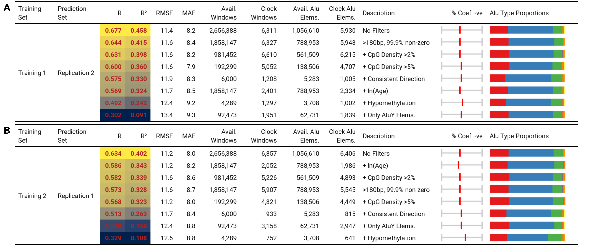
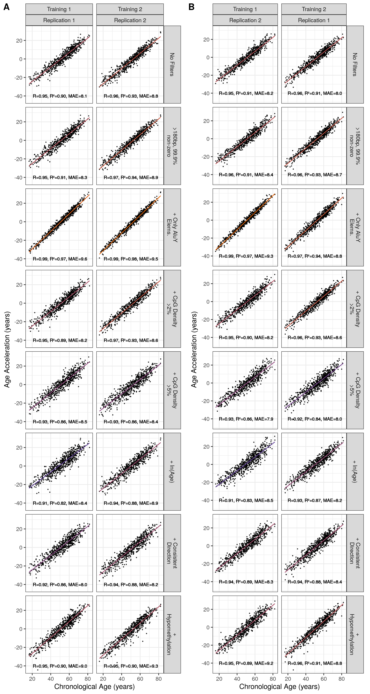

# DNA methylation clocks in Alu Elements {#Alus}

## Abstract 

## Introduction {#AluIntro}

As we age biological systems from the molecular to the macroscopic undergo functional decline.
This increasingly impaired function with time results in increased risk for a wide variety of chronic disease states and indeed for co-morbidities with these conditions.
Ranging from the cardiovascular, opthalmic, and musculoskeletal through to neurological conditions and obesity, all have age as a primary risk factor [@Partridge2018].
Among the molecular changes that occur with age are alterations to the epigenome [@Booth2016].
The epigenome here refers to: The chemical modifications to the genome and the molecules which package it. 
These modifications do not affect the genomic sequence but do impact the accessibility or expression of the genome in different contexts, such as different cell-types [@Bird2007]. 

Approximately 45% of the human genome is comprised of repetitive or transposable elements [@Deniz2019; @Kazazian2017].
The repression of these elements to prevent their expansion or the impact of their latent regulatory potential from effecting genomic stability and regulation is a core function of epigenetic mechanisms [@Gregory2005].
The most common DNA modification, 5-methylcytosine (5mC) at CpG loci, exhibits the most well documented age-related changes, and plays a central role in the repression of repetitive and transposable elements [@Lopez-Otin2013].
DNA methylation also classically functions to repress gene expression at promoters [@Deaton2011], similar to the repressive role that is plays at repetitive elements.
Beyond solely repressive effects, DNA methylation in gene bodies can modulate expression [@Hellman2007] and influence splicing patterns [@Shukla2011].
Furthermore, DNA methylation levels at transcription factor binding sites (TFBS) modulate the binding affinity of transcriptions factors for these sites [@Blattler2014; @Yin2017].

Significant decreases in bulk 5mC with age [@Wilson1983] and in cancer tissues [@Gama-Sosa1983] are among the earliest pioneering measure of global DNAm changes.
Demethylation of repetitive elements was thought to be a major contributor to the global decreases in 5mC [@Bollati2010].
More recent studies using methods able to resolve the genomic position of DNA methylation changes have revealed that some regions of the genome show increasing DNA methylation with age.
Notably, the promoters of polycomb target genes [@Teschendorff2010], bivalent chromatin domains [@Rakyan2010] and specific tRNA genes [@Acton2020].

Alu elements are the single most abundant transposon in the human genome with ~1.19 million copies and comprising ~10.7% of the total genomic sequence [@Dewannieux2003; @Deininger2011].
Alu elements are members of the short interspersed nuclear elements (SINEs) family of retrotransposons, are ~300bp in length, and are derived from the 7SL RNA gene [@Ullu1984].
The Alu elements arose from the 7SL sequence via the FAM sequences, which gave rise to truncated variants, FRAM and FLAM the fusion of which yielded the current dimeric Alu sequence [@Quentin1992].

```{r AluStruct, fig.cap="(ref:AluStruct-Cap)", out.width='90%', fig.show='hold', fig.align = 'center', echo=FALSE}

```
(ref:AluStruct-Cap) __Structure of an Alu element__ A complete Alu element contains the A and B box sequence elements from an RNA polIII promoter, a central A rich region, a short insertion in the right arm, and a poly A region involved in retrotransposition and insertion. There is not an explicit polIII terminator in the Alu sequence so transcription continues through arbitrary flanking sequence until a run of at least 4 Ts, is encountered [@Chen2008; @Batzer2002]. FLAM sequences are the origin of the Left arm and FRAMs the origin of the Right [@Quentin1992.

Alus are primate specific and arose ~65 million years ago (MYA), with a peak in amplification around ~40 MYA (Figure \@ref(fig:AluAge)) [@Ade2013].
Non-LTR retrotransposons, including Alu, L1 and SVA elements, are active in humans.
However, Alu elements are non-autonomous and require the presence of an L1 element to provide the molecular machinery needed for retrotransposition [@Cordaux2009]. 
Mutagenesis arising from Alu element insertion and Alu element mediated recombination is responsible for an estimated 0.4% of all human genetic disorders [@Kazazian2017; @Belancio2008]

```{r AluAge, fig.cap="(ref:AluAge-Cap)", out.width='90%', fig.show='hold', fig.align = 'center', echo=FALSE}

```
(ref:AluAge-Cap) __Alu element Age and history of expansion in primates__ Mya (milion years ago). Reproduced from Batzer & Deininger 2002 [@Batzer2002].

Alu elements are CpG rich (Figure \@ref(fig:AlusWindowsCpGdLVplot)), accounting for ~7.5 million CpGs, or ~25% of all human CpG sites [@Deininger2011].
High levels of DNA methylation predominate at Alu elements across normal tissues.
Furthermore Alu elements are more resistant to hypomethylation than other repetitive elements in cancer cells.
This is indicative of strong pressure to maintain their repressed state [@Jorda2017].

```{r AlusWindowsCpGdLVplot, fig.cap="(ref:AlusWindowsCpGdLVplot-Cap)", out.width='80%', fig.show='hold', fig.align = 'center', echo=FALSE}
#

```
(ref:AlusWindowsCpGdLVplot-Cap) __Alu elements are CpG dense__

Alu elements contain many sequences with the potential to effect gene regulation, and indeed do effect gene expression [@Chen2017b; @RobertoFerrari2019].
There are numerous TFBSs in the canonical Alu sequence [@Polak2006], and some may possess enhancer activity [@Su2014].
Thus deterioration in the effectiveness of the repression of Alu elements has the potential to disruptively expose this latent regulatory function [@Ward2013; @Chuong2017; @Xie2013].
Epigenetic reactivation of cryptic cis-regulatory elements (CREs) within transposons has been show to act as an oncogenic driver [@Jang2019], including specifically from Alu elements [@Rajendiran2016].
De-repression of Alu elements also has the potential to influence common non-malignant diseases [@Chuong2017; @Payer2017].

Quantitative assays of DNA methylation with high positional resolution which cover a large number of loci, combined with statistical methods for sparse regression analysis have permitted the construction of ‘DNA methylation clocks‘ which predict chronological age with a high degree of accuracy [@Horvath2018; @Bell2019].
The difference between chronological and predicted age know as the 'age acceleration' has been found to capture aspects of biological ageing in a number of these clocks.
For example, Age acceleration is a strong predictor of all-cause mortality [@Marioni2015].
Whilst DNA hypermethylation and hypomethylation are driven by distinct mechanisms [@Mozhui2017; @Wu2017] CpGs undergoing these processes are approximately equally represented in DNA methylation clocks.
Interestingly however, hypomethylating CpGs were identified by Zhang et al. to be the most indicative of biological ageing-related all-cause mortality effects in blood [@Zhang2017].
Most DNA methylation clocks constructed in humans have been constructed using the Illumina bead chip array based DNA methylation assays. 
The coverage of these assays is strongly focused on promoters [@Bibikova2009], CpG islands [@Bibikova2011], and more recently enhancers [@Moran2015].
However, array coverage of repetitive elements is lacking due in part to the technical challenges of accurate mapping in these spaces [@Bell2019].
Thus, much of the genomic hypomethylation goes uncovered by the assays most commonly used to construct human epigenetic clocks.

In this study elastic net regression models were used to construct age predictors comprised of the DNA methylation state of Alu elements. 
DNA methylation data at Alu elemetns was drawn from a large (>3,000) immunoprecipitation-derived sequencing-based dataset (MeDIP-seq) from peripheral blood DNA.
Alu-specific DNA methylation ageing clocks were constructed and compared to other clocks' measures. The best performing Alu age predictor had a Pearson correlation coefficient of 0.65 and a median absolute error of 8.1 years. 

\newpage

## Methods

### DNA methylome data 

The Methylated DNA Immunoprecipitation sequencing (MeDIP-seq) data was processed as previously described [@Bell2016; @Bell2017a] and detailed in [Methods](#MeDIPseq) \@ref(MeDIPseq).
These processed data are available from the European Genome-phenome Archive (EGA) (https://www.ebi.ac.uk/ega) under study number EGAS00001001910 and dataset EGAD00010000983 and were generated by BGI Shenzen for TwinsUK.

`MEDIPS` (v1.0) was used for the MeDIP-seq analysis [@Lienhard2014].
This produced reads per million base pairs (RPM) values binned into 500bp windows with a 250bp slide in the BED format, resulting in ~12.8 million windows on the genome.

### Alu element annotation and pre-filtering 

Alu element annotations were taken from Repeat Masker [@Smit2009], only Alus on the autosomes were considered.
2,758,588 500bp windows with a 250bp slide overlapped the 1,137,653 Alu elements annotated.

Technically problematic and genetically confounded Alu element loci were removed.
Alu elements located in [blacklisted](https://github.com/Boyle-Lab/Blacklist/raw/master/lists/hg19-blacklist.v2.bed.gz) 834 regions of the hg19 genome, as identified by Amemiya et al. [@Amemiya2019] were excluded as candidate loci when constructing DNAm clocks.
Alu elements overlapping [known structural variants](ftp://ftp.1000genomes.ebi.ac.uk/vol1/ftp/phase3/integrated_sv_map/ALL.wgs.mergedSV.v8.20130502.svs.genotypes.vcf.gz) identified by the 1000 genomes project [@Fairley2020; @Payer2017] were excluded as candidate clock loci.
Genetic variants which impact on the rate of biological ageing could confound DNA methylation ageing signal.
Haplotype specific methylation peaks, in which a common disease associated genetic variant is predictive of DNA methylation state, were also excluded from the clock; Bell et al. identified  7,173 such regions [@Bell2017a].
To exclude loci with low coverage which are likely to be uninformative and noisy a zero filter was used.
In quantile normalised data loci in which 0.1% or more of samples have an RPM value of 0 are excluded.

### Elastic net regression

[`Bigstatsr`](https://privefl.github.io/bigstatsr/) was used to fit penalised regression models [@Prive2019].
Elastic net regression with an $\alpha$ = 0.5, and cross-model selection and averaging (CMSA) with 10 fold cross-validation was used.
This procedure obviates the necessity of selecting a $\lambda$ regularisation hyperparameter.
CMSA generates model coefficient by averaging across coefficients generated by cross-validation [@Prive2019; @Friedman2010; @Tibshirani2012].

### Sample Selection

Two training and two replication sets were created from the twin data so as to permit the training and replication sets to be unrelated. 
The training sets, which were permitted to contain singletons, contained 1548 individuals and the replication sets contained the 1308 individuals who where twins of those in the replication sets.
The 1548 individuals in the training sets were randomly split into 2 groups of 774 the replication set for each training set was comprised of the twins of the other training set such that two training sets with unrelated replication sets could be constructed (Figure \@ref(fig:twinsplit)).
Giving a total of 2856 individuals in all sets.

```{r twinsplit, fig.cap="(ref:twinsplit-Cap)", out.width='100%', fig.show='hold', fig.align = 'center', echo=FALSE}

```
(ref:twinsplit-Cap) __Construction of training and replication sets__ Twin pairs were split one twin in each group. The first group was twins was split into two groups with a random number generator. The twins of the individuals in one random half of the group were assigned to be the replication set for the other half, producing two sets of unrelated training and replication groups. Models were also used to predict the age of related individuals to gauge the effect of genetic factors on the predictive power of the models.

The age distribution of these training and replication sets are highly similar (Figure \@ref(fig:setsAgeDist)).

```{r setsAgeDist, fig.cap="(ref:setsAgeDist-Cap)", out.width='90%', fig.show='hold', fig.align = 'center', echo=FALSE}
knitr::include_graphics("./figs/setsAgeDist.png")
```
(ref:setsAgeDist-Cap) __Age distribution of training and replication sets__ Training 1 (n = 774); Training 2 (n = 774); Replication 1 (n = 664), unrelated to Training 1; Replication 2 (n = 644), unrelated to Training 2.

All sets are comprised of ~2/3 Monozygotic (MZ) twins and ~1/3 Dizygotic (DZ) twins, exact numbers are detailed in (Figure \@ref(fig:mzdzsplitplot)).

```{r mzdzsplitplot, fig.cap="(ref:mzdzsplitplot-Cap)", out.width='90%', fig.show='hold', fig.align = 'center', echo=FALSE}
knitr::include_graphics("./figs/mzdzsplitplot.png")
```
(ref:mzdzsplitplot-Cap) __Zygosity Make-up of sets__ Replication 1 (n = 664, 225 DZ, 439 MZ); Replication 2 (n = 644, 204 DZ, 440 MZ), Training 1 (n = 774, 256 DZ, 518 MZ); Training 2 (n = 774, 269 DZ, 505 MZ).

### Binarisation

Binarisation of DNA methylation data was achieved by a simple procedure: assigning windows in a given sample a DNA methylation value of 1 if their DNA methylation value was greater than the median RPM value for this window across samples and a 0 if it was less.

Binarisation of gene expression data yielded increased predictive accuracy in gene expression based ageing clocks [@Meyer2020]. 
The reasoning behind this approach is that the quantitation of changes in gene expression is noisy and binarising the data may reduce the noise whilst retaining the information important for age prediction.

### Comparisons to other clocks in TwinsUK Illumina 450k array data {#AluMethodsArrays}

Illumina Infinium DNA methylation 450k arrays ((C) Illumina) were also performed on TwinsUK participants ([Methods](#GenMethodsMethArray) \@ref(GenMethodsMethArray)).
574 Blood-derived DNA samples had matched MeDIP-seq data not used in the training or replication sets in the Alu clock analysis.
These data were available for this analysis in a pre-processed form, Methylation 'beta' values subject to beta-mixture quantile normalisation (BMIQ) as previously described [@Bell2016; @Bell2017a].

DNA methylation ages were computed for the Horvath [@Horvath2013], Hannum et al. [@Hannum2013] and Levine et al. 'PhenoAge' [@Levine2018] clocks, using the coefficients, intercept values and transformations specified the original publications, and a model of the form:
$DNAmAge = a\beta_{probe\ 1} ... b\beta_{probe\ n} + intercept$
Where *a*, *b* and *intercept* are model parameters provided by the authors of the respective DNAm age predictors. 
In the absence of an intercept value 0 was used, in the case of the Hannum clock.
Age acceleration values were computed as the predicted age minus the chronological age.

### Genetic Association for Alu-Clock

===
The study included X participants with both genotypic and phenotypic data from the TwinsUK adult twin registry (see Methods chapter).

Genotyping of the TwinsUK cohort was done with a combination of Illumina HumanHap300 and HumanHap610Q chips – cite Hysi[1] - plus more details of this in there

Intensity data for each of the arrays were pooled separately and genotypes were called with the Illuminus32 calling algorithm, thresholding on a maximum posterior probability of 0.95. After pre-phasing using Eagle v2.4[2], imputation was performed using the Minimach 3.0 software package[3], using haplotype information from the HRC r1.1 2016 reference panel[4].

Using the software GEMMA[5], linear mixed models were fitted to test for associations between the phenotypes and genetic variants. 

For each variant a linear mixed model was built, taking into account the family relatedness arising from the presence of siblings in the cohort (Pirro is checking specifically what he included)

P value to assess the probabilities of associations - suggestive threshold 1x10-5, significant 5x10-8

 

[1] Hysi, Pirro G., et al. "A genome-wide association study for myopia and refractive error identifies a susceptibility locus at 15q25." Nature genetics 42.10 (2010): 902-905.

2Loh, Po-Ru, Pier Francesco Palamara, and Alkes L. Price. "Fast and accurate long-range phasing in a UK Biobank cohort." Nature genetics 48.7 (2016): 811-816.

3Das, Sayantan, et al. "Next-generation genotype imputation service and methods." Nature genetics 48.10 (2016): 1284-1287.

4McCarthy, Shane, et al. "A reference panel of 64,976 haplotypes for genotype imputation." Nature genetics 48.10 (2016): 1279-1283.

5Zhou, Xiang, and Matthew Stephens. "Genome-wide efficient mixed-model analysis for association studies." Nature genetics 44.7 (2012): 821-824.
===

\newpage

## Results

A variety of different initial filtering criteria were applied to the Alu elements included in the models, as well as a number of data transformations. 
Pre-filtering steps were performed partially for quality control and partially to see if subsets of the Alu space with biologically interesting differences could yield clocks of equivalent accuracy but which might capture different aspects of biological ageing related to repeat de-repression.

Preliminary analysis were carried out using RPM values, Quantile normalised RPM values, Absolute methylation value estimates from `MEDIPS` and Binarised DNA methylation data.
Quantile normalised RPM values yielded the best and most consistent results and were used in subsequent analyses.

Whilst Human epigenetic age is logarithmic with time across the lifespan the effects of this are more relevant at younger ages [@Snir2019]. 
We fitted Alu Clock models on the natural logarithm of age in years this did not improve the quality of predicted to actual age values, likely due in part to the older age distribution of our data. 

An Alu element length filter of at least 180bp or approximately two-thirds the length of a full length Alu element (~280bp) was imposed. 
This minimises the number of reads with the potential to misalign to other Alu elements, reads which, in this context, could lead to reduced accuracy of positionally specific Alu DNA methylation estimates [@Hellen2013].

CpG density filters were employed to prioritise regions likely to have dynamic and functionally interesting differences in DNA methylation.
Filters were used for CpG densities above the genomic background of 2%, as well as for >5% the approximate threshold for CpG island shores and low methylation regions [@Stadler2011; @Irizarry2009].

To limit the selection of predictive sites to those likely to have consistent directions of change across samples a clock was constructed with only windows which show nominally significant changes in both members of an MZ twin pair in a consistent direction.
Linear models to predict age based on DNA methylation were fitted for 687 pairs of monozygotic (MZ) twins. 
Batch information and blood cell counts (eosinophils, lymphocytes, monocytes, neutrophils) were included as covariates.

To produce a model that specifically captures age as a function of the de-repression of Alu elements clocks were also constructed with only windows which exhibited nominally significant (p < 0.05) decreases in DNAm in both MZ twins.
This filtering was based on the model used in selecting windows with a consistent direction of change. 

An age predictor was also constructed using only AluY elements.
AluY is the youngest (Figure \@ref(fig:AluAge)), and most CpG dense \@ref(fig:AlusWindowsCpGdLVplot) family of Alu elements.
Having a CpG density closer to that of typically de-repressed functional elements may make such elements more readily susceptible to stable de-repression.
In addition the host genome has had less time to adapt to the presence of these elements so their de-repression may be more disruptive than older elements.

Figure \@ref(fig:modelSummaryTabsMain) summarises the details of Alu clocks trained with these various pre-filtering criteria applied to their starting sets.
The correlation with the predicted age and the chronological age of samples unrelated to the individuals on which the clock was trained indicate model quality (Figure \@ref(fig:corplotsPanelSplit) a).
The Quality of the Alu clock predictions is quite poor in comparison to other DNA methylation clocks with the highest R of 0.65 and a median absolute error of 8.1 years, compared to 0.96 and 3.6 years for Horvath's multi-tissue clock [@Horvath2013].

```{r modelSummaryTabsMain, fig.cap="(ref:modelSummaryTabsMain-Cap)", out.width='100%', fig.show='hold', fig.align = 'center', echo=FALSE}

AluColours <- c(
	"AluY" = "#e41a1c",
	#"Y" = "#e41a1c",
	"AluS" = "#377eb8",
	#"S" = "#377eb8",
	"AluJ" = "#4daf4a",
	#"J" = "#4daf4a",
	"FAM" = "#984ea3",
	"FLAM" = "#ff7f00",
	"FRAM" = "#ffff33"
)
alucolorkeytxt <- paste0(
	collapse = ", ",
	purrr::map2(
		names(AluColours), AluColours, ~kableExtra::text_spec(.x, color = .y)
	)
)
```
(ref:modelSummaryTabsMain-Cap) __Alu Clock Model Summaries__ *A)* Models fitted with Training 1 set predicting Replication 1 ages. *B)* Models fitted with Training 2 set predicting Replication 2 ages. Alu Type Composition Colour code: `r alucolorkeytxt`. R is Pearson's correlation coefficient. RMSE = root mean squared Error, MAE = median absolute error.  '+' signifies this filter is in addition to element length >180bp and 99.9% non-zero RPM values at this locus.

Figure \@ref(fig:modelSummaryTabsCtrl) shows the model summaries when correlations are computed for for the related sets comprised of the twins of individuals in the training set.
The correlations are mostly slightly higher for this prediction than for the prediction of unrelated individuals (Figure \@ref(fig:corplotsPanelSplit) b).
This suggests that there are not large genetic effects on the models as their predictive efficacy is only marginally better when employed to predict the age of individuals closely related to the training set compared to unrelated individuals.

```{r modelSummaryTabsCtrl, fig.cap="(ref:modelSummaryTabsCtrl-Cap)", out.width='100%', fig.show='hold', fig.align = 'center', echo=FALSE}

```
(ref:modelSummaryTabsCtrl-Cap) __Summaries of Alu Clock Models Predicting Twin Groups__ for the purpose of comparing predictive of age models in related and unrelated samples. *A)* Models fitted with Training 1 set predicting Replication 2 ages. *B)* Models fitted with Training 2 set predicting Replication 1 ages. Alu Type Composition Colour code: `r alucolorkeytxt`. R is Pearson's correlation coefficient. RMSE = root mean squared Error, MAE = median absolute error.  '+' signifies this filter is in addition to element length >180bp and 99.9% non-zero RPM values at this locus.

```{r corplotsPanelSplit, fig.cap="(ref:corplotsPanelSplit-Cap)", out.width='100%', fig.show='hold', fig.align = 'center', echo=FALSE}

```
(ref:corplotsPanelSplit-Cap) __Correlation of Predicted with Chronological Age Across Models__ MAE = median absolute error. Orange = High $R^2$, purple = low $R^2$. '+' signifies this filter is in addition to element length >180bp and 99.9% non-zero RPM values at this locus.

## Comparison to other DNA methylation clocks

To compare the Alu clock results with those of other DNA methylation age clocks DNAm age was predicted for the: Horvath [@Horvath2013], Hannum et al. [@Hannum2013] and Levine et al. 'PhenoAge' [@Levine2018] clocks ([Methods](#AluMethodsArrays) \@ref(AluMethodsArrays)) using samples for which both DNA methylation array data and MeDIP-seq data was available (n = 574).
The array based clocks all perform similarly with R values in excess of 0.8, the Alu clock only attains an R of 0.46, though with a narrower error than PhenoAge.
This however, is not entirely surprising given that PhenoAge aims to capture ageing phenotypes and not narrowly chronological age.

```{r ageVsPredage, fig.cap="(ref:ageVsPredage-Cap)", out.width='90%', fig.show='hold', fig.align = 'center', echo=FALSE}

```
(ref:ageVsPredage-Cap) __Correlation of Alu Age Acceleration with Chronological Age Across Models__ MAE = median absolute error. Orange = High $R^2$, purple = low $R^2$. Alu Clock here refers to the unfiltered model trained on the Training 1 set.

```{r aluclockageVsPredageSingle, fig.cap="(ref:aluclockageVsPredageSingle-Cap)", out.width='90%', fig.show='hold', fig.align = 'center', echo=FALSE}

```
(ref:aluclockageVsPredageSingle-Cap) __Correlation of Alu Age Acceleration with Chronological Age Across Models__ MAE = median absolute error. Orange = High $R^2$, purple = low $R^2$. Alu Clock here refers to the unfiltered model trained on the Training 1 set.

### Alu Age Acceleration

The age acceleration values (Chronological - Predicted Age) for the Alu clocks are strongly correlated with chronological age (Figure \@ref(fig:accelCorplotsPanelSplit)), unlike the age acceleration of the Horvath DNA methylation clock and others (Figure \@ref(fig:ageVsAgeAccelAluVsOther)).
The older the in individual and more prone their age is to be overestimated and vice versa.
This means that Alu clock age acceleration values cannot be used independently of chronological age to make statements about biological age.

```{r accelCorplotsPanelSplit, fig.cap="(ref:accelCorplotsPanelSplit-Cap)", out.width='90%', fig.show='hold', fig.align = 'center', echo=FALSE}

```
(ref:accelCorplotsPanelSplit-Cap) __Correlation of Alu Age Acceleration with Chronological Age Across Models__ MAE = median absolute error. Orange = High $R^2$, purple = low $R^2$. '+' signifies this filter is in addition to element length >180bp and 99.9% non-zero RPM values at this locus.

```{r ageVsAgeAccelAluVsOther, fig.cap="(ref:ageVsAgeAccelAluVsOther-Cap)", out.width='90%', fig.show='hold', fig.align = 'center', echo=FALSE}
knitr::include_graphics("./figs/age_vs_age_accel_alu_vs_other.png")
```
(ref:ageVsAgeAccelAluVsOther-Cap) __Correlation of Age Acceleration with Chronological Age Across Models__ MAE = median absolute error. Orange = High $R^2$, purple = low $R^2$. Alu Clock here refers to the unfiltered model trained on the Training 1 set. '+' signifies this filter is in addition to element length >180bp and 99.9% non-zero RPM values at this locus.

Age acceleration in the Alu clocks is not strongly correlated with age acceleration in the Horvath, Hannun or PhenoAge clocks.

```{r aluClockAccelVsOthers, fig.cap="(ref:aluClockAccelVsOthers-Cap)", out.width='60%', fig.show='hold', fig.align = 'center', echo=FALSE}
knitr::include_graphics("./figs/alu_clock_accel_vs_others.png")
```
(ref:aluClockAccelVsOthers-Cap) __Correlation of Alu Age Accelerations with Age Acceleration from Other Models__ MAE = median absolute error. Orange = High $R^2$, purple = low $R^2$. Alu Clock here refers to the unfiltered model trained on the Training 1 set. '+' signifies this filter is in addition to element length >180bp and 99.9% non-zero RPM values at this locus.

\newpage

## Discussion

The criteria for being called an epigenetic clock layed out by Horvath & Raj [@Horvath2018] are that an r > 0.8 should be achieved by the clock.
By this metric the Alu age predictors generated here should not be considered epigenetic clocks.

The age acceleration of the Alu age predictors in strongly correlate with age.
This may be due the the relatively poor ability of MeDIP-seq to provide absolute quantitation of DNA methylation.
There is substantial technical noise in the value representing DNA methylation at a given locus.
The observed systematic bais towards underestimating the ages of the young and overesimating the ages of the old may be explained by a broadly consistent direction with an inconsistent magnitude. 
Simply scaling the value of given locus by a fixed model coefficient when there is a large amount of variation leads to outsized of high magnitude outliers on the age estimates.

It was an aim of this work to investigate the genetic influences on the Alu clock based measures of age-acceleration, as has been with shown previously with an association in the TERT gene with the Horvath clock [@Lu2017], [@Gibson2019]. 
These results had the potential to reveal mechanisms involved in controlling the epigenetic state of this large portion of the genome.
However the strong relationship with Age acceleration and Chronological age in the Alu clock measures of age acceleration renders this difficult as age would be a potent confounder of age acceleration in this instance.


