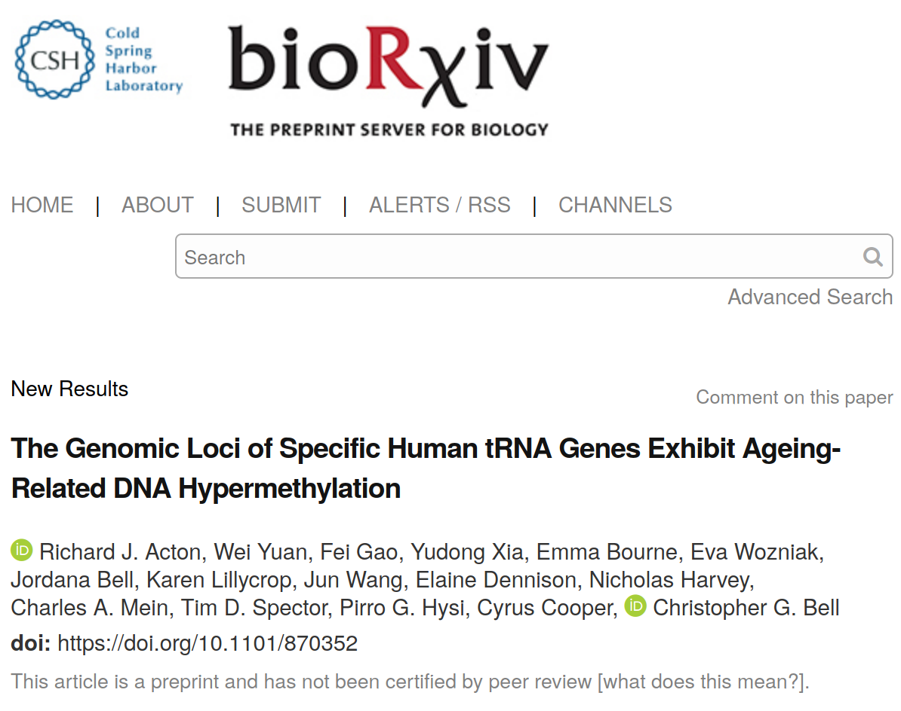

# Appendices {-}

## $BioR\chi iv$ manuscript: The Genomic Loci of Specific Human tRNA Genes Exhibit Ageing-Related DNA Hypermethylation

$Richard J. Acton ^{1,2,3}$, $Wei Yuan ^{4,5}$, $Fei Gao ^{6}$, $Yudong Xia ^{6}$, $Emma Bourne ^{7}$, $Eva Wozniak ^{7}$, $Jordana Bell ^{4}$, $Karen Lillycrop ^{3}$, $Jun Wang ^{6}$, $Elaine Dennison ^{2}$, $Nicholas Harvey ^{2}$, $Charles A. Mein ^{7}$, $Tim D. Spector ^{4}$, $Pirro G. Hysi ^{4}$, $Cyrus Cooper ^{2}$, $Christopher G. Bell ^{1}$

1. William Harvey Research Institute, Barts & The London School of Medicine and Dentistry, Charterhouse Square, Queen Mary University of London, London, U.K.
2. MRC Lifecourse Epidemiology Unit, University of Southampton, Southampton, U.K.
3. Human Development and Health, Institute of Developmental Sciences, University of Southampton, Southampton, U.K.  
4. Department of Twin Research & Genetic Epidemiology, St Thomas Hospital, King’s College London, London, U.K.
5. Institute of Cancer Research, Sutton, U.K.
6. BGI-Shenzhen, Shenzhen, China
7. Barts & The London Genome Centre, Blizard Institute, Barts & The London School of Medicine and Dentistry, Queen Mary University of London, London, U.K.

the pre-print is included as a [pdf file](Supplementary_Files/SF10_tRNApaper.pdf) with the supplementary data.

[$bioR \chi iv$](https://doi.org/10.1101/870352) [@Acton2020]

[Under Consideration at Nature Communications](https://nature-research-under-consideration.nature.com/users/37265-nature-communications/posts/57741-the-genomic-loci-of-specific-human-trna-genes-exhibit-ageing-related-dna-hypermethylation)

## Specific tRNA annotations used in the tRNA analyses {#apptRNAanno}

[Supplementary_Files/SF5_hg19-tRNAs.bed](Supplementary_Files/SF5_hg19-tRNAs.bed)

## tRNA targeted bisulfite sequencing primers {#apptRNAprimers}

[Supplementary_Files/SF6_Targeted_BiS-seq_Primers.txt](Supplementary_Files/SF6_Targeted_BiS-seq_Primers.txt)

## Additional tRNA Age modelling results {#apptRNAmods}

Full age model results for all tRNA genes and all model fitted with different covariates and subsets of the MeDIP-seq Data.

[Supplementary_Files/SF1_MeDIPseqtRNACombinedModelSummariesXL.xlsx](Supplementary_Files/SF1_MeDIPseqtRNACombinedModelSummariesXL.xlsx)

## tRNA mouse models {#apptRNAmouse}

[Supplementary_Files/SF4_mouse_tRNA_age_models.xlsx](Supplementary_Files/SF4_mouse_tRNA_age_models.xlsx)

## tRNA proportional enrichment fisher's test count data {#apptRNAprop}

[Supplementary_Files/SF11_prop_enrich_fishers.xlsx](Supplementary_Files/SF11_prop_enrich_fishers.xlsx)

## TCGA sample used in tRNA analysis {#appTCGA}

[Supplementary_Files/SF7_TCGA_samples_used.tsv](Supplementary_Files/SF7_TCGA_samples_used.tsv)

## Twins UK 450k array tRNA age models {#apptwins450ktRNA}

[Supplementary_Files/SF3_TwinsUK_450k_blood_tRNA_Age_Models.xlsx](Supplementary_Files/SF3_TwinsUK_450k_blood_tRNA_Age_Models.xlsx)

## MAVIDOS RXRA and CDKN2A probe models {#appRXRACDKN2A}

[Supplementary_Files/SF12_vitD_bone_meth_model_results.xlsx](Supplementary_Files/SF12_vitD_bone_meth_model_results.xlsx)

## Age acceleration GWAS SNPs {#appAluageSNPs}

model 1 [Supplementary_Files/SF8_suggestivem1full.tsv](Supplementary_Files/SF8_suggestivem1full.tsv) 

model 2 [Supplementary_Files/SF9_suggestivem2full.tsv](Supplementary_Files/SF9_suggestivem2full.tsv)
