--- 
title: "The Epigenomics of Human Ageing"
author: "Richard J. Acton"
date: "`r Sys.Date()`"
site: bookdown::bookdown_site
output: bookdown::gitbook
link-citations: yes
linkcolor: blue
linestretch: 1.5
documentclass: book
bibliography: "`r normalizePath('~/Documents/bibtex/library.bib')`"
csl: "`r normalizePath('~/Documents/bibtex/genomebiology.csl')`"
github-repo: 
description: "PhD Thesis"
subtitle: |
  The Epigenomics of Human Ageing
  
  Academic Unit - Human Development and Health
  
  Supervisors - Chris Bell, Karen Lillycrop and Cyrus Cooper
---

```{r,include=FALSE,echo=FALSE}
suppressPackageStartupMessages({
	#library(DiagrammeR)
	library(tidyverse)
	#library(gt)
	library(kableExtra)
  options(kableExtra.auto_format = TRUE)
})
```

# Abstract {-}

...

# Acknowledgements {-}

I would like to acknowledge Nevena Krstic for her work extracting the DNA for the MAVIDOS EPIC array analysis and Dr Millie Parsons for her assistance with with the MAVIDOS sample metadata, as well as Dr Beth Curtis and Professor Nick Harvey for their assistance with framing the research questions for the vitamin D and bone development outcomes work with the MAVIDOS samples. I would like to acknowledge Nikki Graham for her assistance identifying suitable samples for targeted bisulfite sequencing work and her work extracting DNA from those samples. I acknowledge the use of the IRIDIS High-Performance Computing Facility, and associated support services at the University of Southampton, in the completion of this work. Finally, I would like to acknowledge the extensive help and support of my primary supervisor Dr Chris Bell.

<!--chapter:end:index.Rmd-->

# Introduction

## The Ageing Population and The Burden of Disease

The global population is ageing as is evident from the changing shape of the world population pyramid (figure \@ref(fig:poppyramid)).
The increase in average lifespan underlying this demographic shift is projected to continue in industrialised nations with a probability of >65% for women and 85% for men [@Kontis2017] (figure \@ref(fig:Kontis2017-fig1)).
Ageing is the main risk factor for cancer, cardiovascular, neurodegenerative diseases, and many other conditions including osteoarthritis [@Niccoli2012]. Furthermore, mortality from these conditions increases according to a logistic function with age [@Belikov2019] (figure \@ref(fig:Belikov2019-fig1)).
In addition to the non-infectious diseases, immunosenescence and frailty in old age contribute to increased mortality from infectious diseases, as exemplified by dramatically higher hospital admissions and deaths for respiratory disease during seasonal flu epidemics in the over 75s [@Fleming2005] (figure \@ref(fig:Fleming2005-fig3)).
Ageing is a common underlying risk factor for many conditions and as this would lead one to expect the number of concomitant disorders and the proportion of persons with multiple morbidities increases with age [@Barnett2012] (figure \@ref(fig:Barnett2012-fig1)). 

```{r poppyramid, fig.cap='(ref:poppyramid-cap)', out.width='95%', fig.show='hold', fig.align = 'center', echo=FALSE}
knitr::include_graphics("figs/population-pryamids-1950-2019.png")
```

(ref:poppyramid-cap) __The Population is Getting Older__ Population pryamids for global population for A) 1950 and B) 2019 from [populationpyramid.net](populationpyramid.net)

```{r Kontis2017-fig1, fig.cap='(ref:Kontis2017-fig1-cap)', out.width='95%', fig.show='hold', fig.align = 'center', echo=FALSE}
knitr::include_graphics("figs/Kontis2017_fig1.jpg")
```

(ref:Kontis2017-fig1-cap) __The Population is Likely to Continue Getting Older__ Median projected increase in life expectancy from birth in the period 2010 to 2030 for 35 industrial nations reproduced from Kontis et al. 2017 figure 1 [@Kontis2017].

```{r Belikov2019-fig1, fig.cap='(ref:Belikov2019-fig1-cap)', out.width='80%', fig.show='hold', fig.align = 'center', echo=FALSE}
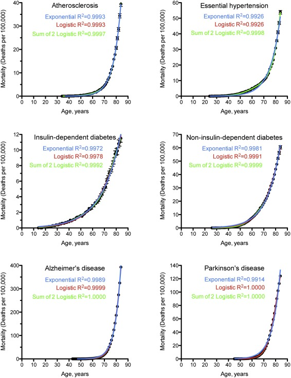
```

(ref:Belikov2019-fig1-cap) __Mortality from Age-Related Conditions Increases According to a Logistic Function with Age__ Morality rate in deaths per 100,000 at different ages for Atherosclerosis, Essential Hypertension, Insulin-dependent diabetes, Non-insulin-dependent diabetes, Alzheimer's disease, and Parkinson's disease. Showing Model fits for exponential, logistic and the sum of 2 logistic functions. Underlying Cause of Death data (1999-2015) were form the Centers for Disease Control and Prevention, Wide-ranging OnLine Data for Epidemiologic Research (CDC WONDER) database. Reproduced from Belikov 2019 figure 1 [@Belikov2019].

```{r Fleming2005-fig3, fig.cap='(ref:Fleming2005-fig3-cap)', out.width='90%', fig.show='hold', fig.align = 'center', echo=FALSE}
knitr::include_graphics("figs/Fleming2005_fig3.jpg")
```

(ref:Fleming2005-fig3-cap) __Mortality from Infectious Diseases Increases With Age__ Visits to  General practitioners, hospital admissions and deaths from respiratory disease in persons aged: (a) 45-64, (b) 65-74 and (c) 75 years and over. Reproduced from Fleming et al. 2005 figure 3 [@Fleming2005].

```{r Barnett2012-fig1, fig.cap='(ref:Barnett2012-fig1-cap)', out.width='80%', fig.show='hold', fig.align = 'center', echo=FALSE}
knitr::include_graphics("figs/Barnett2012_fig1.jpg")
```

(ref:Barnett2012-fig1-cap) __Number and Frequency of Comorbidities increase with Age__ Number of chronic disorders by age group. reproduced from Barnett et al. 2012 figure 1 [@Barnett2012].

Given the rapid increases in the rates of numerous diseases and the rate of death from those diseases as we age, there is a clear impetus to develop interventions to prevent and treat age-related diseases. 
The common factor among all these conditions is their relationship to age, but age is not merely a shared risk factor but frequently the largest; outside of rare genetic conditions which predispose to early-onset.
Thus understanding the underlying biological mechanisms of the ageing process and intervening in those mechanisms, has the potential to be vastly more effective and economical [@Goldman2016] than attempting to tackle diseases individually. 
The discovery in 1993 by Cynthia Kenyon and others [@Kenyon1993] that a single mutation in the *daf-2* gene of *C. elegans* could double the lifespan of this organism is often cited as an inflexion point in the confidence of the ageing research field that interventions in the process of ageing itself may be a realistic therapeutic target. What then do we know about the underlying biology of ageing?

## The biology of Ageing 

Ageing is characterised by a progressive deterioration of physiological integrity with time, resulting in an increased risk of mortality and morbidity.
Theories of how and why this occurs are numerous with a history in the scientific literature stretching back to the late 1800s [@Medvedev1990], setting aside, for now, theoretical frameworks for the process of ageing we will first consider the nature of these changes.
Changes at the organismal level have their origins in changes at the molecular and cellular scales. Lopez-Otin et al. 2013 [@Lopez-Otin2013] identified nine hallmarks of ageing in their 2013 review.
These hallmarks meet the criteria of: 
Manifesting during normal ageing. 
Accelerating ageing when aggravated. 
Retarding ageing when ameliorated.
The hallmarks are further subdivided and hierarchically arranged into primary, antagonistic and integrative categories.
Primary hallmarks are of unequivocally negative effect.
Antagonistic hallmarks arise as a response to the primary and are initially protective against these changes but become problems in their own right as they occur at higher levels over time.
Lastly, the integrative hallmarks directly impact on tissue function and homoeostasis.
The hallmarks are as follows:

__Primary Hallmarks - Causes of Damage__

1. *Genomic instability*: 
  Damage to the genomes of our cells occurs over time and accumulates as we age, this damage ranges from point mutations to large structural mutations, as well as mutations in the mitochondrial genome. 

2. *Telomere attrition*: 
  Telomere shortening occurs during the ageing process, somatic cells do not generally express telomerase so with each division telomeres grow shorter.
  Telomere exhaustion limits the replicative capacity of cells inducing replicative senescence, limiting regenerative potential but also protecting from the uncontrolled growth of cancer.

3. __Epigenetic alterations__: 
  Patterns of DNA methylation and of a number of histone modifications exhibit age-related changes. These contribute to the dysregulation of gene expression and derepression of heterochromatin regions which also increases the risk of genomic instability.
  
4. *Loss of proteostasis*: 
  production of protein folding chaperones in response to stress decreases with age, as does the activity of the two major proteolytic systems, the ubiquitin-proteasome system and the autophagy-lysosome system. 
  This leads to increased prevalence of misfolded, aberrant and aggregated proteins with age.

__Antagonistic Hallmarks - Responses to damage__

5. *Deregulated nutrient sensing*: 
  The IIS (insulin & insulin-like growth signalling) and TOR (Target Of Rapamycin) pathways signal nutrient abundance, promoting anabolism.
  The AMPK (5' adenosine monophosphate-activated protein kinase) and Sirtuins signal nutrient scarcity, promoting catabolism.
  Broadly speaking inhibiting the pro-anabolic pathways and activating the pro-catabolic pathways can extend lifespan.
  
6. *Mitochondrial dysfunction*: 
  Mitochondrial ATP production drops off with and ROS (Reactive Oxygen Species) production increases. Elevated ROS do not appear to accelerate ageing nor do elevated antioxidants retard it. 
  Indicating the primary function of ROS in ageing is not straightforwardly a result of oxidative damage, but may result from its role in stress signalling. 
  Dysfunctional mitochondria exhibit an increased propensity to polarise in response to stress, impacting on apoptotic signalling and inflammatory responses.
  This contributes to the increases in senescent cells and their chronic inflammatory phenotype.
  
7. *Cellular senescence*: 
  Senescent cells are in stable cell-cycle arrest induced by shortened telomeres, other forms of DNA damage, INK4/ARF derepression, or a variety of mitogenic/oncogenic signals.
  Induction of a senescent state in pre-cancerous cells protects against cancer and senescent cells are initially cleared by the immune system.
  However, these cells accumulate in tissue as we age without contributing to function and with a pro-inflammatory secretory phenotype that promotes chronic inflammation.

__Integrative Hallmarks - Proximal Causes of the Ageing phenotype__

8. *Stem cell exhaustion*: 
  Adult stem cells capable of producing new cells for the regeneration of tissues undergo asymmetric divisions to replace themselves and produce replicative progenitor cells to replenish tissue.
  Stem cells may accumulate damage and cease replicating or leave their quiescent state becoming overly replicative and potentially becoming senescent.
  This disrupts the supply of new cells for the renewal of tissue.
  
9. *Altered intercellular communication*: 
  The aforementioned cell-autonomous alterations alter external signalling behaviour of cells across intercellular signalling paradigms.
  This can lead to feedback loops that exacerbate the problem. The high background of pro-inflammatory signals from senescent cells dilutes already declining immune response and fewer senescent cells are cleared.

This work and therefore the following review of the literature focuses on the 3rd hallmark, epigenetic alterations, specifically the role of DNA methylation in ageing.
Booth & Brunet [@Booth2016] contend that epigenetic processes are a hub through which all of the other hallmarks of ageing are mediated and feed-back on one another (Figure \@ref(fig:Booth2016fig3)).
One of these interactions is between DNA damage and chromatin state including DNAm.
Sinclair and Oberdoerffer [@Sinclair2009] make the case that DNA damage and repair processes are disruptive to the epigenome and, with Hayano et al., link double-stranded DNA breaks to accelerated epigenetic ageing in a recent pre-print [@Hayano2019].
Kane & Sinclair [@Kane2019] make the case that reprogramming of the epigenome to a 'younger' state is a promising mode of intervention in the ageing process. 
Whilst loss of genetic information is effectively irreversible, loss of epigenetic information is not necessarily so. 
Dysregulation from the loss of epigenetic information is arguably proximate to age-related changes and may run ahead of significant genetic information loss such that intervening in the former may have beneficial effects in its own right and stave off the latter. 

```{r Booth2016fig3, fig.cap='(ref:Booth2016fig3-Cap)', out.width='60%', fig.align = 'center', echo=FALSE}
knitr::include_graphics("figs/Booth2016_F3_epigenomeHubAgingHallmarks_alpha.png")
```
(ref:Booth2016fig3-Cap) Epigenetic Changes as a hub for the hallmarks of ageing. (reproduced from [@Booth2016], figure 3)

Prior to examining the specific relationship of epigenetic changes to ageing we take a step back to define and outline epigenomics and examine the fundamentals of DNA methylation biology.

## Epigenomics - Overview

Epigenetics generally refers to modifications to DNA and chromatin which do not affect the primary sequence of DNA bases, but which are to varying degrees stable and heritable. 
The term derives from epigenesis and genetics originating with Conrad Waddington [@Waddington1942]. 
Epigenesis refers to the idea that organisms develop through the progressive differentiation of cells from the egg into adult tissues. 
As modern genetics revealed that every cell contained a complete copy of the genome which was differentially utilised by the cells of adult organisms, the terms were fused to reflect the study of how this occurs.
The usage has evolved a little further since molecular biology began to elucidate the mechanisms involved in this process and the term now frequently refers to the study of these mechanisms and their effects in less explicitly developmental contexts.
Arthur Riggs et al. considered that heritability should be a criterion for a mark to be considered epigenetic, but this excludes many phenomena now commonly referred to using the term [@Russo1996].
Requiring heritability results in a further definitional dispute over degrees of heritability; mitotic, meiotic, intergenerational, transgenerational and to what degree of fidelity?
Adrian Bird proposed the definition: "the structural adaptation of chromosomal regions so as to register, signal or perpetuate altered activity states." as a useful compromise [@Bird2007].
Epigenomics refers to the totality of the epigenetic modifications present in a particular cell, tissue type or genome.
This definition appears to have caught on with at least some as: 'These days, "epigenetics" more generally refers to all non-genomic information storage in cells including gene networks, chromatin structure and post-translational modifications to histones.', according to Alice Kane and David Sinclair [@Kane2019].

Whilst an organism can generally be thought of as having a single genome, with exceptions such as Somatic mutations and Chimerism, it will have at least as many epigenomes as it has cell types.
There are on the order of $10^{13}$ cells in the human body [@Bianconi2013].
Estimates of the number of cell types vary with the resolution at which one deems cells functionally distinct [@Regev2017].
At this point in time, however, there is no clear definition of what constitutes a distinct cell type, indeed they are beginning to be defined by the distinct patterns of gene expression and epigenetic modifications they exhibit [@CellSystemsCellType2017].
Consequently, the number epigenomes that could be considered distinct will likely ultimately approximate to the number of epigenomes which can usefully distinguish between sub-populations of cells.
A consortium has been established to produce a [Human Cell Atlas](www.humancellatlas.org) [@Regev2017] which aims to define all human cell types, and a cell type ontology [@CellOntologyOBO] exists.

There are a number of epigenetic modifications which can be subdivided into four broad categories:

1. __DNA modifications__

    DNA methylation primarily takes place on Cytosine residues. 
    Cytosine methylation occurs principally in an mCpG sequence context but can also occur in mCpH, mCHG and mCHH (H=A/C/T) contexts; particularly in cells of the nervous system [@Guo2014a] and embryonic stem cells where as many as 25% of all cytosines can be methylated in non-canonical contexts.
    In contrast to methylation in a differentiated non-neuronal tissue such as foetal lung fibroblasts which is 99.98% in CpG context [@Lister2009; @Schultz2015].
    5-methylcytosine (5mc) can be oxidised to produce and another modified DNA base 5-hydroxymethylcytosine (5hmC).
    5hmC may act as an intermediate to demethylation and potentially has regulatory functions in its own right, reviewed in [@Pfeifer2013].
    5hmC can be oxidised further to formylcytosine (5fC) and carboxylcytosine (5caC). 
    The extent to which these modifications are stable and functional is still being explored.
    Other DNA bases can be methylated such as N6-methyladenine, but this occurs at a substantially lower frequency that 5mC and much less is known about their potential functions [@Wu2016].

2. __Histone tail modifications__

    Histone proteins form disk-shaped octamers around which ~150bp of DNA can be wrapped to form a nucleosome. 
    The 'tails' are generally the N termini of the histone proteins, outside of the core globular domains, which protrude from the nucleosome structure. 
    Histone tails can be subject to post-translational modification which commonly takes place at lysine residues, other residues are subject to modifications but lysines are among the best characterised. 
    Examples of modifications include methylations with between one and three methyl groups per lysine, Acetylations, Ubiquitylation, SUMOylations, and phosphorylations (Reviewed in @Bannister2011).
    Many of these marks can be generally classified as permissive or repressive but are frequently found in combinations of marks of opposing effect, rendering the interpretation of the 'Histone Code' extremely challenging [@Voigt2012].
    One approach to interpreting chromatin state is segmentation. 
    Segmentation makes use of pattern discovery techniques to divide the genome into discrete sections assigning these sections to a set of categories which can then be compared to existing annotations to provide functional labels [@Hoffman2012; @Carrillo-de-Santa-Pau2017].
    When successful the pattern discovery algorithm independently recapitulates our existing ontology of functional elements and hopefully provides new insights by for example highlighting regions not previously considered to be in a given functional category. 
    This is a "top-down" approach making use of the "sum" of available chromatin state data rather than trying to interpret the significance of a single type of mark.

3. __Histone Variants__

    Alternatives to the canonical histones can be substituted in the nucleosome, examples of such alternative histones include H2A.Z and H3.3.
    Alternative histones can alter chromatin structure and dynamics by altering nucleosome stability, binding different factors, and presenting a different substrate for histone modifications, thus altering their pattern.       (reviewed in @Weber2014.)

4. __Some non-coding RNAs (ncRNA)__

    A subset of ncRNAs, particularly those which persist in close association with chromatin can fall within the definition of epigenetic features (reviewed in @Kaikkonen2011). 
    An example of such a long non-coding RNA (lncRNA) is Xist which is a key regulator of X inactivation [@Cerase2015].

## Fundamentals of DNA Methylation

### Structure and Context

DNA methylation is the most well-studied epigenetic modification [@Haluskova2010].
Specifically CpG methylation, the addition of a Methyl group to the 5 carbon of a cytosine base (figure \@ref(fig:5mCvsC)), in a CpG dinucleotide context (figure \@ref(fig:CpGvsGpC)).
(hereafter 'DNA Methylation' or 'DNAm' refers to 5mC CpG methylation unless stated otherwise.)

DNA methylation is stable and relatively easy to characterise from biological samples by comparison with other epigenetic marks, the methylation status of ancient DNA has even been characterised, see for example: 
DNAm profiles have been produced from DNA extracted from mammoth and neandertal remains [@Briggs2010] and native American remains ranging in age from 230 to 4500 years [@Smith2015].
5mC is quite chemically stable such that for most tissue sample preservation techniques for which DNA can be extracted from the sample DNAm can also be characterised. 
DNA extracted with normal laboratory methods can be assayed for DNAm.
Histone modification status, on the other hand, is less robust against environmental stresses on samples and often requires considerably more laborious sample preparation to characterise [@Bauden2017].
DNA methylation also offers the appearance of relative simplicity in comparison to the complex picture of the 'histone code' giving the impression that its useful interpretation may be more readily tractable.
However, interaction between DNAm and histone modifications is well documented [@Hashimshony2003; @Esteve2006; @Rose2014] consequently, a fuller understanding of DNAm will likely require an understanding of histone modifications and their potential to feedback on and thus affect DNAm.

```{r 5mCvsC, fig.cap='(ref:5mCvsC-Cap)',  out.width='80%', fig.show='hold', fig.align = 'center', echo=FALSE}
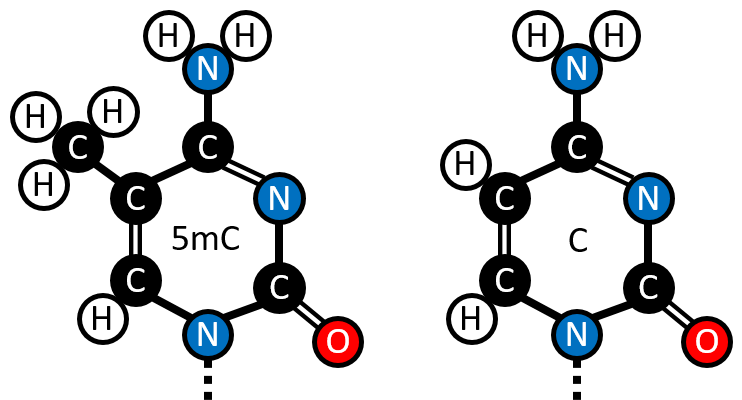
```

(ref:5mCvsC-Cap) The structure of 5-methylcytosine contrasted with Cytosine. (Figure created by the Author.)

```{r CpGvsGpC, fig.cap='(ref:CpGvsGpC-Cap)',  out.width='80%', fig.show='hold', fig.align = 'center', echo=FALSE}
knitr::include_graphics("figs/CpG_vs_GpC.png")
```

(ref:CpGvsGpC-Cap) A schematic representation showing a Methylated __CpG__ dinucleotide in its structural context. This is contrasted with a __GpC__ dinucleotide, which cannot be superimposed on a __CpG__. upper left: methylated cytosine residues in a __CpG__ dinucleotide, showing 5mC is 5' of G on both DNA strands. upper right: unmethylated cytosine residues in a __GpC__ dinucleotide, showing G is 5' of C on both DNA strands. lower: superimposition of a __GpC__ and __CpG__ dinucleotide illustrating the mirrored nature of these structures and the impossibility of superimposing them through rotation. (Figure created by the Author.)

### Distribution and Global Trends

There are 28,299,634 CpGs [@Luo2014] in the hg19 assembly of the human genome [@Lander2001].
Given that the GC content of the human genome is $42\%$ the prior probability of getting a CpG dinucleotide is: $0.21 \times 0.21 = 0.0441$, $4.41\%$.
CpGs represent $\sim1.8\%$ of the dinucleotides in the human genome ( $28,299,634 \div (3.23\times10^9\div2) \approx 0.0175$).
Making them $\sim2.5$ fold less frequent than would be expected *a priori*.
Methylated cytosines are prone to deamination to thymines, resulting in mismatch lesions [@Duncan1980]. 
This increased mutagenic potential generally means they are selected against, accounting for at least some part of their under-representation in the genome.
The three major classes of repeat elements SINEs, LINEs and LTRs contain some $46\%$ of all CpG sites, with a further $5\%$ in other repetitive elements [@Luo2014]. 

```{r CGIs, fig.cap='(ref:CGIs-Cap)',  out.width='80%', fig.show='hold', fig.align = 'center', echo=FALSE}
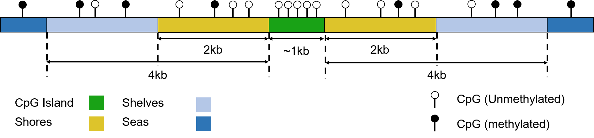
```

(ref:CGIs-Cap) Schematic representation of CpG Islands, shores, shelves and seas. CpG density declines from shores to seas and methylation increases (CpG density and methylation proportion not to scale). (Figure created by the Author.)

CpGs are not uniformly distributed in the genome, they occur at higher frequency in some regions.
"CpG islands" or CGIs are regions of high CpG density.
The total number of CpGs in the UCSC repeat masked CGI annotation list of 28,691 CGIs is 1,990,729.
Therefore, these CpGs comprise $\sim7.0\%$ of the total number of CpGs the genome. The mean percentage of the sequence of these CGIs that is comprised of CpG dinucleotides is $\sim18.5\%$ and their mean length is 761bp.
Irizarry et al. found that the 2kb regions flanking CpG islands which they termed "CpG island shores" exhibited greater tissue-specific differential methylation than the islands themselves [@Irizarry2009]. 
This nomenclature has subsequently been expanded further with "CpG island shelves" which are 2kb - 4kb from the CGIs, and "seas" referring to the rest of the genome, see figure \@ref(fig:CGIs). 

CGIs overlap the promoters of $\sim70\%$ of genes [@Saxonov2006], this, however, leaves roughly half of all CGIs as "orphans" not associated with a known transcription site.
These orphan CGIs frequently constitute cell-type specific enhancers [@Bell2017] and alternate promoters [@Illingworth2010; @Maunakea2010].
They are found in both intergenic and intragenic regions.
CpGs are distributed quite sparsely through the genome occurring at low density in "seas" and at increasing density in CGIs and their flanking regions, see figure \@ref(fig:CGIs).
Early work showed 70-80% of CpGs are constitutively methylated [@Ehrlich1982] (reviewed @Bird2002) Stadler et al. produced a more detailed picture of the distribution of CpG methylation in mouse embryonic stem cells (ESCs) [@Stadler2011] see figure \@ref(fig:CpGfreqVsDNAm).
It is a characteristic of CGIs that they are generally unmethylated.

```{r CpGfreqVsDNAm, fig.cap='(ref:CpGfreqVsDNAm-Cap)',  out.width='80%', fig.show='hold', fig.align = 'center', echo=FALSE}
knitr::include_graphics("figs/CpGfreqVsDNAm.png")
```

(ref:CpGfreqVsDNAm-Cap) The fraction of CpGs with a given methylation level. Data from Whole-Genome Bisulfite Sequencing (WGBS) of Mouse embryonic stem cells. (Figure reproduced from Stadler et al. 2011 [@Stadler2011] figure 1a)

The regulatory role played by DNA methylation varies with context and the scale at which it is examined. 
For example methylation at a single CpG in a transcription factor binding site can determine whether or not the factor can bind at that site. 
There are methylation-sensitive transcription factors which can have their affinity for DNA either increased or decreased by methylation [@Yin2017; @Zuo2017].
In addition, larger-scale changes in DNAm can through interactions with chromatin modifiers alter DNA compaction and more general accessibility of DNA regions for binding, and/or impacting on their topological organisation.
DNAm also varies with nucleosome occupancy with lower methylation in linker sequences than on nucleosome-associated DNA [@Kelly2012; @Huff2014].
The oxidation products of 5mC can also affect chromatin organisation, 5-Formylcytosine can impact nucleosome positioning through covalently binding to histones [@Raiber2017]. 
This raises the question if some DNA methylation occurs specifically to act as an intermediate step for regulatory mechanisms which utilise its oxidation products.

### Pathways of DNA methylation and demethylation 

CpG methylation is produced and maintained by DNA methyltransferase (DNMT) enzymes.
All the DNMT enzymes use S-adenosylmethionine as the source of the methyl donor group.
DNMTs form a covalent intermediate between a conserved cysteine residue and the target base, through a nucleophilic attack on the C6 position in the cytosine ring. 
This is followed by the transfer of the S-adenosylmethionine methyl group to C5, and deprotonation of the C5 to reform the double bond between C5 and C6; which is mediated by a base provided by the enzyme (Figure \@ref(fig:Lyko2017DNAmMechanism)). 

DNMT1 is associated with the replication machinery [@Vertino2002] and reproduces the methylation state of the parent strand on the daughter strand during replication.
The largest of the DNMT family DNMT1 contains a 'replication foci targeting sequence' (RFTS) domain required for its targeting to replication forks.
DNMT1 specialises in recognising hemimethylated DNA and methylating the unmethylated C in a palindromic CpG dinucleotide site, the UHRF1 protein assists in the recognition of these sequences [@Bostick2007]. 
DNMT3a and DNMT3b are responsible for *de novo* DNA methylation along with DNMT3L a catalytically inactive, but DNA-binding subunit [@Jia2009].
The location of *de novo* methylation by the DNMT3s is influenced by a number of factors including the Chromatin state and other DNA binding factors [@Lyko2017].

```{r Lyko2017DNAmMechanism, fig.cap='(ref:Lyko2017DNAmMechanism-Cap)', out.width='80%', fig.align = 'center', echo=FALSE}
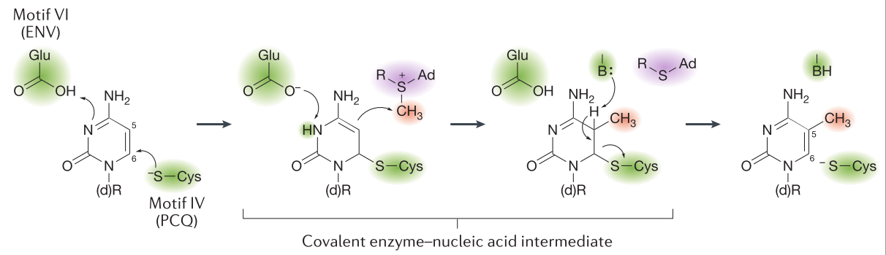
```

(ref:Lyko2017DNAmMechanism-Cap) Motif VI (ENV/PCQ) refers to the conserved catalytic motif in DNMTs. 'B:' Represents the enzyme supplied base (Figure reproduced from the review of DNMT biology by @Lyko2017 (fig. 1b))

DNMT2 is unlike the other members of the DNMT family in that it targets an RNA substrate. 
DNMT2 is a tRNA methyltransferase which methylates a specific subset of tRNA genes, mostly Asp isoacceptors, at a site adjacent to the anticodon which protects them from endonucleolytic cleavage under stress conditions.
Unprotected tRNAs produce fragments which compete with small interfering RNAs interfering with their signalling pathways.

The mechanisms of the demethylation of DNA were more recently characterised than those which govern its methylation. 
They are more complex and less well understood.
A distinction is drawn between active and passive demethylation, in passive demethylation, 5mC bases are diluted out in the process of DNA replication.
In the leading model of active demethylation, they are oxidised one or more times by an enzyme from the TET (Ten-Eleven-translocase) family. 
They are then either passively removed by DNA replication or actively removed by a DNA glycosylase (thymine DNA glycosylase TGD) to create an apurinic site which is restored to a C by the Base Excision Repair (BER) pathway. This cycle of cytosine methylation and demethylation is illustrated in Figure \@ref(fig:Wu2017TETsDNAmCycle) [@Wu2017].

```{r Wu2017TETsDNAmCycle, fig.cap='(ref:Wu2017TETsDNAmCycle-Cap)', out.width='60%', fig.align = 'center', echo=FALSE}
knitr::include_graphics("figs/Wu2017TETsDNAmCycle.png")
```

(ref:Wu2017TETsDNAmCycle-Cap) BER = Bases Excision Repair; AM = Active Modification; AR = Active Removal, PD = Passive Dilution (Figure reproduced from the review of TET mediated active demethylation by @Wu2017 (fig. 1a))

### Maintenance and Fidelity

DNA methylation is highly dependent on the underlying DNA sequence. 
Sequence features of particular importance to determining DNA methylation status are; transcription factor and other DNA binding protein recognition motifs, and CpG density [@Lienert2011; @Ziller2013]. 
Alterations in underlying DNA sequence such as SNPs and copy number variants (CNVs) can have a significant impact on methylation level and the susceptibility of the methylation level to change. 
In addition, CNVs can result in dosage effects on measures of DNAm, causing regions to appear, respectively, substantially more or less methylated when fewer or greater copies than expected are present [@Boks2009; @Kerkel2008; @Schalkwyk2010; @Shoemaker2010; @Bell2017a].
Despite the strong influence of sequence on methylation, global CpG methylation exhibits change over developmental time as illustrated in figure \@ref(fig:DNAmDevTime) and exhibits tissue-specific changes in distribution and amount [@Ziller2013]. 

```{r DNAmDevTime, fig.cap='(ref:DNAmDevTime-Cap)', out.width='80%', fig.align = 'center', echo=FALSE}
knitr::include_graphics("figs/Ciernia2016f3DNAmTime.PNG")
```
(ref:DNAmDevTime-Cap) 5mC levels over developmental time. 5mCH or 5-methylcytosine-(A, T or C) levels are represented on a separate (purple) Axis from the main 5mCG axis. PGC = Primordial Germ Cell. (Figure reproduced from @Ciernia2016 figure 3)

In mitosis, DNA methylation is inherited by daughter cells with an error rate on the order of $1\times10^{-3}$ per site per generation [@Ushijima2005], several orders of magnitude less than that of DNA replication (error rate of $1\times10^{-7}$ - $1\times10^{-8}$ [@Kunkel2004a]).
The fidelity of DNA methylation copying can be assayed by Hairpin-Bisulfite PCR (Polymerase Chain Reaction) [@Laird2004].
Laird et al. looked at two alleles of a portion of the CpG island from the human *FMR1* gene in uncultured lymphocytes, one hypermethylated and one hypomethylated.
In the hypermethylated allele, they found that 96% of sites methylated in the parent strand remained methylated in the daughter strand and 86% of unmethylated sites remained unmethylated. 
By contrast in the hypomethylated allele, there were no methylated sites to be retained and >99% of unmethylated sites remained so following replication. 
Laird et al.'s work suggests a higher degree of overall methylation fidelity for hypomethylated DNA and a propensity for unmethylated sites in hypermethylated DNA to become methylated. 

Change in DNAm levels over time (divisions) can be modelled using the differential equations [@Pfeifer1990a], which predict that a fully methylated site and a fully unmethylated site will converge on an equilibrium level.
This level is determined by the probability of maintenance of the methylation state and of *de novo* methylation for a given locus. 
This stochastic model of DNAm is in agreement with experimental findings [@Laird2004; @Riggs2004a], Figure \@ref(fig:Riggs2004PNASfig2DNAmFidelity).

```{r Riggs2004PNASfig2DNAmFidelity, fig.cap='(ref:Riggs2004PNASfig2DNAmFidelity-Cap)', out.width='70%', fig.show='hold', fig.align = 'center', echo=FALSE}
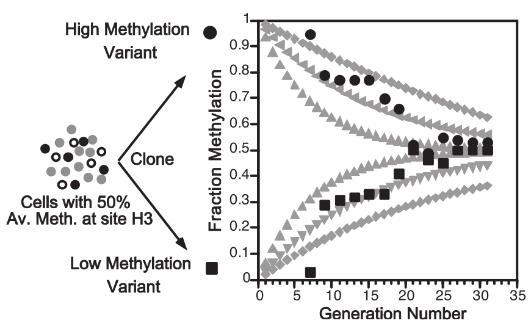
```
(ref:Riggs2004PNASfig2DNAmFidelity-Cap) $E_m$ = probability of methylation maintenance, $E_m$ = probability of *de novo* methylation. $M$ & $U$ = the number of methylated and unmethylated molecules at specific CpG sites respectively. Modelling (__Grey points__) $E_m,E_d$ values of 0.90,0.10; 0.95,0.05; 0.97,0.03 (outermost to innermost, two curves for each $E_m,E_d$ set, one starting at $M=1,U=0$ and one a $M=0,U=1$. Experimental data (__Black points__) from the *HpaII* locus (site H3) in 17 clones of mouse cell line BML-2 which has a known methylation level of 50%. (Reproduced from [@Riggs2004a])

Jenkinson et al. [@Jenkinson2017] used an information-theoretic approach, modelling DNAm as a binary communications channel using a 1-dimensional Ising model from the field of statistical physics. 
This permitted them to examine properties of DNAm not accessible to conventional means of analysis which typically capture the mean methylation level and perhaps the variability for a given locus. 
When considering methylation fidelity using this lens the maintenance of a given methylation state can be seen as an information processing task which requires the consumption of free energy in order to reduce the probability of error in the transmission of that methylation state. 
Thus Relative Dissipated Energy (RDE) can serve as a measure of the work expended by a cell at a given locus in order to preserve the current methylation state of that locus. 

Zhao et al [@Zhao2014] applied Hairpin-Bisulfite PCR genome-wide in mouse embryonic stem cells (ESCs). 
They also found high degrees of methylation fidelity in hypomethylated regions such as CGIs and Promoters, as well as a high degree of fidelity in sites bound by transcription factors. 
This is in agreement with the findings of Jenkinson et al. [@Jenkinson2017] who noted that entropy (methylation stochasticity) was lower and more variable in CGIs and TSS (transcription start sites). 

Methylation inheritance fidelity is reduced in cancer [@Ushijima2005] and increases with differentiation [@Zhao2014].
The RDE (relative dissipated energy) at CGIs and TSSs is higher in differentiated tissues such as the brain, implying low entropy, and lower in embryonic stem cells, implying greater entropy [@Jenkinson2017] (see Figure \@ref(fig:Zhao2014fig3ab)). 
In addition, the correlation between CpG sites increases in cancer [@Jenkinson2017], suggesting reduced higher-level regulatory control and tendency to fall back on lower level feedback mechanisms leading to a return to the baseline equilibrium described above as the cell is expending less energy to maintain an out of equilibrium methylation state.

```{r Zhao2014fig3ab, fig.cap='(ref:Zhao2014fig3ab-Cap)',  out.width='80%', fig.show='hold', fig.align = 'center', echo=FALSE}
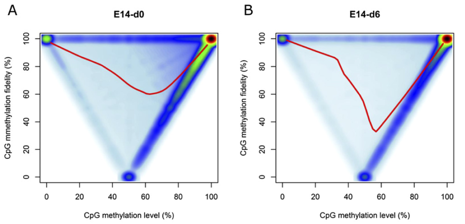
```
(ref:Zhao2014fig3ab-Cap) Bimodal Distribution of DNA methylation level and fidelity. Methylation fidelity exhibits a bimodal distribution with most and least methylated regions exhibiting the highest fidelity. Additionally, fidelity for methylation levels of 10-50% is considerably better than fidelity for levels of 50-90%. These data are from the mouse cell line ES-E14TG2a which is capable of self-renewal when cultured with Leukaemia Inhibitory Factor (LIF) and spontaneous differentiation upon removal of LIF (denoted as E14-d0 at day 0 and E14-d6 at day 6 after the withdrawal of LIF, respectively). Fidelity represents the percentage of symmetrically methylated or unmethylated CpG dyads for a given position as determined by Hairpin-Bisulfite PCR. (Reproduced from Zhao et al. 2014 [@Zhao2014] (figure 3 a and b).)

### DNA Methylation Assays 

There are numerous DNA methylation assays. 
Some are designed to assay global DNAm levels producing a single global measurement of the amount of 5mC present in a sample, others assay DNAm in a manner traceable to a specific genomic locus.
These methods can be further subdivided into targeted methods where the loci to be examined are known in advance, and those where the loci covered are quasi-randomly sampled. 
Both the targeted and untargeted methods vary in their granularity, from individual CpGs to large regions of the genome, on the order of megabases.
These assays also vary in their coverage of the genome from locus-specific approaches looking at small numbers of individual loci to whole-genome methods providing methylation information on all ~28 million CpG sites. 
Between these two extremes are 'epigenome-wide' methods which are focused with varying degrees of specificity on genomic regions of interest.

These DNA methylation assays generally exploit one of four following things:

1. __Methylation sensitive restriction digestion__
    A variety of methods exploit enzymes which differentially cut methylated and unmethylated DNA.
    An example of such enzymes is: HpaII and MspI which are isoschizomers for the sequence: 5'-C^CGG-3' but only HpaII is methylation-sensitive and unable to cut the sequence if the internal cytosine is methylated. 
    The methods which use such enzymes include: Restriction landmark genomic scanning, which gives a roughly megabase resolution indicators of DNAm levels by 2D electrophoresis [@Hatada1991]. 
    MRE-seq, which makes use of methylation-sensitive restriction digests to enrich for unmethylated DNA [@Maunakea2010]. 
    This is then sequenced to provide the genomic location of this unmethylated signal. 
    Reduced Representation Bisulfite Sequencing (RRBS), which uses methylation-sensitive restriction digestion to enrich for unmethylated sequences which are then subject to bisulfite sequencing, (see point 3 below).

2. __DNA methylation-sensitive binding of DNA by antibodies or other proteins selectively which bind methylated DNA__
    Anti-5mC antibodies were first used to isolate methylated DNA in 1985 and were subsequently paired with array-based technologies to assay DNAm levels at specific loci in 2005 [@Weber2005; @Harrison2011].
    This was followed by MeDIP-seq (methylated DNA immunoprecipitation and sequencing) [@Down2009; @Lienhard2014], which enriches methylated DNA that is then sequenced and the number of reads mapping to a locus is indicative of the relative methylation level.
    MBD-seq uses a recombinant Methyl Binding Domain (MBD) protein to enrich for methylated double-stranded DNA, prior to sequencing [@Serre2009a].
    Inferring the absolute methylation levels form the number of reads mapping to a locus enriched by one of these pull-down methods is complicated by variation in CpG density in the genome and the fact that CpG dense regions tend to have low methylation levels, and thus tend not to be pulled down by antibodies binding 5mC or MBD proteins.
    The best results for estimating absolute methylation levels with these methods come from pairing them with a complementary method to enrich for unmethylated sites such as MRE-seq (described above) [@Li2015]. 
    Though relative methylation levels remain effective in identifying differentially methylated regions when using these methods alone [@Bock2010; @Maunakea2010].

3. __Sodium bisulfite conversion of unmethylated cytosines to uracil__
    Conversion of cytosine to uracil changes the base complementary to this site from G to A [@Hayatsu1970]. 
    The basic chemistry of the conversion process is illustrated in Figure \@ref(fig:BisulfiteConversionNEB). 
    This conversion can be detected with a variety of technologies such as: 
    The Illumina bead chip methylation arrays; WGBS; and Targeted bisulfite PCR or sequencing to examine a small number of selected loci.
    It can also be performed on a larger number of loci with microfluidic multiplexing such as that provided by the Fluidigm access array [@Adamowicz2018].
    It is worth noting that bisulfite conversion cannot differentiate between methylated and hydroxymethylated cytosines.
    Because 5hmC represents a small fraction of modified bases compared to 5mC many analyses have made the working assumption that unconverted bases are methylated, but it is beginning to be recognised that distinguishing between the two may be biologically important especially in tissues where 5hmC is more prevalent such as neurons.
    A variant of bisulfite conversion, oxidative bisulfite conversion, exists which can permit 5hmC to be distinguished from 5mC [@Skvortsova2017].
    Additionally, New England Biolabs has recently developed an enzymatic alternative to chemical bisulfite conversion [@Williams2019]

```{r BisulfiteConversionNEB, fig.cap='(ref:BisulfiteConversionNEBCap)', out.width='80%', fig.show='hold', fig.align = 'center', echo=FALSE}
knitr::include_graphics("figs/BisulfiteConversionNEB.jpg")
```
(ref:BisulfiteConversionNEBCap) Sodium Bisulfite conversion of C to U, 5mC and 5hmC are unaffected. (Image Credit New England Biolabs).

4. __Physical differences in the methylated base__
    These are exploited by the not yet widely used '3rd generation' sequencing technologies such as nanopore and single-molecule real-time sequencing.
    These methods respectively exploit the effects of modified bases on ion flow through the nanopore and impact on incorporation time of new bases whilst in the polymerase [@Rhoads2015; @Simpson2017].

## DNA Methylation and Ageing

Returning now to the relationship between DNA methylation and ageing we will review a little of the history of that field, the roles thought to be played by DNAm in ageing and the utility of DNAm clocks as biomarkers of ageing.

Early work on DNA methylation and ageing used biochemical, chromatographic and radiolabeling techniques to assay global changes in the amount of 5mC.
These studies found differences in 5mC composition with cell type [@Ehrlich1982] but did not see changes with age.
Other work around that time however found differences in 5mC levels with the age of cells in culture [@Wilson1983].
Wilson et al. noted that DNA methylation decreased across several tens of generations of cell lines in culture, but not in immortal cell lines.
Immortal cell lines had lower absolute levels of 5mC to start with but remained constant over time.
Wilson et al. also cite earlier work by Romanov at al. 1981 [@Romanov1981] and Berdyshev el al. 1967 [@Berdyshev1967] which documented decreases in 5mC with age in cows and salmon, respectively.

Later work by Wilson et al. 1987 [@Wilson1987] in mice *P. leucopus* and *M. musculus* found decreases in 5mC with age and that the rate of decline was less in the longer-lived *P. leucopus* than in *M. musculus*.
Interestingly, a recent study using different methods by Cole et al. found no global differences between young and old mice in short and long-lived strains, however, their other observations would seem to corroborate these initial trends.
For the assayed sites long-lived mice exhibited 10x more hypermethylation than wild-type (WT), and WT mice had 3x more Differentially Methylated Regions significantly associated with age (DMRs/aDMRs) than did long-lived mice.
Notably, the WT and long-lived mice shared many of the same aDMRs which differed in their degree of methylation as opposed to affecting different sites in the genome [@Cole2017].
The lack of apparent global changes may be due to the biases of the reduced representation bisulfite sequencing (RRBS) method used.
RRBS uses a restriction enzyme-based approach to enrich for regions with high GC content such as CGIs which tend to have low levels of methylation, and consequently may not be sensitive to loss of methylation in generally hypermethylated regions which could contribute to a global trend [@Meissner2005].

Wilson et al. also noted that the mitotic index of tissues did not relate to the loss of DNA methylation with age in tension with their earlier observations *in vitro*.
The persistent loss of 5mC over time and the dramatic changes in methylation seen in cancer cells lead Wilson et al. to suggest that dysregulation of DNA methylation may have a substantial role to play in the age-dependency of cancer risk and ageing more generally (reviewed by Feinberg and Tycko [@Feinberg2004]).
It has been suggested that "Epimutations" may be able to substitute for mutations in the multi-hit model of carcinogenesis [@Knudson1971].
For example; hypermethylation of the *BRCA1* promoter [@Esteller2000], Or, the development of Wilms’ tumour due to Beckwith–Wiedemann syndrome, a disorder arising from loss of imprinting of the gene encoding insulin-like growth factor 2 (IGF-2) leading to a double dose of IGF-2 protein [@Feinberg2018].
Furthermore, the loss of methylation and increased entropy of closed chromatin regions may lead to increased susceptibility to structural mutations commonly found in cancer cells through the exposure of homologous sequences [@Feinberg2004; @Jenkinson2017].

Methods which allowed the examination of changes in DNA methylation at known loci in the genome permitted a more nuanced picture of changes in DNA methylation over time to develop.
Fraga et al. [@Fraga2005] introduced the concept of "epigenetic drift" being the divergence of DNA methylation and other epigenetic modification patterns with time.
Fraga et al. looked at the divergence in DNA methylation along with global Histone H3 and H4 acetylation patterns between monozygotic (MZ) twins over a wide range of ages.
They observed that older twins had greater epigenetic differences with time, in DNA methylation as well as H3, H4 Acetylation. 
Fraga et al. also noted that the divergence in epigenetic state was greater in twins who had lived longer apart and had different medical histories.
Figure \@ref(fig:Fraga2005fig3) is a useful visual encapsulation of Fraga et al.'s DNA methylation results.
Slieker et al. [@Slieker2016] identified 6366 CpGs whose methylation variability increased with age using the Illumina 450k array platform on whole-blood from 3295 individuals.
Both the increase in variability with age and the increasing divergence of twins support a narrative of epigenetic dysregulation and increasing entropy with age.

```{r Fraga2005fig3, fig.cap='(ref:Fraga2005fig3-Cap)',  out.width='80%', fig.show='hold', fig.align = 'center', echo=FALSE}
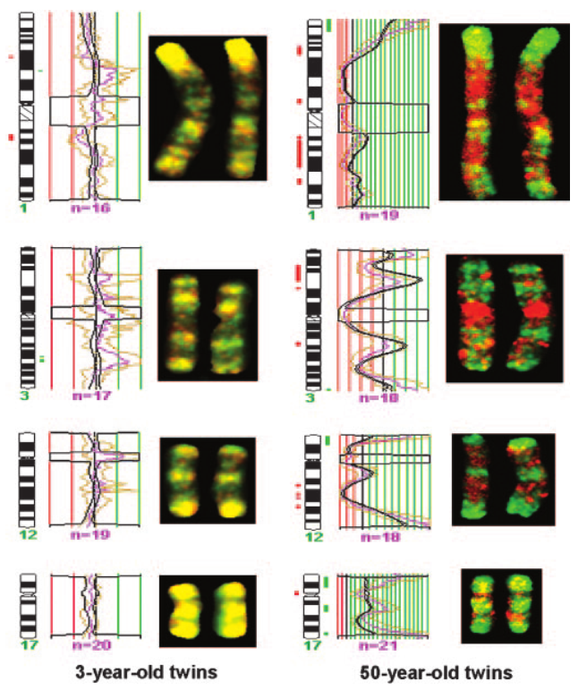
```
(ref:Fraga2005fig3-Cap) Mapping Chromosomal Regions of Differential DNA Methylation. Examples from Chromosomes 1, 3, 12 & 17 are shown for a 3 and 50-year-old twin pair. Methylation status is shown by competitive hybridization of AIMS (amplification of inter-methylated sites) products to metaphase chromosomes. Green and Red signals indicate hypermethylation and hypomethylation events between twins, Yellow indicates little difference. Red and Green blocks adjacent to ideograms indicate areas of significant DNA methylation change. (Reproduced from [@Fraga2005] (figure 3).)

### Age-Related Differential Methylation and Epigenetic Clocks {#DNAmAgeReview}

With the advent of array-based techniques which permitted the measurement of the methylation status of specific CpGs placed strategically throughout the genome, researchers were able to undertake a more fine-grained analysis of the changes in DNA methylation with age.
This has allowed the prediction of chronological age from a metric of "DNA methylation age" (DNAm age), and interpretation of the differences in predicted and chronological age in terms of the pathophysiology of ageing. 

The Illumina Golden gate array [@Bibikova2006] with 1505 probes targeted to cancer-related genes was the first of these.
Bjornsson et al. observed DNAm changes with age as well as noting substantial intra-individual differences.
In contrast earlier work by Eckhardt et al. [@Eckhardt2006] and Ehrlich et al. [@Ehrlich1982] found no age-related changes using averages across individuals. 
Bjornsson et al. [@Bjornsson2008] also found that the intra-individual differences in differential methylation with ageing were highly heritable by use of familial clustering.
Work by Boks et al. [@Boks2009] also using the golden gate array corroborated Bjornsson et al.'s findings in monozygotic twins. 

The Bjornsson and Boks studies used the golden gate array on peripheral blood samples, whereas Christensen et al. [@Christensen2009] used the golden gate array to look for age-related changes in DNAm in several tissue types.
CpG sites that are differentially methylated with age when searching across tissues were frequently specific to a small number of tissue types.
In addition, CpGs in CGIs tended to be hypermethylated with age and *vice versa*.
Christensen et al. also found that the methylation profiles for different tissues were highly predictive of tissue type.

Rakyan et al. [@Rakyan2010] looked at age-related changes in DNAm using the Illumina 27k array [@Bibikova2009] with whole blood samples in a discovery set.
They replicated their findings in sorted cell fractions to see if they could capture changes in DNAm that could be attributed to changes in blood cell-type composition over time, which they did not find.
Teschendorff et al. [@Teschendorff2010] found that promoters of targets of the polycomb group proteins (PCGTs) were more likely than non-PCGTs to become methylated with age [@Jung2015]. 
Repression of PCGTs is required for Stem cells to differentiate.
PCGTs whose methylation status was associated with age were associated with pre-neoplastic conditions in a large cohort using the 27k array with blood and epithelial cell samples. 

Bocklandt et al. [@Bocklandt2011] also using the 27k array but with saliva samples created the first "epigenetic clock" used to predict the chronological age of donors based on the DNAm landscape of their cells, the mean error was 5.2 years.
Bocklandt et al. were able to achieve similar predictive accuracy with as few as 3 CpG sites in their model.
Koch et al. [@Koch2011] used publicly available 27k array datasets from a variety of different tissues to train a model using a different statistical method but only achieved an error of 11 years. 
They did, however, identify a number of CpGs also identified by Bocklandt et al.
Bell et al. [@Bell2012] used 27k array data to look for correlations between differential methylation and age-related phenotypes as well as chronological age.
They found that few age-related phenotypes were correlated with differential methylation, only 5 CpG sites were identified for the 16 age-related phenotypes examined. Whereas 490 significant CpGs were associated with chronological age.
Many of the CpGs they identified persisted across tissue types and replicated in a second cohort, several had been identified previously by Rakyan et al. [@Rakyan2010] and Bocklandt et al. [@Bocklandt2011].

Heyn et al. [@Heyn2012] examined the DNA methylation status of a newborn and a centenarian in CD4+ T cells using whole-genome bisulfite sequencing (WGBS), along with a group of newborns and nonagenarians using the Illumina 450k array [@Bibikova2011]. 
Heyn et al. observed a global decrease in methylation from newborn to centenarian, as well as an intermediate level of methylation on a sample of intermediate age (see figure \@ref(fig:Heyn2012F1b)). 
This observation was replicated in 450k data. 
In addition, Heyn et al. noted that adjacent CpGs normally exhibit a substantial degree of correlation in methylation status and that they were less well correlated with their neighbours with increasing age. 
Interestingly Jenkinson et al. [@Jenkinson2017] found that correlation among nearby CpGs increased in cancer tissues.
Modelling work done by Affinito et al. [@Affinito2016] agrees with this correlation between neighbouring CpGs under physiological conditions, which is particularly pronounced in CpG dense regions like CGIs.
The greater physical proximity of CpGs in CpG dense regions means that greater correlation is expected.
Due to the fact that these CpGs are more likely to be affected by the same proteins and regulatory features than CpGs with greater distance separating them [@Haerter2014].
Garagnani et al. used 450k array data from a cohort of 64 subjects aged 9-83 to identify those CpGs most well correlated with age as had been done with previous array technologies [@Garagnani2012].

```{r Heyn2012F1b, fig.cap='(ref:Heyn2012F1b-Cap)',  out.width='80%', fig.show='hold', fig.align = 'center', echo=FALSE}
knitr::include_graphics("figs/Heyn2012F1b.png")
```
(ref:Heyn2012F1b-Cap) Global Hypomethylation with Age. NB = Newborn, Y26 = 26 year old, Y103 = 103 year old.
(Reproduced from @Heyn2012 figure 1 b.)

In January of 2013 Hannum at al. [@Hannum2013] published a study using the Illumina 450k array and whole blood samples for 656 participants aged 19-101. 
Their optimised model was able to predict age with an error of 3.9 years.
In December of the same year, Horvath [@Horvath2013] published a study using multiple datasets, including  Hannum's data, some produced on the 27k and some the 450k array. 
Both used 'elastic net' penalised multivariate regression models to identify CpGs which collectively provide the best predictor of DNAm age rather than the CpGs which are individually most highly correlated with age [@Friedman2010]. 

Florath et al. [@Florath2014] identified some additional age-associated CpGs from two large cohorts totalling N = 898 and an N = 67 8yr follow-up longitudinal cohort. 
More than 3/4 of the CpG sites they identified began as hypomethylated and increased in methylation with age, a proportion likely skewed by the large number of 450k probes in CGIs and other typically low methylation regions.
Bacalini et al. [@Bacalini2015] performed a meta-analysis of existing DNAm age datasets and employed a "region-centric" approach to try to identify loci larger than single CpGs which they anticipate will be more biologically meaningful than lone CpGs. 
They found that their approach increased the number of common features identified using the Hannum et al. and Heyn et al. datasets. 
Zaghlool et al. [@Zaghlool2015] performed 450k array DNAm age study in Qatari population they identified 12/88, 23/490 and 102/162 of the CpGs found by Bocklandt et al, Bell et al. and Florath et al. respectively. Zaghlool et al. also found that Horvath's age predictor had an error of 3.7 years in their dataset. 
This is in agreement with existing findings and indicates that ethnicity has no major effects on the DNAm age signature. Benton et al. [@Benton2017] looked at changes in DNA methylation with age in a genetically isolated population on Norfolk Island with similar results to previous studies but identifying some novel age-associated CpGs.

Most DNAm relationships with age noted in previous studies have been linear, Johnson et al. [@Johnson2017] used the 450k array in peripheral blood samples. 
They identified 21 CpGs whose DNAm changes at a rate that changes with age from an initial pool of 27,723 CpGs which were differentially methylated with age. 
Two sites exhibited an increasing rate of increase in DNAm with age, and 18 sites a decreasing rate of increase.

### Genetic Influences on DNA Methylation

Epigenetic variation falls on a continuum of genetic influence that can be summarised by three categories:

1. __pure__ - DNA sequence has no predictive value for epigenetic state.

2. __facilitated__ - DNA sequence biases epigenetic state.

3. __obligatory__ - DNA sequence permits exact prediction of epigenetic state.

Regional methylation state is strongly influenced by genotype, by single nucleotide polymorphisms (SNPs) [@Smith2014a] and by structural variants [@Bell2017a]. 
An example of an obligatory effect on methylation is a point mutation at a CpG site, a C to T transition precludes methylation at that site in future. 
The effect of structural variants on methylation can be hard to determine as changes in sequence dosage often lead to measurement artefacts. 
Efforts have been made to correct for the influence of genetic factors in EWAS, when searching for purely epigenetic effects but the potential interaction of the somatic mutations known to accumulate with age (Figure \@ref(fig:Jaiswal2014fig1)) and the changes in DNAm with age remain largely unexplored. 
This is of particular relevance to DNAm as the profile of the types of mutation which accumulate with age (Figure \@ref(fig:Jaiswal2014fig2c)) distinctly favours C to T transition mutations which can disrupt CpG dinucleotides [@Jaiswal2014c].

```{r Jaiswal2014fig1, fig.cap='(ref:Jaiswal2014fig1-Cap)', out.width='60%', fig.align = 'center', echo=FALSE}
knitr::include_graphics("figs/Jaiswal2014fig1_somaticMutationAge.png")
```
(ref:Jaiswal2014fig1-Cap) Somatic mutations increase with Age. (Reproduced from [@Jaiswal2014c], figure 1)

```{r Jaiswal2014fig2c, fig.cap='(ref:Jaiswal2014fig2c-Cap)', out.width='60%', fig.align = 'center', echo=FALSE}
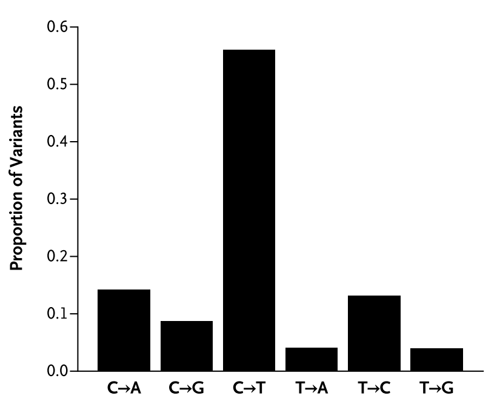
```
(ref:Jaiswal2014fig2c-Cap) C to T transitions are the most common substitutions that occur with age. (Reproduced from [@Jaiswal2014c], figure2 c)

### DNAm Age as a Biomarker of Ageing

We have seen that DNAm can be a fairly accurate predictor of age, however, there is more to being a good biomarker of ageing than predictive accuracy. 
Weidner et al. [@Weidner2014] conducted a study with the specific intent of identifying CpG sites that would serve as the best biomarkers of ageing. 
Below is a list of specific criteria for a high-quality biomarker of ageing laid out by Johnson et al. [@Johnson2006].

1. It must predict the rate of ageing. In other words, it would tell exactly where a person is in their total lifespan. It must be a better predictor of lifespan than chronological age.
2. It must monitor a basic process that underlies the ageing process, not the effects of disease.
3. It must be able to be tested repeatedly without harming the person. For example, a blood test or an imaging technique.
4. It must be something that works in humans and laboratory animals, such as mice. This is so that it can be tested in lab animals before being validated in humans.

We have seen that DNA methylation clocks can be good predictors of chronological age, we will revisit the question of whether or not they are superior to chronological age in their ability to predict lifespan below.
Bell et al. [@Bell2012] found DNAm did not generally correlate well with ageing phenotypes but did correlate well with chronological age and Teschendorff et al. [@Teschendorff2010] found that their age-associated DNAm signature remained fairly constant across several disease states including ovarian cancer and type 1 diabetes.
Suggesting that DNAm age prediction does indeed: "monitor a basic process that underlies the ageing process, not the effects of disease", meeting criterion number 2.
Several of the DNAm clocks discussed so far have been based on whole peripheral blood samples meeting criterion number 3. DNAm age clocks have been shown to work in Chimpanzees [@Horvath2013], Dogs/Wolves [@Thompson2017], Mice [@Stubbs2017], Naked Mole Rats [@Lowe2020], Rhesus Macaques, Humpback Whales [@Lowe2018] and are likely to work in other mammalian model organisms.
Furthermore, a cross-species clock based on conserved ribosomal RNA genes has been developed [@Wang2019].
It should be noted that Horvath's Human clock uses array data and that the Dog/Wolf and Mouse clocks use RRBS.
Model organisms such as *C. elegans* which essentially lack DNA methylation would not, however, be likely to be tractable for DNAm based age prediction.
Consequently DNAm age prediction at least partially meets criterion number 4.

Is DNA methylation a better predictor of lifespan than chronological age? 
Both Hannum and Horvath identified the difference between DNAm age and chronological age or $\Delta_{Age}$ as a potential indicator of disproportionate biological ageing. 
Marioni et al. [@Marioni2015] explicitly set forth to test the value of DNAm age as a predictor of mortality.
Adjusting for age, sex, childhood IQ, education, social class, hypertension, diabetes, cardiovascular disease, and *APOE* e4 status a $\Delta_{Age}$ of +5yr is associated with a 16% increased mortality risk (See figure \@ref(fig:Marioni2015f3)).
A longitudinal study of twins found 3.2 fold increase in the risk of dying first per 5yr $\Delta_{Age}$ within twin pairs [@Christiansen2016].
A meta-analysis of DNAm age predictors by Chen et al. [@Chen2016a] also found that measures of age acceleration based on Hannum and Horvath clocks were superior predictors of mortality than chronological age before and after correction for various potentially confounding factors. 
Chen et al. also noted that correction for blood cell composition improved predictive power.
Indicating that DNAm age is indeed superior to chronological age as a predictor of lifespan meeting criterion number 1 for an ageing biomarker. 

A new DNAm age clock explicitly designed to capture phenotypic age and outperform age acceleration as a biomarker of ageing has recently been produced by Levine et al. [@Levine2018].
The 'PhenoAge' metric was created by selecting nine biomarkers of ageing from 42 possible metrics using a proportional hazards penalised regression model and combining these with chronological age.
(The nine biomarkers are: Albumin, Creatinine, Serum glucose, C-reactive protein, Lymphocyte per cent, Mean red cell volume, Red cell distribution width, Alkaline phosphatase, White blood cell count.)
DNAm data was then regressed against PhenoAge using elastic-net regression to produce a DNAm based PhenoAge predictor which made use of 513 CpGs. 
The PhenoAge predictor outperformed the Horvath and Hannum clocks at predicting all-cause mortality, comorbidities, coronary heart disease risk, and measures of physical functioning. 
41 of the 513 CpGs in the PhenoAge clock were present in the original 353 CpG sites used in the Horvath clock.

The 'GrimAge' clock [@Lu2019] takes a different approach to previous epigenetic clocks in that it has a 2-tiered model predicting first seven surrogates for a variety of other biomarkers of ageing then fitting a model to predict time to death using these surrogates.
'GrimAge' outperforms age accelerations from the Horvath, Hannum and PhenoAge clocks at predicting time to death.


```{r Marioni2015f3, fig.cap='(ref:Marioni2015f3-Cap)',  out.width='80%', fig.show='hold', fig.align = 'center', echo=FALSE}
knitr::include_graphics("figs/Marioni2015f3.png")
```
(ref:Marioni2015f3-Cap) Survival probability by quartiles of $\Delta_{Age}$ in LBC 1921 adjusted for sex, and chronological age. LBC = Lothian Birth Cohort. Using the Hannum and Horvath predictors' values for $\Delta_{Age}$. (Reproduced from @Marioni2015 figure 3.)

### Discussion and Analysis of the Findings of DNAm Age Studies

Interestingly CpGs whose methylation status has been identified as correlating with age in various studies show relatively little overlap. Despite this, changes in DNAm with age are probably the most robust and reproducible large-scale epigenetic change yet captured.
This lack of agreement in absolute terms, however, presents a challenge about how to interpret DNAm changes with age. 

The result of the various DNAm age studies display some seemingly contradictory trends. 
For example, there is the global loss of methylation with age [@Wilson1987; @Fraga2005; @Heyn2012] and yet the majority of the highly significant age predicting CpGs in clocks are undergoing hypermethylation by a ratio of very roughly 2:1 [@Rakyan2010; @Bocklandt2011; @Koch2011; @Garagnani2012; @Florath2014] (see figure \@ref(fig:Florath2014F4abc)).
Interestingly when expanded to look at all age-associated CpGs and not just the most highly correlated CpGs a slightly different picture emerges. Teschendorff et al. [@Teschendorff2010] noted in their original study and Zhang et al. [@Zhang2017] noted in a subsequent analysis if more loosely age correlated sites are included hypomethylation with age is more prevalent.
Zhang et al. state roughly 60% of sites are hypomethylated and 40% hypermethylated, they also observed that all of the highly age-predictive CpGs which overlapped between the studies they examined were hypomethylated. 

It is worth noting that the technologies used to measure the DNAm introduce their own biases into global changes in DNAm levels.
The more Global measures such as WGBS and biochemical measures seem to favour hypomethylation with age [@Wilson1987; @Fraga2005; @Heyn2012].
The arrays seem to have agreed more with these global measures as they have increased in size.
RRBS also seems to skew in favour of hypermethylation with age [@Cole2017].
These more narrow technologies are biased towards promoters and CGIs with their higher CpG density and lower baseline methylation levels making the prior probability of observing a methylation event greater than demethylation by dint of having a dearth of methylated sites to start with.

Sites which are hypomethylated as their "ground state" are more likely to be in CGIs than sites which are hypermethylated as their "ground state", and thus hypomethylated sites are more likely to be variable in their methylation state and subject to tight regulatory control than are hypermethylated sites.
Expanding the pool to look at CpG sites more poorly correlated with age is likely to introduce more sites whose hypomethylation with age is due to increased stochasticity with age.
However, from the background information, one would expect that hypermethylated sites in CpG dense regions like CGIs whose methylation level declines with age would make good quality indicators.
Given that CpGs in CGIs have a high prior probability of being hypomethylated, it follows that one would be more likely to observe a hypermethylation event by chance.
Consequently, a CpG in a CGI that exhibits hypomethylation with age is less likely to be a result of noise than its converse, this may explain the higher reproducibility of these hypomethylated sites. 

```{r Florath2014F4abc, fig.cap='(ref:Florath2014F4abc-Cap)',  out.width='80%', fig.show='hold', fig.align = 'center', echo=FALSE}
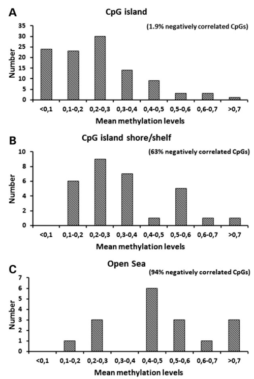
```
(ref:Florath2014F4abc-Cap) Mean methylation level by genomic region showing proportions negatively correlated with age, i.e. become hypomethylated as age increases. (Reproduced from @Florath2014 figure4 a, b, c.)

In a review of DNAm and ageing Jones et al. [@Jones2015] drew a distinction between epigenetic drift changes and epigenetic clock changes with age wherein they defined drift as "the collection of DNA methylation changes that are associated with age within an individual but are not common across individuals.", which is slightly different from the definition used by Fraga et al. [@Fraga2005].
Clock changes are defined as "those sites that are associated with age across individuals and can thus in some cases be used to predict chronological age".
Drift constitutes stochastic change over time not driven by some process which strongly biases the resulting changes in DNAm in direction or to specific sites.
Clock changes are the converse, some underlying process biases DNAm changes in direction and/or position.

This picture is complicated by the tissue specificity of DNAm changes.
Whilst it is evidently the case that multi-tissue DNAm age prediction is possible, it also seems to be the case that an age predictor trained on samples from a specific tissue will outperform one trained on multiple or other tissues when predicting the age of a sample of matching tissue type.
This is supported by the out-performance of the Horvath predictor by the Hannum predictor in blood samples [@Marioni2015] and differentially predicted ages of tissues such as breast noted by Horvath [@Horvath2013].
DNAm was highly correlated with age for a variety of tissue-specific sites in many studies, suggesting that the definition of clock sites is frequently tissue-dependent. 
This may also be true of drift changes, stochastic changes may occur at sites in one tissue that would be tightly controlled in another. 
One could restrict the definition of clock changes further to only those which are present in all/most tissue types to make a multi-tissue predictor. 

Apparent changes in the DNAm state of a mixed cell population could be due not to global changes in that population but rather its composition, blood exhibits changes in the cellular composition with age [@Rimmele2014; @Izzo2020].
As haematopoietic stem cells age their numbers increase and their regenerative potential declines.
Their output becomes skewed towards the myeloid lineage but produces poorer quality cells.
The number of naive T-cells decreases with age, memory and effector T-cells accumulate as to memory B cells limiting the diversity in the cell-types and contributing to immunosenescence (reviewed in [@Geiger2013]).
Cellular composition of tissues can have a substantial impact on epigenome-wide association studies (EWAS), especially when dealing with small effect sizes [@Jaffe2014].
Thus shifts in cell composition such as those in blood during ageing can be substantial sources of confounding when searching for cell-intrinsic changes in DNA. 
Some attempts to assay and/or correct for cell-type composition have been made, for example, Rakyan et al [@Rakyan2010] isolated $CD4^+$ T-cells and found that they had a 60% overlap with age-related CpGs in whole blood. Chen et al. [@Chen2016a] used the method developed by Houseman et al. [@Houseman2012] to correct for cell-type composition and found that it did improve the performance of the Horvath and Hannum age predictors.
The changes were significant but the effect of this correction was relatively modest. 
Whilst cell composition has an effect, DNAm Age definitely seems to be capturing something beyond shifts in cell-type composition. 
However, the age acceleration computed with Hannum's method, which is trained on blood data only, was more strongly correlated with cell-type composition than Horvath's method, indicating that extrinsic changes in cell-type composition likely have some impact the model. 

Jenkinson et al. [@Jenkinson2017] took an information-theoretic approach to DNA methylation maintenance, modelling the binary methylation state of CpGs as a noisy communications channel. 
Permitting them to compute the information capacity (CAP), methylation entropy (ENT), and the relative dissipated energy (RDE) of these channels. 
High capacity channels represent reliable transmission of methylation state, consistent with high RDE as more energy is needed to ensure reliability and low entropy as methylation is more ordered at sites under tighter control than at less highly controlled sites.
They found that the Transcription Start Sites (TSS) exhibited high levels of RDE and high information capacity as well as low levels of entropy.
These values trended in the opposite direction as they moved outwards to CGIs, shores and seas. 
This information-theoretic framing provides a useful lens through which to view drift and clock loci. 

It could be hypothesised that as a cell differentiates those sites the methylation status of which are most important for successful differentiation will be the focus of the expenditure of cellular resources to set and maintain their methylation state, and will thus exhibit high capacity and low entropy.
Whatever mechanism is focusing the resources of the cell on the maintenance of the methylation at these sites may be responsible for the tissue-specific biases in DNAm changes over time i.e. their targets will be clock sites. 
Those sites not involved in the maintenance of the specific differentiated state would be a lower priority for the expenditure of cellular resources and thus display lower information capacity and higher entropy i.e. be drift sites. 
This would also lead one to predict that multi-tissue age predicting loci would be enriched for factors common to the maintenance of a differentiated state. 
The polycomb and Trithorax group proteins are very broadly evolutionarily conserved and play a key role in developmental cell fate choice and particularly in long-term stable maintenance of epigenetic state [@Schuettengruber2017].
Consistent with this hypothesis Teschendorff et al. [@Teschendorff2010] observed that PCGTs are enriched among CpGs associated with age and Levine et al. [@Levine2018] also noted that their 513 clock CpGs were enriched for PCGTs. 
This is also complementary to the idea that DNAm dysregulation with age promotes carcinogenesis by stabilising stem cell character but with reduced capacity for differentiation as proposed by Teschendorff et al. [@Teschendorff2010] and Rakyan et al. [@Rakyan2010].

In his paper [@Horvath2013] Horvath proposed that DNAm age is a measure of the work done by an "Epigenetic Maintenance System" (EMS) which maintains epigenetic stability over time. 
Considering work in its physical sense of the integral of power over time, Horvath considered power, the rate of change in the use of energy by the EMS as the 'tick-rate' of the epigenetic clock. 
He proposed that during development power would be high due to the high level of stress on the system and that power would drop to a consistent level once maturity was reached. 
Horvath laid out four predictions of this EMS model and argued that there was evidence in support of each of them. The predictions were:

1. Cancer tissue should show signs of accelerated age, reflecting the protective actions of the EMS
2. Many mitogens, genomic aberrations, and oncogenes, which trigger the response of the EMS, should be associated with accelerated DNAm age.
3. High age acceleration of cancer tissue should be associated with fewer somatic mutations given the protective role of the EMS
4. Mutations in TP53 should be associated with a lower age acceleration of cancer tissue if one further assumes that p53 signalling helps trigger the EMS

I would propose that a fifth prediction of this model is that DNA methylation fidelity should be elevated during development and differentiation as a reflection of the greater amount of work done by the EMS during this period. 
This is borne out by the results of Zhao et al. [@Zhao2014] who noted a global increase in DNA methylation fidelity during the early differentiation of mouse embryonic stems cells (see figure \@ref(fig:Zhao2014fig3ab)). 

If Horvath's Concept of an EMS is accurate and Jenkinson et al.'s RDE captures the energy expended by the cell on the maintenance of the methylation state of a locus, one would expect Horvath's concept of an EMS to tie in quite nicely with Jenkinson et al.'s methylation channel model.
With the Relative dissipated energy (RDE) for a CpG channel corresponding to the work done by Horvath's EMS at a given locus. 
Jenkinson et al. did indeed observe high levels of RDE in stem cells and a decline of RDE with age. 
Interestingly, however, some cancers exhibited decreased RDE, CAP and increased entropy which is consistent with an accelerated ageing profile but seemingly less so with elevated activity of an EMS. 
It is possible that whilst the distribution of RDE at various loci in the genome shifts giving a lower mean RDE that the total amount of energy expended is increasing but becoming less well targeted such that whilst there is increased energy flux through the EMS it is not being properly directed. 
There may also be a plateau effect wherein the energy flux through the EMS is maxed out and cannot keep up with demand from many loci. 
One would also predict more rapid equilibration of DNAm levels at loci with high RDEs, which could be examined by looking at the second derivatives for the stochastic model of DNA methylation described by Pfeifer et al. [@Pfeifer1990a] using the experimental systems Laird et al. [@Laird2004] and Riggs et al. [@Riggs2004a] used which supported the original model.

Jenkinson et al. [@Jenkinson2017] found a global increase in entropy with age, but not with cell passage in culture suggesting an increase in entropy is associated with epigenetic age independent of mitotic age.
This observation is in agreement with the finding that epigenetic state becomes more stochastic and diverges with age [@Fraga2005; @Slieker2016], indeed genes whose methylation were most divergent with age were enriched for ageing associations. 
They also observed a loss of entropic sensitivity with age. 
Entropic sensitivity is an indicator of how plastic DNAm state is to extrinsic effects. 
Jenkinson et al. noted that there is a general loss of phenotypic plasticity with age, but cited no specific instance of loss of DNAm plasticity to environmental effects with age.
Hahn et al. [@Hahn2017] provided a possible example of this effect when they reported that dietary restriction caused fewer differences in the methylation state of older than younger mice.

In summary, DNAm age is a high-quality biomarker of ageing which can be tailored to the particular requirements of the context, be it estimating the chronological age of individuals, measuring age acceleration/deceleration of individuals relative to their chronological age or estimating age disparity of tissues [@Horvath2018; @Bell2019]. 
There is predictably a cost/accuracy trade-off. 
DNAm age is to some degree capturing "biological age" and likely not being driven by changes due to specific ageing-related diseases as illustrated by lack of relationships with specific pathologies and phenotypes of ageing noted by Bell et al. [@Bell2012]. 
The PhenoAge clock is a better predictor of morbidity and mortality than age acceleration but may not be a better predictor of underlying biological age if the risk it is capturing is driven more by disease than that captured by age acceleration.
PhenoAge is strongly associated with comorbidity count, more so than either the Hannun or Horvath clocks, interestingly zero comorbidities are associated with a negative PhenoAge score suggesting some of the PhenoAge signal is derived from disease status.
Disease may, of course, interact with biological age causing an acceleration thereof, making them difficult to disentangle.
Neither Age acceleration nor PhenoAge perfectly captures biological age but both are highly informative on the subject

Global DNA methylation decreases with age, DNA methylation becomes more disordered and less plastic to environmental influences with age. 
A set of loci, not necessarily individual CpGs but rather some functional unit of methylation exhibit consistent predictable changes with age. 
Which loci are in this set varies with tissue type; there is, however, a subset which seems to be common to most tissues.
The preponderance of these loci are in areas of high to moderate CpG density and become hypermethylated with age.
The high frequency of CpGs and the hypomethylated "ground state" of CGIs would lead one to expect a bias towards being located in CGIs and becoming hypermethylated. 
Thus it is unclear if changes in DNA methylation over time are biased towards regions of high CpG density and hypermethylation at a level that is greater or less than one would predict with the prior information.

## Aims

Going forward this work covers several aspects of change in DNA methylation related to ageing phenotypes.
Starting at the beginning of the human life-course with EWAS for *in utero* markers and interventions to impact on long-term bone health through the lens of the developmental origins of health and disease hypothesis.
Continuing with an examination of the age-related changes in the methylation state of a key functional region of the genome, whose methylation state has not previously been characterised in detail, namely the tRNA genes. 
Lastly, the generation of new DNAm clocks based on a family of repetitive elements, specifically the Alu repeat family. Making use of another region of the genome the DNAm state of which has not previously been characterised in detail, but which represents a substantial proportion of all CpG sites and the derepression of which has long been considered to play a role in ageing.

1. Identify Age-related changes in DNA methylation in regions of the genome characterised in the TwinsUK MeDIP-seq dataset and poorly covered by or covered in small samples by other technologies. 

    a. The tRNA genes, following up on the previous finding of age-related DNA hypermethylation at tRNA-iMet-CAT-1-4 [@Bell2016]. tRNA genes have a core role in cellular metabolism, many emerging regulatory functions both structural and as signalling molecules. tRNA genes also interface with many systems the modulation of which impact longevity, making any age-related changes in their epigenetic state potentially very consequential.
    b. Alu repeat elements, a primate-specific family of SINEs present in over 1 million copies in the human genome. We aim to construct a DNA methylation clock using only these elements. We reason that age acceleration based on this clock will yield different information about biological ageing than from previous clocks as the effects of DNA methylation changes differ between repressed repetitive elements and regulatory sequences. 

2. Identify epigenetic associations with bone health outcomes and of vitamin D supplementation during pregnancy as an intervention to improve bone outcomes [@Harvey2012a; @Cooper2016]. Provide some groundwork for mechanistic studies to extend understanding of what systems influence bone health by identifying what genomic features change epigenetically with bone traits and interventions intended to affect these traits.


<!--chapter:end:01-intro.Rmd-->

# Methods {#methods}

## Illumina DNA Methylation arrays

The Illumina methylation bead chip arrays make use of 50 bp long probes with sequences corresponding to the loci of interest in the genome, with an additional 23 base sequence for positional addressing on the array [@Bibikova2006; @Bibikova2009; @Bibikova2011; @Moran2015].
The CpG of interest is located at the 3' end of the probes.
These probes are attached by their 5' ends to $3\mu m$ diameter silica beads which are embedded in indentations acid etched into the surface of planar silica slides.
Each locus is represented by an average of ~30 beads and a minimum of ~5 beads which are distributed randomly across the slide. 
The number of beads for a given locus is approximated well by the poisson distribution, so this can be used in conjunction with the number of loci to ensure that the probability of having fewer than 5 beads per locus is kept negligibly small by adjusting the ratio of loci to possible bead sites.
Thus each BeadChip array has a unique random distribution of probes which must be decoded to yield the mapping between positions on the array a target loci being assayed.
The positions of the beads are decoded through the sequential hybridisation of fluorescent oligonucleotide probes within the 23 base addressing sequence, with probes for each locus having a unique combination of hybridisation events to identify them [@Gunderson2004; @Michael1998].
An optical scanner such as Illumina's iScan system with a charge coupled device (CCD) to detect the light and a laser to excite the flourescent dyes is used the read the arrays. 
There are two fluorophore channels the respective fluorescence intensities of which are are recorded at each spot.
Initially the probe decoding oligos are used to map the probe locations and then flourescently tagged DNA bases are cycled to assay the DNA methylation as described below.

Samples are prepared for the array assay by fragmentation, bisulfite conversion and amplification.
bisulfite conversion creates a 'pseudo-SNP' by selectively deaminating unmethylated cytosines to uracil and thus changing their base pairing properties and permitting this technology, originally developed to detect SNPs, to assay DNA methylation [@Bibikova2006].
These sample fragments anneal to complementary probes on the array and unbound DNA is washed away.
A single DNA polymerase-mediated elongation step is carried out to permit a fluorescently labelled base to be incorporated at the end of each probe.
C and G are tagged with one fluorophore and A and T with another.
There are two probe designs:

1. The type I probes, which make use of two distinct bead types for each locus.
2. the type II probes, which make use of a single type of bead at each locus.

The 'colour' of the fluorophore incorporated signifies the methylation state and the intensity of the proportion of sites which are in that state.
The logic of which 'colour' corresponds to methylated or unmethylated varies with the probe type and Figure \@ref(fig:Bibikova2011IlluminaMethylationBeadChip) illustrates and explains this in-depth.

```{r Bibikova2011IlluminaMethylationBeadChip, fig.cap='(ref:Bibikova2011IlluminaMethylationBeadChip-Cap)', out.width='60%', fig.show='hold', fig.align = 'center', echo=FALSE}
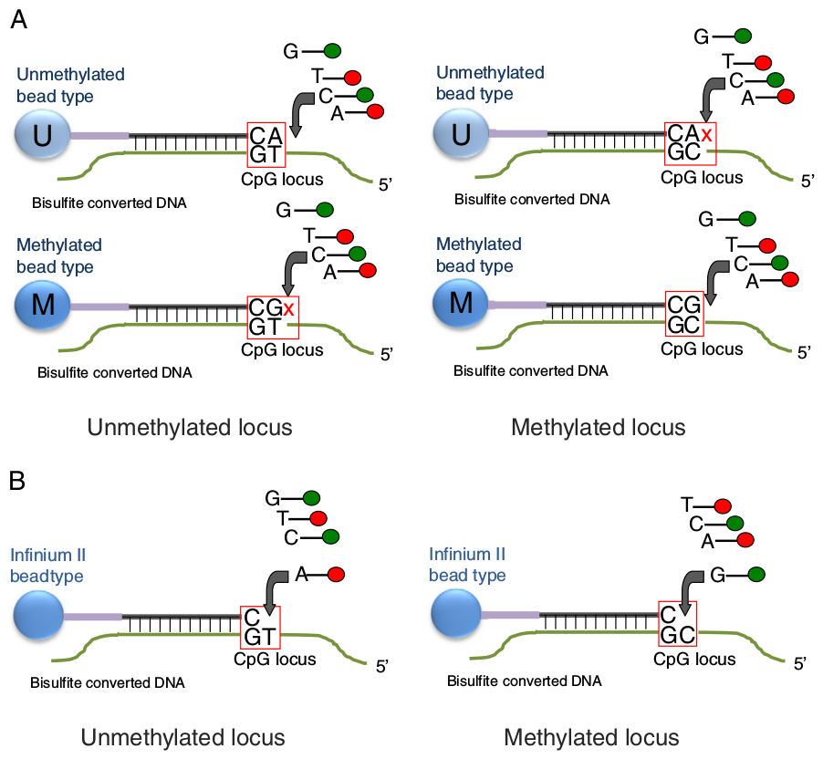
```
(ref:Bibikova2011IlluminaMethylationBeadChip-Cap) __Illumina Methylation Bead Chip Array Probe Designs__ The probes on the array are 50bp in length. In type I probes, unlike type II probes the base that is incorporated (or not) in the elongation step is the base that __follows__ the CpG site. The probes on the array are bound by the amplification products derived from the bisulfite converted DNA, not direct conversion products. Thus, Cs in the sample DNA represent methylated positions and Ts unmethylated positions, as Ts take the place of Us created by bisulfite conversion during the amplification process. __Type I__: Panel A shows the type I probe design. Each locus is represented on two beads, a methylated and an unmethylated bead. *Methylated Sample*: When sample DNA binds a methylated probe the G at the second position in the CpG on the methylated probe will be complementary to the C marking the location of the 5mC. Extension will then be able to occur incorporating a fluorescently labelled base complementary to the base just 5' of the 5mC position in the probe. On the unmethylated probe, the C marking the position of the 5mC will not be complementary to the A base in the probe and thus extension cannot occur. No fluorescent base will be incorporated at the unmethylated probe. *Unmethylated Sample*: When sample DNA binds the methylated probe the T marking the position of the unmethylated C is not complementary to the G at the second position in the CpG site on the probe. Thus, no fluorescent base is incorporated. Whereas, on the unmethylated probe the T marking the position of the unmethylated C will be complementary to the A at the second position in the CpG site on the probe. Thus, a fluorescently labelled base can be incorporated. __Type II__: Panel B shows the Type II probe design. For the Type II probes only one probe represents each locus. In the Type II probes the incorporated base is at the second position in the CpG site. A fluorescently labelled A is always incorporated opposite a T in the sample DNA marking the position of an unmethylated C, and a fluorescently labelled G is always incorporated opposite a C marking the position of an unconverted 5mC in the sample DNA. For the Type II probes, in contrast to the Type I probes, methylation is always signalled in the green channel and unmethylation in the red channel. (figure reproduced from Bibikova et al. [@Bibikova2011].)

These arrays have now undergone several iterations [@Bibikova2009; @Bibikova2011; @Moran2015].
The current array probe design was preceded by the 'golden gate' array which used a variant on the SNP probe design with methylation-specific PCR, This array contained ~1.5k probes covering 371 genes with a strong focus of cancer-related genes [@Bibikova2006].
The first array using the probe design outlined above was the 'Infinium' array which contained 27k type I probes focused on the promoter regions for 14,475 consensus coding genes with 110 miRNA promoters [@Bibikova2009].
The 450k array which had ~480k mixed type I and II probes covering 21,231 RefSeq genes, 26,658 CpG islands, 80,538 predicted enhancer regions and a variety of other features, including the MHC region [@Bibikova2011].
The 450k array systematically underestimates the methylation level in highly methylated regions [@Clark2012], this may well be because it samples only single sites, and highly methylated regions are often not fully methylated.
A Markov chain model of DNA methylation state developed by Affinito et al. [@Affinito2016] suggests that once a threshold level of DNAm is reached on a molecule further methylation becomes less likely.
They reason that DNMTs recruited by the high methylation state have greater difficulty accessing the remaining unmethylated sites.
Thus sampling a single site is likely to produce a systematic underestimate as once neighboring sites are methylated methylation at a given CpG is less likely to increase further.
The 'EPIC' array has ~850k probes including >90% of those on the 450k with greatly expanded coverage of loci with more dynamic methylation states than promoters and CGIs [@Moran2015].
Promoters and CGIs tend to have relatively low methylation variability and the EPIC array aims to capture more functional methylation variation at regions such as enhancers [@Ziller2013].
The 'EPIC' array also contains both Type I and Type II probes, with many of the new sites being type II.
The type I probes have greater dynamic range than the type II but take up twice as much space on the array so there is some trade-off between maximising the number of sites covered and the quality of data at those sites.

Methylation at each site on the array is commonly reported as a $\beta$ value, which corresponds to the proportion of the sample DNA which was methylated at that site.
This is computed from the intensity values extracted from Illumina's IDAT format files which in the case of the methylation arrays are a binary format which had to be reverse engineered to permit analysis outside of Illumina's 'GenomeStudio' [@Smith2013].

$$\frac{\beta=intensity[M]}{intensity[U] + intensity[M]}$$

Where $M$ = methylated and $U$ = unmethylated.

The type I and type II probes have slight systematic differences not accounted for by their genomic context [@Dedeurwaerder2011].
Type I probes have a wider range and are more reproducible than the type II probes. 
This is likely due to the dual complementary probes with fluorescence in different colour channels providing additional information for methylation level calling leading to more robust estimates at extreme values near 1 and 0.
This difference means that to operate uniformly on this mixed data a normalisation procedure is needed to correct for these differences. 

```{r Dedeurwaerder2011fig1bL, fig.cap='(ref:Dedeurwaerder2011fig1bL-Cap)', out.width='50%', fig.show='hold', fig.align = 'center', echo=FALSE}
knitr::include_graphics("figs/Dedeurwaerder2011fig1bL.png")
```
(ref:Dedeurwaerder2011fig1bL-Cap) __Type I probes have a wider range and less variability than type II__. Type I probes shown in blue, Type II in red. Plot shows kernel density of beta values with gausian smoothing. (Reproduced from Dedeurwaerder et al. [@Dedeurwaerder2011])

There exist a number of normalisation methods to account for probe-type bias [@Fortin2016] such as beta-mixture quantile normalization (BMIQ) [@Teschendorff2013]. 
This method was applied as a part of the pre-processing of the Twins UK 450k array datasets used in [Chapter 4](#tRNAs) in this thesis. 
In addition, there are other techniques capable of correcting for probe bias as well as other sources of technical variation such as batch effects [@Leek2010].
Functional normalisation [@Fortin2014] which makes use of the technical control probe data on the arrays to inform its transformation of the DNA methylation values was used to normalise EPIC array data from the MAVIDOS and Southampton Women's Survey (SWS) data in [Chapter 3](#arrays) of this work.

In addition to probe-type bias, there are other sources of potential problems for individual probes on these arrays [@Pidsley2016].
Zhou et al. divide these into three categories [@Zhou2017]:

1. Probes with SNPs internal to the probes especially if located near the 3' end.
  These can cause issues by: 
    a) preventing extension through mismatches near the 3' end.
    b) Altering the ability of the target cytosine to be methylated through effects on the sequence context, including the case where a C/T polymorphism in place of the C/T bisulfite induced conversion.
    c) Inducing a colour change in a type I probe by altering the extension base.
2. Probes which map to multiple possible locations in the bisulfite-converted genome. 
  Methylation values form multi-mapping probes are an amalgam of the methylation levels at the different loci to which the probes can map and cannot be disentangled to yield reliable results for the different loci.
3. Probes with partial off-target matches to other loci.
  Probes with partial matches at the 3' end can lead to extension and an erroneous readout of methylation levels for that locus or partial matches elsewhere can lead to competition for binding with the probe intended for that locus.

To account for these potential problems probe 'masks' have been produced which identify probes which commonly exhibit one or more of these problematic properties so that findings at these loci can be excluded or followed up for validation with other methods [@Zhou2017; @Pidsley2016].
These masks have been used here to identify potentially problematic probes.

The presence of a genetic variant which influences the DNA methylation state of a CpG is known as genetic confounding.
This is not necessarily a problem if genetic effects on a phenotype of interest are a useful outcome but it is an issue if looking for effects mediated purely through epigenetic mechanisms.
Simply excluding all probes with a SNP above a certain minor allele frequency and with a certain distance of a target CpG can both miss rarer genetic confounders and throw away actual non-genetic differences in DNA methylation.
Andrews et al. developed a method called 'gap-hunting' to identify probes which commonly have multi-modal DNA methylation distributions which may be associated with different genotypes influencing a probe locus [@Andrews2016]. 
'gap-hunting' was also employed in this work to search for DNA methylation changes which may be under genetic influence [Results 1](#arrays).
In addition to SNPs causing sequence context changes that affect the DNAm of probes, structural mutations can also have this effect on DNA methylation [@Bell2017a].
Thus probes in the vicinity of non-SNP mutations should also be subject to additional scrutiny.

## MeDIP-seq {#MeDIPseq}

MeDIP-seq uses a monoclonal anti-5mC antibody to bind denatured fragmented genomic DNA at methylated CpG sites. 
This antibody-bound fraction of DNA is isolated and sequenced [@Down2009], Figure \@ref(fig:MeDIPseqReaction) outlines the workflow.
Unlike bisulfite conversion approaches this method permits 5mC to be differentiated from 5hmC, as the antibody binds specifically to 5mC.
The methylation level across the CpG sites in the region of the genome to which the resultant sequencing reads map can subsequently be estimated by counting the number of reads and accounting for the CpG density with software tools such as the `MEDIPS` R package [@Lienhard2014].

MeDIP-seq can also cover much more of the methylome than do the 450k or EPIC arrays. 
The 450k array captures ~1.6% of the 28 million CpGs in the genome. 
At near saturation coverage of ~40 million reads per sample, MeDIP-seq can cover ~60% of all CpGs with at least 1 read, this is almost all methylated CpGs.
At half that total read count MeDIP-seq still covers ~50% of CpGs at $\ge1\times$ and ~20% at $\ge5\times$ [@Taiwo2012].
Other estimates place the threshold for saturation coverage by MeDIP-seq lower at between 20 and 30 million reads and suggest that the maximum number of CpGs covered at least once could extend up to 90% [@Chavez2010].
MeDIP-seq provide a particular advantage by comparison with the Illumina beadchip array technologies with respect to the coverage it provides for repetitive regions of the genome. 
This is illustrated by Clark et al. who show that MeDip-seq covers an estimated 91.4% of repetitive sequences and the 450k array only 3.4% [@Clark2012] (Figure \ref{fig:Clark2012fig1}).
This makes it particularly suited to the aims of this project (Chapters [4](#tRNAs) & [5](#Alus)).

```{r Clark2012fig1, fig.cap='(ref:Clark2012fig1-Cap)', out.width='90%', fig.show='hold', fig.align = 'center', echo=FALSE}
knitr::include_graphics("figs/Clark2012fig1MeDIPseqVs450Kcoverage.png")
```

(ref:Clark2012fig1-Cap) MeDIP-seq provides superior coverage of repetitive regions of the genome than the Illumina array platform. MD-s = MeDIP-seq, 450k = Illumina 450k DNA methylation bead chip array (Reproduced from Clark et al. [@Clark2012])

```{r MeDIPseqReaction, fig.cap='(ref:MeDIPseqReaction-Cap)', out.width='60%', fig.show='hold', fig.align = 'center', echo=FALSE}
knitr::include_graphics("figs/MeDIPseqReaction.png")
```
(ref:MeDIPseqReaction-Cap) __Graphical Summary of the MeDIP-seq process__ Purified DNA is fragmented by sonication, denatured and incubated with anti-5mC antibodies. It is then immunoprecipitated resulting in fragments containing methylated CpGs which are subsequently sequenced.

DNA sample preparation, MeDIP reaction, and Illumina sequencing were performed by BGI-Shenzhen (Shenzhen, China).
Fragmentation of genomic DNA from whole peripheral blood samples from the Twins UK cohort was performed by sonication using a Covaris system (Woburn, MA, USA).
$5\mu g$ of DNA was used in the Illumina Single-End DNA Sample Prep kit followed by end repair, <A> base addition and adaptor ligation.
The MeDIP reaction was performed, according to the protocol for the MagMeDIP kit (mc-magme-048), with a monoclonal antibody for 5-methylcytosine (5mC) (Cat. No.: CO2010021 mc-magme-048 from Diagenode (Liège, Belgium)). 
The antibody was incubated with Adaptor-ligated DNA combining $0.5 \mu l$ antibody + $0.5 \mu l$ water; then $0.6 \mu l$ MagBuffer A, $1.4 \mu l$ water and, $2 \mu l$ MagBuffer C; yielding a final volume of $5 \mu l$ for the immunoprecipitation reaction.
The MeDIP reaction was validated with quantitative PCR.
The product of the MeDIP reaction was purified with Zymo DNA Clean & Concentrator-5 (Zymo Research), and amplified with adaptor-mediated PCR.
Size selection of fragments (200–500 bp) was performed by gel excision and quality assessed by Agilent BioAnalyzer (Agilent Technologies, Santa Clara, CA, USA). 
The resultant libraries were subjected to highly parallel 50bp single-end sequencing on the Illumina HiSeq2000 platform.

Quality control (QC) and alignment were performed by Twins UK.
Sequencing data were subject to initial QC for call quality and base composition using `FASTQC` (v0.10.0) (https://github.com/s-andrews/FastQC) [@Andrews2010].
Duplicates were removed with `SAMTools` (https://github.com/samtools/samtools) [@Li2009b].
The alignment was performed using the Burrows-Wheeler Aligner (`bwa`) (https://github.com/lh3/bwa) [Li2009] with a minimum mapping quality score of Q10.
`MEDIPS` (v1.0) was used to perform MeDIP-specific QC, as well as to generate reads per million (RPM) and Absolute methylation score (AMS) values (https://bioconductor.org/packages/release/bioc/html/MEDIPS.html) [@Lienhard2014].
AMS and RPM values are binned into 500bp windows with a 250bp slide in the BED format, resulting in ~12.8 million windows on the genome (Build: hg19/GRCh37).
Additional quality control checks were performed in the R language: correlation matrix, hierarchical clustering, dendrogram, heatmap, density plot, and batch effects inspection by principal component analysis.
There was a mean of ~16.89 million (SD 3.04M) reads per sample.
This number of reads per sample is consistent with covering ~50% of all CpGs at 1x, ~15% at 5x and ~10% at 10x (estimated using the results of Taiwo *et al.* 2012 [@Taiwo2012].)
MeDIP-seq data from regions of interest was extracted using `bedtools` v2.17.0 [@Quinlan2010].

### Participants

Peripheral blood samples for DNA extraction were provided by the adult volunteers from the UK Twin Register (TwinsUK Resource [@Moayyeri2013]).
The participants are rigorously phenotyped at visits at St Thomas’ Hospital, London.
A twinning questionnaire determines twin zygosity and is confirmed by genotyping. 
Ethics were approved by Guy’s & St Thomas’ NHS Foundation Trust Ethics Committee (EC04/015—15-Mar-04) and written informed consent was obtained from all subjects in accordance with this. 
Samples are stored at −80 °C in EDTA tubes before extraction via the Nucleon Genomic DNA Extraction Kit. 
DNA is subsequently stored in TE Buffer at −20 °C. 

The MeDIP-seq dataset used in this work consists of 4350 whole blood methylomes with age data.
4054 are female and 270 male.
3001 have full blood counts.
There are 3652 individuals in this data set.
These individuals originate from 1933 unique families.
There are 1234 monozygotic (MZ) twin pairs (2468 individuals), and 458 dizygotic (DZ) twin pairs (916 individuals).

The above-described processing steps for Methylated DNA Immunoprecipitation sequencing (MeDIP-seq) data used here have been previously described in Bell et al. [@Bell2016; @Bell2017a].
These processed data are available, subject to approval, from the European Genome-phenome Archive (EGA) (https://www.ebi.ac.uk/ega) under study number EGAS00001001910 and dataset EGAD00010000983.

## Targeted Bisulfite sequencing

Targeted Bisulfite sequencing [@Korbie2015] is very similar in principle to ordinary targeted DNA sequencing but preceded by a bisulfite conversion step as illustrated in Figure \@ref(fig:BisulfiteConversionNEB) [@Bock2010].
However, bisulfite conversion has several implications for downstream processing.
Bisulfite library prep can be either directional, sequencing reads correspond to a bisulfite-converted version of either the forward or reverse strand, or non-directional in which sequencing reads correspond to bisulfite-converted versions of either strand giving a total of four bisulfite-converted sequences with the strand of origin unknown.
If a library is directional there are only two bisulfite-converted sequences.
Library preparation in this work was non-directional.

Mapping can be performed with customised software wrapper to implementations of existing alignment tools. 
`Bismark` is a popular example of such as wrapper which uses the bowtie alignment tool and calls site methylation levels [@Tran2014].
Alignment is performed with *in silico* bisulfite converted versions of the genome and reads, with G to A conversions for reverse strand reads.
This requires four parallel instances of bowtie for forward and reverse G to A and C to T conversions, which are combined to determine the unique best alignment.
(Figure \@ref(fig:Krueger2011BismarkAlignment) panel A).
Bisulfite conversion results in loss of sequence complexity as many Cs effectively become Ts meaning short reads can be challenging to map.
For targeted sequencing approaches it is advisable to align to both the targeted sites and their flanking regions as well as to the whole genome, especially if any of the targeted regions contain repetitive sequences [@Bottcher2012].
Substantial mapping to areas other than those targeted could be indicative of off-target amplification, this step forms a part of the quality control process.
`Bismark` produces methylation calls either combined or by strand and which can be filtered by methylation context CpG, CHG or CHH.

```{r Krueger2011BismarkAlignment, fig.cap='(ref:Krueger2011BismarkAlignment-Cap)', out.width='60%', fig.show='hold', fig.align = 'center', echo=FALSE}
knitr::include_graphics("figs/Krueger2011BismarkAlignment.png")
```
(ref:Krueger2011BismarkAlignment-Cap) __Bisulfite sequencing alignment process__  (Reproduced from Krueger et al. [@Krueger2011])

Targeted sequencing methods where the aim is to sequence a number of amplicons ($N_a$) from a number of samples ($N_s$) means the total number of PCR reactions in the pairwise matrix is ($N_a \times N_s$).
This can rapidly become difficult to manage with conventional bench-top PCR methods especially where consistently between reactions is important for quantitation.
Microfluidic systems for conducting multiple PCR reactions in parallel such as the Fluidigm 48.48 access array employed here improve the ease with which a large number of reactions can be performed.

```{r targetedBiSseqFluidigmGeneric, fig.cap='(ref:targetedBiSseqFluidigmGeneric-Cap)', out.width='60%', fig.show='hold', fig.align = 'center', echo=FALSE}
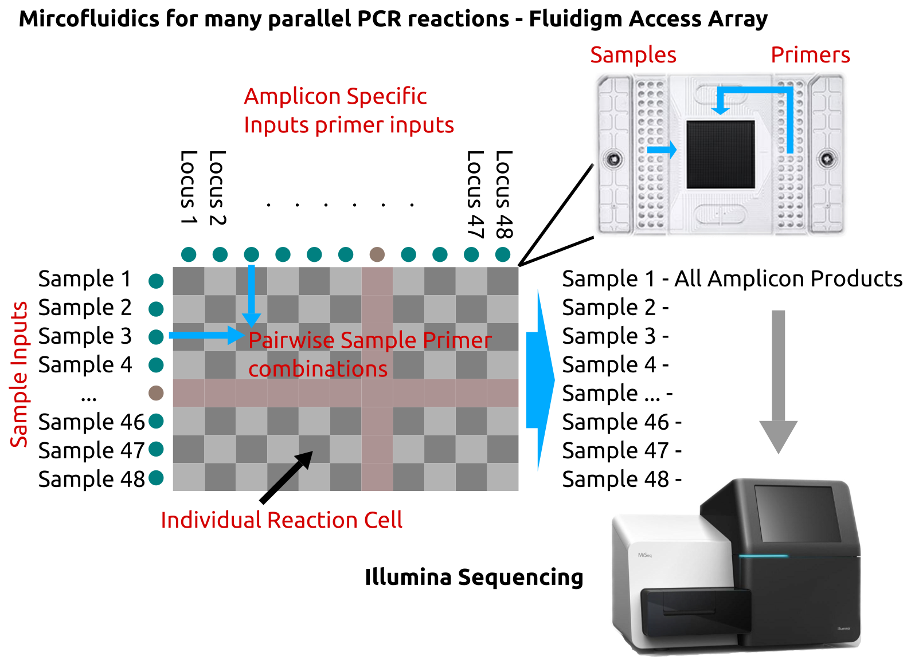
```

(ref:targetedBiSseqFluidigmGeneric-Cap) __Four primer step-out PCR for targeted bisulfite sequencing on the Fluidigm access array.__ 

A four primer step-out PCR process is performed on the bisulfite-converted genome to generate the final PCR product used in the Illumina sequencing reaction (Figure \ref{fig:targetedBiSseqFluidigmPCR}).
After the loci of interest are selected locus-specific primers are designed to be complementary to the bisulfite converted regions flanking the area of interest and avoiding CpG sites in those flanking regions.
A number of tools for designing such primers are available, the tool used in this work was: 'methPrimer' [@Li2002].

```{r targetedBiSseqFluidigmPCR, fig.cap='(ref:targetedBiSseqFluidigmPCR-Cap)', out.width='60%', fig.show='hold', fig.align = 'center', echo=FALSE}
knitr::include_graphics("figs/targeted_BiSseq_fluidigm_PCR.png")
```

(ref:targetedBiSseqFluidigmPCR-Cap) __Microfluidic system for multiple parallel pairwise PCR reactions.__
Fluidigm 48.48 access array.

After designing the target-specific primer sequences the CS1 and CS2 adaptor sequences are added to the forward and reverse primers respectively to permit the addition of Illumina sequencing primers in a second PCR step.
The subsequent analysis is similar to that for whole-genome bisulfite sequencing.
The PCR products are sequenced and the resulting reads aligned and methylation levels called with `Bismark`.

<!--chapter:end:02-methods.Rmd-->

# Results 1 - Epigenome Wide Association Studies for Bone Health Outcomes in Umbilical Cord Blood and Tissue {#arrays}

## Abstract

Long term bone health and fracture risk is strongly influenced by the peak bone mass that is attained in early adulthood, this has its origins in development from late pregnancy through early childhood.
The availability of vitamin D to facilitate the uptake of calcium and phosphate is essential to healthy bone development, in addition to the role of vitamin D as a hormone mediating this process.
Greater mechanistic understanding of this process is desirable to permit the design of more effective interventions to reduce the substantial health burden of osteoporotic fractures in the elderly.
Maternal vitamin D levels during pregnancy have previously been shown to impact on the methylation status of specific genes associated with vitamin D signalling and metabolism, such as *RXRA*. 
Long-term bone health outcomes have also been associated with both maternal vitamin D during pregnancy and methylation of the *CDKN2A* gene. 
To attempt to identify other loci, the epigenetic regulation of which is pertinent to the impact of maternal vitamin D levels on long-term bone health, Epigenome-Wide Association Studies (EWAS) were performed with DNA methylation data from the Illumina EPIC & 450k methylation bead chip arrays.
We tentatively identify two CpGs whose DNA methylation state is associated with bone mineral content at 6 years of age and periosteal circumference at 6 years of age respectively.

## Introduction

In England and Wales a survey of general practice data indicates that 53% of women and 21% of men will experience a bone fracture in their remaining lifetime from the age of 50 years [@VanStaa2001] (Figure \@ref(fig:VanStaa2001)).
Hip fractures in particular are associated with a reduction in survival of an estimated 10-20% with most deaths occurring in the first 6 months, vertebral fractures though approximately an order of magnitude less common carry a similar mortality risk [@VanStaa2001; @Streubel2011].
The national osteoporosis foundation estimated the societal cost of osteoporosis at 58 Billion USD for 2018 in the USA alone [@Thompson2018] with serious negative implications for the quality of life of those with this condition.
Thus interventions to increase bone health and reduce the rate of osteoporosis as well as developing a mechanistic understanding of the development of this condition are of considerable medical interest.

```{r VanStaa2001, fig.cap='(ref:VanStaa2001-Cap)', out.width='80%', fig.align = 'center', fig.show='hold', echo=FALSE}
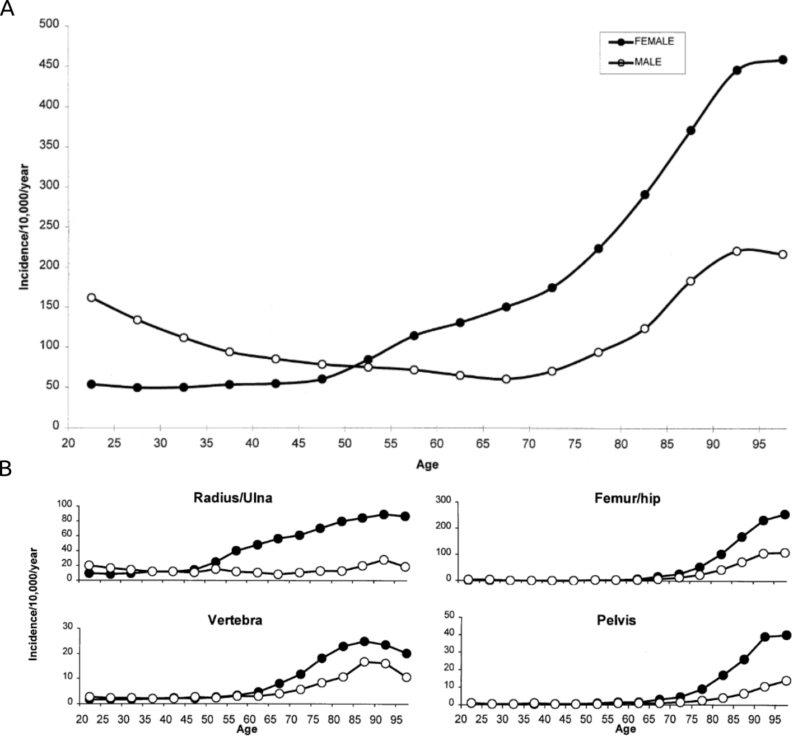
```
(ref:VanStaa2001-Cap) __Overall Fracture Incidence Increases With Age__ Data from 5 million adults in the General Practice Research Database 1988-1998. __A__ Incidence of all fractures at any site by sex and age. __B__ Fractures by sex and age at select sites, pelvis, Femur/Hip & Vertebra confer the greatest increased mortality rates and Radius/Ulna has the greatest sexual dimorphism. (Adapted from van Staa et al. [@VanStaa2001].)


Modelling work indicates that the largest determinant of osteoporosis risk is peak bone mineral density (BMD) with a 10% change in peak BMD leading to a predicted 13 year delay in the development of osteoporosis [@Hernandez2003].
Though the baseline BMD is a better predictor of fracture risk, the rate of loss also independently predicts risk [@Nguyen2005; @Finkelstein2008; @Hui1990].
Thus factors altering the peak bone mass will be important for modulating osteoporosis risk.
Bone mass increases from intrauterine development through to a peak in early adulthood (Figure \@ref(fig:Harvey2014bfig1)).

```{r Harvey2014bfig1, fig.cap='(ref:Harvey2014bfig1-Cap)', out.width='80%', fig.align = 'center', fig.show='hold', echo=FALSE}
knitr::include_graphics("figs/Harvey2014bfig1.png")
```
(ref:Harvey2014bfig1-Cap) __Bone Mass Over The Lifecourse__ Bone mass increases from intrauterine development through to a peak in early adulthood. Intervention in early life to modulate growth trajectory and increase peak mass may provide a higher starting point and delay bone loss in later life. (Reproduced from [@Harvey2014b].)


Calcium, phosphate and vitamin D are needed for bone development [@Bikle2012] and maintenance.
Vitamin D is needed for sufficient intestinal absorption of calcium [@Christakos2011] and phosphate [@Fukumoto2014] in addition to the hormonal role it plays in the regulation of bone development. 
Calcium and vitamin D intake are modifiable factors and thus constitute a reasonable starting point for interventions to improve bone health.
This raises the question of how and when they can best be deployed to maximise their impact on bone health.

Birth weight predicts bone mass in adulthood [@Baird2011]. 
A longitudinal study with long term follow up at Helsinki University Central Hospital linked low childhood growth rate with greater fracture risk in later life [@Cooper2001].
Data from the Southampton Women's Survey (SWS)[@Inskip2006] suggest that intervention in the interuterine period and infancy may afford the greatest opportunity to impact on long term bone health. 
Rate of growth in late pregnancy (19-34 weeks) and early post natal growth (up to ~2 years) predict bone mass at 4 years of age [@Harvey2010a], and estimates of hip strength at 6 years [@Harvey2013].
The proportion of individuals crossing between tertiles of the distribution of growth in length decreases with age, indicating that the variability and thus potential malleability of growth is greatest during the period from 11 weeks gestation to ~2 years.

Observational data indicated a relationship between maternal vitamin D status and bone outcomes in children
[@Mahon2010a; @Viljakainen2010].
Prospective studies showed the effects of maternal vitamin D status on bone growth in newborns [@Viljakainen2011] and at 20 years of age [@Zhu2014a].
MAVIDOS (Maternal Vitamin D Osteoporosis Study) is a randomised, double-blind, placebo-controlled trial of oral vitamin D supplementation (1000 IU cholecalciferol/day or placebo) from 14 weeks gestation in women with initial circulating 25(OH)-vitamin D levels of 25-100 nmol/l [@Harvey2012a; @Cooper2016]. 
The primary outcome of the study was whole body bone mineral content, assessed by Dual Energy X-ray absorptiometry (DXA) within 14 days of birth, and follow up DXA at 4 years of age.
MAVIDOS did not find significant differences in neonatal bone outcomes overall but there were significant differences between intervention and placebo for births taking place during the winter months.

$1,25(OH)_2-Vitamin~D$ has been implicated in the control of Plasma membrane $Ca^{2+}$-ATPases (PMCAs). 
The expression of the *PMCA3* gene in the placenta has been associated with umbilical cord calcium concentration and intrauterine accrual of bone mineral content [@Kip2004]. 
This provides part of a candidate mechanism linking intrauterine vitamin D availability to bone outcomes, but much remains to be elucidated about how maternal vitamin D status may impact bone development.
Work in rat models has demonstrated the ability of maternal nutritional exposure during pregnancy to influence the epigenetic state and expression of genes in their offspring, specifically a change in DNA methylation was identified [@Burdge2007a; @Lillycrop2008; @Burdge2007].
Consequently, the DNA methylation status of target genes of interest for vitamin D and bone development related pathways have been examined [@Holroyd2012]. 

Retinoid-X-receptor-alpha (RXRA), which forms a heterodimer with the vitamin D receptor is essential for the nuclear action of $1,25(OH)_2-Vitamin~D$. 
DNA methylation at four of ten CpG sites in the *RXRA* gene were significantly ($p\le0.05$) lower in the umbilical cord of offspring from cholecalciferol supplemented mothers compared to placebo with a mean difference in methylation of -1.98% (n=447, 95% CI -3.65 to -0.32, p=0.01). 
One CpG site in the gene is related to estimated free 25(OH)D levels [@Harvey2014d].

Methylation of cyclin-dependent kinase inhibitor 2A (CDKN2A) in umbilical cord tissue has been implicated in bone cell activity mediating skeletal development and homeostasis. 
The *CDKN2A* locus has quite complex biology encoding two cell cycle inhibitors $p14^{ARF}$ and $p16^{INK4a}$ as well as the long non-coding RNA *ANRIL* which inhibits $p16^{INK4a}$. 
Targeted analysis of nine CpGs in a 300bp stretch of the *ANRIL* promoter region of *CDKN2A* was carried out. 
Methylation at several of these sites showed an inverse correlation with bone size, mineral content, and mineral density at age four years [@Curtis2017].

Epigenetic states are a product of both genetics and environment, they exist on a continuum from complete or obligatory genetic determination through facilitative variation influenced by genetics, to the purely epigenetic subject entirely to environmental factors.
This picture is complicated by the observation that genetics can not merely influence epigenetic state but also the extent to which that state will vary depending on environmental factors [@Holland2017]. 
Epigenome-wide association studies have been performed on DNA methylation data for many traits including age (Section \@ref(DNAmAgeReview)), smoking status [@Dogan2017], exposure to atmospheric particulate matter [@Dai2016], and obesity [@Wahl2016]. 
Some robust and reproducible DNA methylation changes have been identified with EWAS, particularly for traits such as age and smoking. 
Unlike genome-wide association studies (GWAS) associations found by EWAS can be due to reverse causation. 
That is to say, a genetic variant associated with a disease is very unlikely to have been caused by the disease state whereas an epigenetic association can be the consequence of a disease state. 
Whilst this can complicate the dissection of disease aetiology it can also be a boon in unpicking the biology that follows on from a particular disease or environmental exposure by revealing what biological networks are affected. 

The previous work identifying DNA methylation changes at the *RXRA* [@Harvey2014d] and *CDKN2A/ANRIL* [@Curtis2017] loci associated with childhood bone outcomes lead to an interest in establishing if DNA methylation changes were occuring at other loci.
EWAS using the Illumina 450k and EPIC array technologies were performed for maternal Vitamin D status and childhood bone outcomes in data from the MAVIDOS and SWS cohorts.

### Outline of EWAS

Three sets of EWAS analyses were performed:
Phase I of the MAVIDOS EPIC arrays and comparison with 450k array results.
Phase II of the MAVIDOS EPIC analysis with additional samples.
Analysis of the SWS cord blood EPIC array data.

- MAVIDOS phase I results (EPIC n = 140, 450k n = 60), EWAS outcomes: 
  - Intervention Vs. Placebo 
  - Bone Mineral Content at Birth (g), measured by DXA
  - Maternal circulating 25(OH)-vitamin D levels (nmol/l) at 34 weeks
  - Change in Maternal Vitamin D form 11 to 34 weeks
    
- MAVIDOS phase II results (n = 237), EWAS outcomes:
  - 4 year Total BMC (g), without heads , measured by DXA
  
- SWS cord blood, EWAS outcomes:
  - 8 year Total BMC (kg), without heads, adjusted for sex and age, measured by DXA (n = 408)
  - 6 year Total BMC (kg), without heads, adjusted for sex and age, measured by DXA (n = 402)
  - 6 year Periosteal circumference of the Tibia at 38% from the distal end (mm), measured by Peripheral Quantitative Computed Tomography (PQCT) (n = 141)
  - 6 year Cortical density of the Tibia at 38% from the distal end (mg/cm3), measured by Peripheral PQCT (n = 141)

## Methods

Analysis of the Illumina EPIC and 450k methylation arrays was carried out in the `R` statistical programming language (v3.5.2) using the [`meffil`](https://github.com/perishky/meffil/wiki) package [@Min2017], which was chosen as it is capable of performing functional normalisation in a more memory efficient fashion than alternatives such as `minfi`. 

### Functional Normalisation

Functional normalisation is an approach to removing unwanted variation associated with 'batch' effects such as the date on which a sample was analysed or which slide a sample is on which was developed by Fortin et al. [@Fortin2014]. 
This noise in the data masks the signal associated with the underlying biological effect of interest. 

Functional normalisation makes use of control probes on the arrays which are designed to capture only technical variation as surrogates for the sources of unwanted variation. 
The control probes are processed into 42 summary measures, and principal components analysis is performed on the control probe summary matrices for all samples. 
The top *m* principal components (PCs) are used as the surrogates for technical variation going forward. 
The number, *m*, of PCs from the control probe summary matrices used is informed by the amount of residual variation remaining after normalisation. 
Picking the number of PCs which correspond to the last steep drop in residual variation is the approach recommended by the implementers of `meffil`, and Fortin et al. [@Fortin2014] recommend an *m* of 2 as performing well across a variety of analyses. 
(See supplementary material from [@Fortin2014] for details of the control probe summary process.)

The process used by functional normalisation is a variant on quantile normalisation. 
Instead of forcing the empirical marginal distributions of the samples to be identical at each site across arrays. To produce the normalised values it constructs a quantile function which only removes variation arising from surrogates for batch variation. 
This approach is effective even when comparing samples with large global differences in methylation levels such as between normal and cancer samples, but cannot overcome high degrees of confounding [@Fortin2014].

### Genetically Confounded and Multi-mapping Probes

Probes from different locations in the genome with similar sequences, especially following the reduction in sequence complexity associated with bisulfite conversion, can be cross-reactive on the arrays leading to erroneous signals and are thus commonly excluded from analysis. 
DNAm is often strongly influenced by genetic factors, the effect is especially pronounced when variants alter the sequence at CpG sites themselves as the site can then no longer be methylated. 
Thus, sites that have common genetic variants at the probe site are also excluded from the analysis, as well as some sites whose methylation is known to be under strong genetic influence by common genetic variation.

43,254 probes on the EPIC array have been identified as multi-mapping, DNA binding to the probes may be derived from other locations in the genome invalidating these probes as a measure of methylation at their intended loci [@Pidsley2016]. 
12,510 probes were identified as having genetic variants at the CpG locus they are intending to assay, this can produce misleading results as mutant bases can resemble the products of bisulfite conversion [@Pidsley2016]. 
1,812 probes where found t overlap regions exhibiting haplotype-specific methylation associated with common non-SNP genetic variants (CNVs, Indels, STRs) and regional in-phase clustering of CpG-SNPs [@Bell2017a]. 
Zhou et al. [@Zhou2017] provided a list of probes which they recommend 'masking' from the 450k array due to multi-mapping issues, genetic variants overlapping the CpG sites, and other factors which may render results from these probes problematic. 

In order to identify any potential additional sources of genetic confounding in the phase I MAVIDOS analysis, Probes with methylation values which cluster into distinct groups were identified using the 'gap hunting' method developed by Andrews et al. [@Andrews2016]. 
Such distinct clusters of methylation can arise from genetic variants which influence methylation levels being present in homozygous and heterozygous forms in the study population, see Figure \@ref(fig:MAVIDOSgaphunterEgMonApr162018). 
As the sensitivity and specificity of 'gap hunting' is limited, it is the advice of the authors not to exclude probes flagged by `gaphunter()` prior to performing EWAS. 
It is instead advised to check if any of the results appear in this list after the fact and examine the possibility of a genetic effect if they are.
In phase II of the MAVIDOS analysis and in the SWS analyses only probes with specific technical QC issues were excluded prior to normalisation and EWAS.
Flagging of problematic probes occurred after EWAS on any significant results.

### EWAS Models

#### Cell-Type Correction

Cell-type composition is a known confounder in epigenetic studies [@Jaffe2014; @Houseman2012]. 
Observed variation DNA methylation can be cell-type intrinsic, where changes in DNA methylation are not driven by changes in the cell-type composition of the tissue; or cell-type extrinsic, where changes in DNA methylation are due to changes in the cell-type composition of the population sampled (Figure \@ref(fig:IntrinsicVsExtrinsicDNAmChangeGeneral)). 
An established approach for addressing this potential source of confounding is to add terms to the regression model which reflect the cell-type composition of each sample. 
Cell-type composition can be ascertained through three main approaches: Direct cell count data; Estimating cell counts using the experimental data and models fitted on DNA methylation data from reference panels of known cell-type composition [@Houseman2012]; or reference free approaches which make use of mathematical methods to identify sources of confounding variation such as cell-type heterogeneity. 
Whilst there are several reference samples available for cord blood [@Cardenas2016; @DeGoede2015; @Bakulski2016; @Gervin2016], none were available for cord tissue at the time of the initial analysis, and consequently a reference free technique was used in phase I of the MAVIDOS analysis.
Models were fitted using Surrogate Variable Analysis (SVA) [@Leek2007] and independent Surrogate Variable Analysis (iSVA) [@Teschendorff2011].
The focus of these results is on SVA as minimal differences between the two methods were observed and SVA was recommended based on comparisons of the performance of various cell-type heterogeneity correction methods [@McGregor2016; @Teschendorff2017].

```{r IntrinsicVsExtrinsicDNAmChangeGeneral, fig.cap='(ref:IntrinsicVsExtrinsicDNAmChangeGeneral-Cap)', out.width='80%', fig.align = 'center', fig.show='hold', echo=FALSE}
knitr::include_graphics("figs/IntrinsicVsExtrinsicDNAmChangeGeneral.png")
```
(ref:IntrinsicVsExtrinsicDNAmChangeGeneral-Cap) Diagrammatic representation of DNAm change arising from extrinsic or intrinsic changes in DNA methylation. Extrinsic changes are due to shifts in cell-type composition. Intrinsic changes in DNA methylation occur without changes in the proportions of cell-types. These two modes of change are of course not mutually exclusive and both can be occurring. 


A reference panel for cord tissue samples was recently published [@Lin2018]. 
This cell-type reference had not yet been integrated into the `meffil` R package used to perform the EWAS analyses so I created [a fork of `meffil` including this reference panel in the required format](https://github.com/RichardJActon/meffil/blob/LinAndKarnaniCordTissueRef/data-raw/lin-karnani-reference.r), this can be installed directly from github. 
The code I used to add this reference to the package data before building the R package can be found in this [gist](https://gist.github.com/RichardJActon/703ae70438e865a37998cd608bd12cd3).
Cell-type correction based on this reference was used in phase II of the MAVIDOS analysis.

#### Structure of models fitted for each EWAS

By default EWAS in `meffil` are run with four different models:

1. No covariates, attempting to predict methylation with the variable of interest.
2. All covariates, attempting to predict methylation with the variable of interest plus a user-supplied list of covariates.
3. Surrogate Variables + all covariates, attempting to predict methylation with user-supplied covariates and surrogate variables generated from SVA.
4. Independent Surrogate Variables + all covariates, attempting to predict methylation with user-supplied covariates and independent surrogate variables generated from iSVA.

Running EWAS with multiple models permits the effects of adding the various covariates on the results of the analysis to be seen. 

### Concordance of EPIC and 450k EWAS Results

In order to ascertain if the results from the EWAS in the 450k and EPIC arrays were producing similar sets of probes in the top ranking positions when ordered by p-value, the concordance (% overlap) between the top k probes, where $k = 1 .. 100,000$ was calculated. 
Only probes in common between the two arrays were used and k was incremented in steps of 50.

## Results

### MAVIDOS phase I

DNA methylation at none of the probes were significantly associated with any of the four variables of interest for each EWAS performed in either the EPIC or 450k datasets. 
The concordance between the probes with the top-ranked p-values in common between the EPIC and 450k data was at the level of chance.

#### Whole array QC

##### EPIC arrays

The predicted sex of the samples generated using sex chromosome probe intensities was checked against that in the sample annotation and two mismatches were found. 
These were MAVIDOS IDs 206 and 63 and the associated arrays were excluded from further analysis, (Figure \@ref(fig:MAVIDOSqcEPICsexMismatch)).

```{r MAVIDOSqcEPICsexMismatch, fig.cap='(ref:MAVIDOSqcEPICsexMismatch-Cap)', out.width='80%', fig.align = 'center', fig.show='hold', echo=FALSE}
knitr::include_graphics("figs/MAVIDOSqcEPICsexMismatch.png")
```
(ref:MAVIDOSqcEPICsexMismatch-Cap) Predicted sex of each sample based on the sex chromosome copy numbers inferred from probe intensities for the EPIC array data. Mismatches between the predicted sex and that asserted in the sample annotation metadata are shown in red. Two predicted sex values differ from their annotations. Plot generated by `meffil` QC report.


The dataset also contained four samples for which there were two technical replicates, only the first replicate from each was used (144 arrays run for 140 individuals). 
Array 201516310023 (MAVIDOS ID 95) was excluded as its median methylated signal was more than $3\sigma$ from the expected value, (Figure \@ref(fig:MAVIDOSqcEPICmethVsUnmeth)). 
No samples were excluded for having a higher than expected proportion of undetected probes (proportion of probes with detection p-value > 0.01 is > 0.1) (Figure \@ref(fig:MAVIDOSqcEPICpropSites)). 
No samples were excluded for having a high proportion of probes with low bead counts (proportion of probes with bead number < 3 is > 0.1), (Figure \@ref(fig:MAVIDOSqcEPICbeadNum)).
In total 3 of the EPIC arrays were excluded from the analysis for failing quality control leaving an n=137.

```{r MAVIDOSqcEPICmethVsUnmeth, fig.cap='(ref:MAVIDOSqcEPICmethVsUnmeth-Cap)', out.width='80%', fig.align = 'center', fig.show='hold', echo=FALSE}
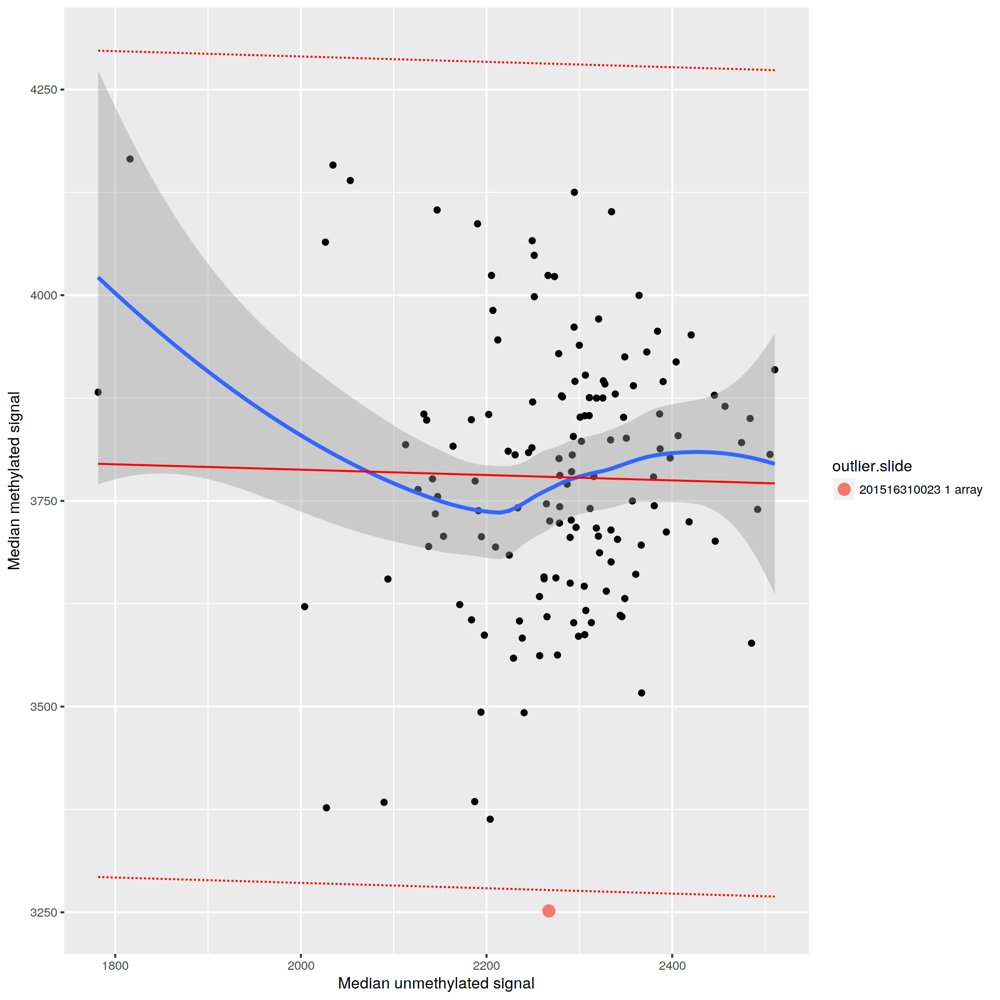
```
(ref:MAVIDOSqcEPICmethVsUnmeth-Cap) Median methylated signal vs unmethylated signal per sample for the EPIC array data, solid red line indicates linear regression of median methylated signal vs median unmethylated signal with dotted red lines representing $3\sigma$ from the expected mean. Samples outside the expected range are indicated in the legend. Plot generated by `meffil` QC report.


```{r MAVIDOSqcEPICpropSites, fig.cap='(ref:MAVIDOSqcEPICpropSites-Cap)', out.width='80%', fig.align = 'center', fig.show='hold', echo=FALSE}
knitr::include_graphics("figs/MAVIDOSqcEPICpropSites.png")
```
(ref:MAVIDOSqcEPICpropSites-Cap) Proportion of probes with detection p-values >0.01 by sample for the EPIC array data. Black line indicates the exclusion threshold of 0.1. Plot generated by `meffil` QC report.


```{r MAVIDOSqcEPICbeadNum, fig.cap='(ref:MAVIDOSqcEPICbeadNum-Cap)', out.width='80%', fig.align = 'center', fig.show='hold', echo=FALSE}
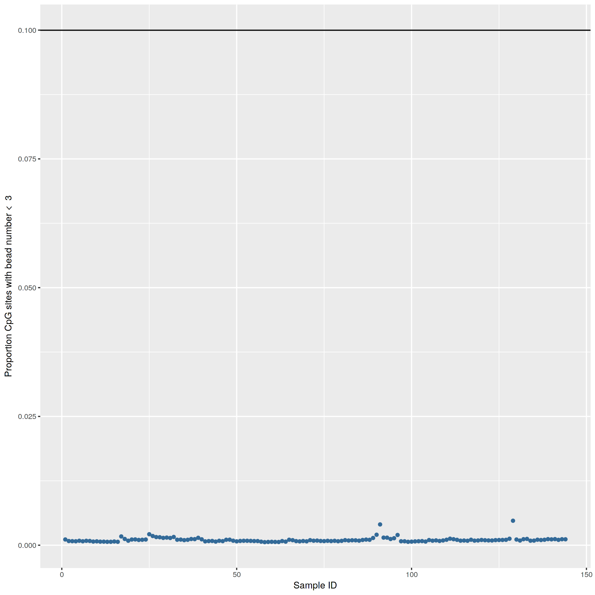
```
(ref:MAVIDOSqcEPICbeadNum-Cap) Proportion of probes with a bead count of < 3 by sample for the EPIC array data. Black line indicates the exclusion threshold of 0.1. Plot generated by `meffil` QC report.


##### 450k Arrays

There were no mismatches between predicted and annotated sex (Figure \@ref(fig:MAVIDOSqc450ksexMismatch)). 
There were not any samples with outliers in their methylated / unmethylated probe proportions (Figure \@ref(fig:MAVIDOSqc450kmethVsUnmeth)). 
No samples were excluded for having a higher than expected proportion of undetected probes (proportion of probes with detection p-value > 0.01 is > 0.1), (Figure \@ref(fig:MAVIDOSqc450kpropSites)). 
No samples were excluded for having a high proportion of probes with low bead counts (proportion of probes with bead number < 3 is > 0.1), (Figure \@ref(fig:MAVIDOSqc450kbeadNum)).

```{r MAVIDOSqc450ksexMismatch, fig.cap='(ref:MAVIDOSqc450ksexMismatch-Cap)', out.width='80%', fig.align = 'center', fig.show='hold', echo=FALSE}
knitr::include_graphics("figs/MAVIDOSqc450ksexMismatch.png")
```
(ref:MAVIDOSqc450ksexMismatch-Cap) Predicted sex of each sample based on the sex chromosome copy numbers inferred from probe intensities for the 450k array data. No predicted sex values differ from their annotations. Plot generated by `meffil` QC report.


```{r MAVIDOSqc450kmethVsUnmeth, fig.cap='(ref:MAVIDOSqc450kmethVsUnmeth-Cap)', out.width='80%', fig.align = 'center', fig.show='hold', echo=FALSE}
knitr::include_graphics("figs/MAVIDOSqc450kmethVsUnmeth.png")
```
(ref:MAVIDOSqc450kmethVsUnmeth-Cap) Median methylated signal vs unmethylated signal per sample for the 450k array data, solid red line indicates linear regression of median methylated signal vs median unmethylated signal with dotted red lines representing $3\sigma$ from the expected mean. Samples outside the expected range would be indicated in the legend. Plot generated by `meffil` QC report.


```{r MAVIDOSqc450kpropSites, fig.cap='(ref:MAVIDOSqc450kpropSites-Cap)', out.width='80%', fig.align = 'center', fig.show='hold', echo=FALSE}
knitr::include_graphics("figs/MAVIDOSqc450kpropSites.png")
```
(ref:MAVIDOSqc450kpropSites-Cap) Proportion of probes with detection p-values >0.01 by sample for the 450k array data. Black line indicates the exclusion threshold of 0.1. Plot generated by `meffil` QC report.


```{r MAVIDOSqc450kbeadNum, fig.cap='(ref:MAVIDOSqc450kbeadNum-Cap)', out.width='80%', fig.align = 'center', fig.show='hold', echo=FALSE}
knitr::include_graphics("figs/MAVIDOSqc450kbeadNum.png")
```
(ref:MAVIDOSqc450kbeadNum-Cap) Proportion of probes with a bead count of < 3 by sample for the 450k array data. Black line indicates the exclusion threshold of 0.1. Plot generated by `meffil` QC report.


#### Probe QC

##### Probe QC - EPIC Arrays

There were no outliers within the control probes Figure \@ref(fig:MAVIDOSqcEPICctrlProbes). 
1,626 probes were excluded for having high background signal in a high proportion of samples (proportion of samples with detection p-value > 0.01 is > 0.1), (Figure \@ref(fig:MAVIDOSqcEPICpropSamples)). 
162 probes were excluded for having low bead count in a high proportion of samples (proportion of samples with bead number < 3 is > 0.1), (Figure \@ref(fig:MAVIDOSqcEPICbeadNumAcross)). 
Probes with poor technical quality were excluded from the analysis prior to functional normalisation.

```{r MAVIDOSqcEPICctrlProbes, fig.cap='(ref:MAVIDOSqcEPICctrlProbes-Cap)', out.width='80%', fig.align = 'center', fig.show='hold', echo=FALSE}
knitr::include_graphics("figs/MAVIDOSqcEPICctrlProbes.png")
```
(ref:MAVIDOSqcEPICctrlProbes-Cap) Control probe signal by sample for each summary group for the EPIC data. Outliers would be circled in black. Plot generated by `meffil` QC report.


```{r MAVIDOSqcEPICpropSamples, fig.cap='(ref:MAVIDOSqcEPICpropSamples-Cap)', out.width='80%', fig.align = 'center', fig.show='hold', echo=FALSE}
knitr::include_graphics("figs/MAVIDOSqcEPICpropSamples.png")
```
(ref:MAVIDOSqcEPICpropSamples-Cap) Undetectable probes across samples for EPIC data. Manhattan plot showing proportion of samples (y) in which a given probe (x) is not distinguishable from background noise, i.e. a detection p-value of > 0.01. Black line indicates the exclusion threshold of 0.1. Plot generated by `meffil` QC report.


```{r MAVIDOSqcEPICbeadNumAcross, fig.cap='(ref:MAVIDOSqcEPICbeadNumAcross-Cap)', out.width='80%', fig.align = 'center', fig.show='hold', echo=FALSE}
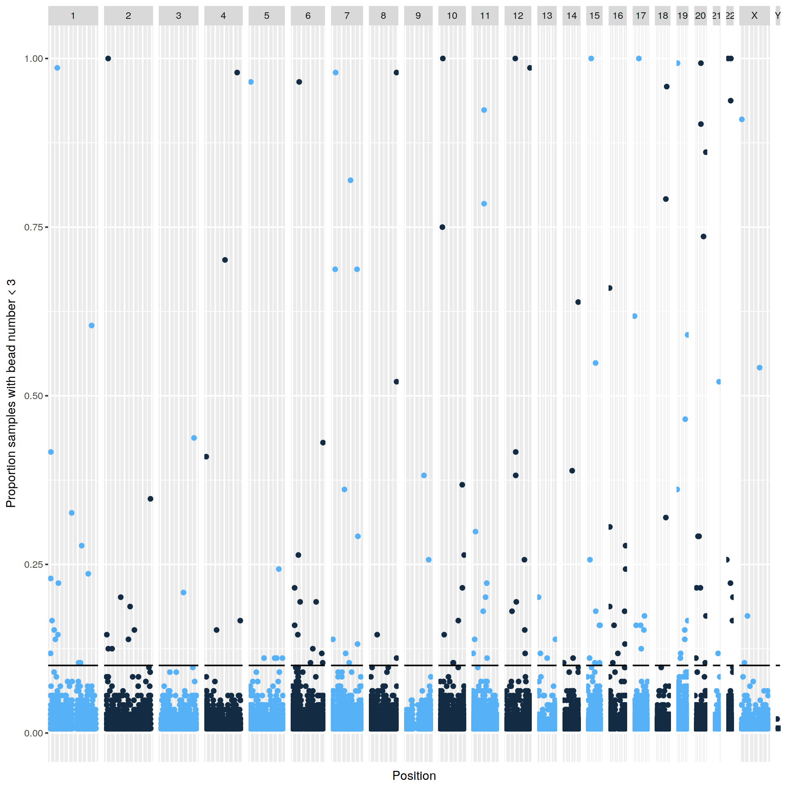
```
(ref:MAVIDOSqcEPICbeadNumAcross-Cap) Low bead count probes across samples for EPIC data. Manhattan plot showing the proportion of samples (y) in which a given probe (x) has a bead count of <3. Black line indicates the exclusion threshold of 0.1. Plot generated by `meffil` QC report.


Problematic probes identified by Pidsley et al. [@Pidsley2016] and those overlapping the regions identified by Bell et al. [@Bell2017a] were excluded from subsequent analysis after functional normalisation. 
This, including the poor quality probes, is a total of 57,396 unique probes excluded from the analysis (~6.62% of the total number of probes).
Gap hunter identified a further 77,398 probes (8.9% of all probes) which might be subject to genetic confounding (Figure \@ref(fig:MAVIDOSgaphunterEgMonApr162018)).

```{r MAVIDOSgaphunterEgMonApr162018, fig.cap='(ref:MAVIDOSgaphunterEgMonApr162018-Cap)', out.width='80%', fig.align = 'center', fig.show='hold', echo=FALSE}
knitr::include_graphics("figs/MAVIDOSgaphunterEgMonApr162018.png")
```
(ref:MAVIDOSgaphunterEgMonApr162018-Cap) An example of the DNAm distribution for a result from the `gaphunter()` function. This is an example chosen to best exemplify the sort of result which is strongly suggestive of a genetic variant with an impact on methylation status acting on this site. It is unrepresentative of typical results from `gaphunter()` in that the groups have a relatively even membership, many results have a small number of individuals in one or more groups making it hard to distinguish methylation outliers caused by rarer genetic variants from those with other causes.


##### Probe QC - 450k Arrays

509 probes were excluded for having high background signal in a high proportion of samples (proportion of samples with detection p-value > 0.01 is > 0.1), (Figure \@ref(fig:MAVIDOSqc450kpropSamples)). 
1037 probes were excluded for having low bead count in a high proportion of samples (proportion of samples with bead number < 3 is > 0.1) (Figure \@ref(fig:MAVIDOSqc450kbeadNumAcross)).
There was one sample (MAVIDOS ID 2183) with an outlier within the control probes, a dinitrophenyl labelled staining control probe, thus it was not excluded as only outliers in dye bias and bisulfite conversion control probes were deemed sufficient grounds for excluding a sample (Figure \@ref(fig:MAVIDOSqc450kctrlProbes), [Detailed contol probe desciption](https://support.illumina.com/content/dam/illumina-support/documents/documentation/chemistry_documentation/infinium_assays/infinium_hd_methylation/infinium-hd-methylation-guide-15019519-01.pdf)). 

```{r MAVIDOSqc450kctrlProbes, fig.cap='(ref:MAVIDOSqc450kctrlProbes-Cap)', out.width='80%', fig.align = 'center', fig.show='hold', echo=FALSE}
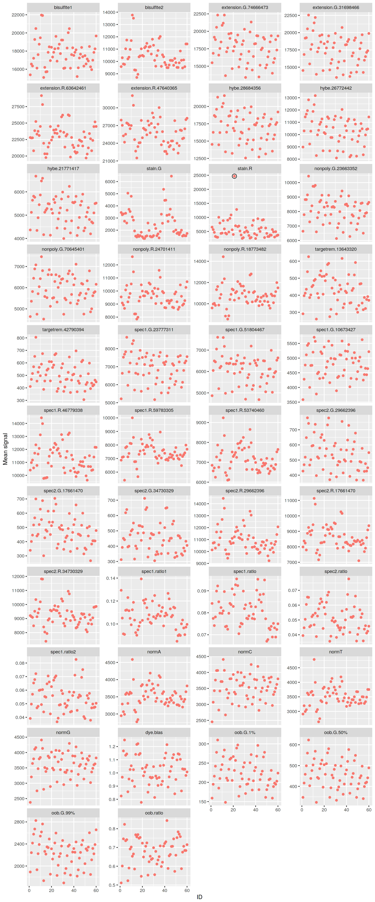
```
(ref:MAVIDOSqc450kctrlProbes-Cap) Control probe signal by sample for each summary group for the 450k data. Outliers would be circled in black. Plot generated by `meffil` QC report.


```{r MAVIDOSqc450kpropSamples, fig.cap='(ref:MAVIDOSqc450kpropSamples-Cap)', out.width='80%', fig.align = 'center', fig.show='hold', echo=FALSE}
knitr::include_graphics("figs/MAVIDOSqc450kpropSamples.png")
```
(ref:MAVIDOSqc450kpropSamples-Cap) Undetectable probes across samples for 450k data. Manhattan plot showing proportion of samples (y) in which a given probe (x) is not distinguishable from background noise, i.e. a detection p-value of > 0.01. Black line indicates the exclusion threshold of 0.1. Plot generated by `meffil` QC report.


```{r MAVIDOSqc450kbeadNumAcross, fig.cap='(ref:MAVIDOSqc450kbeadNumAcross-Cap)', out.width='80%', fig.align = 'center', fig.show='hold', echo=FALSE}
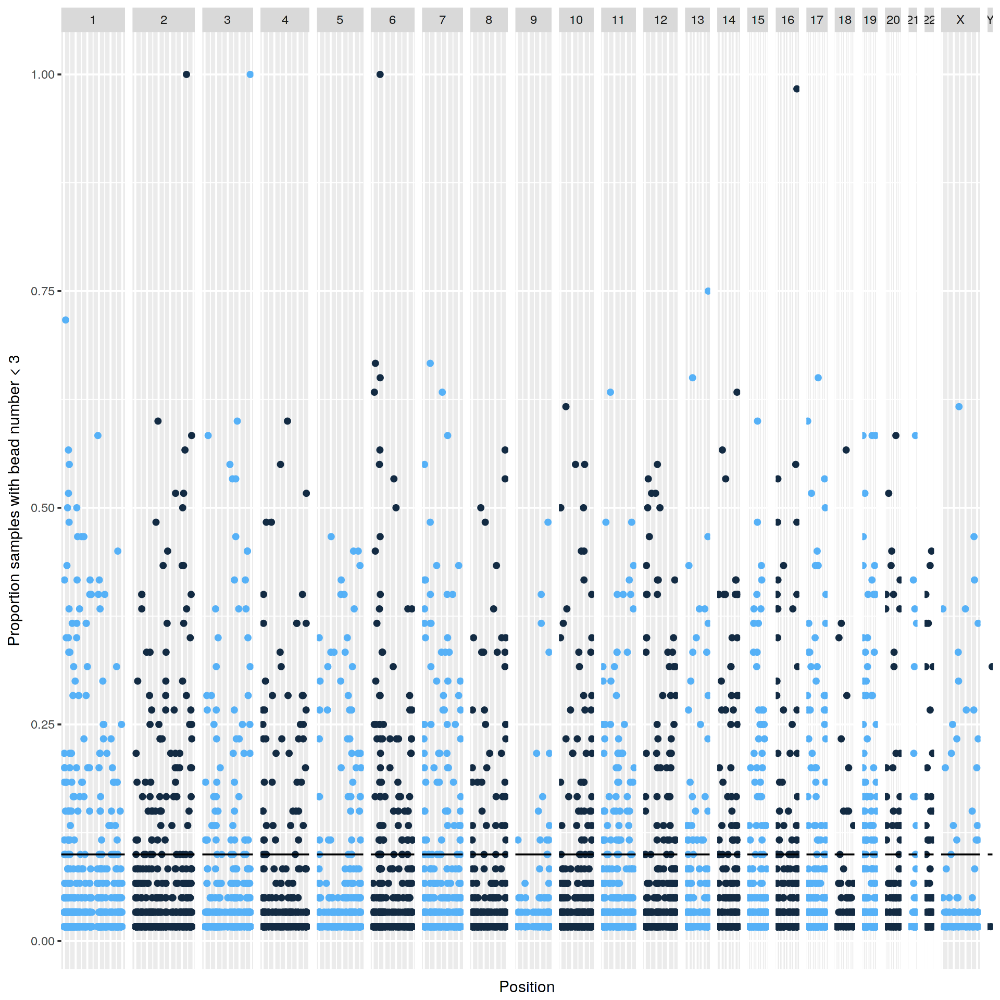
```
(ref:MAVIDOSqc450kbeadNumAcross-Cap) Low bead count probes across samples for 450k data. Manhattan plot showing the proportion of samples (y) in which a given probe (x) has a bead count of <3. Black line indicates the exclusion threshold of 0.1. Plot generated by `meffil` QC report.


All probes on the 'general mask' list from Zhou et al. [@Zhou2017] were excluded from the analysis following functional normalisation, leaving a total of 418,632 probes for subsequent analysis.

#### Functional Normalisation

An *m* of 6 was chosen for the EPIC arrays as this value produced the last steep drop in residual variation, see Figure \@ref(fig:MAVIDOSfunnormPCsEPICMonApr162018). 
An *m* of 6 was chosen for the 450k arrays as this value produced the last steep drop in residual variation, see Figure \@ref(fig:MAVIDOSfunnormPCs450kMonApr162018).

```{r MAVIDOSfunnormPCsEPICMonApr162018, fig.cap='(ref:MAVIDOSfunnormPCsEPICMonApr162018-Cap)', out.width='80%', fig.align = 'center', fig.show='hold', echo=FALSE}
knitr::include_graphics("figs/MAVIDOSfunnormPCsEPICMonApr162018.png")
```
(ref:MAVIDOSfunnormPCsEPICMonApr162018-Cap) Residual variation remaining after functional normalisation of the top 20,000 most variable probes with *m* PCs from the control probe summary matrices for the EPIC array samples (n=137), for M = methylated and U = unmethylated probes.


```{r MAVIDOSfunnormPCs450kMonApr162018, fig.cap='(ref:MAVIDOSfunnormPCs450kMonApr162018-Cap)', out.width='80%', fig.align = 'center', fig.show='hold', echo=FALSE}
knitr::include_graphics("figs/MAVIDOSfunnormPCs450kMonApr162018.png")
```
(ref:MAVIDOSfunnormPCs450kMonApr162018-Cap) Residual variation remaining after functional normalisation of the top 20,000 most variable probes with *m* PCs from the control probe summary matrices for the 450k array samples (n=60), for M = methylated and U = unmethylated probes.


#### EWASs

All EWAS performed below were also performed in exactly the same fashion for the 60 450k arrays, none of these results were significant and they are not included here.

##### Neonatal Bone Mineral Content

Figure \@ref(fig:MAVIDOSbmc) illustrates the distribution of Neonatal Bone Mineral Content, the outcome on which this EWAS was performed.

```{r MAVIDOSbmc, fig.cap='(ref:MAVIDOSbmc-Cap)', out.width='80%', fig.align = 'center', fig.show='hold',  echo=FALSE}
knitr::include_graphics("figs/MAVIDOSbmc.png")
```
(ref:MAVIDOSbmc-Cap) Distribution of Neonatal Bone Mineral Content (g) for individuals in the EWAS.


No probes fell below the Bonferroni corrected significance threshold for an association between DNA methylation at that locus and neonatal bone mineral content, Figure \@ref(fig:MAVIDOSbmcEPICewasManhattanSVA).
Sex and sample age at DXA were included as covariates in the 'all' model.
SVA generated 5 significant surrogate variables which were additionally used in the SVA model.

```{r MAVIDOSbmcEPICewasManhattanSVA, fig.cap='(ref:MAVIDOSbmcEPICewasManhattanSVA-Cap)', out.width='80%', fig.align = 'center', fig.show='hold',  echo=FALSE}
knitr::include_graphics("figs/MAVIDOSbmcEPICewasManhattanSVA.png")
```
(ref:MAVIDOSbmcEPICewasManhattanSVA-Cap) Results of EWAS for neonatal bone mineral content with SVA model. Bidirectional Manhattan plot on which $-log_{10}(p-value)$ is plotted on the y axis and the sign of this value represents the direction of change. Size and transparency of points increases with $-log_{10}(p-value)$ such that the most significant probes are represented by the largest and least translucent points. x axis represents chromosomes and position thereupon. Red line indicates the significance threshold of $6.18\times10^{-8}~(0.05\div808,585)$.  


##### Intervention / Placebo

No probes fell below the Bonferroni corrected significance threshold for an association between DNA methylation at that locus and Intervention/placebo group status, Figure \@ref(fig:MAVIDOSccEPICewasManhattanSVA).
Sex and sample age at DXA were included as covariates in the 'all' model.
SVA generated 5 significant surrogate variables which were additionally used in the SVA model.

```{r MAVIDOSccEPICewasManhattanSVA, fig.cap='(ref:MAVIDOSccEPICewasManhattanSVA-Cap)', out.width='80%', fig.align = 'center', fig.show='hold', echo=FALSE}
knitr::include_graphics("figs/MAVIDOSccEPICewasManhattanSVA.png")
```
(ref:MAVIDOSccEPICewasManhattanSVA-Cap) Results of EWAS for intervention/placebo group status with SVA model. Bidirectional Manhattan plot on which $-log_{10}(p-value)$ is plotted on the y axis and the sign of this value represents the direction of change. Size and transparency of points increases with $-log_{10}(p-value)$ such that the most significant probes are represented by the largest and least translucent points. x axis represents chromosomes and position thereupon. Red line indicates the significance threshold of $6.18\times10^{-8}~(0.05\div808,585)$. 


##### Maternal Vitamin D (34wks)

Maternal Vitamin D levels remain substantially overlapping between intervention and placebo groups at 34wks, see Figure \@ref(fig:MAVIDOSvitDviolinMonApr162018). 
Thus maternal vitamin D at 34wks may prove a more useful variable to model than intervention/placebo status. 

```{r MAVIDOSvitDviolinMonApr162018, fig.cap='(ref:MAVIDOSvitDviolinMonApr162018-Cap)', out.width='80%', fig.align = 'center', fig.show='hold', echo=FALSE}
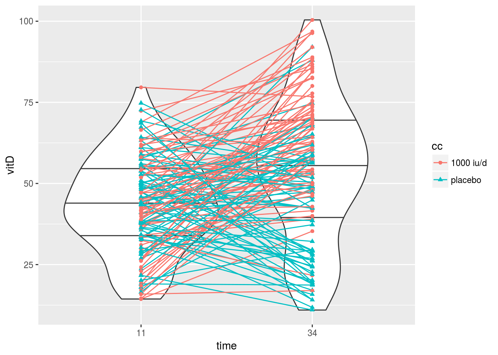
```
(ref:MAVIDOSvitDviolinMonApr162018-Cap) Maternal circulating 25(OH)-vitamin D levels (nmol/l) at 11 and 34wks gestation, supplementation with 1000 IU/day cholecalciferol began at week 14. Each participant is shown at both time points linked by a line to indicate the direction of change. The violin plots indicate the density of the distribution of vitamin D values at each time point with the $25^{th}$, $50^{th}$, $75^{th}$ quantiles indicated with horizontal black lines. The colour indicates Intervention (Red) / Placebo (Blue) group


No probes fell below the Bonferroni corrected significance threshold for an association between DNAm at that locus and maternal vitamin D levels at 34wks gestation, (Figure \@ref(fig:MAVIDOSmVitD34EPICewasManhattanSVA)).
Sex and sample age at DXA were included as covariates in the 'all' model.
SVA generated 5 significant surrogate variables which were additionally used in the SVA model.

```{r MAVIDOSmVitD34EPICewasManhattanSVA, fig.cap='(ref:MAVIDOSmVitD34EPICewasManhattanSVA-Cap)', out.width='80%', fig.align = 'center', fig.show='hold', echo=FALSE}
knitr::include_graphics("figs/MAVIDOSmVitD34EPICewasManhattanSVA.png")
```
(ref:MAVIDOSmVitD34EPICewasManhattanSVA-Cap) Results of EWAS for maternal circulating 25(OH)-vitamin D levels (nmol/l) levels at 34wks gestation with SVA model. Bidirectional Manhattan plot on which $-log_{10}(p-value)$ is plotted on the y axis and the sign of this value represents the direction of change. Size and transparency of points increases with $-log_{10}(p-value)$ such that the most significant probes are represented by the largest and least transleucent points. x axis represents chromosomes and position thereupon. Red line indicates the significance threshold of $6.18\times10^{-8}~(0.05\div808,585)$. 


##### Change in Maternal Vitamin D

Figure \@ref(fig:MAVIDOSdifVD) illustrates the change in maternal vitamin D from 11 to 34 weeks gestation.
No probes fell below the Bonferroni corrected significance threshold for an association between DNAm at that locus and change in maternal vitamin D from 11 to 34wks gestation, Figure \@ref(fig:MAVIDOSdifVDEPICewasManhattanSVA).
SVA generated 5 significant surrogate variables which were additionally used in the SVA model.

```{r MAVIDOSdifVD, fig.cap='(ref:MAVIDOSdifVD-Cap)', out.width='80%', fig.align = 'center', fig.show='hold', echo=FALSE}
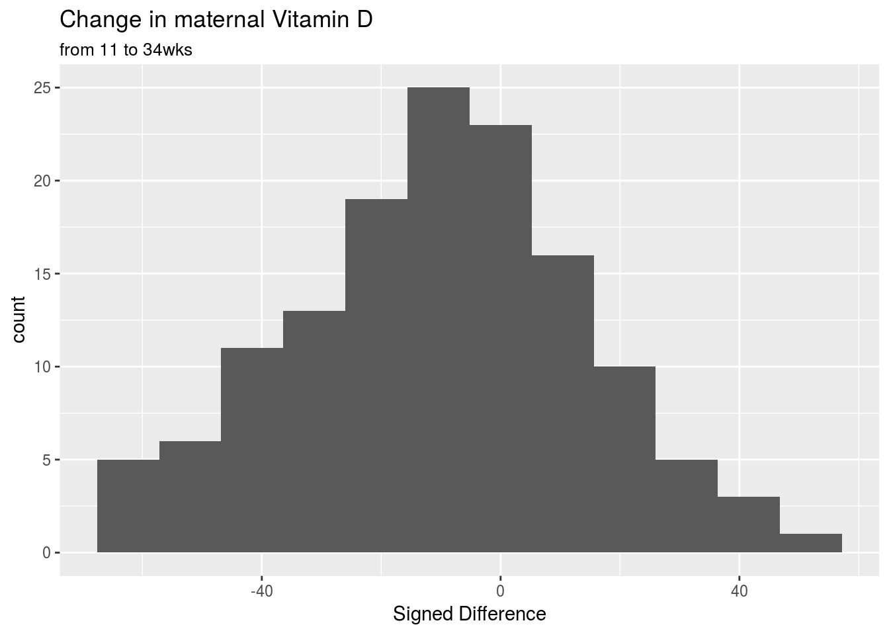
```
(ref:MAVIDOSdifVD-Cap) Distribution of the changes in maternal circulating 25(OH)-vitamin D levels (nmol/l) levels from 11 to 34 weeks gestation.


```{r MAVIDOSdifVDEPICewasManhattanSVA, fig.cap='(ref:MAVIDOSdifVDEPICewasManhattanSVA-Cap)', out.width='80%', fig.align = 'center', fig.show='hold', echo=FALSE}
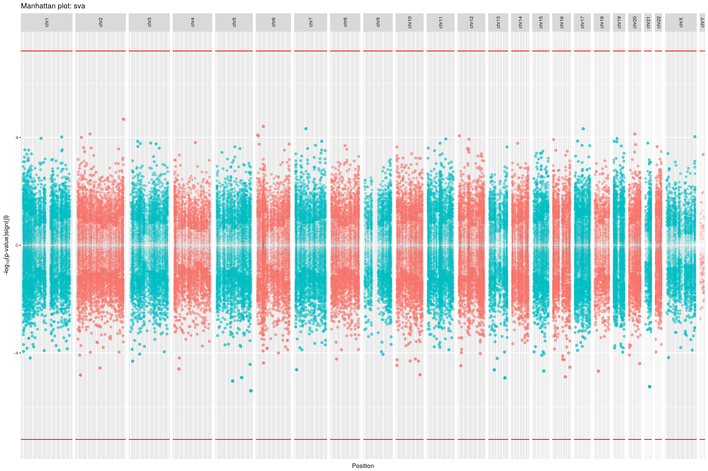
```
(ref:MAVIDOSdifVDEPICewasManhattanSVA-Cap) Results of EWAS for change in maternal circulating 25(OH)-vitamin D levels (nmol/l) levels from 11 to 34wks gestation with SVA model. Bidirectional Manhattan plot on which $-log_{10}(p-value)$ is plotted on the y axis and the sign of this value represents the direction of change. Size and transparency of points increases with $-log_{10}(p-value)$ such that the most significant probes are represented by the largest and least translucent points. x axis represents chromosomes and position thereupon. Red line indicates the significance threshold of $6.18\times10^{-8}~(0.05\div808,585)$. 

#### Concordance of EPIC and 450k EWAS results

Concordance between the rankings of probes would suggest that the EWAS may be capturing a 'real' signal that is simply below the significance threshold with the statistical sensitivity/power that is available in this dataset. 
The concordance between the EPIC and 450k datasets (Figures \@ref(fig:EPIC450kEWASconcordMAVIDOSMonApr162018) & \@ref(fig:EPIC450kEWASconcordMAVIDOSMonApr162018zoom)) appears to be at roughly the level expected by chance. 
This does not lend support to the possibility that there are associations between the variables of interest and DNAm that are beneath the current sensitivity of the study, it does not, however, rule this out. 
In the absence of any probes above the significance threshold and with poor concordance between the 450k and EPIC array p-value rankings no further analyses such as gene set enrichment and differentially methylated region (DMR) calling have been carried out at this time.

```{r EPIC450kEWASconcordMAVIDOSMonApr162018, fig.cap='(ref:EPIC450kEWASconcordMAVIDOSMonApr162018-Cap)', out.width='80%', fig.align = 'center', fig.show='hold', echo=FALSE}
knitr::include_graphics("figs/EPIC450kEWASconcordMAVIDOSMonApr162018.png")
```
(ref:EPIC450kEWASconcordMAVIDOSMonApr162018-Cap) Concordance between the top 100,000 probes in common between the EWASs run on the EPIC (n=137) and 450k (n=60) data sets. bmc = bone mineral content, cc = Intervention / Placebo, difVD = Change in Vitamin D from 11 to 34wks, ExHighConc = Example of High Concordance generated using SVA vs iSVA results for the 450k intervention/placebo EWAS. Dotted line denotes concordance expected by chance (intersects 50% at 387,511, the number of shared probes).


```{r EPIC450kEWASconcordMAVIDOSMonApr162018zoom, fig.cap='(ref:EPIC450kEWASconcordMAVIDOSMonApr162018zoom-Cap)', out.width='80%', fig.align = 'center', fig.show='hold', echo=FALSE}
knitr::include_graphics("figs/EPIC450kEWASconcordMAVIDOSMonApr162018zoom.png")
```
(ref:EPIC450kEWASconcordMAVIDOSMonApr162018zoom-Cap) Concordance between the top 10,000 probes in common between the EWASs run on the EPIC (n=137) and 405k (n=60) data sets. bmc = bone mineral content, cc = Intervention / Placebo, difVD = Chance in Vitamin D from 11 to 34wks, ExHighConc = Example of High Concordance generated using SVA vs iSVA results for the 450k intervention/placebo EWAS. Dotted line denotes concordance expected by chance (intersects 50% at 387,511, the number of shared probes).


### MAVIDOS phase II

DNA methylation at none of the probes was significantly associated with bone mineral content at 4 years.

#### Whole Array QC

The predicted sex of the samples generated using sex chromosome probe intensities was checked against that in the sample annotation and 5 mismatches were found (Figure \@ref(fig:MAVIDOSIIqcEPICsexMismatch)).
Two samples did not have sex information, 2 had predicted sex discordant with their annotated sex and 1 was ambiguous these were excluded from further analysis.

```{r MAVIDOSIIqcEPICsexMismatch, fig.cap='(ref:MAVIDOSIIqcEPICsexMismatch-Cap)', out.width='80%', fig.align = 'center', fig.show='hold', echo=FALSE}
knitr::include_graphics("figs/MAVIDOS-II-qcEPICsexMismatch.png")
```
(ref:MAVIDOSIIqcEPICsexMismatch-Cap) Predicted sex of each sample based on the sex chromosome copy numbers inferred from probe intensities for the EPIC array data. Mismatches between the predicted sex and that asserted in the sample annotation metadata are shown in red. Two predicted sex values differ from their annotations. Plot generated by `meffil` QC report.


Arrays: 201516310023 (mavid: 1490), 201516320022 (mavid: 1672), 201530430013 (mavvid: 4090), 201530430015 (mavid: 1903), & 202410280028 (mavid: 2078) were excluded as their median methylated signal was more than $3\sigma$ from the expected value, (Figure \@ref(fig:MAVIDOSIIqcEPICmethVsUnmeth)). 
No samples were excluded for having a higher than expected proportion of undetected probes (proportion of probes with detection p-value > 0.01 is > 0.1) (Figure \@ref(fig:MAVIDOSIIqcEPICpropSites)). 
No samples were excluded for having a high proportion of probes with low bead counts (proportion of probes with bead number < 3 is > 0.1), (Figure \@ref(fig:MAVIDOSqcEPICbeadNum)).

```{r MAVIDOSIIqcEPICmethVsUnmeth, fig.cap='(ref:MAVIDOSIIqcEPICmethVsUnmeth-Cap)', out.width='80%', fig.align = 'center', fig.show='hold', echo=FALSE}
knitr::include_graphics("figs/MAVIDOS-II-qcEPICmethVsUnmeth.png")
```
(ref:MAVIDOSIIqcEPICmethVsUnmeth-Cap) Median methylated signal vs unmethylated signal per sample for the EPIC array data, solid red line indicates linear regression of median methylated signal vs median unmethylated signal with dotted red lines representing $3\sigma$ from the expected mean. Samples outside the expected range are indicated in the legend. Plot generated by `meffil` QC report.


```{r MAVIDOSIIqcEPICpropSites, fig.cap='(ref:MAVIDOSIIqcEPICpropSites-Cap)', out.width='80%', fig.align = 'center', fig.show='hold', echo=FALSE}
knitr::include_graphics("figs/MAVIDOS-II-qcEPICpropSites.png")
```
(ref:MAVIDOSIIqcEPICpropSites-Cap) Proportion of probes with detection p-values >0.01 by sample for the EPIC array data. Black line indicates the exclusion threshold of 0.1. Plot generated by `meffil` QC report.


```{r MAVIDOSIIqcEPICbeadNum, fig.cap='(ref:MAVIDOSIIqcEPICbeadNum-Cap)', out.width='80%', fig.align = 'center', fig.show='hold', echo=FALSE}
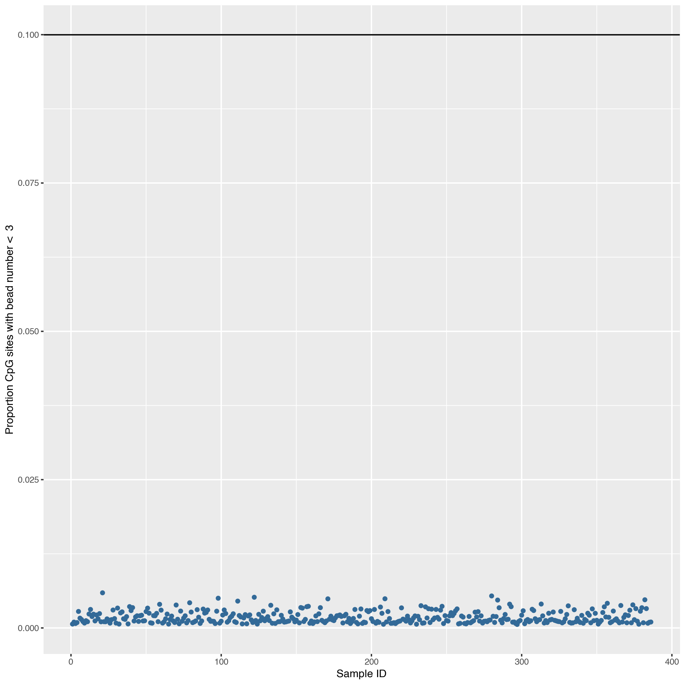
```
(ref:MAVIDOSIIqcEPICbeadNum-Cap) Proportion of probes with a bead count of < 3 by sample for the EPIC array data. Black line indicates the exclusion threshold of 0.1. Plot generated by `meffil` QC report.


#### Probe QC

There was one outlier within the control probes, in a non-critical specificity control probe for detecting non-specific methylation detection over an unmethylated background (Figure \@ref(fig:MAVIDOSqcEPICctrlProbes)). 
1,317 probes were excluded for having high background signal in a high proportion of samples (proportion of samples with detection p-value > 0.01 is > 0.1), (Figure \@ref(fig:MAVIDOSqcEPICpropSamples)). 
220 probes were excluded for having low bead count in a high proportion of samples (proportion of samples with bead number < 3 is > 0.1), (Figure \@ref(fig:MAVIDOSqcEPICbeadNumAcross)). 
Probes with poor technical quality were excluded from the analysis prior to functional normalisation.

```{r MAVIDOSIIqcEPICctrlProbes, fig.cap='(ref:MAVIDOSIIqcEPICctrlProbes-Cap)', out.width='80%', fig.align = 'center', fig.show='hold', echo=FALSE}
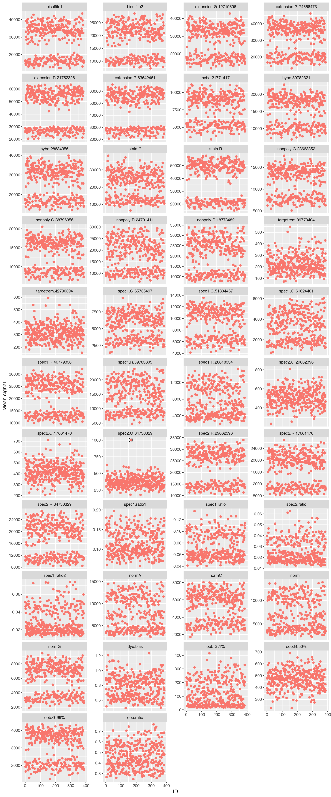
```
(ref:MAVIDOSIIqcEPICctrlProbes-Cap) Control probe signal by sample for each summary group for the EPIC data. Outliers would be circled in black. Plot generated by `meffil` QC report.


```{r MAVIDOSIIqcEPICpropSamples, fig.cap='(ref:MAVIDOSIIqcEPICpropSamples-Cap)', out.width='80%', fig.align = 'center', fig.show='hold', echo=FALSE}
knitr::include_graphics("figs/MAVIDOS-II-qcEPICpropSamples.png")
```
(ref:MAVIDOSIIqcEPICpropSamples-Cap) Undetectable probes across samples for EPIC data. Manhattan plot showing proportion of samples (y) in which a given probe (x) is not distinguishable from background noise, i.e. a detection p-value of > 0.01. Black line indicates the exclusion threshold of 0.1. Plot generated by `meffil` QC report.


```{r MAVIDOSIIqcEPICbeadNumAcross, fig.cap='(ref:MAVIDOSIIqcEPICbeadNumAcross-Cap)', out.width='80%', fig.align = 'center', fig.show='hold', echo=FALSE}
knitr::include_graphics("figs/MAVIDOS-II-qcEPICbeadNumAcross.png")
```
(ref:MAVIDOSIIqcEPICbeadNumAcross-Cap) Low bead count probes across samples for EPIC data. Manhattan plot showing the proportion of samples (y) in which a given probe (x) has a bead count of <3. Black line indicates the exclusion threshold of 0.1. Plot generated by `meffil` QC report.

#### Functional Normalisation

An *m* of 6 was chosen as this value produced the last steep drop in residual variation, see Figure \@ref(fig:MAVIDOSIIfunnormPCsEPIC).

```{r MAVIDOSIIfunnormPCsEPIC, fig.cap='(ref:MAVIDOSIIfunnormPCsEPIC-Cap)', out.width='80%', fig.align = 'center', fig.show='hold', echo=FALSE}
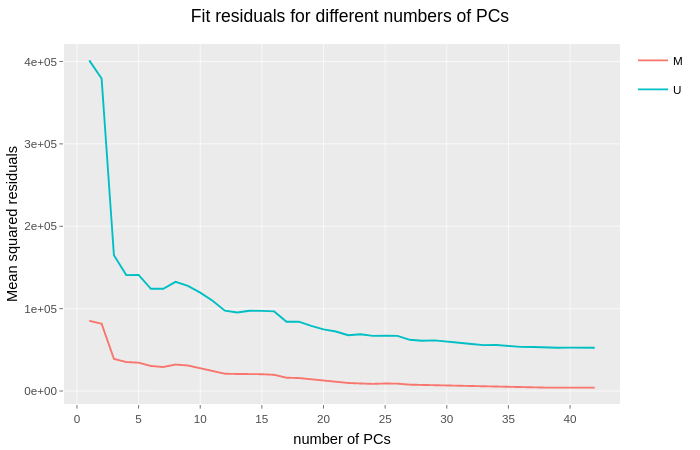
```
(ref:MAVIDOSIIfunnormPCsEPIC-Cap) Residual variation remaining after functional normalisation of the top 20,000 most variable probes with *m* PCs from the control probe summary matrices for the EPIC array samples (n=237), for M = methylated and U = unmethylated probes.

#### EWAS

##### Bone Mineral Content at 4 years

The model for this EWAS attempted to predict whole body (minus head) bone mineral content (g) (Figure \@ref(fig:MAVIDOSIInsubtotbmc)) correcting for: Cell type composition (B-cells, CD4+T, CD8+T, Granulocytes, Monocytes, Natural Killer cells, Endothelial cells, Epithelial cells, Stromal cells), Mother's age at birth, Sex, Mother's BMI at 11 weeks gestation, whether the mother smoked during pregnancy, & Gestational Age.
The EWAS was performed on 237 individuals.
surrogate variable analysis identified 19 significant surrogate variables which were included in the model.
No probes fell below the Bonferroni corrected significance threshold for an association between DNAm at that locus and bone mineral content, in any of the models including SVA (Figure \@ref(fig:MAVIDOSIInsubtotbmcEPICewasManhattanSVA)).

```{r MAVIDOSIInsubtotbmc, fig.cap='(ref:MAVIDOSIInsubtotbmc-Cap)', out.width='80%', fig.align = 'center', fig.show='hold',  echo=FALSE}
knitr::include_graphics("figs/MAVIDOSIInsubtotbmc.png")
```
(ref:MAVIDOSIInsubtotbmc-Cap) Distribution of whole body (minus head) bone mineral content in grams at 4 years of age.


```{r MAVIDOSIInsubtotbmcEPICewasManhattanSVA, fig.cap='(ref:MAVIDOSIInsubtotbmcEPICewasManhattanSVA-Cap)', out.width='80%', fig.align = 'center', fig.show='hold',  echo=FALSE}
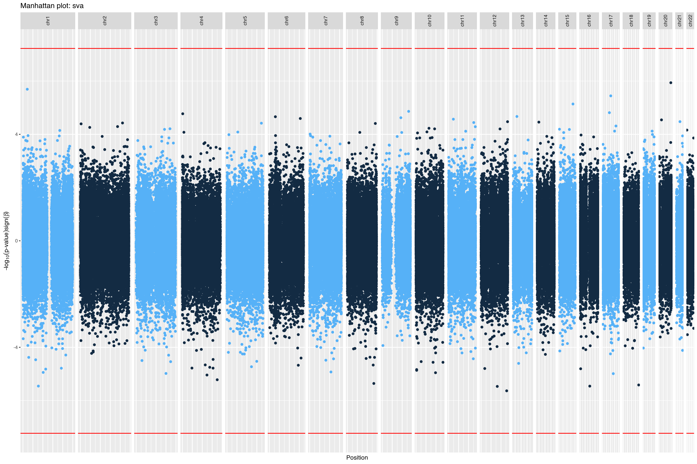
```
(ref:MAVIDOSIInsubtotbmcEPICewasManhattanSVA-Cap) Results of EWAS for whole body minus head bone mineral content (g) with SVA model (n = 237). Bidirectional Manhattan plot on which $-log_{10}(p-value)$ is plotted on the y axis and the sign of this value represents the direction of change. Size and transparency of points increases with $-log_{10}(p-value)$ such that the most significant probes are represented by the largest and least translucent points. x axis represents chromosomes and position thereupon. Red line indicates the significance threshold of $6.18\times10^{-8}~(0.05\div808,585)$.  

### Southampton Women’s Survey (SWS)

DNA methylation at two probes were significantly associated with total bone mineral content at 6 years and periosteal circumference at 6 years respectively.
Probe cg26559250 located at Chr6:157,653,445-157,653,447 at the ZDHHC14 (zinc finger DHHC-type palmitoyltransferase 14) gene showed an increase of DNA methylation with increasing bone mineral content with a significance of $2.52\times 10^{-8}$
Probe cg22570676 located at Chr19:2,527,492-2,527,494 at the GNG7 (G protein subunit gamma 7) gene showed an increase of DNA methylation with increasing periosteal circumference with a significance of $4.24\times 10^{-8}$.
Neither probe is flagged for known technical issues or genetic confounding [@Zhou2017].

```{r, eval=FALSE, echo=FALSE, include=FALSE}
vroom::vroom(
  "~/Documents/PhD_Stuff/phd/Projects/MAVIDOS/data/data_gitIg/EPIC.hg19.manifest.tsv.gz"
) %>% dplyr::filter(probeID %in% c("cg26559250","cg22570676")) %>%
  dplyr::select(dplyr::starts_with("MASK"))# %>% View()
```

#### Whole Array QC

The predicted sex of the samples generated using sex chromosome probe intensities was checked against that in the sample annotation and no mismatches were found (Figure \@ref(fig:SWSqcEPICsexMismatch)).

```{r SWSqcEPICsexMismatch, fig.cap='(ref:SWSqcEPICsexMismatch-Cap)', out.width='80%', fig.align = 'center', fig.show='hold', echo=FALSE}
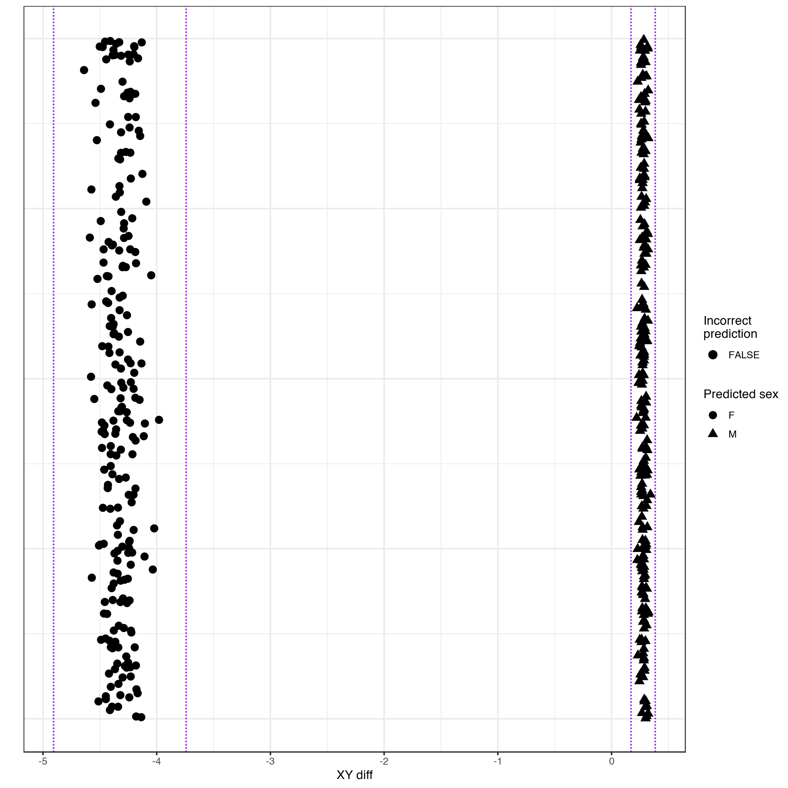
```
(ref:SWSqcEPICsexMismatch-Cap) Predicted sex of each sample based on the sex chromosome copy numbers inferred from probe intensities for the EPIC array data. Mismatches between the predicted sex and that asserted in the sample annotation metadata are shown in red. Two predicted sex values differ from their annotations. Plot generated by `meffil` QC report.


No samples were excluded for having a median methylated signal that was more than $3\sigma$ from the expected value, (Figure \@ref(fig:SWSqcEPICmethVsUnmeth)). 
No samples were excluded for having a higher than expected proportion of undetected probes (proportion of probes with detection p-value > 0.01 is > 0.1) (Figure \@ref(fig:SWSqcEPICpropSites)). 
No samples were excluded for having a high proportion of probes with low bead counts (proportion of probes with bead number < 3 is > 0.1), (Figure \@ref(fig:SWSqcEPICbeadNum)).

```{r SWSqcEPICmethVsUnmeth, fig.cap='(ref:SWSqcEPICmethVsUnmeth-Cap)', out.width='80%', fig.align = 'center', fig.show='hold', echo=FALSE}
knitr::include_graphics("figs/SWSqcEPICmethVsUnmeth.png")
```
(ref:SWSqcEPICmethVsUnmeth-Cap) Median methylated signal vs unmethylated signal per sample for the EPIC array data, solid red line indicates linear regression of median methylated signal vs median unmethylated signal with dotted red lines representing $3\sigma$ from the expected mean. Samples outside the expected range are indicated in the legend. Plot generated by `meffil` QC report.


```{r SWSqcEPICpropSites, fig.cap='(ref:SWSqcEPICpropSites-Cap)', out.width='80%', fig.align = 'center', fig.show='hold', echo=FALSE}
knitr::include_graphics("figs/SWSqcEPICpropSites.png")
```
(ref:SWSqcEPICpropSites-Cap) Proportion of probes with detection p-values >0.01 by sample for the EPIC array data. Black line indicates the exclusion threshold of 0.1. Plot generated by `meffil` QC report.


```{r SWSqcEPICbeadNum, fig.cap='(ref:SWSqcEPICbeadNum-Cap)', out.width='80%', fig.align = 'center', fig.show='hold', echo=FALSE}
knitr::include_graphics("figs/SWSqcEPICbeadNum.png")
```
(ref:SWSqcEPICbeadNum-Cap) Proportion of probes with a bead count of < 3 by sample for the EPIC array data. Black line indicates the exclusion threshold of 0.1. Plot generated by `meffil` QC report.

#### Probe QC

There were no outliers within the control probes (Figure \@ref(fig:SWSqcEPICctrlProbes)). 
833 probes were excluded for having high background signal in a high proportion of samples (proportion of samples with detection p-value > 0.01 is > 0.1), (Figure \@ref(fig:SWSqcEPICpropSamples)). 
127 probes were excluded for having low bead count in a high proportion of samples (proportion of samples with bead number < 3 is > 0.1), (Figure \@ref(fig:SWSqcEPICbeadNumAcross)). 
Probes with poor technical quality were excluded from the analysis prior to functional normalisation.

```{r SWSqcEPICctrlProbes, fig.cap='(ref:SWSqcEPICctrlProbes-Cap)', out.width='80%', fig.align = 'center', fig.show='hold', echo=FALSE}
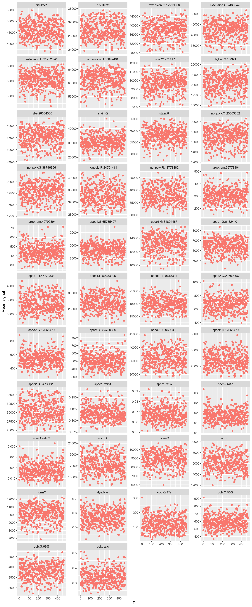
```
(ref:SWSqcEPICctrlProbes-Cap) Control probe signal by sample for each summary group for the EPIC data. Outliers would be circled in black. Plot generated by `meffil` QC report.


```{r SWSqcEPICpropSamples, fig.cap='(ref:SWSqcEPICpropSamples-Cap)', out.width='80%', fig.align = 'center', fig.show='hold', echo=FALSE}
knitr::include_graphics("figs/SWSqcEPICpropSamples.png")
```
(ref:SWSqcEPICpropSamples-Cap) Undetectable probes across samples for EPIC data. Manhattan plot showing proportion of samples (y) in which a given probe (x) is not distinguishable from background noise, i.e. a detection p-value of > 0.01. Black line indicates the exclusion threshold of 0.1. Plot generated by `meffil` QC report.


```{r SWSqcEPICbeadNumAcross, fig.cap='(ref:SWSqcEPICbeadNumAcross-Cap)', out.width='80%', fig.align = 'center', fig.show='hold', echo=FALSE}
knitr::include_graphics("figs/SWSqcEPICbeadNumAcross.png")
```
(ref:SWSqcEPICbeadNumAcross-Cap) Low bead count probes across samples for EPIC data. Manhattan plot showing the proportion of samples (y) in which a given probe (x) has a bead count of <3. Black line indicates the exclusion threshold of 0.1. Plot generated by `meffil` QC report.

#### Functional Normalisation

An *m* of 12 was chosen as this value produced the last steep drop in residual variation, see Figure \@ref(fig:SWSfunnormPCsEPIC).

```{r SWSfunnormPCsEPIC, fig.cap='(ref:SWSfunnormPCsEPIC-Cap)', out.width='80%', fig.align = 'center', fig.show='hold', echo=FALSE}
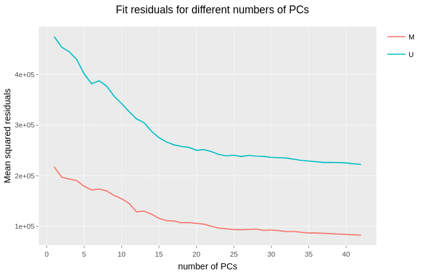
```
(ref:SWSfunnormPCsEPIC-Cap) Residual variation remaining after functional normalisation of the top 20,000 most variable probes with *m* PCs from the control probe summary matrices for the EPIC array samples (n=464), for M = methylated and U = unmethylated probes.

#### EWAS

For all the EWAS, blood cell-type counts were estimated using the Houseman method [@Houseman2012] and the cord blood cell-type reference panel from Bakulski et al. [@Bakulski2016].
The Cell-types estimated were: B cells, CD4+ T cells, CD8+ T Cells, Granulocytes, Monocytes, Natural Killer cells, & Erythrocytes.
In addition to the estimated blood cell counts all models included as covariates: Maternal Age at time of birth (years), Sex, maternal BMI at 11 weeks gestation, parity, whether or not the mother smoked during pregnancy, and gestational age.

##### Total Bone Mineral Conent at 8 years

Figure \@ref(fig:SWSttotbmcwhasa), illustrates the distribution of bone mineral content at 8 years in the 408 individuals in this EWAS.
Surrogate variable analysis identified 95 significant surrogate variables, this is likely an overestimate stemming from small amounts of variation remaining unaccounted for by the manual model thus the Manhattan plots based on the manual model were included.
No probes fell below the Bonferroni corrected significance threshold ($5.92\times10^{-8}$) for an association between DNA methylation at that locus and total bone mineral content minus head at 8 years adjusted for age and sex, Figure \@ref(fig:SWSttotbmcwhasaEPICewasManhattanSVA).

```{r SWSttotbmcwhasa, fig.cap='(ref:SWSttotbmcwhasa-Cap)', out.width='80%', fig.align = 'center', fig.show='hold',  echo=FALSE}
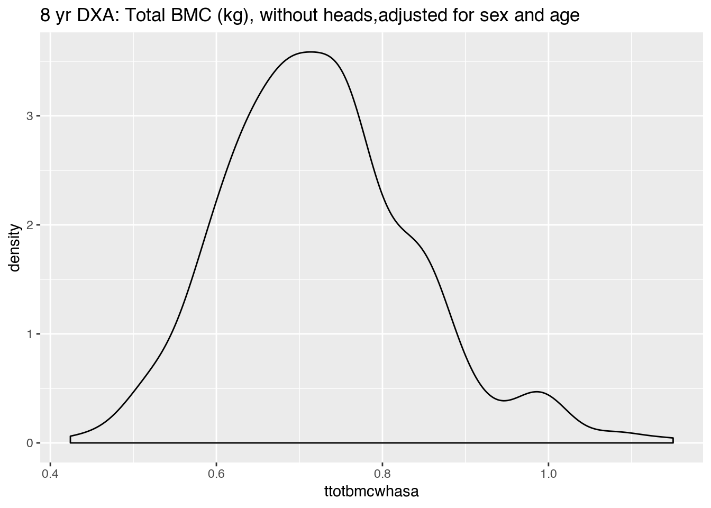
```
(ref:SWSttotbmcwhasa-Cap) Distribution of whole body (minus head) bone mineral content in kg at 8 years of age (n = 408), adjusted for sex and age, as measured by DXA.

```{r SWSttotbmcwhasaEPICewasManhattanSVA, fig.cap='(ref:SWSttotbmcwhasaEPICewasManhattanSVA-Cap)', out.width='80%', fig.align = 'center', fig.show='hold', echo=FALSE}
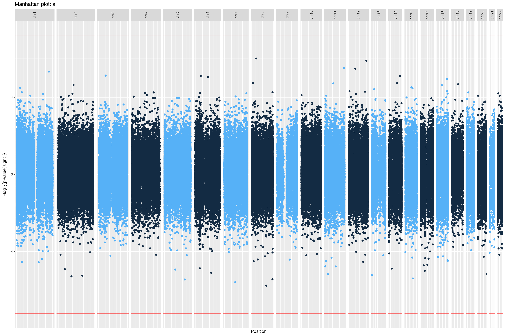
```
(ref:SWSttotbmcwhasaEPICewasManhattanSVA-Cap) Results of EWAS for whole body (minus head) bone mineral content in kg at 8 years of age (n = 408), adjusted for sex and age. The 'all' model results are shown here. Bidirectional Manhattan plot on which $-log_{10}(p-value)$ is plotted on the y axis and the sign of this value represents the direction of change. The x axis represents chromosomes and position thereupon. Red line indicates the significance threshold of $5.92\times10^{-8}$.

##### Total Bone Mineral Conent at 6 years

Figure \@ref(fig:SWSstotbmcwhasa), illustrates the distribution of bone mineral content at 6 years in the 402 individuals in this EWAS.
Surrogate variable analysis identified 97 significant surrogate variables, this is likely an overestimate stemming from small amounts of variation remaining unaccounted for by the manual model thus Manhattan plots based on the manual model have been included.

```{r SWSstotbmcwhasa, fig.cap='(ref:SWSstotbmcwhasa-Cap)', out.width='80%', fig.align = 'center', fig.show='hold',  echo=FALSE}
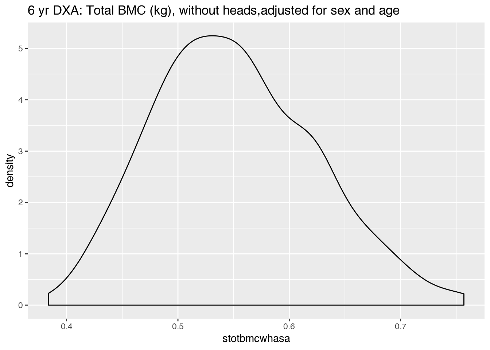
```
(ref:SWSstotbmcwhasa-Cap) Distribution of whole body (minus head) bone mineral content in kg at 8 years of age (n = 402), adjusted for sex and age, as measured by DXA.

One probe fell below the Bonferroni corrected significance threshold ($5.92\times10^{-8}$) for an association between DNA methylation at that locus and total bone mineral content minus head at 6 years adjusted for age and sex, Figure \@ref(fig:SWSstotbmcwhasaEPICewasManhattanSVA). This probe was cg26559250 which is located at Chr6:157,653,445-157,653,447 adjacent to the ZDHHC14 (zinc finger DHHC-type palmitoyltransferase 14) gene. cg26559250 was significant (p = $2.52\times 10^{-8}$, increase of 1.46% per kg) in the 'all' model and was also Bonferroni significant in the uncorrected model. However, cg26559250 was not significant in the SVA or iSVA models suggesting that it may be attributable to batch or cell-type effects.

```{r SWSstotbmcwhasaEPICewasManhattanSVA, fig.cap='(ref:SWSstotbmcwhasaEPICewasManhattanSVA-Cap)', out.width='80%', fig.align = 'center', fig.show='hold', echo=FALSE}
knitr::include_graphics("figs/SWSstotbmcwhasaEPICewasManhattanAll.png")
```
(ref:SWSstotbmcwhasaEPICewasManhattanSVA-Cap) Results of EWAS for whole body (minus head) bone mineral content in kg at 6 years of age (n = 402), adjusted for sex and age. The 'all' model results are shown here. Bidirectional Manhattan plot on which $-log_{10}(p-value)$ is plotted on the y axis and the sign of this value represents the direction of change. The x axis represents chromosomes and position thereupon. Red line indicates the significance threshold of $5.92\times10^{-8}$.

##### Periosteal Circumference at 6 years

Figure \@ref(fig:SWSs3peric), illustrates the distribution of periosteal circumference at 38% from the distal end of the tibia at 6 years (mm) in the 141 individuals in this EWAS.
Surrogate variable analysis identified 37 significant surrogate variables, this is likely an overestimate stemming from small amounts of variation remaining unaccounted for by the manual model thus Manhattan plots based on the manual model have been included.

```{r SWSs3peric, fig.cap='(ref:SWSs3peric-Cap)', out.width='80%', fig.align = 'center', fig.show='hold',  echo=FALSE}
knitr::include_graphics("figs/SWSs3peric.png")
```
(ref:SWSs3peric-Cap) Distribution of periosteal circumference at 38% from the distal end of the tibia (mm) at 6 years of age (n = 141), adjusted for sex and age, as measured by PQCT.

One probe fell below the Bonferroni corrected significance threshold for an association between DNA methylation at that locus and periosteal circumference at 38% from the distal end of the tibia at 6 years (mm) adjusted for age and sex, Figure \@ref(fig:SWSs3pericEPICewasManhattanSVA). This probes was cg22570676 which is located at Chr19:2,527,492-2,527,494 at the GNG7 (G protein subunit gamma 7) gene. cg22570676 was significant (p = $4.24\times 10^{-8}$, increase of 0.370% per mm) in the 'all' model and was also Bonferroni significant in the uncorrected model. However, cg22570676 was not significant in the SVA or iSVA models suggesting that it may be attributable to batch or cell-type effects.

```{r SWSs3pericEPICewasManhattanSVA, fig.cap='(ref:SWSs3pericEPICewasManhattanSVA-Cap)', out.width='80%', fig.align = 'center', fig.show='hold', echo=FALSE}
knitr::include_graphics("figs/SWSs3pericEPICewasManhattanAll.png")
```
(ref:SWSs3pericEPICewasManhattanSVA-Cap) Results of EWAS for periosteal circumference at 38% from the distal end of the tibia (mm) at 6 years of age (n = 141), adjusted for sex and age. The 'all' model results are shown here. Bidirectional Manhattan plot on which $-log_{10}(p-value)$ is plotted on the y axis and the sign of this value represents the direction of change. The x axis represents chromosomes and position thereupon. Red line indicates the significance threshold of $5.92\times10^{-8}$

##### Cortical Denisty at 6 years

Figure \@ref(fig:SWSs3crtden), illustrates the distribution of cortical density at 38% from the distal end of the tibia at 6 years ($mg~cm^{-3}$) in the 141 individuals in this EWAS.
No probes fell below the Bonferroni corrected significance threshold ($5.92\times10^{-8}$) for an association between DNA methylation at that locus and cortical density at 6 years, Figure \@ref(fig:SWSs3crtdenEPICewasManhattanSVA).
Surrogate variable analysis identified 37 significant surrogate variables, this is likely an overestimate stemming from small amounts of variation remaining unaccounted for by the manual model thus Manhattan plots based on the manual model.

```{r SWSs3crtden, fig.cap='(ref:SWSs3crtden-Cap)', out.width='80%', fig.align = 'center', fig.show='hold',  echo=FALSE}
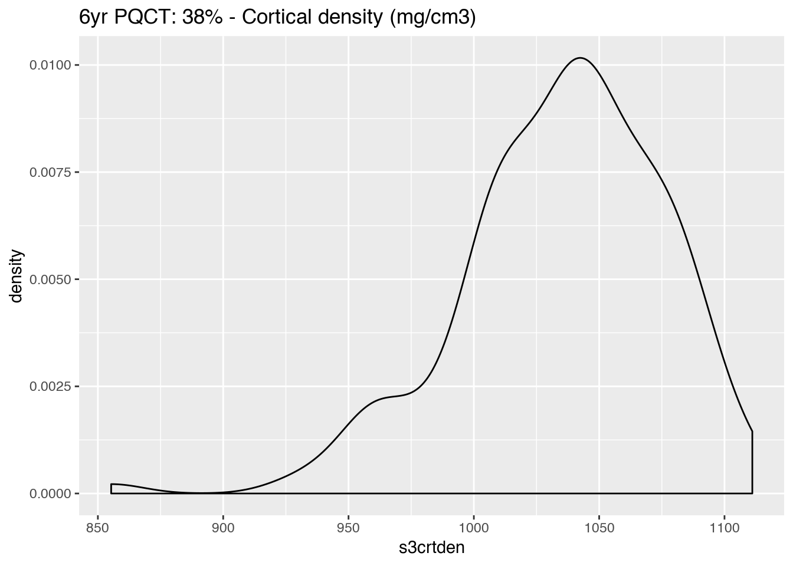
```
(ref:SWSs3crtden-Cap) Distribution of cortical density at 38% from the distal end of the tibia ($mg~cm^{-3}$) at 6 years of age (n = 141), as measured by PQCT.

```{r SWSs3crtdenEPICewasManhattanSVA, fig.cap='(ref:SWSs3crtdenEPICewasManhattanSVA-Cap)', out.width='80%', fig.align = 'center', fig.show='hold', echo=FALSE}
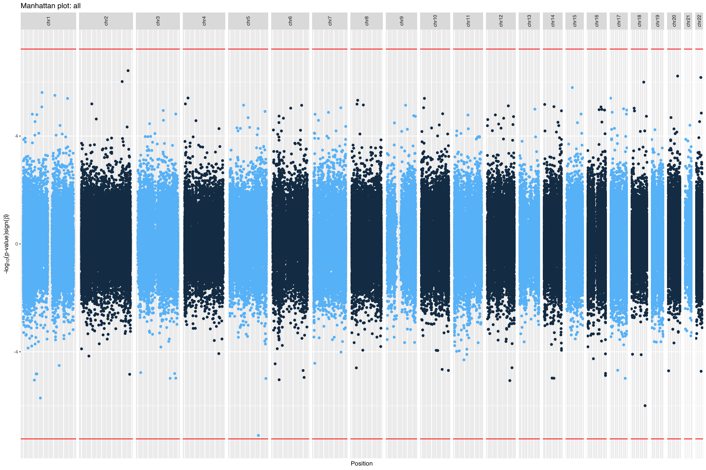
```
(ref:SWSs3crtdenEPICewasManhattanSVA-Cap) Results of EWAS for cortical density at 38% from the distal end of the tibia ($mg~cm^{-3}$) at 6 years of age (n = 141). The 'all' model results are shown here. Bidirectional Manhattan plot on which $-log_{10}(p-value)$ is plotted on the y axis and the sign of this value represents the direction of change. The x axis represents chromosomes and position thereupon. Red line indicates the significance threshold of $5.92\times10^{-8}$

## Discussion

EWAS for 9 outcomes were carried out across 3 sets of samples from MAVIDOS and SWS using the EPIC and 450K array platforms. 
No significant results were found in either the first or second phase of the MAVIDOS analysis. 
Two possible results for bone outcomes at 6 years were identified in the SWS data but did not remain in models including surrogate variables for possible confounding effects. 
The effect observed at probe cg26559250, adjacent to the ZDHHC14 gene, in EWAS for bone mineral content at 6 years was not seen at the 8 year time point.
Furthermore both this result and the finding for probe cg22570676 and periosteal circumference were of small effect sizes 1.46% per kg, 0.370% per mm respectively.
Consequently these results should be treated with considerable caution, they are in need of replication before they can be considered reliable.
No Bonferroni significant DNA methylation changes at the *CDKN2A* and *RXRA* loci which have been previously associated with maternal vitamin D and bone phenotypes were identified, despite the presence of 95 and 75 probes annotated as being in the vicinity of these genes respectively.

```{r, echo=FALSE, include=FALSE, eval=FALSE}
#See: http://www.utstat.toronto.edu/~brunner/oldclass/378f16/readings/CohenPower.pdf
#P412-425
library(pwr)
r2 <- 0.02
r2 / (1 - r2)

testres <- pwr.f2.test(
	u = 7, 
	f2 = r2 / (1 - r2),
	sig.level = 5.92e-8,
	power = 0.8
)
testres
ceiling(testres$v) + 1 + testres$u
```

```{r, eval=FALSE, echo=FALSE, include=FALSE}
epicmaniX <- readRDS(
  "~/Documents/PhD_Stuff/phd/Projects/MAVIDOS/data/data_gitIg/EPIC.hg38.manifest.gencode.v22.rds"
)
RXRAprobes <- epicmaniX %>% plyranges::filter(grepl("RXRA",geneNames)) %>% names()
CDKN2A <- epicmaniX %>% plyranges::filter(grepl("CDKN2A",geneNames)) %>% names()

RXRAprobes %>% length()
CDKN2A %>% length()
```

Whilst the calculation of power for EWAS is a complex and rather understudied problem [@Wang2011; @Tsai2015; @Graw2019] it is possible to achieve some approximations using Cohen's methods [@Cohen1988]. 
To achieve the modest goal of 80% power for a small effect size ($r^2 = 0.02$) in a linear regression analysis (F-test) with 7 covariates at a significance level suitable for the EPIC array of p = $5.92\times10^{-8}$ an n of 2607 is needed.
Seven was the smallest number of covariates used in an SVA model in these analyses, models in the SWS analyses had 13 manually specified variables.
When considering what is for EWAS a very large effect size ($r^2 = 0.15$) with the 13 covariates used in the SWS models it is possible to achieve 80% power for an n of 374.
This is an effect size in line with the effects of smoking on DNA methylation at some loci [@Joubert2016; @Breton2017].
This would make the two largest EWAS performed here for BMC at 8 and 6 years (n = 408, n = 402 respectively) powered only to find large effect sizes with just over 80% probability. 
The most generous set of parameters (80% power, $r^2 = 0.15$, p = $5.92\times10^{-8}$, & 2 covariates) yield an n of 259, more realistic numbers (90% power, $r^2 = 0.02$, p = $5.92\times10^{-8}$, & 13 covariates) yield an n of 3370.
EWAS have identified biologically relevant changes associated with environmental exposures in DNA methylation with magnitudes of less than a single percentage point, and percentage changes in the low single digits are not uncommon in EWAS [@Breton2017]. 
This makes all of the EWAS performed here underpowered to identify small DNA methylation changes which might be expected to occur.
A collaboration with colleagues in Bristol is underway to perform a meta-analysis to include these data with similar results from other cohorts in order to increase the power of these analyses. 
The covariates included in the models for the second phase of MAVIDOS analysis and the SWS analysis are matched to those being used by our collaborators to maximise the comparability of our results.

Given that the effect of maternal vitamin D on neonatal bone mass appears to be seasonal, with only babies born in the winter months showing statistically significant benefits of supplementation [@Cooper2016], it would be interesting to perform seasonally stratified EWAS were sufficient numbers available to do so with reasonable power.

Attempting to identify small changes in the overall DNA methylation state of complex populations of cells like blood and umbilical cord tissue which are associated with phenotypes such as circulating maternal vitamin D is a technically challenging undertaking. 
This work provides two candidates for further analysis for associations between DNA methylation and bone health outcomes at 6 years of age.
Furthermore, these results have contributed to a larger meta analysis with greater power to detect associations with metrics of bone health.


<!--chapter:end:03-EWAS.Rmd-->

# Results 2 - The Genomic Loci of Specific Human tRNA Genes Exhibit Ageing-Related DNA Hypermethylation {#tRNAs}

$Richard J. Acton ^{1,2,3}$, $Wei Yuan ^{4,5}$, $Fei Gao ^{6}$, $Yudong Xia ^{6}$, $Emma Bourne ^{7}$, $Eva Wozniak ^{7}$, $Jordana Bell ^{4}$, $Karen Lillycrop ^{3}$, $Jun Wang ^{6}$, $Elaine Dennison ^{2}$, $Nicholas Harvey ^{2}$, $Charles A. Mein ^{7}$, $Tim D. Spector ^{4}$, $Pirro G. Hysi ^{4}$, $Cyrus Cooper ^{2}$, $Christopher G. Bell ^{1}$

1. William Harvey Research Institute, Barts & The London School of Medicine and Dentistry, Charterhouse Square, Queen Mary University of London, London, U.K.
2. MRC Lifecourse Epidemiology Unit, University of Southampton, Southampton, U.K.
3. Human Development and Health, Institute of Developmental Sciences, University of Southampton, Southampton, U.K.  
4. Department of Twin Research & Genetic Epidemiology, St Thomas Hospital, King’s College London, London, U.K.
5. Institute of Cancer Research, Sutton, U.K.
6. BGI-Shenzhen, Shenzhen, China
7. Barts & The London Genome Centre, Blizard Institute, Barts & The London School of Medicine and Dentistry, Queen Mary University of London, London, U.K.

`r Sys.Date()`


[$bioR \chi v$](https://doi.org/10.1101/870352) [@Acton2020]

[Under Consideration at Nature Communications](https://nature-research-under-consideration.nature.com/users/37265-nature-communications/posts/57741-the-genomic-loci-of-specific-human-trna-genes-exhibit-ageing-related-dna-hypermethylation)


- @Vorlander2020 - MAF1 structural

\newpage

## Abstract

Understanding how the epigenome deteriorates with age and subsequently impacts on biological function may bring unique insights to ageing-related disease mechanisms. As a central cellular apparatus, tRNAs are fundamental to the information flow from DNA to proteins.
Whilst only being transcribed from ~46kb (<0.002%) of the human genome, their transcripts are the second most abundant in the cell.
Furthermore, it is now increasingly recognised that tRNAs and their fragments also have complex regulatory functions.
In both their core translational and additional regulatory roles, tRNAs are intimately involved in the control of metabolic processes known to affect ageing.
Experimentally DNA methylation can alter tRNA expression, but little is known about the genomic DNA methylation state of tRNAs.

Here, we find that the human genomic tRNA loci are enriched for ageing-related DNA hypermethylation.
We initially identified DNA hypermethylation of 44 and 21 specific tRNA genes, at study-wide (p < $8.36\times10^{-5}$) and genome-wide ($p < 4.34\times10^{-9}$) significance, respectively, in 4,350 MeDIP-seq peripheral blood DNA methylomes (16 - 82 years).
This starkly contrasted with 0 hypomethylated at both these significance levels.
Further analysing the 21 genome-wide results, we found 3 of these tRNAs to be independent of major changes in cell-type composition (tRNA-iMet-CAT-1-4, tRNA-Ser-AGA-2-6, tRNA-Ile-AAT-4-1).
We also excluded the ageing-related changes being due to the inherent CpG density of the tRNAome by permutation analysis (1,000x, Empirical p-value < $1\times10^{-3}$).
We additionally explored 79 tRNA loci in an independent cohort using Fluidigm deep targeted bisulfite-sequencing of pooled DNA (n=190) across a range of 4 timepoints (aged ~4, ~28, ~63, ~78 years).
This revealed these ageing changes to be specific to particular isodecoder copies of these tRNAs (tRNAs coding for the same amino acid but with sequence body differences) and included replication of 2 of the 3 genome-wide tRNAs.
Additionally, this isodecoder-specificity may indicate the potential for regulatory fragment changes with age.

In this study we provide the first comprehensive evaluation at the genomic DNA methylation state of the human tRNAome, revealing a discreet and strongly directional hypermethylation with advancing age.

\newpage

## Introduction

Ageing is implicated as a risk factor in multiple chronic diseases [@Partridge2018].
Understanding how the ageing process leads to deteriorating biological function is now a major research focus. This field has hopes of increasing human longevity and ‘healthspan’ whilst ameliorating the extensive physical, social and economic costs of these ageing-related disorders [@Campisi2019].
Epigenetic processes, which influence or inform cell-type specific gene expression, are altered with age and are a fundamental hallmark of this progression, indeed they are arguably a hub mediating other hallmarks including stem cell exhaustion, cellular senescence, and mitochondrial dysfunction [@Lopez-Otin2013; @Booth2016]. 

DNA methylation (DNAm) is the most common epigenetic modification of DNA and age-associated changes in this mark were recognised in mammalian tissues as early as 1983 [@Wilson1983].
Changes in DNAm with age are extensive with thousands of loci affected.
Many of these changes represent 'drift' [@Fraga2005] arising from the imperfect maintenance of methylation state.
Specific genomic regions show distinct directional changes, with loss of DNA methylation in repetitive or transposable elements [@Chuong2017], and gains in certain promoters, including the targets of polycomb repressor complex [@Teschendorff2010] as well as bivalent domains [@Rakyan2010].
The advent of high-throughput DNAm arrays [@Sandoval2011; @Teschendorff2010; @Hannum2013] has elucidated more detailed patterns of ageing related changes in DNAm.
The identification of precise individual CpG sites that exhibit consistent changes with age enabled the construction of predictors of chronological age known as epigenetic or DNAm ‘clocks’ [@Hannum2013; @Horvath2013; @Levine2018; @Horvath2018a; @Lu2019].
Furthermore, it was observed that ‘acceleration’ of this DNAm-derived measure is a biomarker of ‘biological’ ageing due to associations with morbidity and mortality [@Horvath2018; @Field2018].
In a previous investigation of ageing-related DNAm changes within common disease-associated GWAS regions, Bell et al. identified hypermethylation of the specific transfer RNA gene, tRNA-iMet-CAT-1-4 [@Bell2016].
The initiator methionine tRNA possesses certain unique properties [@Bhattacharyya2016; @Kamhi2010; @Birch2016], including its capacity to be rate limiting for translation [@Rideout2012], association with the translation initiation factor eIF2 [@Kolitz2010], and ability to impact the expression of other tRNA genes [@Pavon-Eternod2013]. 

tRNAs are fundamental in the translation process for all domains of life and are thus evolutionarily ancient [@Eigen1989].
This translation machinery and the regulation of protein synthesis are controlled by conserved signalling pathways shown to be modifiable in longevity and ageing interventions [@Tavernarakis2008].
Additionally, beyond their core role in the information flow from DNA to protein sequence, tRNAs can fragment into numerous tRNA-derived small RNAs (tsRNAs).
There are a number of types of tRNA derived small RNAs (tsRNAs) [@Pliatsika2018] which serve as signalling molecules [@Lee2009] (Figure \@ref(fig:tRNAderivedSmallRNARoles)).
Four main types of tsRNAs have been identified, these are 5' tRNA halves, 3' tRNA halves, and the tRNA derived fragments (tRFs) of ~18 - ~22bp sizes [@Torres2019; @Li2018a; @Xu2017a].
tRNAs and pre-tRNAs also give rise to piRNAs [@Keam2014; @Honda2017; @Tosar2018] and internal tRNA fragments or itRFs [@Loher2017].
The terminology and ontology of tsRNAs is still stabilising as our understanding of these RNA species evolves.
Some of these tsRNAs feedback on protein synthesis by regulating ribosome biogenesis [@Kim2017], others have diverse regulatory functions such as targeting transposable element transcripts [@Martinez2017].
The extent of the functional significance of tsRNAs is also an open question [@Schimmel2017].

```{r tRNAderivedSmallRNARoles, fig.cap="(ref:tRNAderivedSmallRNARoles-Cap)", out.width='100%', fig.show='hold', fig.align = 'center', echo=FALSE}
knitr::include_graphics("./figs/tRNAderivedSmallRNARoles.png")
```
(ref:tRNAderivedSmallRNARoles-Cap) __The Types and Functions of tRNA derived small RNAs__ Reproduced from Cristodero et al. [@Cristodero2017].

The human tRNAome, comprising all of the genomic locations of tRNA genes, represents an extremely small portion of the genome [@Parisien2013].
There are 416 high confidence tRNA genes when additionally considering tRNA pseudo genes, nuclear encoded mitochondrial tRNA genes and possibly some closely related repetitive sequences the number of sequences closely resembling tRNAs is 610 (gtRNAdb [@Chan2009]) this extended set covers <46 kb (including introns) and represents <0.002% of the human genome.
Despite their small genomic footprint, and the observation that approximately half of all tRNA genes are transcribed at negligible levels if at all [@Torres2019a], these genes produce the second most abundant RNA species next to ribosomal RNA [@Lodish2000] and are required for the production of all proteins.

tRNA genes are transcribed by RNA polymerase III (polIII) [@Schramm2002] and have type II polIII promoters which contain A and B-box internal promoter elements bound by the complex TFIIIC, followed by TFIIIB, and polIII [@Canella2010].
Transcription is terminated by a simple run of Ts and proceeds in rounds of fast re-initiation where the same polIII molecule is preferentially re-used [@Dieci1996].
tRNA gene expression is modulated by the polIII specific transcription factor Maf1 a highly conserved factor which represses tRNA transcription [@Murawski1994; @Pluta2001].
The activity of Maf1 is modulated by the Target of Rapamycin Kinase Complex 1 (TORC1) [@Mange2017].
Several general transcription factors also influence tRNA gene expression; the tumour suppressors p53 [@Crighton2003] and Rb [@Sutcliffe2000] both negatively regulate tRNA expression and c-Myc upregulates tRNA gene expression, all act via TFIIIB [@Gomez-Roman2003].
tRNAs are dysregulated in cancer, and have  potential utility as prognostic markers [@Krishnan2016].
tRNA regulation may play an important role in cancer [@Huang2018]. 
DNAm is able to repress the expression of tRNA genes experimentally [@Besser1990], in plasmid expression systems, but may also represent co-ordination with the local repressive chromatin state [@Varshney2015].
Transcription is also repressed by the highly conserved polIII specific transcription factor Maf1 [@Murawski1994; @Pluta2001], who’s activity is modulated by the Target of Rapamycin Kinase Complex 1 (TORC1) [@Mange2017], a highly conserved hub for signals that modulate ageing [@Kennedy2016]. 

Assuming similar rates of transcription one would expect that the more frequently an amino acid is used in the exome, the more copies of that tRNA gene there would be in the genome [@Gingold2012].
Indeed, tRNA gene dosage is quite closely matched to amino acid usage frequency in the human exome, though the correlation is less strong for codon usage (Figure \@ref(fig:codonAndaaFreqNtRNAplots)).
The imperfect nature of this correlation suggests that there may be regulation of tRNA expression beyond simply having copy numbers proportionate to usage frequency.

```{r codonAndaaFreqNtRNAplots, fig.cap="(ref:codonAndaaFreqNtRNAplots-Cap)", out.width='100%', fig.show='hold', fig.align = 'center', echo=FALSE}
knitr::include_graphics("./figs/codonAndaaFreqNtRNAplots.png")
```
(ref:codonAndaaFreqNtRNAplots-Cap) __tRNA gene copy number is imperfectly correlated with amino acid and codon usage frequency__ __A)__ Amino acid usage frequency in the human exome vs tRNA gene copy number __B)__ Codon usage frequency in the human exome vs tRNA gene copy number Usage Frequency Data [@Athey2017], tRNA gene count data from GtRNAdb [@Chan2009].


Codon usage frequencies have been claimed to be mostly invariant in the transcriptomes of a wide range of tissues, as well as across developmental time [@Schmitt2014b], however differences in the codon usage of gene with highly tissue specifically expressed genes have been observed [@Plotkin2004].
Transcriptome codon usage frequency and corresponding tRNA gene expression levels have been claimed to vary with several other factors; notably, the replicative state of cells.
Differences in the codon usage of genes with highly tissue-specifically expressed genes have been observed [@Powell1997].
tRNA expression and codon usage ostensibly separates differentiated from replicating cell populations [@Gingold2014].
It has however been argued that these differences are substantially explained by variation in GC content [@Rudolph2016], and the extent to which codon usage plays a role in regulation of translation remains contested.

A variety of observations have indicated that many tRNA genes are expressed in a tissue specific fashion in diverse organisms [@Dittmar2006],[@Sagi2016].
These include the tissue specific manifestations of diseases caused by mutations involving tRNAs and their usage [@Kirchner2017],[@Ishimura2015].
Though detailed characterisation of tissue specific tRNA expression patterns are still lacking.
Considering the board similarity of transcriptome codon usage across time and tissues and the purported functional equivalence in translation of tRNAs with the same anticodon, there is an open question as to the reason for tissue specificity of tRNA expression.
The tissue specific expression of tRNAs whilst substantially maintaining codon ratios would require highly coordinated tRNA gene regulation to obtain similar expression levels of putatively functionally equivalent genes. This situation is strongly suggestive of as yet undiscovered function.
Isodecoders, tRNAs with the same anticodon but which differ in sequence elsewhere, are distinct in translational efficiency [@Geslain2010], which can have consequences in human disease [@Kirchner2017].
However, such differences seem likely to explain only some of the tissue specificity of tRNA gene regulation. 

Ageing is linked to core aspects of metabolic regulation, with nutrient sensing and stress response acting as major modulators of ageing. 
tRNAs as well as tsRNAs are integral to the regulation of protein synthesis and stress response.
protein synthesis represents a substantial proportion of total cellular energy expenditure and this fraction can vary considerably with nutrient availability [@Pace2006].
Metabolic processes are also recognised to modulate the age estimates of DNAm clocks [@Nwanaji-Enwerem2018].
Partial inhibition of translation increases lifespan in multiple model organisms [@Hansen2007] and PolIII inhibition increases longevity acting downstream of TORC1 [@Filer2017].
Furthermore, 5’ tRNA halves circulating in serum are modulated by ageing and caloric restriction [@Dhahbi2013]. 

DNAm is able to repress the expression of tRNA genes on methylated expression vectors [@Besser1990].
Whilst the broader chromatin milieu affects tRNA transcription, tRNA genes are unusual in that they are sufficiently short to fit within a single nucleosome.
tRNA genes are generally 'nucleosome free' and precise placement of the nucleosome immediately upstream of the transcriptional start site is of importance for their expression [@Bhargava2013a].
A recent review of the epigenetic regulation of the polIII transcriptome [@Park2017] noted the very limited CpG methylation data available at polIII loci.
Transcription by RNA polymerase III at SINE loci is suppressed by histone methylation but not by DNA methylation [@Varshney2015], indicating that DNA methylation may not directly influence the expression of tRNA genes but may do so by influencing the surrounding chromatin state.
Standard RNA-seq is of limited utility in examine tRNA expression due to the issues of mappability.
tRNAs are a major target for 'epitranscriptomic' modification, with an average of 11-13 modifications per tRNA [@Wilusz2015; @Schimmel2017], some of which stop polymerases from elongating or alter base pairing creating further mapping challenges.
Thus variants on standard RNA-seq procedures have been developed [@Cozen2015; @Shigematsu2017a; @Gogakos2017]. polIII ChIP-seq has been used as a proxy for tRNA gene expression, and unlike RNA-seq based methods generates reads from uniquely identifiable flanking regions which map to a known locus of origin.
This same advantage exists for the MeDIP-seq data used in this study. 

tRNA gene loci may also play a role in large scale genome organisation.
tRNA gene clusters act as insulators [@Raab2011], and have extensive long-range chromatin interactions with other tRNA gene loci [@VanBortle2017].
The coordinated transcription of tRNAs at subnuclear foci may represent an organising principle for 3D-chromatin by providing spatial constrains. 
In both budding and fission yeast tRNA genes localise to the nucleolus.
In fission yeast, a subset of B-box sequence elements bound TFIIIC and not polIII serve as chromatin anchors to the nuclear periphery and act as boundaries between euchromatic and heterochromatic regions [@Noma2006].
It is unclear to what extend tRNA genes may play similar roles in large scale chromatin organisation in other organisms.

We directly investigated ageing-related changes in the epigenetic DNA methylation state of the entire tRNAome, facilitated by the availability of a large-scale MeDIP-seq dataset.
Arrays poorly cover this portion of genome.
The 450k and EPIC arrays have 110 robust probes covering 84 tRNAs and 129 robust probes covering 89 tRNAs respectively, thus even the latest EPIC arrays cover <15% of the tRNA genes, with robust probes, and in total only ~4.7% of all the tRNA gene CpGs [@Zhou2017].

tRNA genes sit at the heart not only of the core biological process of translation but at a nexus of signalling networks operating in several different paradigms, from small RNA signalling to large scale chromatin organisation [@VanBortle2017].
In summation tRNA biology, protein synthesis, nutrient sensing, stress response and ageing are intimately interlinked.
We have identified tRNAome DNA hypermethylation and independently replicated this newly described ageing-related observation.

\newpage
## Methods {#tRNAmethods}

### Participants

Participants in the 'EpiTwins' study are adult volunteers from the TwinsUK Register.
The participants were aged between 16 and 82 years, with a median of ~55 years (cohort profile [@Moayyeri2013]).
Ethics for the collection of these data were approved by Guy's & St Thomas' NHS Foundation Trust Ethics Committee (EC04/015—15-Mar-04) and written informed consent was obtained from all participants.  

Participants for our targeted bisulfite sequencing of select tRNA loci were drawn from two studies.
Samples from participants aged 4 and 28 years are from the MAVIDOS [@Harvey2012a] study and participants aged 63 and 78 years are from the Hertfordshire cohort study [@Syddall2005].
Due to a limited number of available samples, the two 4 year old pools contained DNA from 20 individuals each, with all other pools having 25 contributing individuals.
Pool 1, the first 4 year old pool used DNA from all male samples, with all other pools using all female samples.
Thus, the total number of participants was 190 (see Table \@ref(tab:poolAges)).
Samples from the 28 year old time point are all from pregnant women at ~11 weeks gestation.  

### tRNA annotation information {#tRNAanno}

Genomic coordinates of the tRNA genes were downloaded from GtRNAdb [@Chan2009]. 
The 2 tRNAs located in chr1_gl000192_random are tRNA-Gly-CCC-8-1 & tRNA-Asn-ATT-1-2 ([Supplementary File S1](./Supplementary_Files/hg19-tRNAs.bed)).
Stem/loop structure annotations were inferred from output of `tRNAscan` [@Lowe2016] with a custom `perl6` script.
The 213 probes overlapping tRNA genes were derived from intersecting the tRNA gene annotation data from gtRNAdb with the Illumina 450k array manifest annotation for the hg19 genome build using bedtools v2.17.0 [@Quinlan2010].
We excluded 107 tRNAs from blacklisted regions of hg19 [@Amemiya2019].

#### tRNA Gene Clustering {#clustering}

We clustered the tRNA genes by grouping together all tRNAs within 5Mb of one another using the `bedtools merge` tool v2.17.0 [@Quinlan2010].
We used a command of the form: `bedtools merge -c 4 -o collapse -d <N> -i hg19-tRNAs.bed` where `<N>` is the binsize.
We varied the binsize and selected 5Mb as it is at approximately this size that number of clusters with more than one tRNAs exceeds the number of singleton tRNAs (Figure \ref{fig:tRNAgeneClustersByBinSize}).
We added the further requirements that these groupings contain at least 5 tRNA genes with a density of at least 5 tRNA genes per Mb to be considered as clusters. 

#### tRNA gene mappability assessment {#mappabilityDensity}

To assess the mappability of tRNA gene regions we computed a value for mappability score density to facilitate comparisons of regions of the genome.
Mappability score density is computed as the area under the encode mappability tracks [@Derrien2012] over the length of the region.

### DNA methylome data

#### TwinsUK MeDIP-seq methylomes {#EpiTwinsMethods}

The Methylated DNA Immunoprecipitation sequencing (MeDIP-seq) data was processed as previously described [@Bell2016; @Bell2017a] and detailed in [Methods](#MeDIPseq) \@ref(MeDIPseq).
These processed data are available from the European Genome-phenome Archive (EGA) (https://www.ebi.ac.uk/ega) under study number EGAS00001001910 and dataset EGAD00010000983 and were generated by BGI Shenzen for TwinsUK.
The dataset used in this work consists of 4350 whole blood methylomes with age data. 
4054 are female and 270 male. 
3001 have full blood counts.
There are 3652 individuals in this data set.
These individuals originate from 1933 unique families.
There are 1234 monozygotic (MZ) twin pairs (2468 individuals), and 458 dizygotic (DZ) twin pairs (916 individuals).

MeDIP-seq used a monoclonal anti-5mC antibody to bind denatured fragmented genomic DNA at methylated CpG sites.
This antibody-bound fraction of DNA was isolated and sequenced [@Down2009].
MeDIP-seq 50-bp single-end sequencing reads were aligned to the hg19/GRCh37 assembly of the human genome and duplicates were removed.
`MEDIPS` (v1.0) was used for the MeDIP-seq specific analysis [@Lienhard2014].
This produced reads per million base pairs (RPM) values binned into 500bp windows with a 250bp slide in the BED format, resulting in ~12.8 million windows on the genome.
MeDIP-seq data from regions of interest was extracted using Bedtools v2.17.0 [@Quinlan2010].  

#### Analysis of DNA methylome data for Significant Ageing-related changes {#medipmodels}

All analysis was performed in R/3.5.2.
Linear models were fitted to age using the MeDIP-seq DNA methylome data, as quantile normalised RPM scores at each 500bp window.
Quantile normalisation was performed with the `qqnorm` R function with the theoretical quantiles of the RPM values at each window used in subsequent analysis.
Models were fitted with: 1. No covariates; 2. Batch information as a fixed effect; 3. Blood cell-type counts for neutrophils, monocytes, eosinophils, and lymphocytes as fixed effects; and 4. Batch and Blood Cell counts as fixed effects.
Model 1 & 2 were fitted on the full set of 4350 as batch information was available for all samples but blood cell count data was only available for a subset of 3001 methylomes.
Models 1 & 2 fitted in the n=3001 subset were similar to those fitted in the complete set of 4350. 
Models 3 & 4 were fitted in the n=3001 subset with full covariate information and sets of significant tRNAs identified at study-wide and genome wide levels in model 4 were used in subsequent analyses.
Models were also fitted for two unrelated subsets created by selecting one twin from each pair (Monozygotic or Dizygotic), yielding sets with n = 1198 & 1206 DNA methylomes. 
One additional model was fitted for longitudinal analysis, samples were selected by identifying individuals with a DNA methylome at more than one time point and filtering for only those with a minimum of 5 years between samples.
This yielded 658 methylomes from 329 individuals with age differences of 5-16.1 years, median 7.6 years.
Models for this set included participant identifier as a fixed effect in addition to blood cell counts and batch information.

#### Permutation Analysis for Enrichment with Age-related Changes {#AgeErichmentPermutation}
 
We performed a permutation analysis to determine whether the CpG distribution of sets of the tRNAome was the principle driver of the ageing-related changes observed.
Windows overlapping tRNAs have a higher proportion of windows with a greater CpG density than their surrounding sequences (see Figure \@ref(fig:CpGcountBGvstRNAPlot)).
CpGs residing within moderate CpG density loci are the most dynamic in the genome [@Ziller2013] and CpG dense CpG island regions include specific ageing-related changes [@Teschendorff2010; @Rakyan2010; @Bell2016]. 
For comparison we also performed the permutation in the CGI regions from the Polycomb group protein target promoters in Teschendorff *et al.* [@Teschendorff2010] and bivalent loci from ENCODE ChromHmm 'Poised Promoter' classification in the GM12878 cell-line [@Ernst2011].
A random set of 500bp windows representing an equivalent CpG density distribution of the feature set in question were selected from the genome-wide data.
Above a certain CpG density there are insufficient windows to sample without replacement within a permutation.
Furthermore, above ~$\ge18\%$ CpG density CpG Islands become consistently hypomethylated [@Bell2012a].
Therefore, all windows with a CpG density of $\ge18\%$ (45 CpGs per 500bp) were grouped and sampled from the same pool.
i.e. a window overlapping a tRNA gene which had a 20% density could be represented in permutation by one with any density $\ge18\%$.
This permutation was performed 1,000 times to determine an Empirical p value by calculating the number of times the permutation result exceeded the observed number of significant windows in the feature set.
$Empirical~p-value = \frac{r+1}{N+1}$, where r is the sum of significantly hypermethylating windows in all permutations and N is number of permutations [@North2003].

```{r CpGcountBGvstRNAPlot, fig.cap="(ref:CpGcountBGvstRNAPlotCap)", out.width='100%', fig.show='hold', fig.align = 'center', echo=FALSE}
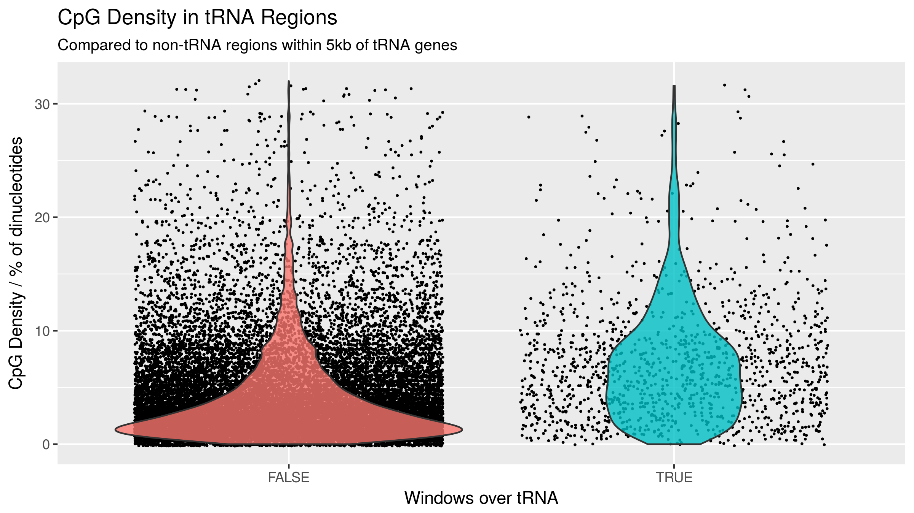
```
(ref:CpGcountBGvstRNAPlotCap) CpG Density in windows overlapping tRNA genes compared to that of non-tRNA overlapping windows in flanking sequences (+/-5kb)

#### Neonate and Centenarian Whole Genome Bisulfite Sequencing

DNA methylation calls were downloaded from GEO: [GSE31263](https://www.ncbi.nlm.nih.gov/geo/query/acc.cgi?acc=GSE31263) and intersected with tRNA genes using bedtools v2.17.0 [@Quinlan2010].

#### Sample pooling and EPIC array

We performed an Illumina Infinium DNA methylation EPIC array ((C) Illumina) and targeted bisulfite sequencing of select tRNA gene loci.
Here we used DNA extracted from whole blood and pooled into 8 samples from unrelated individuals at 4 time-points with 2 pools at each time-point.
The individual were age matched at approximately 4, 28, 63, and 78 year timepoints (Table \@ref(tab:poolAges))
Using the EPIC array we were able to infer the DNAm age using the Horvath DNAm clock [@Horvath2013] and blood cell-type composition of our samples using the Houseman algorithm [@Houseman2012].

```{r poolAges, out.width='60%', echo=FALSE, warning=FALSE, message = FALSE}
##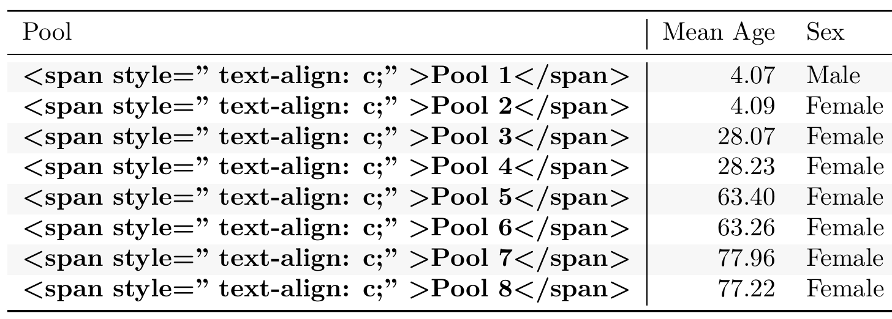
##options(knitr.table.format = "html")#"latex"
library(kableExtra)
options(kableExtra.auto_format = TRUE)
sampleMetaData <- read_tsv(
	"./figs/sampleMetaDataProcessed.tab",
	progress = FALSE,
	col_types = cols(
		id = col_character(),
		age = col_double(),
		pool = col_character(),
		sex = col_character(),
		group = col_character(),
		DNA..ug = col_double(),
		Amount.used.ng = col_double(),
		Proportion.of.total.used = col_double(),
		Percentage.of.total.used = col_character()
	)
)

poolColours <-c(
	"Pool 1"="#ffffcc","Pool 2"="#CCCC56",
	"Pool 3"="#a1dab4","Pool 4"="#3CA661",
	
	"Pool 5"="#41b6c4","Pool 6"="#2899A8",
	"Pool 7"="#225ea8","Pool 8"="#14488C"#,
	#"DNAm Age" = "red"
)

poolSummaryTable <- 
sampleMetaData %>% 
	group_by(pool) %>% 
	dplyr::summarise(
		`Mean Age` = mean(age), Sex = sex[1],
		`Min Age` = min(age), `Max Age` = max(age), n = n()
	) %>%
	dplyr::rename(Pool = pool) %>%
	#mutate_if(is.numeric,sprintf("%g.2",.)) %>%
	mutate(
		Pool = case_when(
			Pool == "Pool 5" ~ "Pool 7",
			Pool == "Pool 6" ~ "Pool 8",
			Pool == "Pool 7" ~ "Pool 5",
			Pool == "Pool 8" ~ "Pool 6",
			TRUE ~ Pool
		)
	) %>%
	arrange(Pool) %>%
	mutate(
		Pool = cell_spec(
			Pool, 
			#"latex",#"html",
			# color = "#000000",
			align = "c"#,# angle = 45,
			# background = poolColours[Pool]
		)
	) %>%
	kable(
		digits = 2,
		#format = "latex",#"html",
		escape = FALSE,
		booktabs = TRUE,
		caption = "(\\#tab:poolAges) (ref:poolAgesCap)",
		linesep = ""
	) %>%
	kable_styling(
		bootstrap_options = "striped", full_width = FALSE,
		latex_options = "striped"
	) %>%#, fixed_thead = TRUE
	#row_spec(0, background = "#b8b8b8") %>%
	column_spec(1, bold = TRUE, border_right = TRUE)

poolSummaryTable
```
(ref:poolAgesCap) Summary information on participants in each pool.

#### Targeted Bisulfite Sequencing {#targetedBiSseq}

We selected tRNA loci for targeted sequencing in which have had observed changes and DNAm with age and closely related tRNAs in which changes were not observed.
Primer design was performed using 'methPrimer' [@Li2002] ([Supplementary File S2](./Supplementary_Files/Targeted_BiS-seq_Primers.txt)). 
A total of 84 tRNA loci were targeted in 2 rounds of sequencing, 79 subsequently generated reliable results post-QC.
The targeted tRNAs covered a total of 723 CpGs with a median of 8 CpGs per tRNA (range 1-13), data passing QC was generated for 458 CpGs, median 6 (range 1-9) per tRNA.

Initial QC for readcount, base call quality and base composition was caried out with `FastQC` (https://github.com/s-andrews/FastQC) [@Andrews2010] and `multiqc` (https://github.com/ewels/MultiQC) [@Ewels2016] for combined visualisation of QC outputs.
Quality based trimming was performed with `Trim Galore` (https://github.com/FelixKrueger/TrimGalore) [@Krueger2015] and target specific primer trimming with `cutadapt` (https://github.com/marcelm/cutadapt) [@Martin2011] and custom `perl 5` scripts.
Alignment and methylation calling was performed with `Bismark` (v0.20.0) [@Krueger2011] making use of `bowtie2` [@Langmead2012].

The alignment was performed against both the whole hg19 genome and just the tRNAome +/- 100bp to assess the possible impact of off-target mapping.
Mapping to the whole genome did produce purported methylation calls at a larger number of loci than mapping just to the tRNAome (683,783 vs 45,861 respectively).
Introducing a minimum coverage threshold of 25 reads dramatically reduced this and brought the number of sites into line with that in the tRNAome set (36,065 vs 33,664 respectively) suggesting a small number of ambiguously mapping reads. All subsequent analysis was performed using the alignment to just the tRNAome with a minimum coverage of 25 reads.

We performed pairwise differential methylation analysis of the tRNA genes at the different time points using `RnBeads` (https://bioconductor.org/packages/release/bioc/html/RnBeads.html) [@Muller2019] with `limma` [@Ritchie2015] and a minimum coverage of 25 reads.
We also performed linear regression predicting age from DNA methylation at the targeted tRNA sites, permitting us to compare rates of increase with age.
For the linear regression, we used only CpG sites with more than 25 reads mapped to the regions of the genome targeted for amplification.

#### TwinsUK Illumina 450k array methylomes

Illumina Infinium DNA methylation 450k arrays ((C) Illumina) were also performed on TwinsUK participants, in 770 Blood-derived DNA samples which had matched MeDIP-seq data.
These data were available for this analysis in a pre-processed form, Methylation 'beta' values subject to beta-mixture quantile normaisation (BMIQ) as previously described [@Bell2016; @Bell2017a].
Cell-type correction was performed using cell-count data and the following model: `lm(age ~ beta + eosinophils + lymphocytes + monocytes + neutrophils)`.

### Chromatin Segmentation Data

Epilogos chromatin segmentation data [@Meuleman2019; @Ernst2011] was downloaded for the tRNA gene regions +/- 200bp from https://explore.altius.org/tabix/epilogos/hg19.15.Blood_T-cell.KL.gz using the `tabix` utility. 
The data used was the 'Blood & T-cell' 15 State model based on segmentation of 14 cell-types.
This data was manipulated and visualised with `R` and `ggplot2`.
tRNAs were assigned a predominant chromatin state base on the state with the highest score over that tRNA gene.

### Isolated Blood Cell Type Specific Data {#sortedbloodmethods}

Data from 7 cell-type fractions from 6 Male individuals was downloaded from [GSE35069](https://www.ncbi.nlm.nih.gov/geo/query/acc.cgi?acc=GSE35069) [@Reinius2012] using `GEOquery` [@Davis2007p]. 
Five of the 6 top age hypermethylating tRNAs are covered by this array dataset.

### Cancer and Tissue Specific Methylation Data {#TCGAmethods}

Data was downloaded from the TCGA (The Cancer Genome Atlas) via the GDC (genomic data commons) data portal [@Grossman2016] using the `GenomicDataCommons` `R` package.
Data from foetal tissue [@Yang2016; @Nazor2012] was downloaded from GEO ([GSE72867](https://www.ncbi.nlm.nih.gov/geo/query/acc.cgi?acc=GSE72867), [GSE30654](https://www.ncbi.nlm.nih.gov/geo/query/acc.cgi?acc=GSE30654)).
From the TCGA, we selected samples for which DNAm data was available from both the primary site and normal solid tissue, and for which we could infer an approximate age (within one year).
We selected those probes overlapping tRNA genes yielding 73,403 data points across 19 tissues with an age range of 15-90yrs (median 63.4) ([Supplementary File S3](./Supplementary_Files/TCGA_samples_used.tsv))

### Assaying tRNA expression in blood with MINTmap {#mintmapmethods}

We used small RNA-seq data from sorted blood cell fractions [@Juzenas2017] ([GSE100467](https://www.ncbi.nlm.nih.gov/geo/query/acc.cgi?acc=GSE100467)) and the MINTmap [@Loher2017] tRNA fragment alignment tool.
This dataset covered 42 individuals aged 21-63.
We also created a customised MINTmap reference designed to include only fragments which unambiguously map to a single tRNA gene locus and which overlap the 5' or 3' end of the genomic tRNA sequence by at least one base with no mismatches.
This reference is intended to capture pre-tRNAs prior to processing and CCA addition operating under the assumption that the levels of pre-tRNAs will be informative about the amount of transcription taking place at the tRNA loci.
This approach provides at most a many to one mapping of tRNA fragments to a tRNA genes.

Assaying the expression of tRNA genes presents numerous difficulties [@Torres2019], and usually requires variants on standard RNA-seq protocols.
Our custom MINTmap reference build yielded 383 fragments mapping to 92 distinct tRNA loci in this data.
To control quality, only fragments with more than 20 total instances in the dataset, and present in more than 20 individuals were considered.

The maximum length of a fragment was limited to 50nt, due to the read length of the small RNA-seq data.

### Mouse RRBS Analysis {#mousemethods}

We downloaded methylation calls and coverage information resulting from RRBS performed by Petkovich *et al.* [@Petkovich2017] from GEO using `GEOquery` [@Davis2007p] [GSE80672](https://www.ncbi.nlm.nih.gov/geo/query/acc.cgi?acc=GSE80672).
These data from 152 mice covered 68 tRNA and 436 CpGs after QC requiring >50 reads per CpG and >10 data points per tRNA.
We excluded 5 tRNAs from blacklisted regions of mm10 [@Amemiya2019].
After QC there were 58 tRNA genes and 385 CpGs.
We performed simple linear modelling in `R` to predict age (in months) from methylation level at each tRNA and each CpG.

\newpage

## Results {#res}

### DNA Methylation of Specific tRNA Gene Loci Changes with Age

```{r OverviewOfAnalyses, fig.cap="(ref:OverviewOfAnalysesCap)", out.width='100%', fig.show='hold', fig.align = 'center', echo=FALSE}
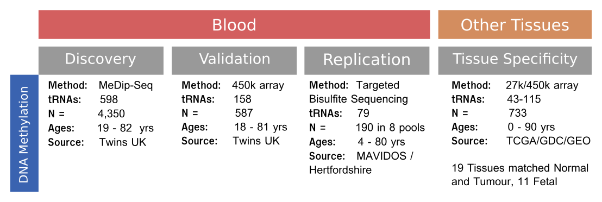
```
(ref:OverviewOfAnalysesCap) __Study Structure__ tRNAs differentially methylated with age initially identified in MeDIP-seq, validated (where covered in 450k array) and replicated in targeted bisulfite sequencing of pooled samples. Tissue specificity of these effects was explored in TCGA and foetal tissue data.

Due to tRNAs critical role in translation and evidence of their modulation in ageing and longevity-related pathways, we interrogated these genes for evidence of ageing-related DNA methylation changes.
Our discovery set was a large-scale peripheral blood-derived DNA methylome dataset comprising of 4,350 samples (see Figure \@ref(fig:OverviewOfAnalyses)).
This sequencing-based dataset had been generated by Methylated DNA Immunoprecipitation (MeDIP-seq) [@Down2009], which relies on the enrichment of methylated fragments of 200-500 bp to give a regional DNAm assessment (500 bp semi-overlapping windows, see [Methods](#EpiTwinsMethods) \@ref(EpiTwinsMethods)).
In total the extended human tRNAome is comprised of 610 tRNAs and closely related sequences (gtRNAdb)(see Figure \@ref(fig:kutteresq)), though only 492 are autosomal and do not reside in blacklisted regions of the genome [@Amemiya2019].

```{r kutteresq, fig.cap="(ref:kutteresqCap)", out.width='100%', fig.show='hold', fig.align = 'center', echo=FALSE}
knitr::include_graphics("figs/kutteresq_BLcount.png")
```
(ref:kutteresqCap) __The genetic code as instantiated in the human tRNAome__ The triplet genetic code leads to the incorporation of specific amino acids into an elongating protein via corresponding tRNAs. n is the number of tRNA genes which encode a given amino acid, the number in parentheses is how many of those may be pseudogenes based on their tRNAscan score [@Lowe2016], and the number in square braces is the number in blacklisted regions [@Amemiya2019]. There are a total of 610 tRNAs and closely related sequences in GtRNAdb [@Chan2009], 416 of which are high confidence tRNAs, 116 of which are potential pseudogenes, and 107 are in blacklisted regions [@Amemiya2019]. Notably 7 of the 61 non-STOP codons are missing from the human tRNAome therefore these codons are handled by wobble base matching (*e.g.* GCG Arg, ACC Gly). Also of note are the suppressor and selenocysteine tRNAs. The 20 methionine tRNAs are split equally between initiator methionine and internally incorporating methionine tRNAs, which are structurally distinct. There are also 23 nuclear encoded mitochondrial tRNAs.

Due to the small size of these tRNAs (60-86bp, median 73bp, excluding introns which are present in ~30 tRNAs with sizes from 10-99bp, median 19bp), this fragment-based method enabled a robust examination of the epigenetic state of these highly similar sequences. 
This was supported by a mappability assessment. 
The median mappability score density for the tRNAome was 0.90 for 50mers when considering tRNA genes $\pm500bp$ reflecting the regional nature of the MeDIP-seq assay [Methods](#mappabilityDensity) \@ref(mappabilityDensity).
In contrast the 50mer mappability density is 0.68 for the tRNA gene sequences alone without flanking sequences. Excluding the flanking region is representative of the mappability of reads generated using a technique such as whole-genome bisulfite sequencing as there is no ChIP fragment so reads mapping to adjacent more mappable sequences do not convey information about the methylation state of sites in the same fragment but which are harder to map (see Figures \@ref(fig:mappabilityiMet1) & \@ref(fig:mappabilityScoreDensity)).


```{r mappabilityiMet1, fig.cap="(ref:mappabilityiMet1Cap)", out.width='100%', fig.show='hold', fig.align = 'center', echo=FALSE}
knitr::include_graphics("./figs/mappability-iMet1.png")
```
(ref:mappabilityiMet1Cap) Example of mappability data from the encode mappability tracks [@Derrien2012] for the initiator methionine tRNA genes.

```{r mappabilityScoreDensity, fig.cap="(ref:mappabilityScoreDensityCap)", out.width='100%', fig.show='hold', fig.align = 'center', echo=FALSE}
knitr::include_graphics("./figs/mappabilityScoreDensity_tRNAVsFlank500.png")
```
(ref:mappabilityScoreDensityCap) Mappability score density of the tRNAome increases with read length and is greater when flanking regions ($\pm500bp$) are included. Mappability score density is computed as the area under the encode mappability tracks [@Derrien2012] over the length of the region.

We identified 21 genome-wide significant and 44 study-wide significant results (p < $4.34\times10^{-9}$ and $8.36\times10^{-5}$, respectively, via linear regression see [Methods](#medipmodels) \@ref(medipmodels) (batch corrected n=4350).
Study-wide significance was calculated conservatively using the Bonferroni method for all 598 autosomal tRNAs. 
There was a strong directional trend with all results at both significance levels being due to increases in DNA methylation.
Age-related changes in cell type proportion are strong in heterogeneous peripheral blood, and include a myeloid skew, loss of naive T cells and increases in senescent cells [@Geiger2013].
A subset of 3 genome-wide and 16 study-wide significant hypermethylation results remained significant even after correcting for potential cell-type changes by including lymphocytes, monocytes, neutrophils and eosinophil cell count data (n=3001, Listed in Table \@ref(fig:GWSBBtRNAsTab), Red in Figure \@ref(fig:circos)).
tRNA-iMet-CAT-1-4 is located on chromosome 6.
tRNA-Ile-AAT-4-1 and tRNA-Ser-AGA-2-6 are neighbours and are located on chromosome 17 within the 3' UTR of *CTC1* (CST Telomere Replication Complex Component 1).
Going forward we refer to these most robustly corrected sets of 3 and 16 tRNA genes as the genome-wide and study-wide significant tRNA genes respectively.


```{r GWSBBtRNAsTabBuild, eval=FALSE, out.width='60%', echo=FALSE, warning = FALSE, message = FALSE}
#eval = TRUE, # eval=FALSE,
gws <- 4.338717e-09
sws <- 0.05 / 598
medipWinbytRNAres <- readRDS("Supplementary_Files/medipWinbytRNAres.Rds")
medipWinbytRNAres %>%
    tibble::as_tibble() %>%
    arrange(tRNAname, medip.p.value) %>%
    select(-width, -strand) %>%
    filter(medip.batch.p.value < gws) %>%
    filter(is.na(BLreason)) %>%
	#mutate(swsl = medip.p.value < sws) %>%
	#mutate(model = if_else(medip.p.value < sws,"BB sws","batch gws")) %>%
    mutate(
        window = sprintf(
            "%s:%s-%s", tools::toTitleCase(as.character(seqnames)),
            format(big.mark = ",", start), format(big.mark = ",", end)
        )
    ) %>%
    #dplyr::mutate(across(ends_with(".slope"), ~sprintf("%.3f",.))) %>%
    dplyr::mutate(
        across(
            ends_with(".slope"),
            ~cell_spec(
                sprintf("%.2f",.),
                #color = "white",
                color = ifelse(is.na(.), "#BBBBBB", "black"),
                bold = TRUE,
                background = case_when(
                    #swsl == FALSE ~ "#BBBBBB",#"red",
                    sign(.) == 1 ~ "#fddbc7",#"#ef8a62",
                    sign(.) == -1 ~ "#d1e5f0",#"#67a9cf",
                    TRUE ~ "#BBBBBB"
                )
            )
        )
    ) %>%
    dplyr::mutate(
        across(
            ends_with(".p.value"),
            ~cell_spec(
                sprintf("%.2e", .),
                #color = "white",
                bold = TRUE,
                color = ifelse(is.na(.), "#BBBBBB", "white"),
                background = 
                	case_when(
                		#swsl == FALSE ~ "#BBBBBB",
                		TRUE ~ spec_color(log2(.), option = "E", end = 0.9)
                	)
            )
        )
    ) %>%
	# dplyr::mutate(
	# 	model = 
	# 	cell_spec(
	# 		model, background = case_when(
	# 			model == "BB sws" ~ "red",
	# 			TRUE ~ "black"
	# 		)
	# 	)
	# ) %>%
    #dplyr::mutate(across(ends_with(".p.value"), ~sprintf("%.3e",.))) %>%
    dplyr::select(
        tRNA = tRNAname,
        Window = window, 
        #model,
        ` Slope` = medip.slope, ` p-value` = medip.p.value,
        #`Slope ` = medip.batch.slope, `p-value ` = medip.batch.p.value,
        ` Slope ` = array.slope, ` p-value ` = array.p.value,
        `  Slope` = tbs.slope, `  p-value` = tbs.p.value
    ) %>%
    kableExtra::kable(
        #longtable = TRUE,
    	#caption = "(ref:GWSBBtRNAsTabCap)",
        booktabs = TRUE, escape = FALSE,
    ) %>%
    kable_styling(
        #full_width = TRUE,
        font_size = 12,
        latex_options = c("scale_down")
    ) %>%
    collapse_rows(
        columns = 1:2,#7, 
        latex_hline = "major",#none
        valign = "middle"
    ) %>%
    add_header_above(
    	c(
    		" " = 2,#3,
    		#"MeDIP Blood & Batch" = 2, "MeDIP Batch" = 2,
    		"MeDIP" = 2,
    		"450k Array" = 2, "Targeted BiS-seq" = 2
    	)
    ) %>%
    #landscape() %>%
	save_kable("figs/table1a.pdf")

magick::image_read_pdf("figs/table1a.pdf") %>% 
	magick::image_convert("png") %>% 
	magick::image_write("figs/table1a.png")

```

```{r GWSBBtRNAsTab, fig.cap="(ref:GWSBBtRNAsTabCap)", out.width='95%', fig.show='hold', fig.align = 'center', echo=FALSE}
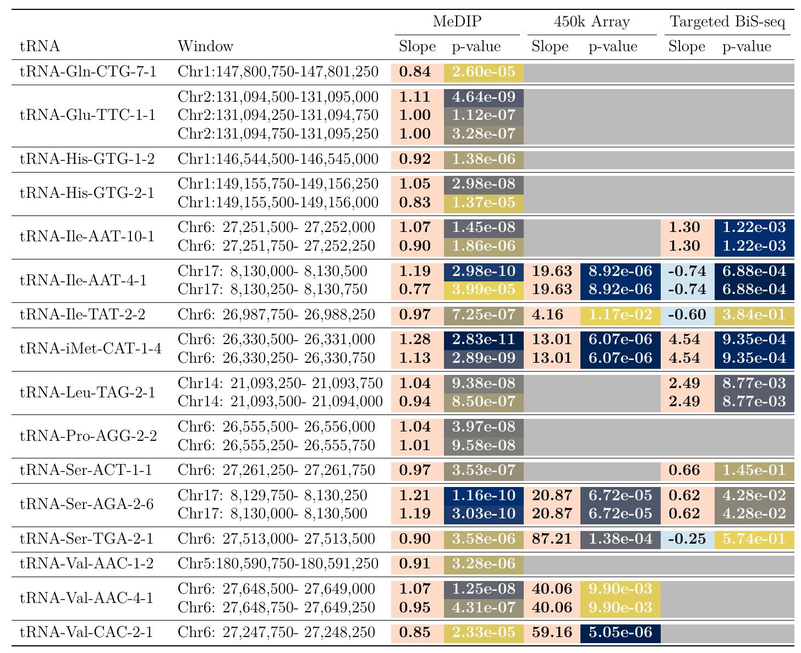
```

(ref:GWSBBtRNAsTabCap) Study-wide significantly hypermethylating tRNAs in blood cell-type and batch corrected model MeDIP-seq. With Corresponding results in Twins UK 450k array (blood cell-type corrected) and targeted bisulfite sequencing results. Age models for array and targeted BiS-seq were calculated using all probes / CpGs overlapping the indicated tRNA gene. 'Slope' corresponds to the beta value for methylation in the linear model, orange colouring indicates hypermethylation and blue hypomethylation. p-values coloured such that low values are dark blue and high values are yellow. blank grey cells indicate missing data. Due to the related nature of these twin samples, we also analysed these data in two subsets of n = 1198 & 1206 by selecting one twin from each pair into the seperate sets. This analysis also included correction for Batch and Blood Cell counts.Whilst in these smaller datasets no tRNAs were genome-wide significant, 5 and 7 tRNA genes, respectively, reached study-wide significance. In these sets 5/5 and 6/7 of these were present in 16 study-wide significant tRNA genes.

```{r circos, fig.cap="(ref:circosCap)", out.width='100%', fig.show='hold', fig.align = 'center', echo=FALSE}
knitr::include_graphics("figs/tRNA_circos_test_inkscape_4.png")
```
(ref:circosCap) Human tRNAome overview. From the outside in: Chromosome ideograms scaled by the number of tRNA genes (total = 598), as excludes chromosome X (10), Y (0) and contig chr1_gl000192_random (2; see [Methods](#tRNAanno) \@ref(tRNAanno)). tRNA genes within 20kbp of one another are grouped with breaks inserted between these clusters. Radial grey lines represent the location of tRNA genes in the genome. $-log_{10}(p-value)$ for the blood cell-type and batch corrected age model are shown for each window overlapping a tRNA gene in green. Mean methylation across all samples (n=3001) in RPM (reads per million base pairs) is shown in blue. Genome-wide significant cell-type & batch corrected ($p < 4.34\times10^{-9}$) tRNAs show in red. The 158 Loci covered by 213 probes on the 450k array which directly overlap a tRNA gene are shown with green triangles. The 84 loci targeted for bisulfite sequencing in this study are indicated in magenta. Mappability score density is computed as the area under the encode mappability tracks [@Derrien2012] over the length of the region.

Due to the related nature of these twin samples, we also analysed these data in two subsets of n=1198 & 1206 by selecting one twin from each pair into the seperate sets.
This analysis also included correction for Batch and Blood Cell counts. 
Whilst in these smaller datasets no tRNAs were genome-wide significant, 5 and 7 tRNA genes, respectively, reached study-wide significance. 
In these sets 5/5 and 6/7 of these were present in 16 study-wide significant tRNA genes.

Furthermore, we examined a subset of samples with longitudinal data (n=658 methylomes from 329 individuals, median age difference 7.6 yrs).
At the nominal significance threshold (p < 0.05) this yielded a split of 41 hypermethylating tRNA genes and 22 hypomethylating tRNA genes. 
Of these hypermethylated tRNAs, 2 are in the previously identified genome-wide significant set of 3 (with tRNA-iMet-CAT-1-4 ranked 3rd by p-value) and 9 are in the study-wide significant set of 16. 


### tRNA Genes are Enriched for Age Related DNA Hypermethylation

Whilst ageing changes are pervasive throughout the DNA methylome, we identified a strong enrichment for this to occur within the discrete tRNAome (Fisher's Exact Test p = $1.05\times10^{-27}$) (see Figure \@ref(fig:sizePropEnrich)).
This is still significant if the 6 of the study-wide significant 16 tRNAs that overlap polycomb or bivalent regions are excluded (p = $4.66\times10^{-15}$)

CpG density is known to have a clear impact on the potential for variability of the DNA methylome as well as ageing-related changes [@Ziller2013; @Christensen2009].
To assess whether this hypermethylation finding was being driven merely by the inherent CpG density of the tRNAome, we performed a CpG density matched permutation analysis (1,000X, see [Methods](#AgeErichmentPermutation) \@ref(AgeErichmentPermutation)).
This supported the specific nature of these age-related DNAm changes within the functional tRNAome (Empirical p-value < $1.0\times10^{-3}$, Figure \@ref(fig:sizePropEnrich) b).
As a point of comparison for this genomic functional unit, we also performed the same permutations for the known age-related changes in the promoters of genes that are polycomb group targets [@Teschendorff2010] and those with a bivalent chromatin state [@Rakyan2010].
We were able to reproduce the enrichment of the polycomb group targets and bivalent regions (Empirical p-value < $1.0\times10^{-3}$) in our dataset.

```{r, sizePropEnrich, fig.cap="(ref:sizePropEnrichCap)", out.width='60%', fig.show='hold', fig.align = 'center', echo=FALSE}
knitr::include_graphics("./figs/permutation-proportion.png")
```
(ref:sizePropEnrichCap) __A)__ tRNA genes are enriched for age-related hypermethylation compared to the genomic background, (Fisher's Exact Test p < $1.05\times10^{-27}$, n = 3001). __B)__ tRNA genes show more significant hypermethylations than CpG Density matched permutations. Each permutation represented a random set of windows matching the CpG density of the functional unit (bivalent domains, polycomb group target promoters & the tRNA genes). These are subsequently assessed for signficant age-related DNAm changes (see [Methods](#AgeErichmentPermutation) \@ref(AgeErichmentPermutation)). The red line is the observed number of significant loci.

tRNA-iMet-CAT-1-4 is located in the largest tRNA gene cluster in the human genome at chr6p22.2-1 [Methods](#clustering) \@ref(clustering).
This cluster contains 157 tRNA genes spanning the 2.67Mb from tRNA-iMet-CAT-1-2 to tRNA-Leu-AAG-3-1, and also hosts a histone gene microcluster.
tRNA-Ile-AAT-4-1 and tRNA-Ser-AGA-2-6 are neighbours and are located on chromosome 17 (Figure  \@ref(fig:gvizLocusZooms)).
Notably tRNA-Ile-AAT-4-1 and tRNA-Ser-AGA-2-6 have a third close neighbour tRNA-Thr-AGT-1-2 which does not show significant age-related hypermethylation.
We observe a similar pattern of sharp peaks of significance closely localised around the other loci in the study-wide significant set.
GENCODE 19 places tRNA-Ile-AAT-4-1 in the 3’UTR of a Nonsense-mediated decay transcript of *CTC1* (CST Telomere Replication Complex Component 1, CTC1-002, ENST00000449476.2) and not of its primary transcript.

```{r gvizLocusZooms, fig.cap="(ref:gvizLocusZoomsCap)", out.width='100%', fig.show='hold', fig.align = 'center', echo=FALSE}
knitr::include_graphics("figs/gviz_iMet-CAT-1-4_Ser-AGA-2-6_3k_white_bigger.png")
```
(ref:gvizLocusZoomsCap) __A)__ tRNA-iMet-CAT-1-4 as well as __B)__ tRNA-Ser-AGA-2-6 and tRNA-Ile-AAT-4-1 exhibit age related DNA hypermethylation in MeDIP-seq data. The sharp peaks suggest that this effect is localised to individual tRNA genes. One of the windows overlapping tRNA-Ile-AAT-4-1 also partially overlaps tRNA-Ser-AGA-2-6.Results shown are from the blood cell-type and batch corrected model. Median Methylation in reads per million is calculated across all samples in the model. The window structure track (Wins) illustrates the tiled nature of the MeDIP-seq windowing. Some annotations of the 3' UTR of CTC1 extend further than illustrated here covering tRNA-Thr-AGT-1-2. CpG density and CpG position are included to illustrate that similarly CpG dense tRNA genes are exhibiting differing age related DNAm change patterns.

To place these hypermethylating tRNA genes in their genomic context we examined how the extended set of 44 non-blood cell-type corrected study-wide significant tRNAs clustered with other tRNA genes.
We clustered the tRNA genes by grouping together all tRNAs within 5Mb of one another and then required that a cluster contain at least 5 tRNA genes with a density of at least 5 tRNA genes per Mb (see [Methods](#clustering) \@ref(clustering)).
This yielded 12 major tRNA gene clusters containing a total of 353 tRNA genes, 42 of the 44 study-wide significant tRNA genes in the non cell-type corrected age model reside within these clusters (figure \@ref(fig:heyn) b). 
The hypermethylating tRNA genes are spread evenly among these clusters proportionately to their size, (no significant difference in a one-way ANOVA of percentage of significant tRNAs by cluster).

```{r heyn, fig.cap="(ref:heynCap)", out.width='95%', fig.show='hold', fig.align = 'center', echo=FALSE}
knitr::include_graphics("./figs/heyn-cluster.png")
```
(ref:heynCap) __A)__ Available study-wide significant (SWS) tRNA genes (n = 14) are more methylated in a centenarian than in a neonate or a 26 year old. Whole Genome Bisulfite Sequencing Data in a newborn, as adult and a centenarian. Each point represents the methylation level at an individual CpG within a tRNA gene. __B)__ Almost all tRNA genes (42/44, counts shown in red) study-wide significant in the MeDIP batch corrected age model, and all of the genome-wide significant and blood-cell type corrected sets of tRNA genes reside in one of 12 major tRNA gene clusters. (Defined by joining all tRNAs within 5Mb of one another and requiring at least 5 tRNA genes per cluster with a density of at least 5 tRNA genes per Mb). 

#### Age-related tRNAome DNA Hypermethylation is even observed in one Newborn versus one Centenarian

We examined an available Whole Genome Bisulphite sequencing (WGBS) dataset from Heyn *et al.* [@Heyn2012] (see [Methods](#tRNAmethods) \@ref(tRNAmethods))
These data consisted of blood-derived DNA WGBS in one newborn child and one 26 year old, and centenarian (103 years).
In their analysis, the centenarian was found to have more hypomethylated CpGs than the neonate across all genomic compartments, including promoters, exonic, intronic, and intergenic regions.
However, even in this examination of 3 individuals of 3 different age in the 55% of tRNA that possessed coverage, we observed DNA hypermethylation with age among the study-wide significant tRNA hypermethylators. The centenarian was significantly more methylated in this set of tRNAs than the neonate (Wilcoxon rank sum test, 6.14% increase (95% CI -Inf - 4.31), W = 717, p = $6.14\times10^{-4}$, see Figure \@ref(fig:heyn) a).

\newpage

#### Age-related Changes Independently Replicated with Targeted Bisulfite Sequencing

In order to further robustly support these-ageing related changes, we attempted to replicate these findings ourselves in an independent ageing dataset.
Furthermore, we employed a different technology Targeted bisulfite (BiS) sequencing to also further validate the MeDIP-seq-derived results.
These data provide individual CpG resolution to identify what may be driving the regional DNAm changes observed.

We performed this targeted BiS-seq in blood-derived DNA from 8 pools of age-matched individuals at 4 time-points (~4, ~28, ~63, ~78 years) from a total of 190 individuals, as detailed in Table \@ref(tab:poolAges).
A total of 79 tRNA loci generated reliable results post-QC (see [Methods](#targetedBiSseq) \@ref(targetedBiSseq)).
These tRNAs covered a total of 458 CpGs with a median of 6 CpGs per tRNA (range 1-9).
Median Coverage per site across pools, technical replicates and batches was 679 reads (mean 5902).

Firstly, we ran the 8 Pooled samples on the Illumina EPIC (850k) array to confirm that our pooling approach was applicable for DNAm ageing-related evaluation.
This showed an $R^2 = 0.98$ between pool mean chronological age and Horvath clock DNAm predicted age [@Horvath2013](see Figure \@ref(fig:DNAmAgeVsChronAge)).
Therefore, this confirmed the utility of this novel pooling approach. 
We also used these array derived data to estimate the major blood cell proportions for each of these pools with the Houseman algorithm [@Houseman2012].

```{r DNAmAgeVsChronAge, fig.cap="(ref:DNAmAgeVsChronAgeCap)", out.width='60%', fig.show='hold', fig.align = 'center', echo=FALSE}
knitr::include_graphics("./figs/DNAmAgeVsChronAge.png")
```
(ref:DNAmAgeVsChronAgeCap) Chronological Age compared with DNAm Age estimated with Horvath's 2013 multi-tissue clock [@Horvath2013] based on EPIC array data for the 8 pooled samples used in the Targeted Bisulfite sequencing (See Table \@ref(tab:poolAges) for pool details).

We noted that individual tRNA loci exhibiting age-related changes in DNAm had duplicate or isodecoder (same anticodon but body sequence variation) sequences in the genome, which despite exact or near sequence identity did not show similar changes.
tRNA-iMet-CAT-1-4 for instance is 1 of 8 identical copies in the genome and was the only locus that showed significant changes.
The results of pairwise differential methylation tests between age groups for the 6 top tRNAs from the MeDIP-seq models are listed in Table \@ref(tab:pairwiseTab).

Of the 3 top hits in MeDIP-seq, tRNA-iMet-CAT-1-4 (Figure \@ref(fig:combinedKaryoplots)c) and tRNA-Ser-AGA-2-6 (Figure \@ref(fig:combinedKaryoplots)i) exceeded nominal significance (p-values = $9.35\times10^{-4}$ & $4.28\times10^{-2}$ , respectively).
However, tRNA-Ile-AAT-4-1 (Figure \@ref(fig:combinedKaryoplots)n) showed a nominal decrease in DNAm with age. 
tRNA tRNA-Leu-TAG-2-1 from the study-wide significant set also showed nominally significant hypermethylation with age (Figure \@ref(fig:combinedKaryoplots)u).
Also, four of the individual CpGs in tRNA-iMet-CAT-1-4 exhibited nominally significant increases in DNAm with Age (Figure \@ref(fig:tRNAiMetCAT1x4nomSigCpG)).

```{r, tRNAiMetCAT1x4nomSigCpG, fig.cap="(ref:tRNAiMetCAT1x4nomSigCpGCap)", out.width='80%', fig.show='hold', fig.align = 'center', echo=FALSE}
knitr::include_graphics("./figs/tRNA-iMet-CAT-1-4_nomSig_CpG.png")
```
(ref:tRNAiMetCAT1x4nomSigCpGCap) Individual CpG methylation increases (nominally significant p < 0.05) in tRNA-iMet-CAT-1-4.

\newpage

```{r, pairwiseTab, out.width='60%', message=FALSE, warning=FALSE, echo=FALSE}
library(kableExtra)
options(kableExtra.auto_format = TRUE)
diffMethRestRNA <-
read_tsv("./figs/combined-diffMethRestRNA.tsv") %>%
	mutate(
		comparison = gsub(
			comparison, pattern = " \\(based on ageBand\\)", replacement = ""
		)
	) %>%
	extract(
		comparison,
		into =c("a","b"),
		regex = "(\\d+) vs\\. (\\d+)",
		convert = TRUE
	) %>%
	#distinct(a,b) %>%
	mutate(
		ap = case_when(
			a > b ~ b,
			a < b ~ a,
			TRUE ~ a
		),
		bp = case_when(
			b < a ~ a,
			b > a ~ b,
			TRUE ~ a
		)
	) %>%
	select(-a,-b) %>%
	arrange(ap,bp) %>%
	unite(comparison,ap,bp,sep = " vs. ") %>%
	mutate(
		comparison = factor(
			comparison,
			levels = unique(comparison),
			ordered = TRUE
		)
	)

pairwiseTab <- 
diffMethRestRNA %>%
	arrange(name,comparison) %>%
		filter(
		name %in% c(
			"tRNA-iMet-CAT-1-4",
			#"tRNA-Met-CAT-5-1",
			#"tRNA-Met-CAT-4-2",
			#"tRNA-Ile-AAT-1-1",
			"tRNA-Ile-AAT-4-1",
			"tRNA-Ser-AGA-2-6"
		)
	) %>%
	mutate(mean.mean.diff = sprintf("%4.3g", mean.mean.diff)) %>%
	mutate(comb.p.val = sprintf("%.3e", comb.p.val)) %>%
	mutate(
		comb.p.val = case_when(
			as.numeric(comb.p.val) < 0.05 ~ paste0(comb.p.val,"*"),
			#as.numeric(comb.p.val) < 0.01 ~ paste0(comb.p.val,"**"),
			TRUE ~ comb.p.val
		)
	) %>%
	select(
		"tRNA" = name, "num. CpGs" = num.sites, comparison,
		"p-value" = comb.p.val, "delta" = mean.mean.diff
	) %>%
	kable(
		#"latex",
		booktabs = TRUE, linesep = "",
		caption = "(\\#tab:pairwiseTab) (ref:pairwiseTabCap)"
	) %>%
	collapse_rows(columns = 1:2, latex_hline = "major", valign = "middle")
pairwiseTab
```
(ref:pairwiseTabCap) Pairwise Differences in Methylation between Age groups by tRNA. p-values are for pairwise methylation differences (see [Methods](#targetedBiSseq) \@ref(targetedBiSseq))[@Muller2019].

##### Select Duplicates & Isodecoders of Hypermethylating tRNA loci remain unchanged

We targeted a selection of these duplicate and isodecoder loci for bisulfite sequencing in order to confirm that the identified DNAm changes are specific to a given locus and not general to related tRNAs.
Examining the tRNA-iMet-CAT-1 family, only the previously identified 1-4 version confirmed significant hypermethylation (not 1-2, 1-3 or 1-5)(Figure \@ref(fig:combinedKaryoplots)a-e). Likewise the tRNA-Ser-AGA-2-6 version was supported compared to 2-1,2-4 and 2-5(Figure \@ref(fig:combinedKaryoplots)f-j)).

```{r, combinedKaryoplots, fig.cap="(ref:combinedKaryoplotsCap)", out.width='100%', fig.show='hold', fig.align = 'center', echo=FALSE}
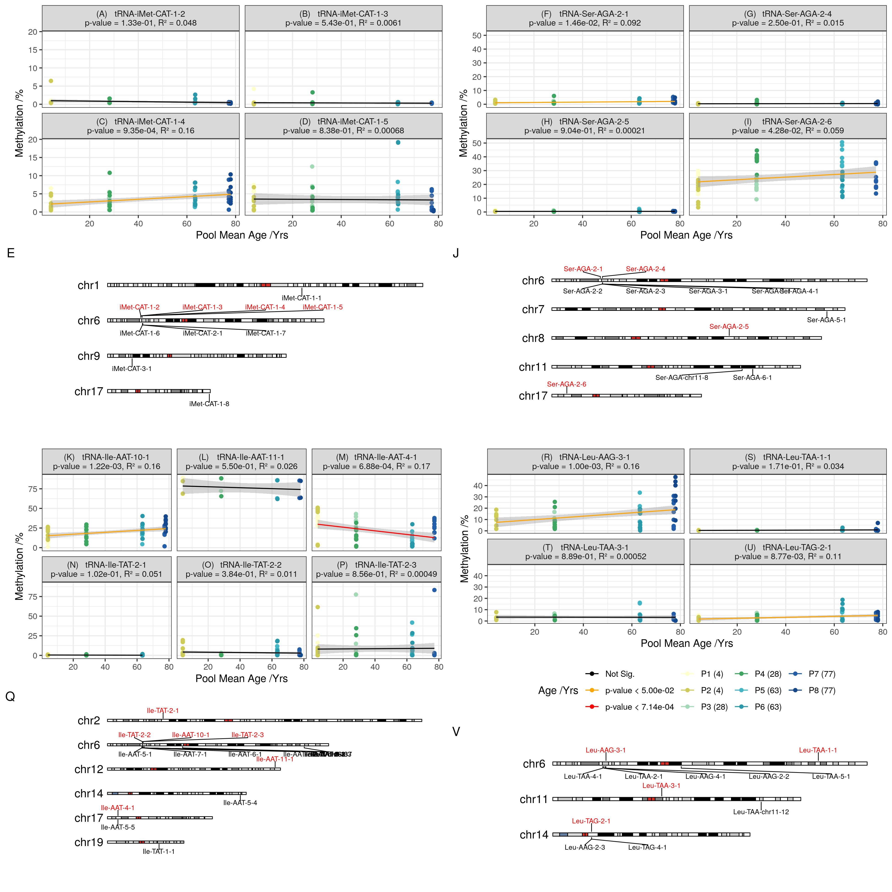
```
(ref:combinedKaryoplotsCap) (A-Q) Mean methylation across replicates at each CpG in each pool for select tRNAs. Ideograms show the locations of all tRNAs with the same anticodon, with those featured in the scatter plots highlighted in red and placed above the ideogram. (R-V) Except for leucine isoacceptors tRNAs are not all of the same codon and only tRNAs on the same chromosome as those plotted are labelled on the ideograms. (experiment-wide Bonferroni p = $6.41\times10^{-4}$).

#### DNA methylation 450k Array Data Validates the MeDIP-seq Results 

Although DNA methylation array poorly cover the tRNAome, we wished to attempt to see if this BiS-based but differing and well-established technology was supportive at all of our DNA hypermethylation findings. 
TwinsUK had available 450k array on 587 individuals, and this platform includes 143 probes, covering 103 tRNAs.
All the 3 top tRNAs in the MeDIP-seq results were covered by this data set, and 7 of the 16 study-wide significant set.
9 tRNAs show significant (p < $4.58\times10^{-4}$) increases in DNA methylation with age in models corrected for blood cell counts including all 3 of the 3 tRNAs identified in the MeDIP-seq as genome-wide significant and 5 of the 7 study-wide significant set present on the array (Figure \@ref(fig:bloodEpitwins450kCounts)).
Although it should be noted that 56 of these 143 probes are within the non-robust set of Zhou et al. [@Zhou2017], including 1 of the genome-wide, and 1 of the study-wide results (covering tRNA-Ile-AAT-4-1 & tRNA-Val-AAC-4-1), respectively.

```{r bloodEpitwins450kCounts, fig.cap="(ref:bloodEpitwins450kCountsCap)", out.width='100%', fig.show='hold', fig.align = 'center', echo=FALSE}
knitr::include_graphics("./figs/blood_epitwins450k_Counts_sws_bl_zhou.png")
```
(ref:bloodEpitwins450kCountsCap) Volcano-like plot. tRNAs are labelled if they are significant here or were in the MeDIP-seq data (Red). Model slope: the model coefficient for the methylation values. Unfilled circles indicate those probes in the general mask generated by Zhou et al. [@Zhou2017]. Significance threshold: $0.05/103 \approx 4.58\times10^{-4}$ (the number of tRNA genes examined).

#### Ageing-Related tRNA Loci show increased Enhancer-Related Chromatin Signatures

We further explored the activity of the tRNAome in public Chromatin segmentation data in blood (Epilogos Blood & T-cells set) [@Meuleman2019].
This shows proportionally more Enhancer-related (Enh, EnhBiv & EnhG) chromatin states at tRNA genes hypermethylating with age than the stronger Promoter-related (TSS) in other tRNAs. (Figure \@ref(fig:combinedEpilogosPlot)).
Whereas these characteristics are less frequently predominant in the rest of the tRNAs (Figure \@ref(fig:combinedEpilogosPlot)).
Age-hypermethylating tRNA are enriched for enhancer chromatin states compared to the rest of the tRNAome (Fisher's Exact test p = 0.01).

```{r, combinedEpilogosPlot, fig.cap="(ref:combinedEpilogosPlotCap)", out.width='90%', fig.show='hold', fig.align = 'center', echo=FALSE}
knitr::include_graphics("./figs/maxScoreBytRNAtRNAge6SplitPlot_BL.png")
```
(ref:combinedEpilogosPlotCap) Chromatin segmentation data from the Epilogos [@Meuleman2019] 'Blood & T-cell' 15 State model (tRNA genes +/- 200bp). Frequency with which a model state was the predominant state at a given tRNA. Proportions of predominant tRNA state for the 14 study-wide significant age-hypermethylating tRNAs covered compared to other 371 available tRNAs.

#### Age Hypermethylating tRNAs are more methylated in Lymphoid than Myeloid cells

Three tRNA genes remained genome-wide significant and 16 study-wide significant following correction for major cell-type fraction. 
This is suggestive of either cell-type independent change or, presumably less likely, a very large effect in a minor cell-type fraction.
tRNAs have exhibited tissue-specific expression [@Schmitt2014b; @Dittmar2006; @Sagi2016] and blood cell-type populations change with age.
Specifically, there is shift to favour the production of cells in the myeloid lineage [@Geiger2013].
These points lead us to examine tRNA gene DNAm in sorted cell populations.
We used a publically available 450k array dataset [@Reinius2012]) that has been used in the construction of cell-type specific DNAm references for cell-type fraction prediction using the Houseman algorithm [@Houseman2012] (see [Methods](#sortedbloodmethods) \@ref(sortedbloodmethods)).
This consists of data from 6 individuals (aged $38 \pm 13.6$/yrs) from seven isolated cell populations (CD4+ T cells, CD8+ T cells, CD56+ NK cells, CD19+ B cells, CD14+ monocytes, neutrophils, and eosinophils).
We found that tRNA gene DNAm could separate myeloid from lymphoid lineages (Figures \@ref(fig:meanMethbytRNAMatLowBB6) & \@ref(fig:meanMethbytRNAMatHeatmapLow)). 

Of the eight study-wide significant tRNAs with array coverage, we identified that collectively these eight are significantly more methylated in the lymphoid than the myeloid lineage (1.1% difference, Wilcoxon rank sum test p = $1.50\times10^{-6}$ 95% CI 0.7%-$\infty$).
Thus, any age related increases in myeloid cell proportion would be expected to dampen rather than exaggerate the age-related hypermethylation signal that we observed.
In addition tRNA-Ile-AAT-4-1 and tRNA-Ser-AGA-2-6 have the highest variance in their DNAm of all 129 tRNAs covered in this dataset. 
This could represent ageing-related changes as these samples range across almost 3 decades. 
Another possibly may be that these loci as well as hypermethylating are also increasing their variability with age in a similar fashion to those identified by Slieker *et al.* [@Slieker2016].
In that study they identified that those loci accruing methylomic variability were associated with fundamental ageing mechanisms.  

```{r meanMethbytRNAMatLowBB6, fig.cap="(ref:meanMethbytRNAMatLowBB6Cap)", out.width='100%', fig.show='hold', fig.align = 'center', echo=FALSE}
knitr::include_graphics("./figs/meanMethbytRNAMatLowBB6_bl.png")
```
(ref:meanMethbytRNAMatLowBB6Cap) Heatmap [@Gu2016] of mean methylation of probes covering each tRNA in 7 cell-type fractions from 6 Male individuals. Data from [GSE35069](https://www.ncbi.nlm.nih.gov/geo/query/acc.cgi?acc=GSE35069) [@Reinius2012]. Of the 16 study-wide significant hypermethylating tRNAs, 8 are covered by this dataset.

### tRNA Gene DNA Methylation in Other Tissues

Some tRNA gene expression has been shown to be highly tissue specific [@Schmitt2014b; @Dittmar2006; @Sagi2016].
It follows that our observations of changes in DNAm with age in blood might be specific to that tissue.
We used a mix of 450k and 27k array data from 'solid tissue normal' samples made available by TCGA (The Cancer Genome Atlas) and data from foetal tissue [@Yang2016; @Nazor2012] downloaded from GEO (see [Methods](#TCGAmethods) \@ref(TCGAmethods)).
The samples from TCGA range in age from 15-90 (n = 733).
Only 43 tRNA genes had adequate data to compare across tissues in this dataset and 115 in the foetal tissue data.

#### tRNA Genes also Hypermethylate with Age in Solid Tissue

Only 2 of the 3 tRNA genes we identified as genome-wide significant and a further 1 of the study-wide significant tRNA genes are present in the set of 45 tRNA genes in the TCGA data, thus limiting our ability to draw conclusions about the tissue specificity of our results. 
Solid tissue samples have a strong preponderance for low levels of methylation consistent with the active transcription of many tRNA genes and show slight increasing methylation with age but age accounts for very little of the variance (linear regression slope estimate = $1.52$; $R^2= 0.0002$; p-value $1.34\times10^{-3}$ (Figure \@ref(fig:cancerVsNormalCombinedPlots)d). 
In a pan-tissue analysis we found that 10 tRNA genes showed changes in DNAm with age, 9 of which were hypermethylation (p-value $<1.1\times10^{-3}$).
One of these tRNA genes, tRNA-Ser-TGA-2-1 was also present in study-wide significant set of tRNA genes.
Figures \@ref(fig:meanBetasByTissueTNMHeatmap) & \@ref(fig:meanMethBytRNAByFetalTissueHeatmap) illustrate minimal tissue specific differences.
Interestingly, however, tRNA-iMet-CAT-1-4 and tRNA-Ser-AGA-2-6 appeared more variable in methylation state than many other tRNAs in the TCGA normal tissue samples (Figure \@ref(fig:meanBetasByTissueTNMHeatmap)) and indeed have the highest variance in DNA methylation across tissues (Figure \@ref(fig:cancerVsNormalCombinedPlots)c).

### Expression of tRNAs in Blood with Age

Having observed specific tRNA gene isodecoders hypermethylating with age we explored the expression of tsRNA in blood cell-types.
We devised a bioinformatic approach to attempt to assay tRNA transcription in order to use standard publicly available small RNA-seq datasets.
We created customised MINTmap [@Loher2017] reference designed to include only fragments which unambiguously map to a single tRNA gene locus and which overlap the 5' or 3' end of the genomic tRNA sequence by at least one base with no mismatches.
This reference is intended to capture pre-tRNAs prior to processing and CCA addition operating under the assumption that the levels of pre-tRNAs will be informative about the amount of transcription taking place at the tRNA loci (see [Methods](#mintmapmethods) \@ref(mintmapmethods)).
Our custom MINTmap reference build yielded 383 fragments mapping to 92 distinct tRNA loci in this data. 
The lack of coverage of age hypermethylating tRNAs by uniquely attributable RNA-seq reads prevented us from drawing any strong conclusions about the relationship between DNAm changes and changes in tRNA transcription.

Using the original MINTmap reference optimised to detect tRNA fragments derived from mature tRNAs there were 5384 unique fragments derived from as many as 417 tRNA loci.
However, the mapping between fragments and loci in this reference is many to many, with each tRNA gene able to give rise to many fragments and each fragment attributable to at least 1 and usually many tRNA genes.
We limited our examination of these fragments to those with a length of greater than or equal to 40nt to capture reads more likely to be derived from mature tRNAs rather than tRFs or tRNA halves (Figure \@ref(fig:combinedFragSizeDists)).
We identified 48 tsRNAs with nominally significant expression changes (p < 0.05), 8 increased and 40 decreased in abundance with age.
For example 5 of 6 fragments showing significant age-related expression changes derived from the Gln-CTG family of tRNAs are decreasing with age (Figure \@ref(fig:mintmapres)).
This is suggestive that expression of some tRNA genes may decline with age but this possibility is in need of additional tRNA expression data before it can be asserted with confidence.

```{r mintmapres, fig.cap="(ref:mintmapresCap)", out.width='100%', fig.show='hold', fig.align = 'center', echo=FALSE}
knitr::include_graphics("./figs/nonSigIsoMapbbswsPlotsGln-CTG.png")
```
(ref:mintmapresCap) tRNA fragments derived from the Gln-CTG family of tRNAs, selected as tRNA-Gln-CTG-7-1 is one of the 16 study-wide significant age-hypermethylating tRNA genes. Pane titles contain the MINTbase Plates, unique identifiers of the tRNA fragments [@Pliatsika2018].

#### MINTmap reference Fragment distribution

In the original MINTmap reference (Figure \@ref(fig:combinedFragSizeDists)b) there are peaks at around 18nt, 22nt and 32nt.
This is consistent with the expected tRNA fragment size distributions with 'tRNA halves' at 30-33nt and other tRFs at 18nt and 22nt.
In our custom reference (Figure \@ref(fig:combinedFragSizeDists)a) whilst there is still a peak at ~18nt, with suggestions of peaks near 22nt and 32nt the tRNA fragment length distribution is somewhat different from that of the standard MINTmap reference.
There are larger peaks at ~28 and ~40nt consistent with the longer fragments expected given that this reference aimed to target fragments derived from pre-tRNAs not tRFs derived from mature tRNAs.

```{r combinedFragSizeDists, fig.cap="(ref:combinedFragSizeDistsCap)", out.width='100%', fig.show='hold', fig.align = 'center', echo=FALSE}
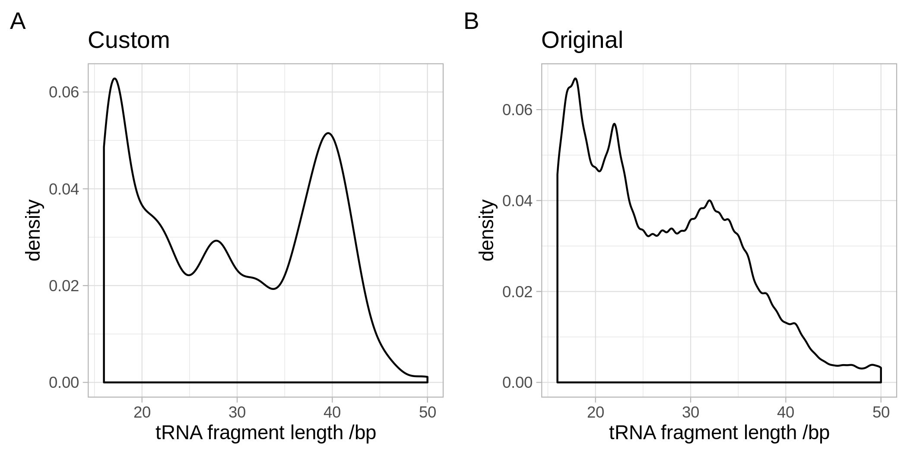
```
(ref:combinedFragSizeDistsCap) Comparison of the fragment size distributions between our custom reference __A)__ and the original the MINTmap reference __B)__.

## Mice also show age-related tRNA gene DNA hypermethylation

We examined the DNA methylation of the mouse tRNA genes in using data from a reduced representation bisulfite sequencing (RRBS) experiment performed by Petkovich et al. [@Petkovich2017].
These data from 152 mice covered 51 tRNA genes and 385 CpGs after QC (see [Methods](#mousemethods) \@ref(mousemethods)), representing ~11% of mouse tRNA genes.
The mice ranged in age from 0.67-35 months.

Three of the 51 tRNAs showed Bonferroni significant DNA methylation changes with age (p-value < $1.08 \times 10^{-4}$) and all were in the hypermethylation direction.
These three are tRNA-Asp-GTC-1-12, tRNA-Ile-AAT-1-4, tRNA-Glu-TTC-1-3 (Figure \ref{fig:mouse}). Full Age model Results are available in [Supplementary File S4](Supplementary_Files/SF4_mouse_tRNA_age_models.xlsx).

```{r mouse, fig.cap="(ref:mouseCap)", out.width='100%', fig.show='hold', fig.align = 'center', echo=FALSE}
knitr::include_graphics("./figs/CpGPlotComb.png")
```

(ref:mouseCap) DNA methylation of CpGs in 3 tRNA which significantly hypermethylate with age in mice, in data from Petkovich et al. [@Petkovich2017]. 6 CpGs reach bonferroni significance and 7 show nominally significant increases.

In order to investigate the mouse results further we made use of data from Thornlow et al. [@Thornlow2020], which had established tRNA ortholog sets for 29 mammalian species.
They identified 197 mouse tRNAs as having direct human orthologs with 44 of these included in the mouse results from Petkovich et al. [@Petkovich2017].
However, unfortunately, although 2 of the top 3 tRNAs (tRNA-Ser-AGA-2-6 & tRNA-Ile-AAT-4-1) have mouse orthologs (tRNA-Ser-AGA-2-2 & tRNA-Ile-AAT-1-1), they are not covered in these mouse data. 
Furthermore, none of the tRNAs showing significant hypermethylation in mice (at nominal p<0.05) had human orthologs in our MeDIP-seq study-wide significant hypermethylating set. 
Therefore, whilst we cannot directly compare specific tRNA loci due to this lack of coverage, it is interesting that the small number of significant tRNA genes in the mouse data also hypermethylate with age.

\newpage

## Discussion

Our work has identified a previously unknown enrichment for age-related epigenetic changes within the tRNA genes of the human genome.
This observation was strongly directional with increasing DNA methylation with age [@Ehrlich2019].

The MeDIP-seq dataset employed brought advantages in exploring this undefined terrain of the tRNAome.
Firstly, being genome-wide it provides much increased access, as these regions are poorly covered by current arrays.
Secondly, being a fragment-based regional assessment of DNA methylation, the individual but highly similar small tRNA genes can be surrounded by unique sequence.

We determined by genome-wide permutation that this strong hypermethylation signal was specific to the tRNAome, and not merely driven by the underlying CpG density of these loci.
A targeted BiS-seq experiment validated the defined nature of the tRNA change in an independent dataset, with a successful pooling approach, which may also be useful for other ageing-related targeted DNA methylome evaluations. 
Additionally, we gained support for our results from limited DNA methylation array data. 

Whilst the changes in DNA methylation we have observed are relatively small (i.e. 3.7% between 4-year to 78-year pools in tRNA-iMet-CAT-1-4), this is consistent with the effect size seen in the majority of positions differentially methylatyed with age in many other studies [@Slieker2016; @Xu2014b], except for the noted extreme outliers, such as *EVOLV2* [@Slieker2018]. 
Furthermore, effect size cut-offs are observed to remove a large fraction of true age-DMPs [@Zhu2018].

We subsequently explored further what was driving this age-related phenomenon and its possible biological implications. 
As this result was observed in peripheral blood, we were well aware that we were examining DNA derived from a heterogeneous cell type population [@Lappalainen2017].
Moreover, that there are well known age-related proportional changes in peripheral blood cell composition [@Geiger2013]. 
The TwinsUK MeDIP-seq and 450k array DNA methylation data included measured haematological values. 
Therefore, we adjusted for major cell type effects, such as a myeloid skew, and distinct tRNAs were still significant.
Although, a caveat to our study is that this can not exclude changes in minor specific sub-cell fractions types.
However, that these age-related effects were strong enough to be observed in both a regional MEDIP-seq assessment and a pooled sequencing approach, implies that they not extremely subtle.
We examined age-related tRNA gene DNA methylation changes in the limited subset of mouse tRNA genes covered in publicly available RRBS data (~13%) and were able to identify tRNAs exhibiting DNA hypermethylation with age in this set.
This suggests that age-related tRNA gene hypermethylation may not be unique to humans, but at least observed across mammals.

Due to the high number of hypermethylating tRNA prior to cell-type correction, we were also curious whether the epigenetic state of this small tRNAome fraction of genome could capture and in fact be a defined fingerprint of cell type.
We found that tRNA gene DNA methylation could separate myeloid from lymphoid lineages. 
There also was some suggestion of more fine-grained blood cell-type signatures in tRNA DNAm, such as the separation of CD19+ B cells from CD4/8+ T cells.
Ageing is also known to lead to an increase in senescent cells (*e.g.* CD8+ CD28- cells).
Whether these epigenetic changes in the tRNAome uniquely represent these cell-types will require technical advances to enable future single cell DNA methylome analysis to accurately assess these regions.
If further supported, the epigenetic state of these loci may aid the taxonomy of cell-type definition.

This signal within the tRNA families was observed to occur at specific Isodecoders.
After correcting for major cell types, we identified 2 tRNA genes tRNA-iMet-CAT-1-4 and tRNA-Ser-AGA-2-6 which had the most consistent hypermethylation across 3 different assays.
Isodecoders expand in number with organismal complexity and the high prevalence in mammals has been suggested due to their additional regulatory functionality [@Goodenbour2006; @Keam2014]. 
They also have distinct translational efficiency [@Geslain2010], which can also have consequences in human disease [@Kirchner2017].
Furthermore, there is great complexity to the fragmentation of tRNA [@Schimmel2017], with physiological processes such as stress shown to induce fragment production [@Li2019].
These resultant tsRNAs can feedback on protein synthesis by regulating ribosome biogenesis [@Kim2017] and others have diverse regulatory functions such as targeting transposable element transcripts [@Martinez2017].
They are also observed to circulate in the blood in a cell-free fashion, and fragment levels can be modulated by ageing and calorie restriction [@Dhahbi2013].
The isodecoder specific nature of our findings frame a possible hypothesis for regulatory change with age and future work will be required to unravel this potential.

Whilst, the expression of the tRNA genes has long been simplified as ‘constitutive’, some observations have indicated that many tRNA genes are expressed in a tissue-specific fashion in diverse organisms [@Dittmar2006; @Sagi2016].
Although others have found the majority of isodecoders are transcribed in different cell types [@Parisien2013].
Several transcription factors acting via TFIIIB [@Gomez-Roman2003] have a negative (the tumour suppressors p53 [@Crighton2003] and Rb [@Sutcliffe2000]) or positive (the proto-oncogene c-Myc) influence [@Gomez-Roman2003].
Regulatory sequence in the flanking or the internal regions of tRNA genes do not explain tRNA expression variation [@Schmitt2014].
Whilst DNAm is able to repress the expression of tRNA genes [@Besser1990], the broader chromatin environment also affects tRNA transcription.
Due to the co-ordinated nature of epigenomic modifications, it may also be revealing to evaluate ageing-related histone modification in these tRNA loci.  

Changes in the epigenetic state of specific tRNA could be modulating transcription efficiency or even codon availability in the ageing cell. 
tRNA gene dosage is quite closely matched to amino acid usage frequency in the human exome.
However, the transcriptome codon usage frequency and tRNA gene expression have been claimed to vary with the replicative state of cells, separating differentiated from replicating cells [@Gingold2014].
Others have argued that these differences are substantially explained by variation in GC content [@Rudolph2016] and that codon usage frequencies are observed to be mostly invariant in the transcriptomes of a wide range of tissues, as well as across developmental time [@Schmitt2014].
Although, experimental stress-related states have revealed changes with an over-representation of codons that are translated by rare tRNAs [@Gingold2012].  

tRNA sequences themselves are under strong structural (both secondary and tertiary) [@Goodenbour2006] as well as functional constraint, which leads to an order of magnitude reduction in variation compared the background genomic mutation rate [@Parisien2013].
However, polymorphic tRNA could be another potential caveat to our work.
Although, there is no significant population variation in, for example, tRNA iMet sequences in 1,000 Genomes data.
Indeed, there are only 11 new isodecoder sequences with high confidence (tRNAscan scores $\ge50$) at >1% population frequency [@Parisien2013].
There is also some evidence for tRNA copy number variation at specific loci, although this remains under-characterised [@Iben2015; @Darrow2014].
Another potential cause we considered was whether age-related somatic copy number increases could be occurring in these loci.
Population or somatic copy number expansions could lead to increased methylated reads in MeDIP-seq without any epigenetic state change.
However, this would not be consistent with the targeted and array BiS conversion methodologies, where the proportion of methylated to unmethylated reads would still be constant.  

It is worth noting the parallels with known cancer and ageing epigenetic changes, and that tRNAs are also dysregulated in cancer [@Huang2018], with proposed utility as prognostic markers [@Krishnan2016].
Furthermore, the early replicating state of tRNA loci, potentially associated with high expression [@Muller2017], may make them prone to hypermethylate, as is observed in early replicating loci in both cancer [@Du2019] and senescent cells [@Cruickshanks2013].
Interestingly, tRNA gene loci may also play a role in local as well as large scale genome organisation [Hamdani2019; @VanBortle2017].
tRNA gene clusters act as insulators [@Raab2011] and have extensive long-range chromatin interactions with other tRNA gene loci [@VanBortle2017]. 
The coordinated transcription of tRNAs at subnuclear foci and the B-box sequence elements bound by TFIIIC and not PolIII may represent an organising principle for 3D-chromatin by providing spatial constraints [@Noma2006].
Therefore, these tRNA epigenetic changes could contribute to the structural changes that are also observed in ageing [@Sun2018].  

In conclusion, due to the unique challenges that make the tRNAome difficult to examine it has remained epigenetically under-characterised despite its critical importance for cell function. 
We directly interrogated the epigenetic DNA methylation state of the functionally important tRNAome, across the age spectrum in a range of datasets as well as methodologies and identified an enrichment for age-related DNA hypermethylation in the human tRNA genes.

\newpage


## Data availability

The MeDIP-seq data supporting the results of this article are available in the EMBL-EBI European Genome-phenome Archive (EGA) under Data set Accession number EGAD00010000983 ([https://www.ebi.ac.uk/ega/datasets/EGAD00010000983](https://www.ebi.ac.uk/ega/datasets/EGAD00010000983)).
The targeted BiS-sequencing data is available at: [https://www.ncbi.nlm.nih.gov/bioproject/PRJNA635108](https://www.ncbi.nlm.nih.gov/bioproject/PRJNA635108)

## Code availablity

Available at [https://github.com/RichardJActon/tRNA_paper_code](https://github.com/RichardJActon/tRNA_paper_code)

\newpage

## Acknowledgements

We gratefully acknowledge the individuals from TwinsUK, Mavidos and the Hertfordshrie cohort.
TwinsUK received funding from the Wellcome Trust (Ref: 081878/Z/06/Z), European Community’s Seventh Framework Programme (FP7/2007-2013), the National Institute for Health Research (NIHR)-funded BioResource, Clinical Research Facility and Biomedical Research Centre based at Guy’s and St Thomas’ NHS Foundation Trust in partnership with King’s College London. 
Further funding support for the EpiTwin project was obtained from the European Research Council (project number 250157) and BGI. 
SNP Genotyping was performed by The Wellcome Trust Sanger Institute and National Eye Institute via NIH/CIDR.
The authors would like to thank Nikki Graham for her assistance with the identification and pooling of the MAVIDOS and Hertfordshire DNA samples.
The authors also acknowledge the use of the IRIDIS High Performance Computing Facility, and associated support services at the University of Southampton, in the completion of this work.
The MRC-LEU is supported by the Medical Research Council (MRC).
CGB received support from Diabetes UK (16/0005454).
RJA was in receipt of a MRC Doctoral fund (1820097).

## Author Contributions

RJA designed experiments and analysed all the processed and experimental data.
CGB conceived and designed the experiments.
TDS, KW and JW conceived and provided TwinsUK MeDIP-seq data. 
YX, FG and JW produced raw MeDIP-seq data with WY and JB processing and quality controlling these data.
WY contributed an analysis concept. 
CC, NH, ED, and KL provided MAVIDOS and Hertfordshire sample data.
EB, EW, and CAM performed the targeted BiS sequencing experiment.
PGH contributed additional data and discussion of results. 
RJA and CGB wrote the paper. 
All authors reviewed and approved the final manuscript.

\newpage

## Supplementary materials {-}

### Supplementary Figures


```{r meanMethbytRNAMatHeatmapLow, fig.cap="(ref:meanMethbytRNAMatHeatmapLowCap)", out.width='90%', fig.show='hold', fig.align = 'center', echo=FALSE}
knitr::include_graphics("./figs/meanMethbytRNAMatHeatmapLow_bl.png")
```
(ref:meanMethbytRNAMatHeatmapLowCap) Heatmap Mean Methylation of probes covering each tRNA in 7 cell-type fractions from 6 Male individuals. Showing all 150 tRNAs covered by 213 probes on the Illumina 450k array. Data from [GSE35069](https://www.ncbi.nlm.nih.gov/geo/query/acc.cgi?acc=GSE35069) [@Reinius2012] downloaded using `GEOquery` [@Davis2007p]. Generated with the `ComplexHeatmap` `R` package [@Gu2016].

```{r cancerVsNormalCombinedPlots, fig.cap="(ref:cancerVsNormalCombinedPlotsCap)", out.width='100%', fig.show='hold', fig.align = 'center', echo=FALSE}
knitr::include_graphics("./figs/cancerVsNormalCombinedPlots.png")
```
(ref:cancerVsNormalCombinedPlotsCap) Global properties of tRNA methylation data for 45 tRNA genes across 19 tissues with matched normal and tumour samples from 733 cases in TCGA [@Yang2016; @Nazor2012].

```{r meanBetasByTissueTNMHeatmap, fig.cap="(ref:meanBetasByTissueTNMHeatmapCap)", out.width='90%', fig.show='hold', fig.align = 'center', echo=FALSE}
knitr::include_graphics("./figs/meanBetasByTissueTNMpseudoSplitHeatmap.png")
```
(ref:meanBetasByTissueTNMHeatmapCap) Mean Methylation of 43 tRNAs in 19 tissues. Possible pseudogene (tRNA-Asn-ATT-1-1) is shown in a separate cluster beneath the main heatmap [@Gu2016].

```{r meanMethBytRNAByFetalTissueHeatmap, fig.cap="(ref:meanMethBytRNAByFetalTissueHeatmapCap)", out.width='60%', fig.show='hold', fig.align = 'center', echo=FALSE}
knitr::include_graphics("./figs/meanMethBytRNAByFetalTissueHeatmapPseudosplit.png")
```
(ref:meanMethBytRNAByFetalTissueHeatmapCap) Mean Methylation of 115 tRNAs in 11 tissues. Possible pseudogenes are shown in a separate cluster beneath the main heatmap [@Gu2016].

<!--chapter:end:04-tRNA.Rmd-->

# Results 3 - {#Alus}

## Abstract 

## Introduction {#AluIntro}

Age is a significant risk factor across the breadth of chronic diseases, including cardiovascular, obesity-related, ophthalmic, musculoskeletal and neurological disorders [@Partridge2018].
The molecular changes that occur with age include alterations to the epigenome [@Booth2016] – the chemical modifications and packaging of the genome that indicate or facilitate cell-specific activity [@Bird2007].
This includes age-related changes to DNA methylation, the most common modification of DNA [@Lopez-Otin2013].
This epigenetic mechanism is crucial in repressing the large proportion of the human genome (~45% [@Gregory2005]) that is comprised of repetitive or transposable elements [@Deniz2019], [@Kazazian2017].
It also classically leads to robust repression of gene expression through promoter DNA methylation [@Deaton2011], and has more nuanced effects on expression within the gene body [@Hellman2007], as well as influencing splicing [@Shukla2011] and transcription factor binding-sites (TFBSs) [@Blattler2014], [@Yin2017].

A significant decrease in DNA methylation with age was first observed with pioneering global measures [@Wilson1983], in similar fashion to the reduced methylation seen in cancer tissue [@Gama-Sosa1983].
This DNA methylation loss was seen to be strongly contributed to by the demethylation of repetitive elements [@Bollati2010].
Random drift in the epigenetic state with age was also observed [@Bollati2010], and more recent studies have identified targeted hypermethylation of specific functional regions, such as the promoters of polycomb target genes [@Teschendorff2010], bivalent chromatin domains [@Rakyan2010] and the genomic loci of specific tRNA genes [@Acton2020] 

Alu elements are the most successful transposon in terms of numbers within the human genome, totalling ~1.19 million copies and comprising ~10.7% of the genomic sequence [@Dewannieux2003], [@Deininger2011].
This ~300 bp primate-specific retrotransposon is a member of the short interspersed nuclear elements (SINEs) and is derived from the 7SL RNA gene [@Ullu1984].
Alu elements arose ~65 million years ago (MYA), with a peak in amplification around ~40 MYA [@Ade2013].
Non-LTR retrotransposons, which include Alus as well as L1 and SVA elements, are active in human.
However, Alu elements themselves are non-autonomous and need to commandeer a nearby L1 element’s retrotransposition molecular machinery [@Cordaux2009].
Alu insertion mutagenesis as well as Alu element mediated recombination account for 0.4% of all human genetic disorders [@Kazazian2017], [@Belancio2008].

DNA methylation represses Alu elements and due to their sequences being rich in CpGs they in fact account for ~25% of all the CpGs in human genome (~7.5 million) [@Deininger2011].
Alu repeats are predominately methylated across all normal tissues, and even in cancer cells they are the more resistant to hypomethylation than other repetitive elements, implying a strong pressure to maintain their epigenetic state [@Jorda2017].
These elements are an abundant genetic resource of regulatory sequences with
numerous TFBSs residing within its canonical sequence [@Polak2006].
They can influence gene expression [@Chen2017b], [@RobertoFerrari2019] and there is evidence that some may possess enhancer activity [@Su2014]. 
The deterioration of epigenomic repression can unmask latent regulatory function within repetitive elements [@Ward2013], [@Chuong2017], [@Xie2013].
This has been clearly displayed as a pathogenic mechanism in cancer, with epigenetic reactivation of cryptic cis-regulatory elements (CREs) within transposons acting as oncogenic drivers [@Jang2019] , including Alu elements [@Rajendiran2016].
There is the potential for these changes to also influence common non-malignant age-related diseases [@Chuong2017], [@Payer2017].

The identification of specific age-related DNA methylation changes has enabled the construction of ‘DNA methylation clocks‘ [@Horvath2018] that can predict an individual’s chronological age, but also capture aspects of biological ageing, such as all-cause mortality [@Marioni2015].
Hypermethylated and hypomethylated cytosines approximately equally drive these DNA methylation clocks, although these age-related increases or decreases in methylation are driven by distinct biological mechanisms [@Mozhui2017], [@Wu2017].
Interestingly, hypomethylating CpGs have been identified to be the most indicative of biological ageing-related all-cause mortality effects in blood [@Zhang2017].
However, due to poor coverage of the repetitive space because of technical issues [@Bell2019], much of the genomic hypomethylation is not well captured by array analysis.

In this study we set about to identify and explore age-related DNA methylation changes in Alu elements in a large (>3,000) immunoprecipitation-derived sequencing-based dataset (MeDIP-seq) from peripheral blood DNA. We constructed an Alu-specific DNA methylation ageing clock and compared how this contrasted with other clocks’ measures. We also investigated genetic influences on age- acceleration measures from this Alu-clock via GWAS, as has been with shown previously with an association in the TERT gene with the Horvath clock [@Lu2017], [@Gibson2019].
These results may reveal mechanisms involved in controlling the epigenetic state of this large portion of the genome.
Finally, we interrogated these genetic associations for any potential connection with common age-related diseases through PheWAS in the UKBiobank dataset [@Bycroft2017].

## Methods

## Results

Age-related DNA methylation changes in Alu Elements

Study Design - Figure 1

```{r studyDesign, fig.cap="(ref:studyDesignCap)", out.width='100%', fig.show='hold', fig.align = 'center', echo=FALSE}
#knitr::include_graphics("./figs/studyDesign.png")
```

(ref:studyDesignCap)

- This sequencing-based dataset – MeDIP-seq fragments 200-500bp – size Alu elements 300bp
- Remove strongly genetically driven loci
	- Removed known polymorphic Alu in the human population [@Payer2017]
	- ?Adapted Gap Hunting algorithm (see Methods)
- Genome-wide significant/ Study-wide Significant windows
- ?Validated Alu methylation with target BiS-seq
- Enrichment Analysis - GREAT [@McLean2010]
- ?Association with GWAS disease loci

### Alu-element specific DNA methylation Clock

- Elastic net regression with R package glmnet [@Friedman2010], [@Engebretsen2019]

### Comparison of Alu-Clock with Array-derived DNA methylation Clocks

- Compared with
	- Horvath [@Horvath2013] ,
	- Hannum et al. [@Hannum2013]
	- PhenoAge [@Levine2018]
	- GrimAge [@Lu2019]
	- EpiTOC [@Yang2016]
	- ?Remethylation Window [@Zhou2018]

### Genetic Association for Alu-Clock calculated Age Acceleration

- We performed a GWAS on Age-acceleration similar to Lu et al. 42 calculated in a separate dataset used to construct the Alu-clock
- Genome-wide significant & nominally significant results 

### Disease Association with these Variants / Enrichment for Age-Related Diseases

- Ageing and genetics shared risk [@Zenin2019]
- https://www.eurekalert.org/pub_releases/2019-01/g-aac012919.php
- GWAS results from UKBioBank
- http://www.nealelab.is/uk-biobank
- Explore via PheWAS of these Alu-related variants
	- Phewascatelog.org
	- Denny et al Nat Biotech 2013 [@Denny2014]
	- Bush NRG [@Bush2016]
	- Wei et al. Circulation 2018 [@Wei2018]
	- Other papers (Zhao et al. Plos One 2019; We et al. BioRxiv 462077; Nielsen et al Nat Gen 2018; Giri et al. Nat Gen 2019; Bastarache et al Science (2018))
	- http://pheweb.sph.umich.edu/
- Enrichment of nominal significant results with Age-related disease cf. Random

\newpage

## Discussion

\newpage

## Methods

### Participants

Human participants were drawn from the TwinsUK Bioresource. 
These deeply phenotyped individuals DNA methylomes

MeDIP-seq data as described in [@Bell2017a] – Briefly All data is available at

## Age-related DNA methylation changes

To identify strongly genetically we ?utilised the Gap Hunting algorithm of Andrews et al. [@Andrews2016] adapted
We excluded all known
Excluded polymorphic Alus [@Payer2017]
?Exclude any methylation overlapping STRs

### ?Validation with target BiS-seq

### Alu element specific DNA methylation Clock

### Comparison with Array-derived Clocks

### Genetic Association for Alu-Clock

### Association of these variants with Age-related Disease

#### Data availability

The MeDIP-seq data supporting the results of this article are available in the EMBL-EBI European Genome-phenome Archive (EGA) under Data set Accession number EGAD00010000983 (https://www.ebi.ac.uk/ega/datasets/
EGAD00010000983).

#### Code availablity

Available at [GitHub](https://github.com/richardjacton)

\newpage

#### Acknowledgements

#### Author Contributions

\newpage


<!--chapter:end:05-Alu.Rmd-->

# Discussion

...

<!--chapter:end:06-discussion.Rmd-->

# References {-}

<!--chapter:end:07-references.Rmd-->

